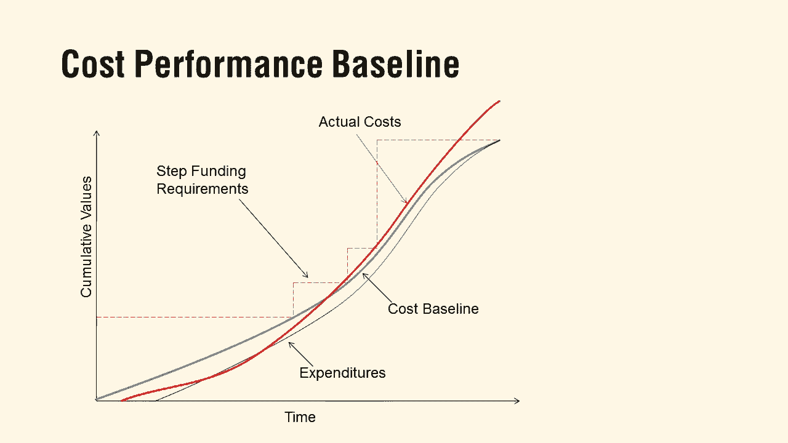

# 【Udemy】项目管理师应试 PMP Exam Prep Seminar-PMBOK Guide 6  286集【英语】 - P278：5. Project Cost Management - servemeee - BV1J4411M7R6

Let's take a look at some things you need to know for your exam on project cost management。

Cost management， Chapt 7 in the pembaok， we talked about different estimate types。

 Remember we had analogous， we had parametric， we had definitive or a bottom up。

 but there's one I want you to really know。 actually too。 I want you to really know。

 and that's our three point estimate types。 Remember that we had triangular。

 and we have beta triangular is just an average。 So you sum up optimistic。

 most likely pessimistic and you average it out and you can do this in schedule or cost。

 So I kind of saved it here for cost。 But remember this can go with schedule as well。

A per is beta and it's the one that's weighted towards most likely。

 so remember it's optimistic plus four times the most likely plus pessimistic divided by 6。

 y6 because you have six factors， four most likely， one pessimistic one optimistic。

 so it's giving more weight towards the most likely。So perRT is beta。

 and remember sometimes you could see this with a little C or the O attached to the formula that means you're doing cost or time。

Our cost performance baseline mentioned this a little bit earlier。

 our cost performance baseline is what we think things will cost in the project。

The blue line is our cost baseline of this example， our red line is our actual cost。

 the difference between the two is our cost variance。

 and then that black line is our expenditures where we're actually purchasing things。

The red stair steps， like it looks like a stair step because it's step funding。

 I get just enough money。To go to this point。 I wasn't gonna to sing that song。

 I get just enough money。 I got just enough money to get to this point。 All right。

 that's step funding。 So I have just enough to get to this phase。 And then I get some funding。

 So I have step funding at that phase gate And that's enough money to get to the next phase in the next phase and so on。

 So it's a way to do some I don't have to finance everything at once。 I do it by phases。

 So those are usually tied to stage gates or phase gates。 So step funding。

 And then the idea is in our you can see in our y axis there。

 the cumulative values as I get closer and closer to the end of the project。

 I should be running out of money because I'm towards the end of the project。

So those are some key terms you want to know for cost， keep going。

