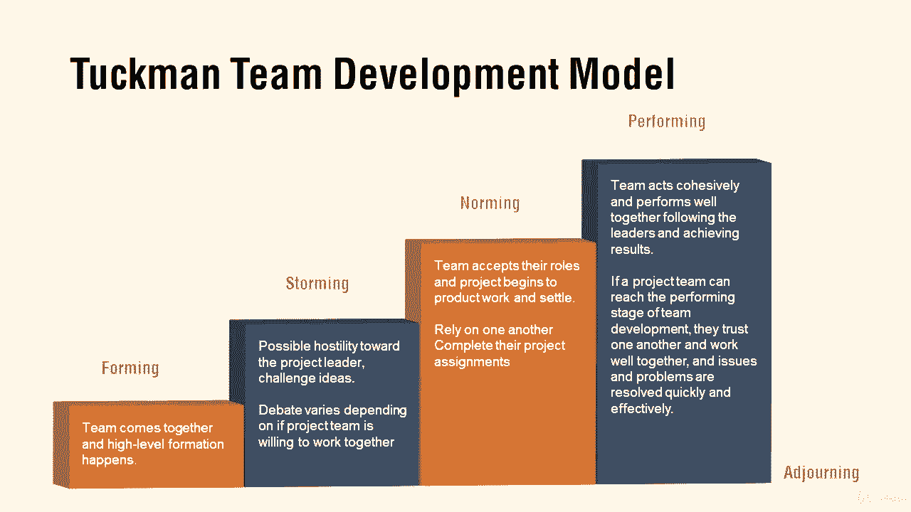

# 【Udemy】项目管理师应试 PMP Exam Prep Seminar-PMBOK Guide 6  286集【英语】 - P280：7. Project Resources Management - servemeee - BV1J4411M7R6

Let's talk about chapter 9 in the Pimbach and resource management in particular I want to talk about the human side first of resource management。

 I'm talking about emotional intelligence， emotional intelligence。

 the ability to control my emotions and understand my emotions and the emotions of others We have two types of emotional intelligence to be aware of you have inbound and that's the self-manage where I don't blow up。

 I don't lose my temper， I can control my feelings outbound。

 about relationship management that I don't say things that can hurt others， I don't react。

 that could damage our relationship。Emotionally competent teams are better teams。

 I think we would all agree with that。 It also helps with a reduction in staff turnover because we get along and we respect one another doesn't mean we always agree but we show respect and that's important。

 Some terminology when it comes to resources So you have a role is just the generic team name an app developer a tester。

 a chemist， you know whatever it is a technical writer here so it's just the name that that role is so it's the generic project team name。

Authority is the level of decision making ability。Responsi are actions and expectations and competency is your depth of skill and knowledge。

 All right， let's take a look at a matrix chart。 Remember， a matrix is just a table。

 So in this example， we're looking at a racecy chart where we use the legend of responsible。

 accountable， consulted and informed。 There can only be one individual accountable per activity。

A RamM is a responsibility assignment matrix， that's where you have your own legend doesn't have to be a racy legend。

 technically a racy is a RamM， but a RamM is where generally it's more like you create the legend and then roles and responsibilities rather than having the team members' actual names we would put the role in there like application developer。

 tester， designer， writer whatever the case would be and then you would have a legend for that as well or just a checkmark to show that role does this type of work or the specific activity。

So that's a matrix chart。You won't need to know these HR theories so I'm going to hit them quickly Maslow's hierarchy of needs from the bottom to the top。

 physiological safety， social esteem and self-actization。

 so I can't satisfy needs below to the our needs above rather to the needs below is satisfied。

 so I'm not interested in esteem if I'm very very thirsty and hungry。 I want that need。

 I have to have that needs satisfied first。Hstberg's theory of motivations describes are motivators and demotivators that motivators promote performance。

 demotivators actually take away if they're missing like poor pay or pressure or whatnot。

Remember our hygiene agents are just part of the employee employee your relationship。

 so pay benefits， a safe working environment， if those are missing then then will be a demotivator。

 I can't motivate until hygiene agents are satisfied so Herbsberg's theory of motivation。

Then we have McGor's X and Y， it's a management perspective of people， X people， bad， micromanaged。

 lazy， can't trust them， why people， they're self led， motivated， capable， can get things done。

Then we have David McClellan's three needs theories that our needs are acquired over time。

 so sometimes called the acquired needs theory， and our needs are A affiliation and power。

 and at one of those needs is our driving need， and so be familiar with that。

 the only one that you take a test for is the Thematic App perceptionception test with the David McClellan's Ac Need or three needs theory。

 our needs are acquired over time。A new term that we saw in the Pimba Guide 6 edition is the idea of a team Charer。

 the team Charer basically just as what are our values as a team， how will we communicate。

 how will we make decisions， what are our conflict resolution approaches。

 What's our guidelines for meetings， what are our agreements with one another and what are the ground rules that we all enforce。

 not just the project manager， So a team charter。The Tuckman development model。

 it describes how people come together and what they do in that stage of this model， so forming。

 you get together， storming， you're duking it out， who's in charge。

 who's going to lead in certain areas， Noring you settle down into your roles and go about working together。

 performing you begin to act collaboratively collaboratively and everyone's working well together。

 it's possible you go backwards。 but our goal is to just go forwards。

 and then of course the very last phase is adjourning and that it was added on later。

 but that's the idea that teams are temporary so we adjourn。

Very important terms there in resource management， I mainly focus on the HR terms because remember resources are also equipment materials。

 things that you need that you may have to procure or have in order to do the work。

 so we manage resources， it could be physical things， we lead people。All right， good job。

 keep moving forward。

