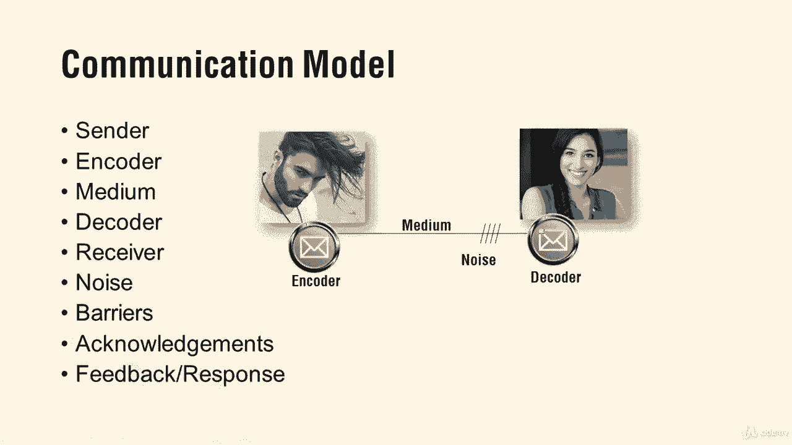

# 【Udemy】项目管理师应试 PMP Exam Prep Seminar-PMBOK Guide 6  286集【英语】 - P281：8. Project Communications Management - servemeee - BV1J4411M7R6

Chapter 10 of the Pembaok Guide， all about Project communications。

 one of the most important things that you do as a project manager is to communicate 90% of your time communicating。

When you get into the communications management， a little formula you'll have to recognize is our communications channel formula okay so the formula is n times n minus1 divided by 2 so in this example willll be 10 times 10 minus1 is9 so 90 by by2 is 45 there are 45 communication channels want to know that for your exam a lot of times we'll get the question do I include the project manager in the number of stakeholders so do I add one like in this case would it be 11 times 10 divided by two or is it really just 10。

Or that could be a trick like I can't say definitively， yes， you always do or yes。

 you always don't because they could say you are managing the project and you have eight stakeholders。

 so I might be tempted there to make it nine instead of eight。

So what you have to do this you aren't going to like this。

 what we have to do is figure it out first for nine and see if that answer works and then figure it out for 10。

 does that answer work so you might have to do the math twice to see which one shows up in the answers from your choices on the exam。

Also have to worry about this week you have 10 stakeholders next week you'll have 23。

 how many more channels will you have so I have to solve for 10。

 then solve for 23 and then find the difference of those channels I can't just say I have 13 more so I'll do that math you have to solve the channels it won't work if you just say 13 more。

 All right， so that's the communications channel for。Then you remember the communication model。

The guy with his flowing hair here。 All right， so remember these components， though， Snder。

 you're the receiver。 My email is the encoder。 yours is the decoder。 The medium is the network。

 You are the receiver。 So your machine is the deco or your email system。

 and then any static or disruption that garbles or distorts the message is noise。

 A barrier is if two people won't talk to each other or they can't because they speak different languages。

An acknowledgement means I receive the message， doesn't mean I agree with the message。

Feedback and response is where you ask questions or clarity or you say， okay。

 I got it and I'll take care of it。

So that's the communication model， know those terms for your exam。

