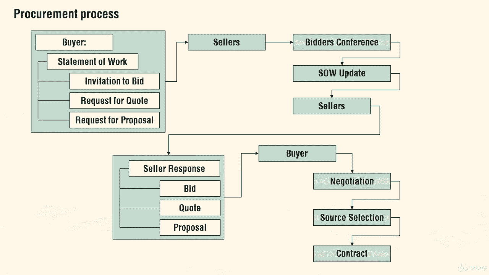

# 【Udemy】项目管理师应试 PMP Exam Prep Seminar-PMBOK Guide 6  286集【英语】 - P283：10. Project Procurement Management - servemeee - BV1J4411M7R6

。

Chapter 12 and the pinmbaok is all about procurement management and there's a lot of terms in this chapter you need to know first off the market conditions remember we had sole source。

 there's only one single source， there's lots to choose from that you have your favorite and oligopoly。

 the market conditions are so tight that what one player does affects all the other players in that marketplace。

Our procurement process in terms。 So you're the buyer。

 you create a statement of work or a terms of reference， create an imitation to bid。

 request for quote requestquest for proposal。 you give that to the sellers。

 then you have a bidders conference statement of work updates， you give that back to the sellers。

 the sellers then will go create a bid， quote or proposal。

 whatever you ask for and give it back to you the buyer。 you and the buyer negotiate。

 then you choose which one you will purchase from， and then you create a contract。

 So that's the whole process and the key terms that you want to know for procurement。

 One of the key things you'll need to know for your exam will be what contract type is most appropriate for your project and for a given scenario。

 So we're going walk through all the different contract types in the big picture of contract and really the characteristics of a contract you'll need to be familiar with。

 So really， really know these contract types I guarantee。

You're going to have some questions on contracts on your exam。So all about contracts。

 it's a formal agreement between a buyer and a seller。

 the US will back up contracts through the court system。

Contracts state everything that has to be true in order to close out the contract。

Any changes to the contract， they have to be formally approved， controlled。

 and documented and signed off on。Your contract may may have。

The terms of how you are allowed to change it， it may be an addendum or it may be up to X amount of dollars or what's the process so the contract can even define how changes to the contract are allowed or declined just because I have a contract doesn't mean I have to accept the changes。

 I could say we don't have time。 we've got other commitments can't take it on or we could say let's finish this contract and we'll make a new contract for that change。

Contracts can be used as risk mitigation and we know this because we're talking about which risk response。

Transference， I know y'all got that one right。Some contract legalities here。

There are two big categories we're going to look at with contracts。

 we have a fixed fixed price or cost reimbursable。Fixed price means this is the amount you pay。

Cost reimbursable means you're going to pay the cost that the vendor has。

 the seller has to perform the work in the contract and there's usually a profit margin built into that。

 but that's more has more of a flex because if the vendors costs fluctuate because the waste or some other you know nuance。

 then you have to pay for that because the cost。It is the type of contract you're paying for the cost to do the work。

 So generally， cost reimbursable are riskier for you， the buyer。Fixed price is fixed。

 you're only going to pay this amount， and there's a couple different flavors with both of those we're going to look at。

A contract has an offer， so this is the work we offer to do for you， we both accept it。

 we have to agree to it， and then we get the consideration。

 we get the payment that I will offer to build your house in consideration of the $500，000。

Has to be for a legal purpose， and it has to be executed by someone that has the capacity and authority to act on behalf of the organization so if I'm just a project manager。

 I can't be signing contracts， I need to give that to my manager or the contract department whoever really has the authority to make that deal between the parties。

A firm fixed price contract means I am the seller and you're the buyer。

And I say I will deliver to you  four tons of pea gravel， and it's going to cost you know。

 $1200 or whatever。 But I give a firm price。 You're not going pay more or less。 it's the deal。

 So the seller carries the risk of costoverruns。 If I didn't pay attention to how far away you are from where that pe gravel is。

 how far I have to deliver it and it's gonna to cost me a lot of money and fuel。

 that's on me So any costoverrun comes out of my end。

 So if I'm building a big deck on the back of your restaurant where people can go out and eat their lunch outside or whatever。

 and I say I'll do that for it's going cost $10000 right， we have a deal。

 and then I get out there and I start working and my team is having waste they're cutting the wood to the wrong link or the wood got wet or damaged you aren't paying anymore。

 We have a firm firm fixed price agreement。 That's。Deals on me。The buyer。

 you specifies what you're purchasing from me。Our contract could have a addendum if you want to change it so I'm building this deck for you。

 it's $10，000 and you come out and say， hey， this looks really nice。

 how about you build some picnic tables too， Hey we can do that but that's not part of our contract so we're going to have to do an addendum for that change or we might just make a whole new contract for these picnic tables So the firm fixed price specifies exactly what you're getting for exactly this amount。

So we're really clear on that。A similar one is a fixed price incentive fee。

What this one does is you say， Joe， I want you to build this deck for me in the back of our restaurant here。

But I need it done in like 10 days because we have a big party that's going to happen in 10 days。

If you get it done by then I'll give you a $2000 bonus so I have a fixed price and an incentive to get this all done in 10 days。

 so now I have to do some work about being more efficient and keeping my team on top of things and making sure there's not waste because I want to hit that deadline to get the bonus。

 the incentive fee， the incentive fee in that example was per schedule。

 but you might also say it's for cost which in a fixed price that's really cost doesn't matter。

 but a technical performance， so you could say if you can make this throughput even faster or make it more reliable or make it more attractive or what you create is low in cost to support then I'll give you a bonus。

There might be a price ceiling on that bonus， or a good example was in Indianapolis several years ago。

 I lived in Indianapolis for a pretty good stretch， as some of you know。In Indianapolis。

 there was a big project downtown where all these interstates came together。

 all these highways came together。They called it the Mega project and they gave this construction company。

 I think it was $10，000 for every day they got done early。So the up to a million。

 I think that's what it was。 It was something like that。 But the up to is the ceiling。

 So if you got an early for every day you were done early， you got a bonus about 100000。 So if you。

 you could be up to 10 days early is the max。 If you got done 12 days early， you didn't get 1。

2 million。 they got 1 million or whatever the terms were。 But it was something like that。 Well。

 the company that was doing the project。 They worked 24，7。 They had lights out there。

 They had a crew out there at nighttime， daytime all the time。 they were working on it。

 So they had they had done the math。😊，What would their labor be per day to get that $100。

000 bonus so it may not have been a pure million dollar bonus for them。

 but they spent a little bit more by crashing the project and fast trackingracking the project and working 247 that was less than the cost of that was less than the million dollars so they improved their profit margin so that's the idea of an incentiveife the risk they had was if there was a mistake and it set them back on their schedule。

 it would begin eating into that bonus because they would be done fewer and fewer days less than what they had anticipated so the seller carried the risk of cost overruns。

On a really big project that's going to last for several years。

 we might allow a fixed price with an economic price adjustment， an FP EPA。

 What this means is the price of materials if they fluctuate like the cost of steel or the cost of inflation any other external conditions that could affect the price unfairly for the vendor。

 then we would adjust that fixed price up or down， So it goes both ways。

 but we have to identify what will be the standard， how will we know how much steel cost。

 So some type of of a marker that we would follow that that would。

Kick in if it went above X amount percent low or below a percent， it would kick in。

 So this economic price adjustment is good for long term projects。A cost reimbursable。

 generally bad for you， the seller。 now I'm going to be the buyer。 okay。

 I'll be the sleazy buyer over here。 and I say that because cost reimbursable often seem like use car smells and I can really control what you pay as the seller and you're the buyer。

So this is anytime you have cost plus cost plus the fee or some other modifier。

It's okay to use this if the scope of work can't be defined early。

 I know we want to hire you to build this deck， but we're kind of making it up as we go。 All right。

 it we kind of crazy。 we want some different patterns and some different things in here。So all right。

 we'll do that， but it's going to be cost plus a fee to make these patterns out of wood or whatever it is as we go。

High risk may exist in this type of a project where we do a cost reimbursable。

 so if lots of risk happen， then you have to pay for those because there's a lot of risk here we're not going to carry all of this。

 we have to share that risk。The buyer， you you carry the risk of cost overruns。

 so if I have wasted wood and material， then you have to pay for that it's a cost plus or cost reimbursable。

 so you have to pay for that。A cost plus a fixed fee is where I say I'll come build that deck for you。

 and it's $5000 plus the cost of the wood。All right， so you have to pay for all the materials。

 so I'll get receipts and show you that I bought wood。 The danger with this is that。

If my team waste wood or gets wet or damaged or whatever， you have to buy more wood。

 So it's a cost plus a fixed fee。 You're paying for that material。So it's a little bit dangerous。

 the fee is constant that $5，000 fee is based on the scope， if you change the scope。

 like you want to add picnic tables or benches， that's outside of our scope so my fee could go up so the materials and the fee is going to change because you've added more things to the scope。

A really dangerous one here is a cost plus incentive fee。 A cost plus incentive fee is。

10000 dollars to do this。 build this warehouse for you or a barn， let's say for you。

 and in this construction。I'm going to give you a bonus if you get un early。

So if I rush to get done and I have waste and so on， you have to keep buying the materials。

 but I'll get a bonus if I get done early， so you carry some risk here that I'm going to rush and have waste。

 Haste makes waste。In larger projects， you might have an incentive sharing and the split is typically 80 20。

So here's what's happening here。I borrow money from the bank to buy an old warehouse。

 and we're going to convert this warehouse to condos。

 and I want to hire you to come in and do the construction of this。

 So I'm kind of the deal maker here， the broker。So I borrow the money a few million dollars to make all this happen。

 you come in and are doing the work until you finish the project。

I am just paying and paying and paying。 I don't have a return on investment till you're done because I can't sell these condos until you're done。

 or I can't rent them out until you're done。So an incentive sharing is where I tell you if you hit these dates。

 these milestones between now and completion， or beat them， I'll give you a bonus。

 so the idea here with this 8020 split is we say this is what the work is worth for your labor and time to get here。

But if you get done early， I'll basically pay you 20% of what you would have had and so on and so on and so on。

 and so I can give you basically a bonus by getting done early。

 so you aren't having to pay for additional labor， but you're doing it well and you aren't having waste and so on。

 so you being the business owner， the construction company， you aren't paying for labor。

 but you're getting paid 20%， a nice little bonus as if you had paid for labor。

So it's a cost savings for both of us that we share I get the 80% idea is I am you're getting 20% of what you would have paid and I have 80% because I didn't have to pay it for you it's good because you don't have the overhead the labor for me it's good because you're getting them faster or hitting your dates so it's an incentive sharing it's like a cost savings or a split。

The contract will define what that split is like that 8020。 you don't have to say $8020。

 you could say that this split is X amount of dollars。 you could just say you get an early。

 you get a little bonus here on these dates， so don't get hung up on that 8020 or incentive sharing。

 It's just a way of setting some markers。 you hit these dates。

 You're going to get a bonus for hitting these milestones。Now。

 one of the most unusual types of contract is a cost plus award fee。

You want me to build this deck for you， okay？And it's gonna be 10000。 So I build the deck。

 and I get done and be like it。 And I didn't go over on cost。 It's really good。 Maials are， you know。

 everything is $10000。 You inspect it。 and you say， great job。 it's really good。

 I'm gonna give you a bonus of $1500。 That's the award fee。

 So a cost plus award fee is a mysterious award that will be determined by you given to me the seller。

 So the buyer determines what the fee is。 It could be whatever they want。 They could say。

 here's a dollar。 That's your award。 the contract really doesn't specify what the award fee has to be。

 So the award is determined by the buyer based on my performance。

A time of materials contracts a very simple contract。

 Basically it says we'll pay for your time and we're going to pay for your materials so we could say up to $300 hours and up to you know $5000。

 So we have a not to exceed clause。 so the seller。Me。

 you're going to give me an hourly rate and any materials that I buy。

 I'm going to give you a receipt and you're going to reimburse me for the cost。

 That's time and materials。It can't have a time limit as well that this contract is good for six months。

 so that's a time of materials you're paying for time and you're paying for the materials know those contract typess and characteristics。

 be able to recognize them for your exam。

