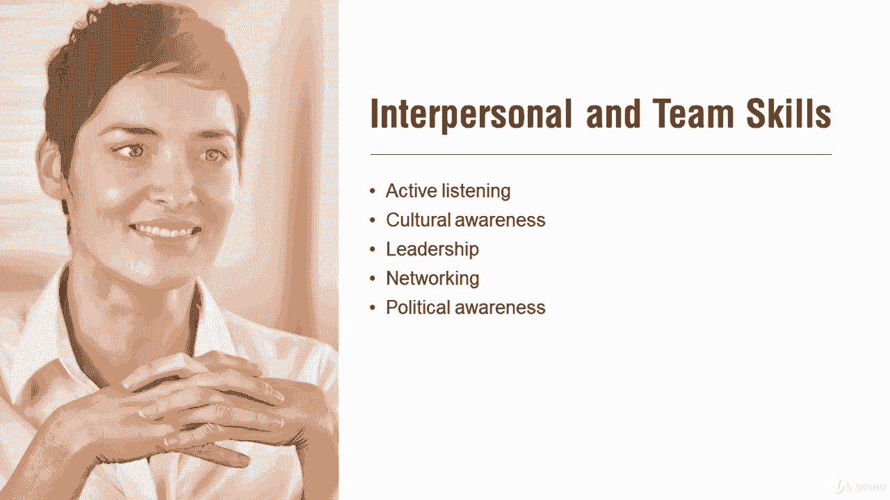

# 【Udemy】项目管理师应试 PMP Exam Prep Seminar-PMBOK Guide 6  286集【英语】 - P284：11. Project Stakeholder Management - servemeee - BV1J4411M7R6

。Chapter 13 in the Pimba Guide  Six edition is all about stakeholders really need to know stakeholders。

 stakeholders are people that have an interest in your project。

 they can affect your project or they are affected by your project。

 so they have some different characteristics here they're interested in it， they have rights。

 legal or moral rights， they have ownership， ownership of an asset。

 they have knowledge that they can help， or they contribute， they've got money。

 they have resources or just general support for the project。

Stakeholder analysis is where we study the stakeholders and we can create these different grids。

 so the one that I would encourage you to know is the idea of a power interest grid。

The higher the power， the higher the interest， the more closely you'll manage that stakeholder so these are some different flavors here。

 they all the same it just helps you create a stakeholder engagement plan。

So this is integrated with other knowledge areas because all those other knowledge areas were interacting with stakeholders。

 all of them， so the other knowledge areas and processes overlap here with monitoring stakeholder engagement。

It's most directly linked to communications， so our communications management plan and schedule overlap as well。

 obviously， with stakeholder engagement。 we're making certain that we are actively engaging stakeholders So we're relying on our project management information system。

 our information management system can help us engage stakeholders because we're looking at activities。

 we're looking at risks， we're looking at issues， all of those affect people if it affects a person。

 that person's a stakeholder and that can affect them positively or negatively In either case we want to be involved with stakeholder engagement。

 we want to make sure we're communicating and we have a clear understanding between the parties we have to use expert judgment like we talked about decision making。

 you may have to make some decisions that are not popular with some stakeholders。

You're going to meet with stakeholders。We always want to be honest and direct with project news。

 good or bad， we don't run from it， we don't hide it， we go to the problem。

 so you're always honest and direct， communication。

 often face to face communication is one of the best approaches here。Data analysis techniques。

 alternatives analysis， so you think about other solutions。

 root cause analysis remember RCA we're looking for causal factors。

 not symptoms that are contributing to why a stakeholder doesn't feel engaged or they're negatively engaged or they aren't a fan of your project。

 and then we continue to do stakeholder analysis。Throughout the Pembaok guide and this course。

 we've seen this idea of interpersonal and team skills， so you've seen all of this before。

 it's just really important when it comes to communication and stakeholder engagement。

You need that emotional intelligence， you need to be able to understand。

What a person is saying and how does that affect their lives and what's their concern with that objective of the project？

Again， cultural awareness， understanding the different cultures and how that could influence the project or how your project may be interpreted in the light of that culture。

What about leadership， you got to show leadership， then project team members can take leadership。

Networking is going to happen， you want to make relationships。

 long term relationships over short term relationships and of course having some political awareness。

 so stakeholder engagement， talking about engaging our stakeholders。

 keeping them involved and excited in our project。All right， great job， keep moving forward。

