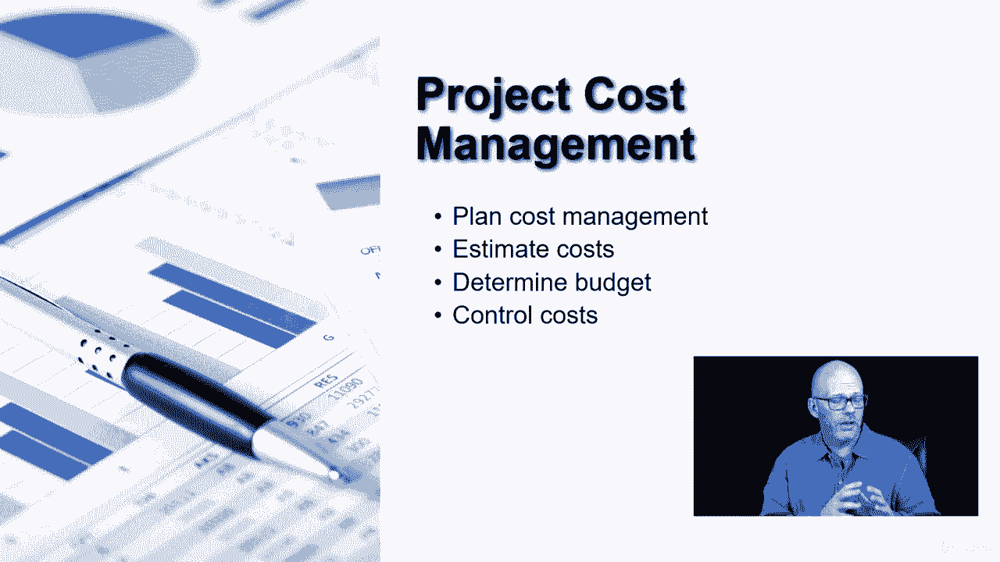

# 【Udemy】项目管理师应试 PMP Exam Prep Seminar-PMBOK Guide 6  286集【英语】 - P32：8. Project Cost Management - servemeee - BV1J4411M7R6

作为项目经理我们经常收到的第一个问题是，1。这个东西到底值多少钱，成本管理，弹球指南的第七章是关于回答这些类型的问题，根据我们掌握的信息量，我们能够对成本作出更可靠的预测。

这是我们在第七章谈到的事情之一，在针盒里，所以项目成本管理有四个过程计划成本管理，估计费用，确定预算和控制成本，所以成本管理是PNP考试中非常重要的一部分，这是Imboi中相当重要的一章。

只有在计划了四个过程的情况下，成本管理创建一个成本管理计划，它将告诉我们，我们组织中可以接受的估算成本的方法是什么？确定预算，然后我们如何控制成本，估计成本是我们预测的，根据我们掌握的信息量。

甚至我们要预测的时间，我们可以创建成本估计，所以有一个方差或一个方差范围，与不同类型的估计有关，当我们进入第七章的针盒时，我们会看到这一点，确定预算是与我们的工作包联系在一起的地方，在工作分解结构中。

它是所有这些工作包的成本总和，帮助我们创建预算，然后我们还将控制成本，就像我们控制范围和时间表一样，我们必须控制成本，以免出现波动，2。我们不希望浪费时间，那样会浪费钱，或浪费的材料，这将导致浪费金钱。

所以控制成本是一项非常重要的活动。

这是PIN BO第七章中的四个过程，而且是的，我们将在本章中讨论挣值管理，所以在课程的后面有一些值得期待的东西，所有的权利。

