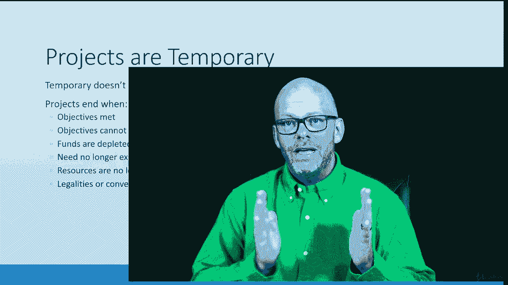

# 【Udemy】项目管理师应试 PMP Exam Prep Seminar-PMBOK Guide 6  286集【英语】 - P42：2. Projects are Temporary - servemeee - BV1J4411M7R6

正如我在上一节课中提到的，项目是暂时的努力，只是因为它们是暂时的，并不意味着这是一个短期的持续时间，经常在项目中，我们知道它会在某个时候结束，所以这是暂时的想法，没有进行中，我说，经常在项目中。

它总是在临时的项目中，如果看不到尽头，想质疑，我在做手术吗，项目有明确的开始和结束，当我们创建项目章程时，我们写进宪章的东西之一是成功的标准之一，当这些事情是真的时，我怎么知道我已经做完了。

所以这就是我的目标，当我创造这些东西的时候。

我知道项目已经完成了，所以说，这就是结局，项目是临时的，项目完成，或者当你现在达到这些目标时，项目就结束了，目标不一定只是范围，我们也可以有目标，就像你有这么多时间，有最后期限。

如果你不在最后期限前完成，这个项目没有理由继续下去，所以说，比如说，我们有个贸易展，你必须在这个特定的日期前完成这个项目，为了参加贸易展，嗯，如果你错过了交易日期，这个项目没有理由继续下去。

在项目上也可能有一个目标，在有成本的地方，我们的资金有限，所以我们先做最重要的事情，然后我们做最不重要的事情，所以我们会尽我们所能利用现有的资金，当我们没钱的时候，那么项目就完成了。

通常我们认为范围驱动，但这可能是时间或成本，我们将讨论敏捷环境中的倒三角形，所以我们稍后会讨论这个，只是有一点提示，让你兴奋，可能需要，已不存在，所以这个项目可能不再需要了，我推出第一版。

一个软件的两个，在我的项目进行到一半的时候，出现了第二个版本，所以我目前需要取消的项目，因为我们现在有了更好的技术，所以不再需要它了，或者市场上有机会，那个机会就没了，所以这个项目不再需要了。

将是项目可能被取消的原因，资源可能不再可用，因此，您可能需要特定的团队成员或技能集，如果那个人离开你的组织，那么你的项目就会陷入困境，也可能是一种材料，你用的是一种非常特殊的材料，如果你找不到那种材料。

那你就知道，也许你的项目太依赖于它了，它将不再需要存在，如果你得不到那个资源，物理资源，你可能有一些法律，所以可能会有一个新的法律或法规会导致你的项目结束，因为这将不符合规定或与新法律不同步。

也可能只是为了方便好吧，这个项目进行得够久了，我们玩完了，我们要结束这个项目，所以这些都是为什么一个项目是临时的特征，真的很重要要知道，因为我们希望能够认识到，这项行动正在进行中吗，还是暂时的。

我们知道它会在某个时候结束，我们常常感激它在某个时候会结束，所有的权利。