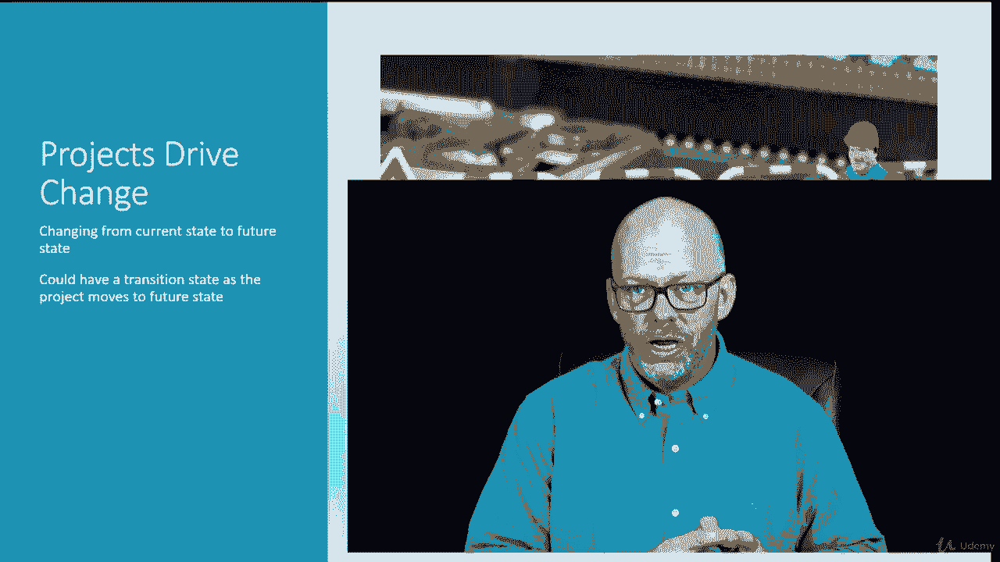
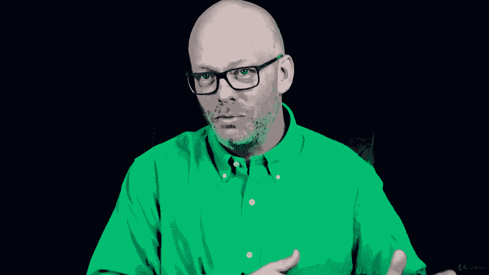

# 【Udemy】项目管理师应试 PMP Exam Prep Seminar-PMBOK Guide 6  286集【英语】 - P43：3. Project Create Unique Products, Services, Or Results - servemeee - BV1J4411M7R6

我们知道项目是创建独特产品服务的临时努力，有条件的结果项目也有一个特点，项目正在将当前状态改变为所需的未来状态，项目正在从我们现在的位置转移到我们目标的期望状态，我们想去的地方。

所以项目总是在做四个活动之一。

我们在搬东西，我们在添加一些东西，或者改变什么或者删除什么，而且是的，当你谈论移动时，你必须做那些手的动作，添加，变化，删除，所以你去那里，不是真的，你不必那么做，但这会帮助你记住这些，所以你要增加。

变化，删除，有时叫Mac D现在好了，认识到这一点很重要，这是一个快速的测试，你真的在做一个项目吗，你在改变吗，所以项目是关于变化的，所以你正在从你现在的状态转移到你想要的未来状态，现在。

有可能经常有可能，尤其是在它有一个过渡状态，过渡期，当你做这个动作的时候，所以想象一下我们在，你知道Windows X，不管流行什么版本，现在我们在Windows X上。

微软Windows Y的新版本来了，我经常问这个问题，所有的权利，所以我们从x移动到y，我们的网络里有成千上万的人，我们支持的，我们必须从x到y。

所以我们不能一下子打开开关，所以我们所做的是按部门滚动发布，按部门分列，所以我们的过渡状态是，有些人会在Windows Y上，我们已经为他们做了过渡，但其他人还在Windows X中。

所以现在我们有了双重支持，这就带来了一些问题和风险，也许还有一些，你知道我们在项目中必须考虑的一些资源限制，这个过渡状态，然后你知道，随着越来越多的人来到WindowsY，这越来越不是一个问题和风险。

但我们还是要计划这次行动转移，一个过渡状态也可以是我把产品给了别人支持，我正在把它投入生产，不一定是它，它可能是一个新的设备或一个新的解决方案，或者你知道即使是一栋建筑，所以有某种类型的保修或支持期。

当我们把这台新设备安装到位时，我们只是不插上电源就走开了，有一个过渡，我们支持并保持它，你知道，帮助人们提高我们为他们创造的新解决方案，所以这也是一个过渡态，所有的权利，干得好。

