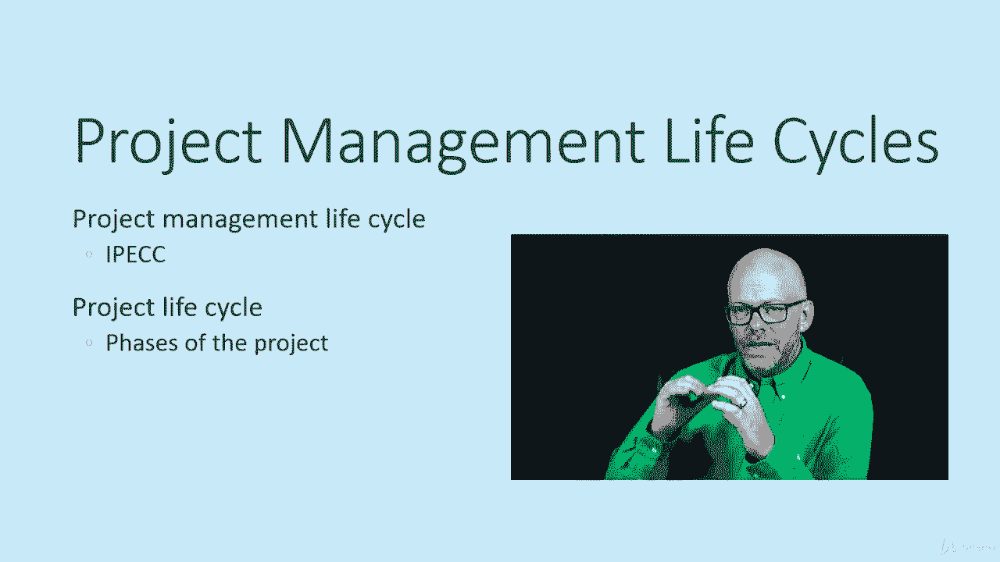

# 【Udemy】项目管理师应试 PMP Exam Prep Seminar-PMBOK Guide 6  286集【英语】 - P48：8. Reviewing a Project Life Cycle - servemeee - BV1J4411M7R6

为了你的采购经理人指数检查，有两个术语你需要熟悉，项目管理生命周期和项目生命周期，项目管理生命周期描述了启动，规划，执行人，监测，控制和关闭，这是我们作为项目经理使用的常见过程组，但是。

项目生命周期对每种类型的项目都是独特的，所以它描述了项目的阶段，所以如果你想想在建筑中我们有建造前阶段，许可证，和调查，还有所有的文书工作，以此类推，然后我们有基础阶段，然后取景。

电气和管道以及完成每一个阶段都构成了项目的生命周期，项目管理生命周期总是启动计划，正在执行，监视器，控制和关闭，所以我们刚才谈到了应用领域，项目生命周期是您所做的工作类型所特有的，换句话说。

我们在制造项目中不会有相同的项目生命周期，作为一个IT项目，作为建设项目，这些是该应用领域独有的，正在做的工作类型，事实上，有些项目可能也有自己独特的生命周期，他们自己独特的阶段。

所以你可能并不总是有一个框架阶段或管道阶段，或建筑项目中的任何情况，因为也许你不是在陷害，你在重塑或做干墙，或在你的建筑项目中的任何情况，我想说的是，项目的生命周期总是独一无二的。

每个阶段描述该阶段正在创建的工作和交付品，所以如果我们有一个叫做基础的阶段，我们都能很好地理解这在那个阶段创造了基础，或者如果我们有一个叫做框架的阶段，我们说的是房子的骨架，框架结构。

所以这只是一种快速的描述方式，在那个阶段发生了什么类型的工作，然后在该阶段的结束时创建可交付的产品，所以我们将看到相位的概念，一个阶段的结束允许下一个阶段的开始，一个阶段的结束往往会创造一个里程碑。

所以里程碑是项目中的一项重大成就。

所以基础阶段的结束将创造基础的里程碑，所以它描述了正在发生的事情以及它创造了什么，这就是项目的生命周期，所有的权利，干得好。

