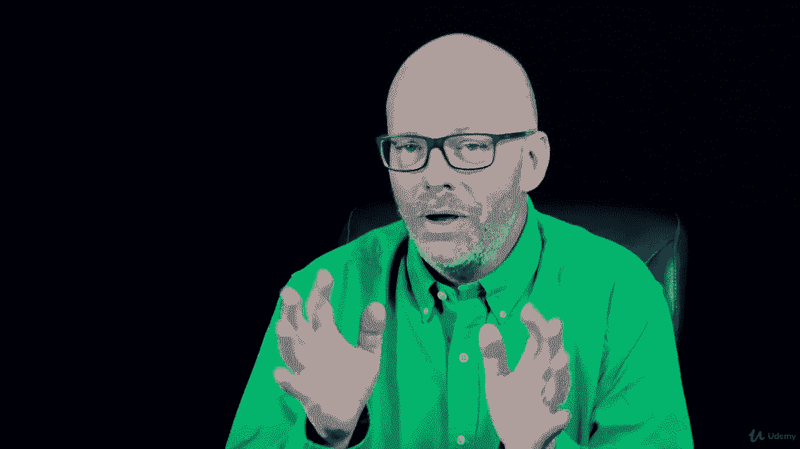

# 【Udemy】项目管理师应试 PMP Exam Prep Seminar-PMBOK Guide 6  286集【英语】 - P49：10. PMP Coach Don’t Think too Much - servemeee - BV1J4411M7R6

我教TP考试准备很长时间了，我在美国各地都教过这个。

全世界和网上，我注意到PMI候选人中有一个共同的主题，在人民党候选人中，他们经常有过度思考问题的倾向，因为他们想确定通过这次考试，他们想确定自己是对的，他们经常看一个问题，他们开始使答案合法化。

而不是只从表面上看问题，所以你不能对一个问题读太多，你只要回答问题，所以不要想太多，别想太多了，虽然在同一条线上，我注意到经常逃避考试的人，他们往往真的很害怕考试，一拖再拖，他们需要很长时间来准备。

所以我得出的结论是你准备的时间越长，在某个时候，你有一个送货点，所以我想对大多数人来说大约四到六周，是你需要有一个紧张的学习时间吗，大约四到六周，但如果你超越这一点，我相信有风险。

你的记忆力和兴趣真的会开始消退和下降，因为你有生命，你有工作，你还有其他你感兴趣的东西吗？你学习的时间越长，你只是会与课程早期发生的事情失去联系，在你学习的早期，我发现如果大多数人能把它压缩到四到六周。

我知道这似乎很多，但它真的，真的不算太糟，四到六周的紧张学习，我知道你还有其他事要做，你有工作等等，所以这对每个人来说都不现实，但我不会花一年的时间学习来通过这次考试，我会鼓励人们尽量压缩你的日程安排。

然后不要想太多答案，但我希望你有信心你能做到这一点，别怕这个，我认为害怕比失败剥夺了更多的人的成功，从来没有这样做过，所以不要害怕，这是你能做的，这只是个测试，这是一个测试，我有信心你能通过。

所以要有信心，别想太多，把你的努力集中起来，把它做好，勇往直前。