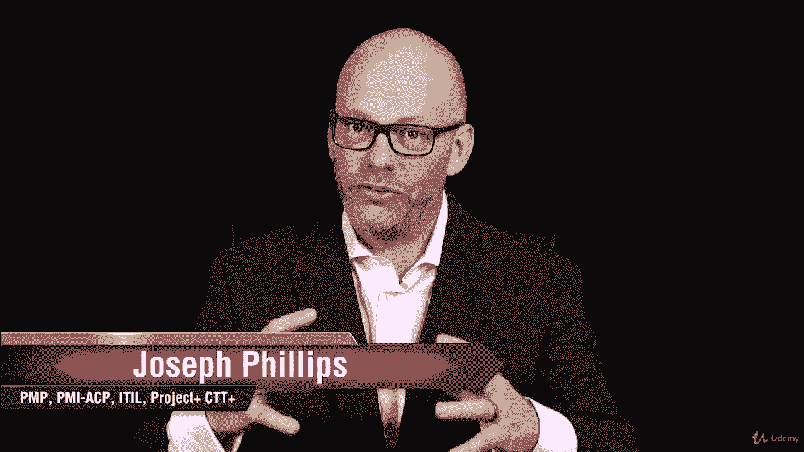
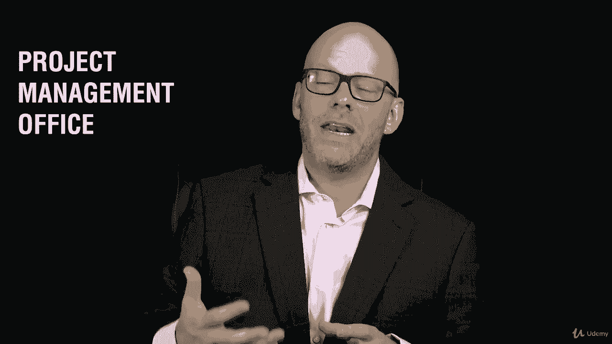
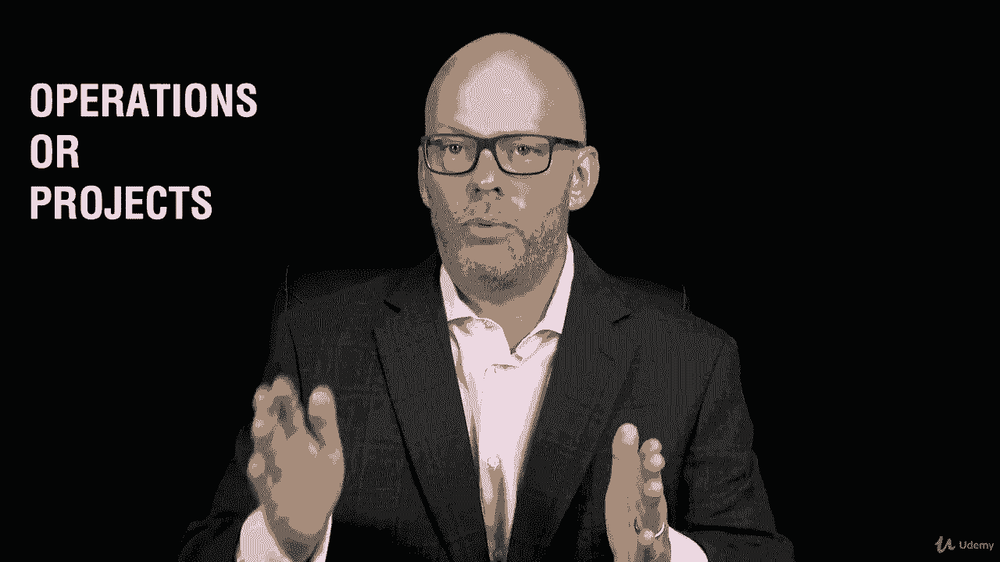
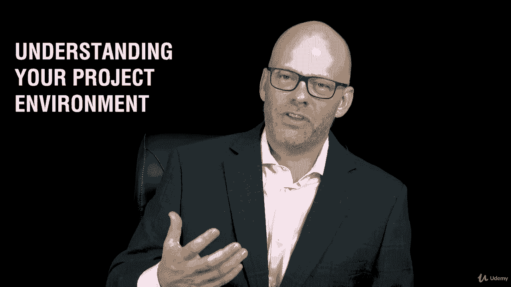

# 【Udemy】项目管理师应试 PMP Exam Prep Seminar-PMBOK Guide 6  286集【英语】 - P51：1. Section Overview Related Areas of Project Management - servemeee - BV1J4411M7R6

在本节中，我们将讨论项目管理的相关领域。

我们知道项目是唯一的实体，组织中唯一可以发生的结构。

我们将确定那些影响项目管理的其他领域。

你考试时需要知道的，也可能在你的组织中。

所以我们想在这里有一个非常清楚的理解，看看这些不同的术语，所以，如果你知道，通过正确回答问题来帮助我们通过PP的术语。

所以我们要谈谈项目管理和。

程序管理和项目组合管理，这三件事是相关的。

你也可能在项目管理办公室工作。

有不同类型的项目管理办公室，你的组织可能会称之为PMO，可以称之为项目办公室或项目总部。

所以为了我们的缘故，这些都是重叠的，我们就把它称为PMO。

项目管理办公室，我们将在本节中有一个很好的区别。

关于我们需要能够识别的操作或项目。

那是一个项目吗，还是手术。

有什么区别，那么这两者的一些特征是什么呢非常重要的是能够识别。

这是业务活动还是项目活动，所以我们将在这一节中深入研究。

你会有一个任务，或者你会在项目或操作上测试自己。

所以这真的很重要，这是一个有趣的小练习，有趣可能不是正确的词，但这是练习或作业。

我们要谈谈OPM，所以给你一个新的术语，opm。

所以我们将研究OPM和商业战略，这两件事有什么关系。

嗯，什么是OPM和业务策略，在本节中值得期待的事情，然后我们将讨论了解您的项目环境。

所以我们要讨论这个。

希望你能认识到不同环境的特征，甚至你作为项目经理的工作环境，所以我们在这一节中有很多信息要涵盖。

所以让我们跳进去，现在就把它打出来。

