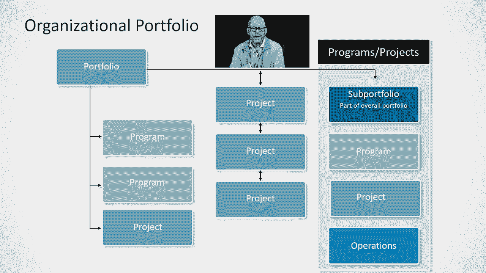

# 【Udemy】项目管理师应试 PMP Exam Prep Seminar-PMBOK Guide 6  286集【英语】 - P53：3. Portfolio Management - servemeee - BV1J4411M7R6

你在考试中必须认识到的另一个术语是投资组合，如果你愿意，这是一本关于一个组织可以在，我们投资的所有事情，所以如果你想想你自己的个人投资组合，用你的股票或存款，或者你有什么，那是你的投资组合，嗯。

组织或业务环境中的投资组合，描述企业本身的投资，我指的是项目项目和运营，然后由组织的投资组合经理领导，通常是一个高级管理人员管理，我们如何投资于项目和项目，因此，在投资组合管理范围中包含的注意事项。

你到底要送什么，为组织提供服务，所以思考业务价值的变化，你正从一个状态移动到一个期望的未来状态，那么这里发生了什么变化，规划，你将如何计划，我们如何处理这项工作，你如何高效地做这件事，方案或项目的管理。

在我们的背景下，我们只考虑项目，但现实是，一个项目也可能落入投资组合，成功的因素是什么，你怎么知道你成功了，那么监控项目呢，那么你如何监控它，特别是，你如何监控风险，或任何可能威胁项目成功的东西。

因为投资组合经理会想知道，你将如何在你所提供的投资中取得成功，所以我们投资的是，你如何交付，1。投资的回报率是多少？所以投资组合是关于最大化投资回报的，所以一个组织有一个投资组合，然后里面是投资。

以下是投资组合的样子，看起来这里有一个大圆圈，但中心是投资组合，然后我们有这些橙色的方块，表示我们刚才谈到的程序，然后记住程序中有项目，投资组合可以有项目和程序，一个投资组合可能只有程序。

然后程序会有项目，更有可能的是，一个投资组合将两者兼而有之，而且是的，一个投资组合可能只有项目，但你可能两者都有，当你看一个典型的投资组合时，投资组合对监督感兴趣，就像我们刚才说的范围，你如何管理变化。

2。你打算怎样做成功的计划，你打算怎么做？或者谁来管理那个项目，什么是成功，因为我们想要投资回报，那么如何监控，监控的一部分将是通信，当你有差异或事情没有计划时，我们将在第十章的针盒中讨论通信。

组织组合，另一种看待这个的方式，你有投资组合，然后在投资组合中，我们有程序，我们有项目，所以我们刚才说的，但下面还有一件事，最后，我们可以有一个子投资组合，一个子投资组合是工作服的一部分。

所以你提到了一个非常大的组织，像一个政府，或者一个非常大的生意，他们可能有一个投资组合，他们可以投资于整个公司的资金量，而不是一个人管理所有这些，他们按部门或业务线或项目和计划的类型来划分。

所以你可以有一个子投资组合，然后子投资组合将有我们描述的程序和项目，而且是的，操作可以是投资组合的一部分，但通常我们谈论的是程序和项目。

但你可以在那里做手术，所有的权利，干得好。