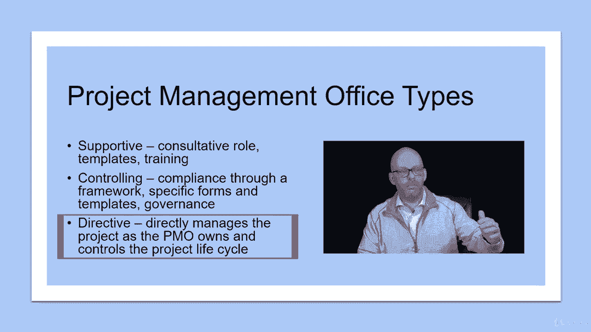

# 【Udemy】项目管理师应试 PMP Exam Prep Seminar-PMBOK Guide 6  286集【英语】 - P54：4. Working with a Project Management Office - servemeee - BV1J4411M7R6

许多组织使用项目管理办公室，这是协调某一特定领域项目的一种方式，所以在一个部门，在整个公司或只是在内部，你知道吗，一小组或一类型的工作，通常PMOS在部门内，这样IT部门就可以有自己的PO。

在更大的公司里，你有一个PMO是可能的，对于组织中的所有项目，无论哪种方式对你的考试都无关紧要，你需要知道的是PMO的特征，你和PMO一起工作吗，作为项目经理这对你有什么影响。

所以让我们来看看这里的特征，所以一个项目管理办公室，他们的首要目标是支持项目经理，帮助管理跨PMO的共享资源，所以资源是设备，设施，工具，也是人，所以他们可以帮助协调什么时候人们可以被用于什么项目。

pmos可以提供一些指导，对项目经理的指导和培训，因为PMOS通常想要的是一个统一的方法来做项目，以便本组织中的所有项目采取相同的方法，遵循相同的过程，对所有项目使用相同的表单、工具和技术。

以便利益相关者知道会发生什么，项目之间是统一的，这是一种可重复的项目管理方法，项目管理办公室也可进行项目审计，我们想确认项目是否符合这些，已建立的可重复的方法，所以他们在用，他们是项目经理。

项目团队正在使用正确的工具和技术，或者使用正确的表单或模板，使用正确的软件，所以项目审计不仅仅是财务审计，但你在按计划做工作，就像你在那里开的药一样，PMO A PMO还负责开发和管理流程和程序。

所以我刚才说的，我们有一种特殊的交流方式，我们使用这些形式，你必须每周四发送一份状态报告，你必须至少每隔一周开一次情况会，或者您必须为采购或更改请求创建此表单，按照这个方法，因此，在该组织中。

所有项目都有相同的方法，这对一个项目经理来说真的是一件很棒的事情，有几个原因，一个是节省时间，我不必重新发明轮子，每次我进入一个项目，我也不必培训利益相关者如何改变控制，或者期待什么形式。

当每个人都知道每当我们做一个项目，星期四你会得到一份状况报告，星期一上午我们要开一个情况会，这将制定我们本周的目标，我们将使用这些表格，这就是你如何获得变更控制和问题类型，所以它真的加快了一些速度。

通过使用项目管理办公室和建立方法来监督项目管理，所以我喜欢和PMO一起工作，它还有助于跨项目的沟通，尤其是如果你所在的组织项目团队成员来自世界各地，他们可能同时在多个项目上。

所以它可以帮助你与其他项目经理沟通，并安排资源，身体和人的，有三种类型的项目办公室你想熟悉，你有支持性的控制和指令，一个支持性的，就像听起来他们更像是一个咨询的角色，他们在帮助项目经理和咨询。

提供模板和培训，控制更多的是遵从性，你必须通过一个框架来工作，使用特定表单和特定模板并遵循此治理，然后指令通常意味着项目归PMO所有，项目经理作为PMO的一部分工作，所以他们管理项目。

他们控制项目生命周期，所以它不会在不同的群体中分布或传播，所有项目都可以由不同的小组要求，但一旦他们开始或开始，他们是PMO的一部分，所以他们真的控制了项目生命周期和方法的一切。

知道这些对你的考试很重要，因为这取决于你所在的PMO类型。

这将影响您管理项目的方式，所有的权利，干得好。

