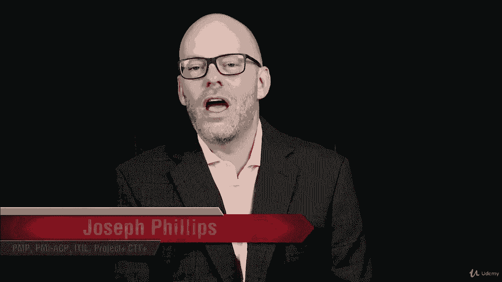
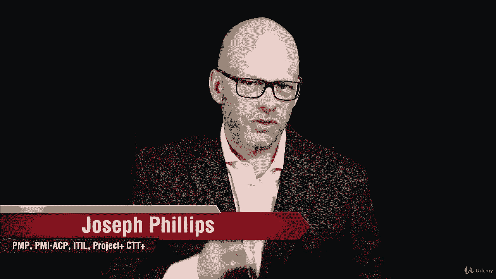
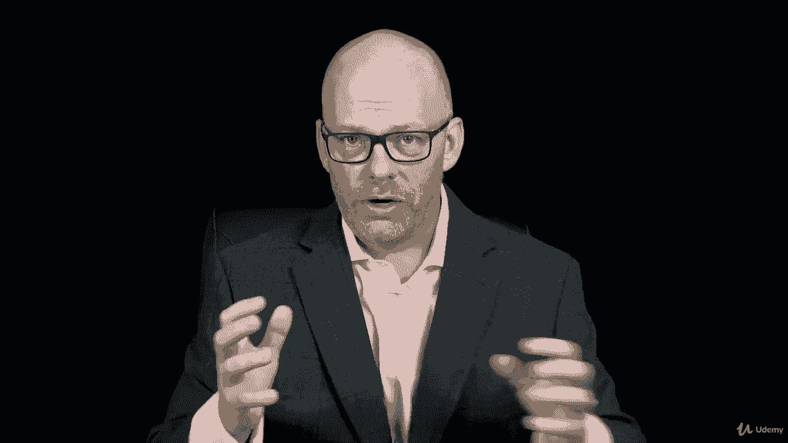
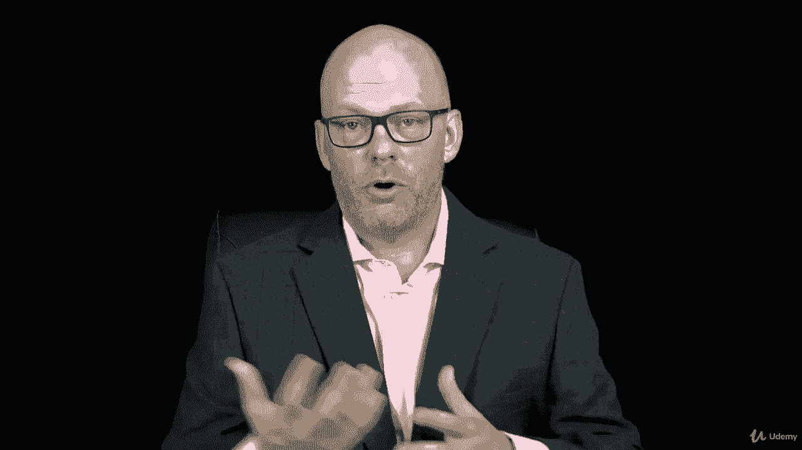
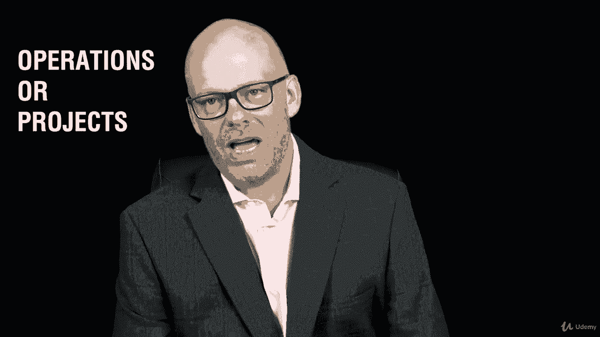
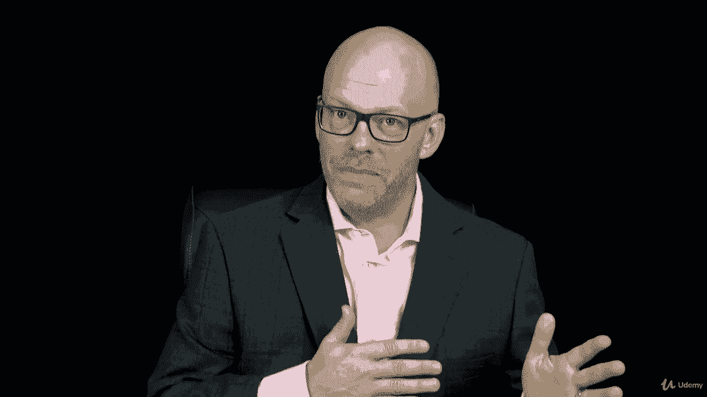
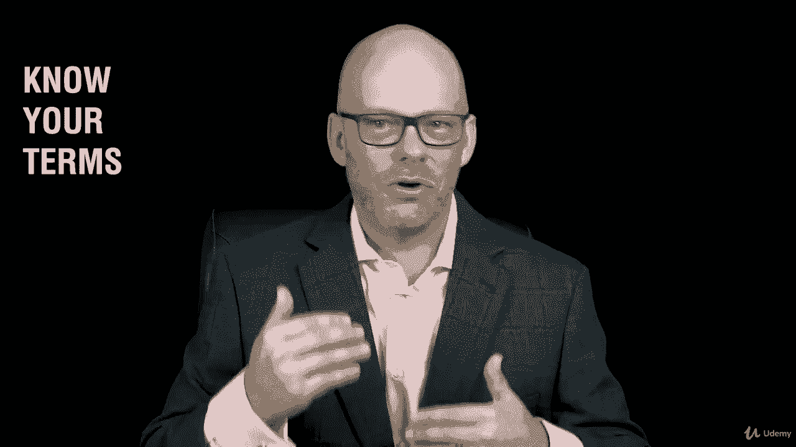

# 【Udemy】项目管理师应试 PMP Exam Prep Seminar-PMBOK Guide 6  286集【英语】 - P59：9. Section Wrap Related Areas of Project Management - servemeee - BV1J4411M7R6

完成项目管理相关领域的这一节做得很好。

我知道我们在这一节中涵盖了很多信息，所以让我们再次登上头条，好好总结一下。

在我们进入新材料之前。

在本节中，我们研究了组织中与项目管理相关的不同组件。

我们谈到了项目管理，当然啦。

然后我们讨论了程序管理和投资组合管理。

以及这三个实体如何协同工作，可以是彼此的一部分。

以及在这些情况下，作为项目经理，你需要如何运作。

不管你是一个单独的项目还是在一个程序中工作，或者你是投资组合的一部分。

我们谈到了与项目管理办公室合作，作为项目经理这对你有什么影响，以及你作为组织中的PM是如何运作的，在本节中，我们还讨论了。

是一个项目吗，还是手术，我知道你完成了一项任务，你能够识别项目或操作。

所以这真的很重要。

我们讨论了OPM，组织项目管理和业务战略。

我们谈到了策略，组织的愿景。

战略，什么能帮助我们实现这一愿景，然后OPM如何适应这个层次结构。

然后你必须了解不同的项目环境。

你所处的环境，影响，你如何管理这个项目。

你作为项目经理所拥有的权力，然后你想识别这些不同的环境。

即使你不在这些结构中工作，因为这会影响你如何回答考试问题，所以你需要注意那些通过P和P的考试。

然后当然，正如我在教练会议上提到的。

知道你的条件，如果你知道条款，你看一下在整个课程中散布的抽认卡。

知道你的条件，这将有助于你回答这个问题。

如果你不认识这个词，你不知道是什么，那么真的很难理解什么，问题是问好吧，干得好，你进步很大，你已经看过第六区了，嗯，让我们开始第七区，你能做到。

