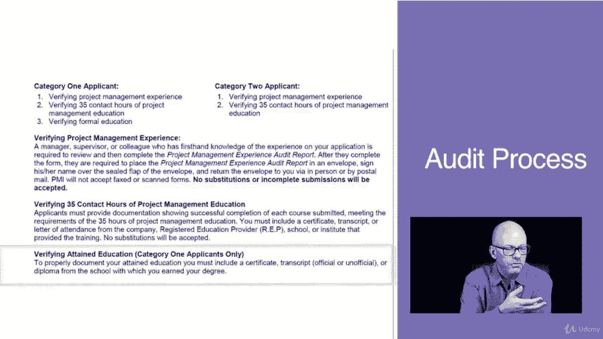
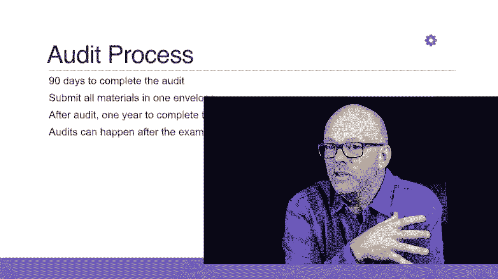

# 【Udemy】项目管理师应试 PMP Exam Prep Seminar-PMBOK Guide 6  286集【英语】 - P6：7. PMP Exam Application Audit - servemeee - BV1J4411M7R6

在上一节课中，我们讨论了如何获得P和P的资格，你看到其中一个步骤是可能的审计，我只是对审计的想法轻描淡写，嗯，那是因为我想在这方面多花点时间，在这个PP应用程序中，审计，是呀，你可以接受审计。

但是为什么PMI审计应用程序，为什么要费心呢，主要有三个原因，为什么一个，它证实了你的教育和经验，每个申请PP的人都可以接受审计，当你申请的时候总是有机会的，有机会，嗯，人们不作假是一种威慑。

他们不会撒谎，因为如果他们被抓了，他们出来了，他们不会，他们没有资格参加考试，所以它证实了教育和经验，它还提高了认证的可信度，你可能还记得几年前，在那里有一个特定的认证和它，我不会提到名字。

但在网上找到真正的试题并不难，嗯，对应用程序的审核摆脱了那些纸质证书，这是一场艰难的考试，你必须有资格参加考试，不是每个人都能接受的，所以它让它更排他性一点，或者证明经验，我们可以进入整个辩论。

还是证明了经验，人们还在撒谎吗，我认为绝大多数人都是诚实的，我知道当你申请的时候你会是，然后第三步是，正如我提到的，它过滤掉了纸质项目经理，你必须记录你的经验，然后证明如果你被审计，当然。

不是每个人都会被审计，审计的真相是这样的，只有一种方法可以避免审计，那就是不要报考，没有什么神奇的词或捷径可以绕过潜在的审计，如果你要被审计，你要接受审计，就是这样，这是参与计划的一部分。

一小部分应用程序被随机审核，现在是随机审计，采购经理人可以根据自己的酌处权进行审计，但自动，当您提交应用程序时，你要么被审计，要么不被审计，这是一个随机的过程，所以审计是随机的，你不能逃避审计的机会。

这是随机的，这不是侧写，他们不会说任何使用这个特定关键字的人，我们要对他们进行审计，或者任何从这所大学毕业的人，否，它是它是一个，这是随机的，这不是侧写，你被审计的可能性很小，这些年来。

我遇到了很多被审计的人，那么如果你被审计了会发生什么，一开始真的没那么可怕，这是你的类别一或类别二，第一类，你验证你的PM经验，您的联系时间，这将是指示com的证书，这个课程，你也是你的正规教育。

所以你的大学成绩单或学位的副本，如果你有高中文凭，你的第二类，所以你再次验证了你的项目经理经验和你三五个小时的项目管理教育，然后你进入你验证你的项目经理经验，这是PM网站上的审计说明。

所以如果你注意到你必须验证你的经验，这意味着你的经理，有第一手经验的主管或同事，你的申请需要审阅，然后完成它是一个表格，项目管理经验审计报告，所以他们填写了这份表格，然后他们把它放在一个信封里。

然后他们在信封背面的封条上签名，所以你知道如果有人打开它就很明显了，对于您在PP应用程序上报告的每一个项目，您都要这样做，所以所有这些不同的项目你必须有相同的过程，然后你不能代替它。

一切都必须完全是你在应用程序上写的，然后你验证你的下午教育的三个五个接触时间，所以请注意，你必须成功完成提交的每门课程，达到所需的三五个小时的项目管理教育，证书，在公司注册教育机构的成绩单或出勤信。

那就是我们，我们是一家PMI注册教育提供商，所以我们的证书上有我们的标志，这就是你给PMI的，如果你在本课程后被审核，然后验证已获得的教育类别，只有一个，所以你必须出示你的大学学位或成绩单。

所以这就是你给的。

你把所有的东西都放进一个信封里，然后你把这个送到PMI，你有九十天的时间完成审核，你有三个月的时间，你把所有的东西都放在一个信封里，然后你把它送进去，你不是一次寄一件的，他们不可能追踪到的。

审计后太乱了，那么你有一年的时间完成考试，所以这三个月不会占用你一年的时间，一旦你通过审核，从那时开始你有三年的时间，审计可以在考试后进行，总有这种可能性，你可以被审计，即使你通过了测试。

我没见过有这种经历的人，我肯定发生过，所以我们只要意识到这一点，我们在审计过程中遵循PMMI的规则，老实说，这并不是什么可怕的事情，我知道现在看起来很可怕。

但如果你对你的申请诚实，那么完成审计就很容易了，就像我说的，我见过很多很多被审计过的人。