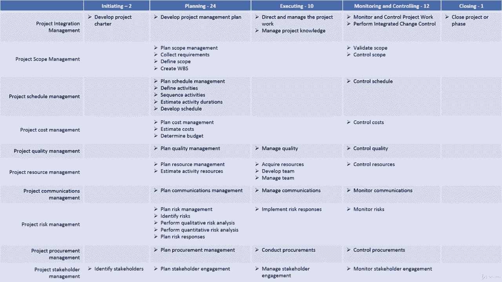
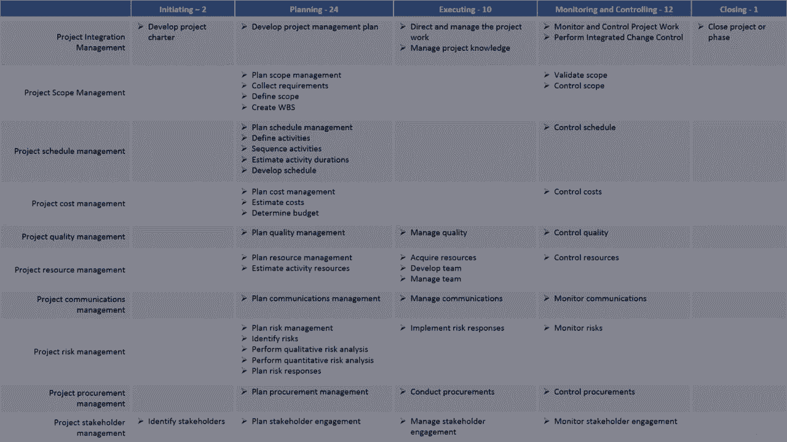

# 【Udemy】项目管理师应试 PMP Exam Prep Seminar-PMBOK Guide 6  286集【英语】 - P61：2. Reviewing the Project Management Process Groups - servemeee - BV1J4411M7R6

欢迎回来，让我们来谈谈过程组，我知道你已经看过了，您已经知道进程组，但这对你的考试来说是非常重要的信息，我想通过流程组和流程，只是为了把这一切都凝胶起来，那么让我们来谈谈这些过程组和过程。

以及它与你的考试有什么关系，好的，这些过程按过程组排列，就像你在顶部看到的那样，我们有启动计划，正在执行，监测、控制和关闭，然后沿着第一列，是我们的知识领域，与Imboge的不同章节相对应。

知识区域和流程组的交集是您可以找到单个流程的地方，所以让我们来看看这些，我们有发起，我们必须制定项目章程，确定利益相关者的规划，有两个四个，制定项目管理计划计划范围管理，收集需求以查找范围，创建WBS。

然后我们有计划进度管理，定义活动顺序活动，估计活动持续时间，制定时间表，计划风险管理，识别风险，执行定性，然后我们进行了定量风险分析，下一步计划利益相关者的参与，我们有执行，有十个执行过程。

指导和管理项目工作，然后监视和控制，我们有十二个过程，监督和控制项目工作，执行集成变更控制，控制采购，监测利益攸关方的参与，最后只有一个过程，那就是结束项目或阶段，当你在本课程中学习这些过程时。

尤其是当你进入考试前的最后几天，我希望你多注意开始和结束，然后执行，因为与计划和监控相比，向流程分配的问题更多，和控制，所以真的真的没有启动。

这对你的考试有帮助。

所有权利，干得好，我告诉过你很快的，只是快速回顾一下这些过程组继续前进。

