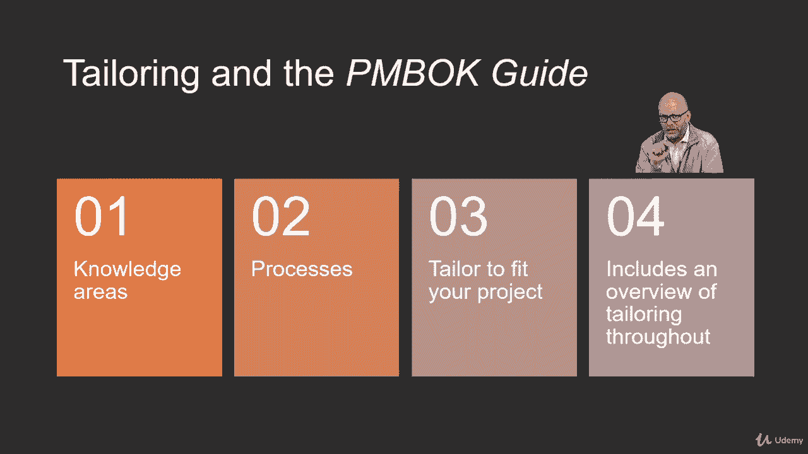

# 【Udemy】项目管理师应试 PMP Exam Prep Seminar-PMBOK Guide 6  286集【英语】 - P63：4. Tailoring the Processes - servemeee - BV1J4411M7R6

让我们谈谈裁剪项目管理流程，您已经知道您不必在每个项目中使用每个过程，但我们还必须确定深度，我们应该利用选择的过程，然后我们甚至可以定制这些过程，以适应我们正在管理的项目或我们的组织的类型。

或者在我们的项目或努力中什么对我们最重要，所以让我们先谈谈裁剪过程，我们需要知道四个关键事实，第一个是我们将在项目中使用什么过程，所以我知道我不必使用所有的过程，但是我应该用哪些。

或者我们将在这个项目中使用，第二个是到什么深度，所以如果我们知道我们必须做一个管理质量过程，但这到底意味着什么到什么深度到什么程度，或者我们要做风险分析，或定性定量风险分析到什么深度。

如果是一个大型的高调项目，通常我会在这些过程中更深入、更激烈，低优先级的小型项目，相当高的水平，我不需要在所有这些过程中投入很多时间，所以根据项目是什么，项目的优先级，我们选择的过程。

我们将确定强度到什么深度，我们在多大程度上做这个过程，我们已经知道，第三步，不是每个项目都需要每个过程，所以这是一个既定的现在，我们已经记下来了，通常，虽然第四步，项目越大，过程可能越多，所以项目越大。

可能你会接触到比一个小项目更多的过程，在Pinbock指南中还有一些关于剪裁的事情，整个Pinbuck指南，我们将看到裁剪过程或裁剪过程的想法，这些将在不同的知识领域章节中，从第四章开始，关于集成管理。

一直到十三，利益攸关方管理，所以我们在这里看到的，第一步是知识领域，所以每个知识领域，可能会有一些剪裁，我们知道过程，第二步这里的过程生活在知识区域内，然后第三步，我们为您的项目量身定做，所以这是项目。

项目的优先权，项目的特征将告诉我们需要哪些过程，我们在多大程度上需要这些过程，然后第四步，弹球指南中要知道的第四件事，正如我提到的，我们会看到一个做裁缝的机会，所以说，只是要意识到这一点。

当我们读到这些章节的时候，别让这影响了你，剪裁又回来了，每个知识领域。

每个过程都有机会量身定做，所有的权利。

