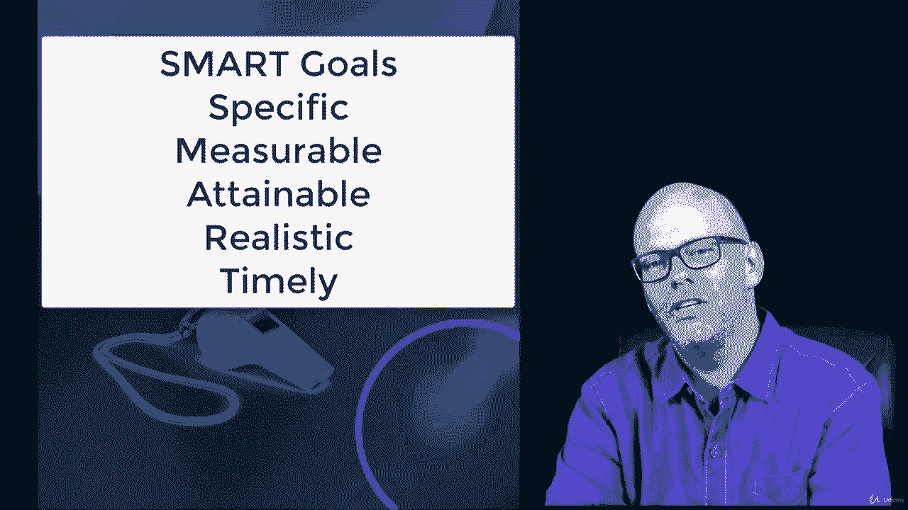

# 【Udemy】项目管理师应试 PMP Exam Prep Seminar-PMBOK Guide 6  286集【英语】 - P7：8. PMP Coach Getting Started - servemeee - BV1J4411M7R6

在整个课程中，我在这些小的PMP教练课程中投入了大量精力，这对你和我来说是个直言不讳的机会，所以我要和你分享一些，只是一些真正的教练建议，你需要第一部分，我们都在谈论P NP考试，就PP教练而言。

我认为对人们来说最难做的事情之一就是开始，迈出第一步，让我们朝着任何目标前进的第一个行动，六年前，我跑了一场马拉松，我在五个小时内就跑对了，我是说真的很慢，我知道我不是在吹牛，我只是很高兴完成。

那是我第五次跑马拉松，然后我不再说了，我是我做完了那种锻炼，太老了，不能那样做，嗯，我变胖了，变得沮丧，变得懒惰，变老了，六年或五年后，我说你知道这很荒谬，我没有理由，我不能再做一次就恢复状态了。

在我的生活中再次感觉良好，所以我开始采取这些小步骤重新开始锻炼，减肥，对我的饮食做一些小的改变，他们不得不开始，我必须从某个地方开始，所以随着时间的推移，就像没事一样，2。我可以先快速走几步。

然后慢跑一个街区吗，然后走一个街区，然后跑一英里，然后跑五英里，最终我能够跑马拉松，事实上是六年后，但那是我最美好的时光，我比你大六岁，但我现在能在整整十分钟内完成，我的功劳，那天风雨交加。

我想我本可以做得更好，所以也许你的腿上还有一场马拉松，我不知道我的目的不是吹嘘马拉松，因为我肯定没有赢得我的分数，为了达到那个目标，必须从某个地方开始，哪怕是最微小的一步，所以在这些早期的部分。

当我们考虑通过P NP时，你得从某个地方开始，你必须采取一些微小的步骤，并在这些基础上再接再厉，我们生活中发生的事情，我想当我们创造一个小目标时，我们实现了那个给我们信心的小目标。

然后创建下一个小目标和下一个小目标，下一个目标下一个目标，然后我们得到动力，因为我们有信心，基于我们已经做的，我们可以继续前进。

所以如果你准备好进入下节课，但是您还没有开始您的PMP考试申请，这次讲座的作业，我真的想鼓励你们花点时间跳出来做这件事，你永远不会通过P NP，如果你不申请P NP。

所以即使你出去你要做的就是输入你的名字和地址，至少你现在已经开始了，你有九十天的时间来完成它，一旦你开始，我认为这对任何人来说都是非常可行的，但你必须采取一些具体的步骤，所以我想现在就给你这个机会。

当你准备好的时候，让我们继续，结束这一节，然后我们将进入一些新的材料。

