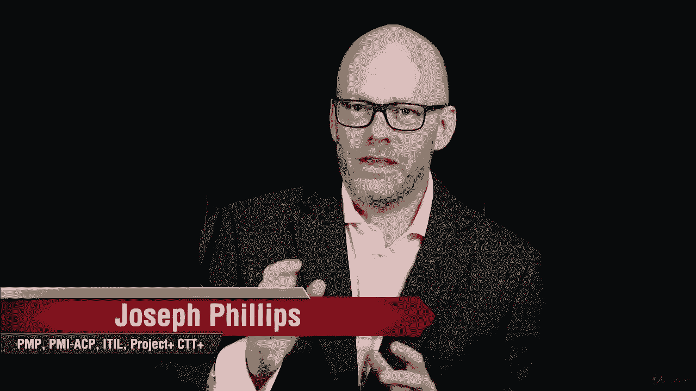
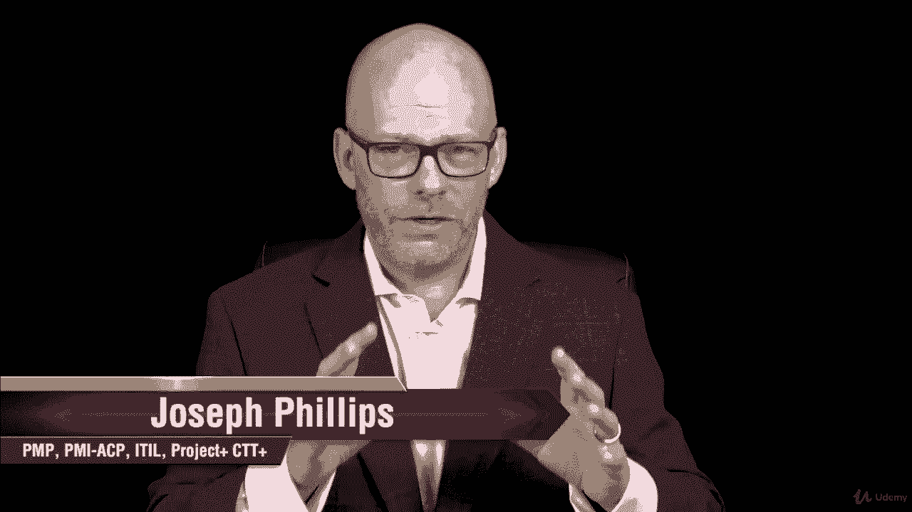
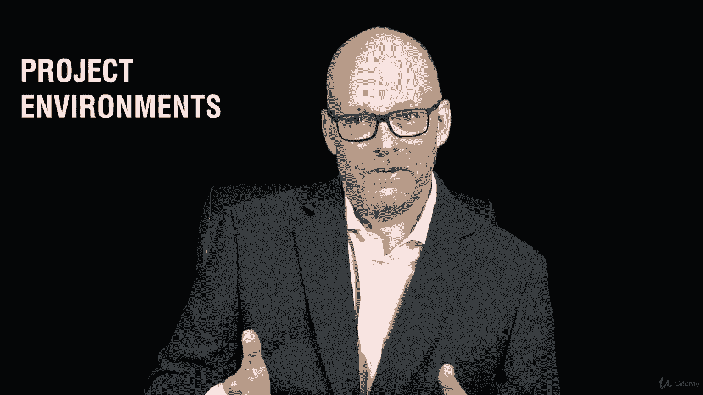
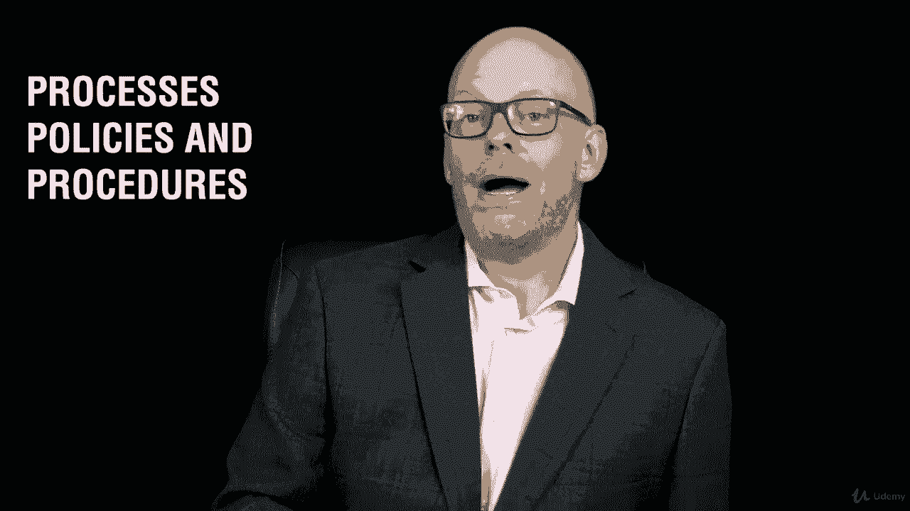
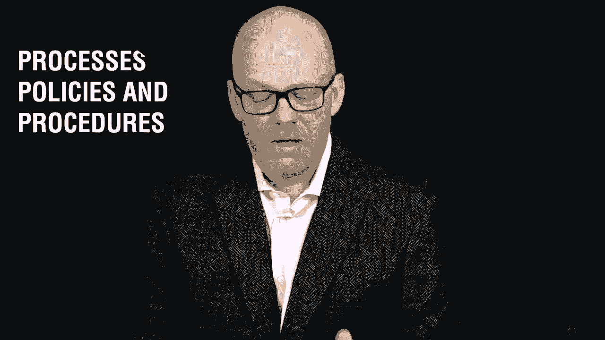
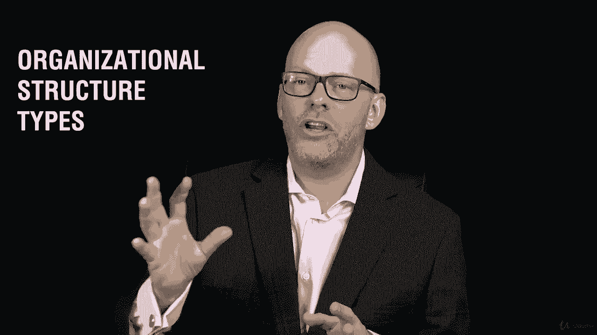
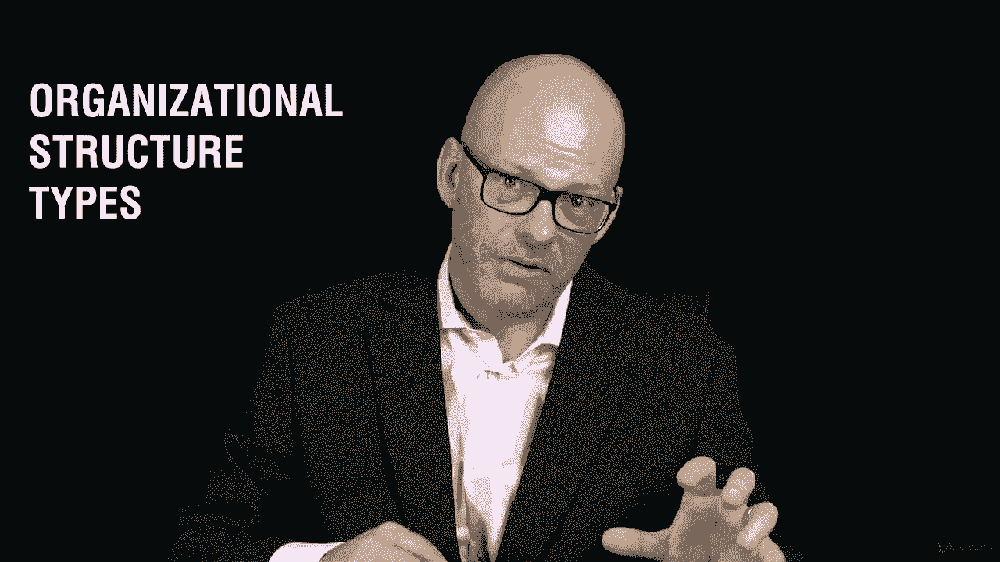

# 【Udemy】项目管理师应试 PMP Exam Prep Seminar-PMBOK Guide 6  286集【英语】 - P71：1. Section Overview Project Environments - servemeee - BV1J4411M7R6

在这一节中，我们将讨论一个非常重要的考试主题。

我们在前面的部分已经讨论过了，但现在我们要进入细节。

嗯，项目环境的主题是什么。

记住你作为项目经理所处的环境，影响如何管理该项目。

所以我们需要查看项目环境。

所以给你一些新的术语，我们将研究企业环境因素和组织流程资产。

这些将是许多过程的输入。

然后在项目创建更多信息时更新它们。

因此，我们将讨论企业环境因素和组织过程资产，你可以像我一样缩写，我们叫他们EEF和OPAS，所以这就是它的意思。

但你很快就会明白的，我们还将研究过程，政策和程序。

那么您在组织中做的流程是什么。

你限制或控制的政策是什么，你如何做这个过程，作为项目经理，你必须遵循什么程序，你工作的地方，这是您的组织特有的。

我们将研究组织系统和框架，影响如何管理项目的管理元素。

然后是一个非常重要的话题，我早些时候暗示过，它的组织结构类型。

这就是组织的结构，按不同部门的项目划分的类似业务线。

所以组织结构类型会影响你作为项目经理获得的权力。

所以我稍微早了一点。

这就是我们要研究这些不同结构类型的地方。

然后您将完成一项关于定义这些不同组织类型的作业。

所以真的很重要，你完成了，因为你需要知道考试的结构类型。

你需要知道在任何给定的结构中，作为项目经理，你是如何运作的。

所以现在如果你不在那个特定的结构中工作，你可以看到这对你的考试来说是一个挑战。

如果你不知道这种结构的细微差别。

好的，让我们跳到这里，把关于项目环境的这一节删掉。

