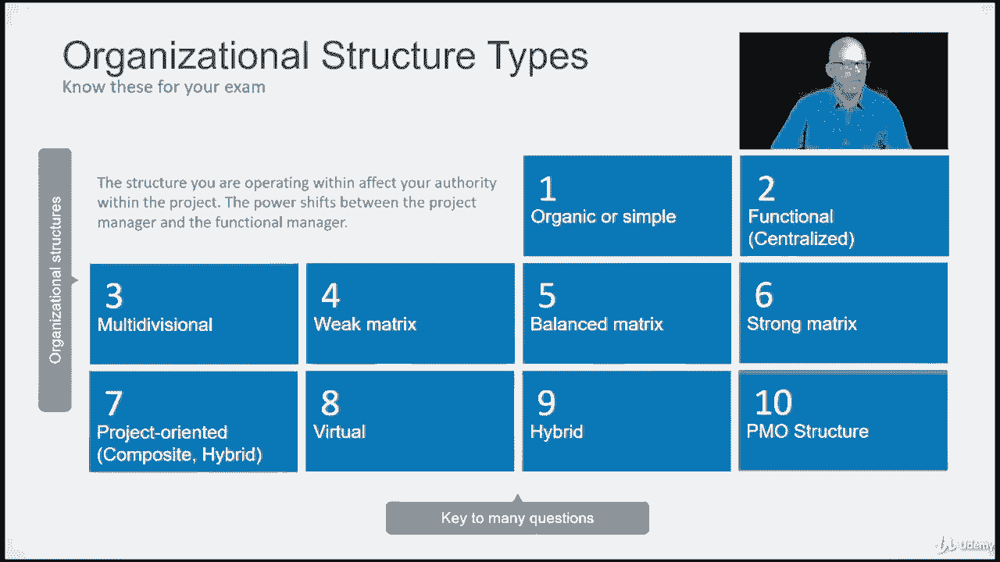

# 【Udemy】项目管理师应试 PMP Exam Prep Seminar-PMBOK Guide 6  286集【英语】 - P79：9. Organizational Structure Types - servemeee - BV1J4411M7R6

每个组织都与其他组织有一点不同，就像没有两个项目是像，没有两个组织是完全相同的，然而，有一些公认的特征描述了一个组织的结构。

所以在这节课中，我们将研究这些不同的组织结构，我们实际上是在讨论组织是如何建立的，这会影响你作为项目经理的权力，所以在考试中识别这些是很重要的，因为你可能会得到一个描述给定组织结构的考试问题。

如果你不知道那个结构的特点，那就会影响你回答问题的方式，因为这一切都是关于力量的，这不全是权力的问题，但这通常是我们作为项目经理要去的地方，所以我们要注意这些组织结构类型，我们在结构中考虑了一些因素。

就像我提到的力量，但它真的还有一些其他的特征，因此，组织能够组织其公司的目标是一致的，那么我们如何最好地实现我们的目标，我们的愿景和战略，我们可以通过能力来构建它。

所以有时我们称之为业务或部门的LOB线，所以你有IT部门，制造部门，销售部，所以它是一种能力是一种方式，如何构建一个组织是很明显的，这也有助于控制，所以我们可以更好地关注这些不同学科的控制和有效性。

决定的升级，所以很容易看出谁是负责人，如果我们说的是制造部、销售部或信息技术部，它还设置了一个权限范围，你知道，IT部门的职能经理或首席信息官，如果会的话，如果是这样的话，他们将负责它的决定。

设计的简单性，我们不想变得太繁琐和过度工程师，一个组织是如何结构的，有时候，尽管组织只是进化成这种科学怪人的结构，因为他们吸收了其他团体或其他业务，这并不完全符合，所以你可能有两个IT部门，一个是数据。

你知道，一个用于网络，或者你有什么，所以设计的简单性永远是一个目标，我们不想为项目经理设计过度的东西，它显然需要授权能力，作为首相，你可以做什么，你对项目决策有多大的权力，谁负责，谁该负责。

负责的意思是你有责任，你，你有责任，你是那个做决定的人，它回到你身边，你是那个有责任的人，这是你的责任，责任意味着你必须做这项工作，你得做很多次，我们说角色和责任，我们并不总是看到责任，全靠你了。

适应性是指你在组织效率上有多灵活，什么对组织最有效，这怎么会让我们，我们灵活吗，我们必须流过，成本是通过在组织中有这些多个实体，这是不是节省成本，它在头顶上吗，那对我们的成本有什么影响，物理位置呢。

尤其是在一个非常大的组织中，你可能有网站，你知道全世界，所以这会影响你的灵活性，以及如何管理项目，以及公司的结构，然后我们想要清晰的沟通，谁向谁报告，首相向谁报告，尤其是如果他们有一个IT项目，比如说。

它跨越了所有不同的部门，那么谁真正负责这些不同的决定呢，所以这些都是组织结构因素，我们思考的事情，当我们回答这些问题时，当我们思考这些不同类型的结构时，我们将在下一张幻灯片中看到。

所以这些都是规划中的特征，或者有时没有太多的计划，它只是发生或演变成这样，所以让我们来看看这十个组织结构，我知道这里有很多，你想在考试中认出这些吗，因为你所处的结构会影响你有多大的权威。

权力通常在项目经理和职能经理之间转移，所以十个不同的结构，我们将详细研究所有这些，你有所谓的有机的或简单的，你有功能性，有时被称为集中的多部门，然后我们有三个矩阵结构，弱平衡强项目导向。

有时被称为复合材料或混合体，虚拟结构，然后是一个混合结构，然后是PMO结构，那么让我们来看看这十种组织结构类型及其特征。

有机的或简单的结构，组织内的工作组是灵活的，所以很多时候我们看到这并不总是，但它可能是一个较小类型的公司，我们有一个大项目要做，人们只是跳进去做工作，他们工作的主人，经理，一线员工。

他们都跳进去完成工作，所以这真的不是很多你的准确性在这里，一切都集中在完成工作上，首相没有太多的权力，可能更像是项目协调员或项目加速者，实际上，当局就像组织的所有者。

这就是为什么我说它可能是一个创业公司，所以组织的所有者负责预算，负责完成这项工作，你可能会有一个，你知道，只要被称为首相，但你也可以被称为协调员或加速者，专门用于项目的资源很少。

这意味着你可能不会有全职的人在这个项目上，这更像是一个需要的基础，然后是首相，他们可能不会有行政人员来帮助项目经理，所以表单、报告和模板，很多都落在首相身上，你没有管理人员来帮忙，如此有机或简单。

只是很简单，记住这里的主要特点是人们根据需要跳进去做工作，不是真的爱上角色，在标题中，在有机或简单结构中，一个功能性组织有时被称为集中式组织，所以有明确的业务单位或业务线的划分。

这就是我之前谈到销售时所说的，市场营销，金融，i，那可能是一个功能性组织，PM和一个功能性组织没有太多的权威，更多的是职能经理做决定，现在，一个职能组织中的项目保持在该职能范围内，所以你有一个IT项目。

你有一个销售项目，一个我没有真正使用资源的制造项目，从这些其他行业，一切都在这个实体中，每个人都向职能经理报告，包括项目经理，首相可能被称为团队领导，可能被称为项目协调员或加速者。

通常这是每个人的兼职角色，因为不仅在项目中兼职，你也有你在行动中做的日常活动，很少或没有行政人员，职能经理管理项目预算，现在，多部门结构具有与功能结构相同的一些特征，区别在于。

尽管我们有每个除法的函数复制，所以有一个IT部门的想法，你可能在这里有制造部门，在制造业中，你有一个IT部门，然后在这里你有财务部或部门，然后在它里面有一个IT组，所以你可以有这些角色的复制。

但他们只支持他们运作的部门，所以它的功能类似于，但它要大得多，你有这种角色的复制，所以它并不总是有效的，不仅不总是具有成本效益，但有时是出于必要，因为你有一个庞大的组织，你有这些角色的复制。

首相真的没有很多权力，就像一个功能性的，同样的方式也可以被称为项目协调员，项目资源，可能是兼职，因为你在做你的日常活动，你参与的项目可能是兼职管理人员，所以你可能会有一个人充当所谓的抄写员，或行政助理。

他们会帮助安排或保存会议记录和议程，又是这样的事情，职能经理将管理项目预算，现在让我们来谈谈我们有弱的三个矩阵结构，平衡有力，弱的形容词，平衡的或强壮的，它描述了项目经理相对于职能经理的权力。

所以弱矩阵是，或者这些矩阵中的任何一个都是团队来自公司的各个地方，它不仅仅是在制造业或IT领域，所以你有一个项目，制造业的人金融界的人等等，所以你有来自全国各地的资源，全世界，可能是。

项目经理的权力很小，虽然在弱矩阵管理是兼职，兼职项目团队，项目协调员或团队负责人可能是PM的头衔，你可能会有兼职的管理人员再次帮忙，职能经理管理项目预算，平衡矩阵。

一个平衡的矩阵描述了PM和职能经理之间的权力量，通常，项目经理对项目团队仍然有较低到中等程度的权力，还是兼职，它仍然是一个兼职下午，因为人们每天都有手术，他们必须照顾，你可能有一个兼职的行政人员。

项目经理和职能经理，但他们共同管理项目预算，所以平衡矩阵，这真的是，听起来不错，现在，强矩阵非常相似的特性，但这一次项目经理比职能经理对项目预算有更多的权力，把你的兼职管理变成一个几乎全职的项目团队。

全职行是项目经理的角色，你可能有全职行政人员，所以一个强大的矩阵更专注于PM中的项目，下一个我们有一个项目导向，以项目为导向的是指小组是否在一起，他们都在这个项目上全职工作。

所以如果我们从组织中走到一起，即使我们是虚拟的，这是我们在给定时间内唯一的项目，所以它是以项目为导向的，有时你可能会把它看成是项目，但实际上它是以项目为导向的，就是我们所说的。

现在项目经理几乎完全控制了团队，所以他的力量是最大的，是高度自治，首相将在这个项目上全职工作，团队将全职工作在这个项目上，你有一个全职的行政人员，他们正在帮助后勤，所以有时你可能有一个全职的时间表。

你可能有一个危险的人，但他们在帮忙，你可能有一个行政助理，他们正在帮助管理这个项目，项目经理以项目为导向管理预算，虚拟组织并不一定意味着我们都是分布式的，当我们谈论虚拟组织时，我们真正在谈论的是什么。

我们所有这些不同的部门都参与了这个项目，每个部门都有一个人代表那个部门或那个小组，所以它有点像一个网络，在这些不同的群体之间，由这个个体代表，所以这是每个不同部门的接触点的想法，沟通有时是一个挑战。

因为你有一个接触点，所以你得通过那个人，那个人就去了团队，或者那里的利益相关者获得信息，把它带回来，还给你首相，然后你把它给这个家伙，所以当涉及到交流时，它变得有点混乱。

首相对这个项目团队的权力真的很低，因为这些都是接触点，所以没有太多的权威，他们回到与职能经理分享权力，项目经理可以是全职或兼职的项目团队成员，这些不同的接触点，在队里的，他们很可能是兼职。

你可能会有兼职或全职的行政人员，那里有很多弯曲，所以一个虚拟组织实际上描述了这个网络，所以你想到虚拟，想想这个网络节点，但节点是人，这些不同部门中的每一个的接触点，混合组织。

它只是所有这些的任何类型的混合，您想要的任何类型的混搭都是复合结构，或者混合组织，所以你有一个混合，你是一个强大的矩阵，你带着各地的人，但对于这个项目，你将以项目为导向，你将只在这个项目上工作一段时间。

所以这是一个特殊的项目，项目经理的权力是结构所独有的，它是，很难确定这一点，因为是你编的，它是所有这些不同结构的混合体，项目管理办公室，我们将更多地讨论PMOS，有点高水平。

因为它确实会影响我们的结构和你拥有的权力，作为首相，项目管理办公室是一个项目管理办公室，一个PMO组织，他们管理对组织中所有项目的控制，那个组织可以是企业，整个公司，也可能只是一个部门。

这是一个统一的方法，当项目经理的目标，尽管你想要一个统一的方法，然后PMOS帮助项目经理跨项目共享资源，他们可以提供一些指导和沟通帮助，做一些变更控制，为变更控制创建一些流程和策略。

它们也有助于解决问题，所以这是一个PMO，所有这些的大画面，所以很快就有了一些利弊，我不打算在这里详述这一点，有机的或简单的，专业人士很灵活，囚犯们会感到不知所措，因为他们有这个项目。

他们必须处理他们的日常任务，负责的职能部门经理，首相几乎没有权力，多部门，明确的权力关系，缺点是，尽管你有重复的努力，项目导向，首相有自主权，项目团队在项目期间全职工作，缺点是。

尽管你的团队可能会竞争或储备资源，他们也可能会有一些焦虑，因为他们担心在这个项目中他们下一步要做什么，强矩阵，强大的矩阵团队可以分配50%到90%的持续时间，你可能会有一些资源竞争。

仍然是一个平衡的矩阵，项目经理平衡了项目权力和管理，但项目经理的职能经理可能会竞争，所以在这里有一点时间的斗争，然后项目团队成员可能会觉得他们有多个老板，弱矩阵，首相没有什么权威。

这样做的缺点是职能部门，它是分开的，这是一项单独的活动，然后团队成员可能会觉得同时有多种资源，资源和部门是分开的，所以只有一个接触点，这就造成了沟通上的挑战，PMO是我们有一个标准和集中的方法。

然后它可能会感到窒息或与项目经理脱节，所以这里有一些快速的事情，利弊，我不想喋喋不休，你可以研究的一点是，有空的时候，知道这些可能并不重要，为了你的考试，所有的权利，我知道这里有一个很长的讲座，干得好。

勇往直前。