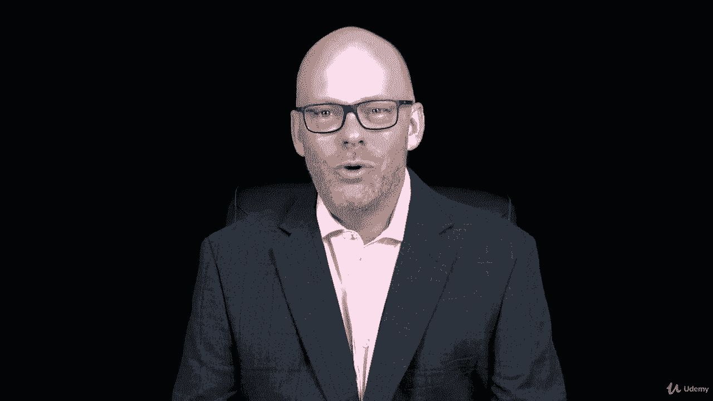

# 【Udemy】项目管理师应试 PMP Exam Prep Seminar-PMBOK Guide 6  286集【英语】 - P8：9. Section Summary Preparing to Pass the PMP Exam - servemeee - BV1J4411M7R6

干得好，完成了关于赚取PMP的第一部分，PMP考试准备研讨会是一个长核心，这是一个很大的课程，我们有很多信息要报道，但你做了很多人都没有尝试过的事情，很多人会害怕人民党，所以他们不会尝试。

否则他们会紧张起来，所以他们在PMP考试准备上购买了这门课程，但他们没走到这一步，他们一拖再拖，作为一个项目经理，他们一开始就不好，你知道通常最难的部分是刚开始，这就是你已经做的，所以在第一部分。

我们讨论了这门课要讲的内容，你和我要一起做什么，当我们通过这条路线时，我们看了PMP考试，考试的机制是什么，1。考试要花多少钱，你如何完成考试申请，我们还讨论了你如何有资格参加PP。

所以你想确保你受过教育，这门课就足够了，三个五个接触小时是从这个课程，我们还讨论了你是否有学位，这对P和P考试申请有什么影响，还有你多年的项目经理经验，我们谈到了审计过程，你有可能被审计。

当你递交申请时，正如你现在所知道的，这真的没什么大不了的，这只是一个有点繁琐的过程，你必须经历才能改善你的教育经验，如果那是你完成审计，然后利用这一点额外的时间做一些更稳定的努力。

当你准备通过你的PP时，别让审计吓到你，我们谈到了考试申请，你实际上如何去PMI组织申请PMP考试，所以我们看了看，事实上，你做了一项任务，我希望你在考试申请上还能保留一点情绪，你必须完成。

所以如果你现在开始，当你通过这门课程时，你可以完成它，然后如果你需要这门课程作为你的联系时间，您可以将此课程作为您的联系时间提交，你的考试应用程序已经准备好了，这样就不会耽误你的学习。

然后必须填写应用程序，然后去考试，你会觉得与我们将要报道的信息有点脱节，在整个课程中，所有的权利，你做到了，你完成了第一堂课，第一部分，我应该说很多关于赚取P和P的讲座，好的，干得好。

我们下一节见。

