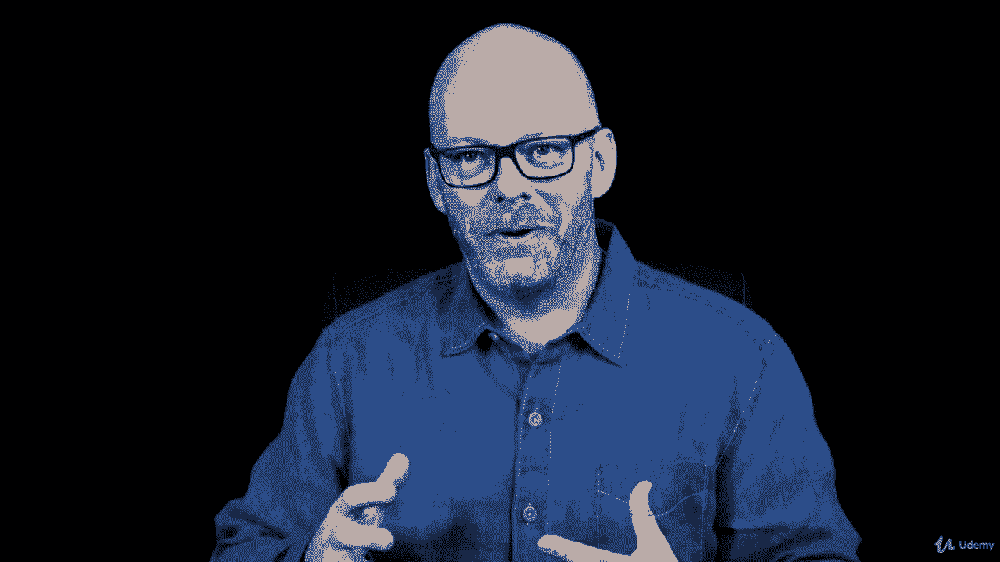

# 【Udemy】项目管理师应试 PMP Exam Prep Seminar-PMBOK Guide 6  286集【英语】 - P81：11. PMP Coach Keep going! - servemeee - BV1J4411M7R6

我非常相信动量，我想最难的部分是一旦你开始了就开始。

尽管你开始获得动力，动量是不断推动你前进的能量，在你的努力中是如此重要，通过考试，通过P和P，你找到了动力，你找到继续前进的方法，每天抽出一些时间来为你的PP学习，我们还需要从大局出发。

这不会永远持续下去的，就像一个项目，不会永远继续下去的，我见过一些人，或者和一些人交谈过，你知道一整年，从他们的申请获得批准之日起，去参加考试，坦率地说，这不是个好主意，把它压紧。

而不是把你的痛苦延伸到一年多，在一年多的时间里与这些信息断开联系，越快越好，正如我们前面所说的，就像你在一次作业中所做的那样，制定一个学习策略，如果你的目标是一年，通过这次考试。

当你到了九点或十点的时候，看看时间过去了多少，以及你将如何失去与这些信息的联系，就像生活中的大多数事情一样，你等得越久，情况就越糟，所以你真的想压缩这种努力，找到动力紧凑努力专注并完成它，2。

我相信你能成功，事实上，我知道你能做到这一点，所以要努力，找时间，找到能量，创造动力，坚持这条路线，你做得很好，你已经涵盖了很多材料，现在我们将开始进入更具体的知识领域。

当我们在PinboGuide中工作时，所以我有信心你能做到，勇往直前。

