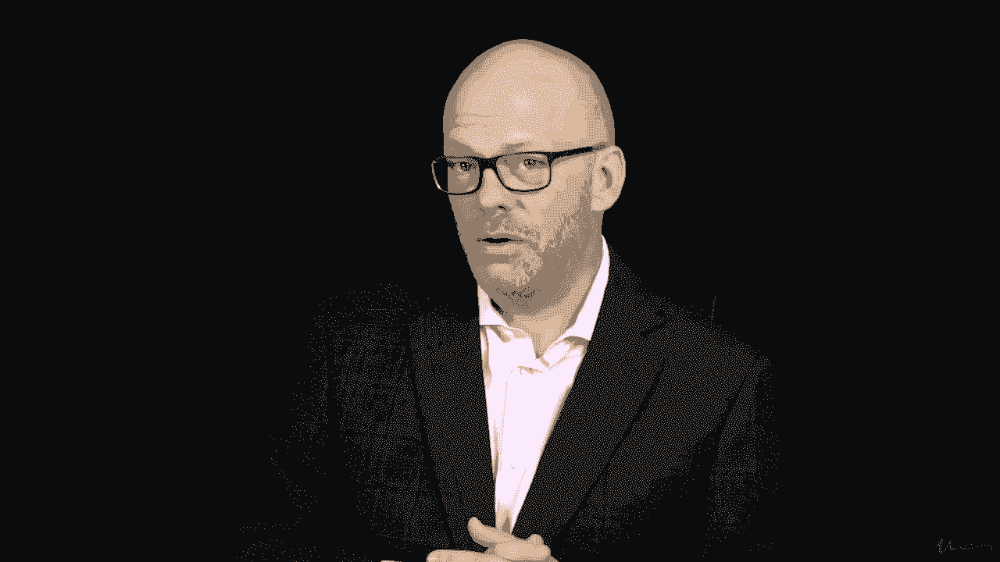
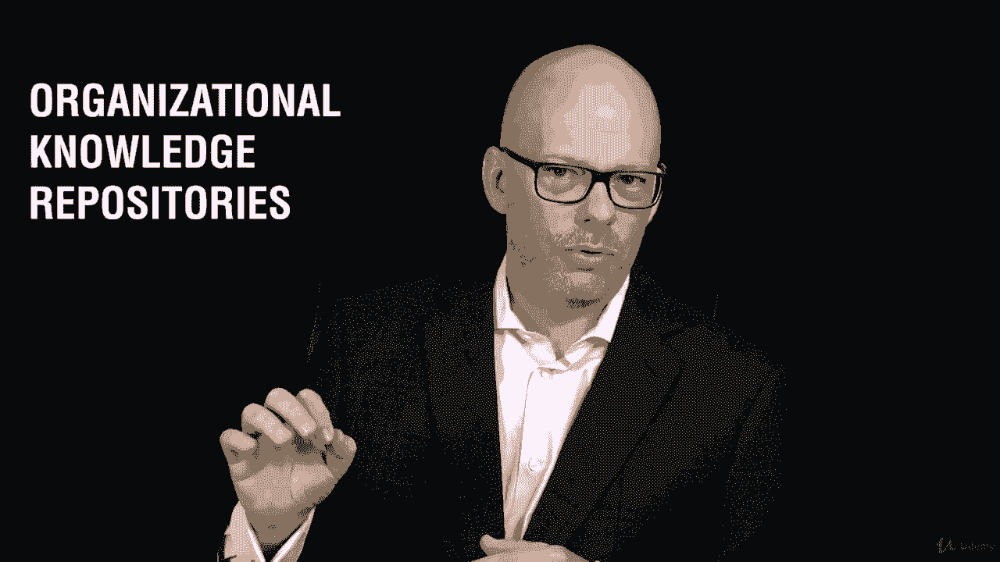
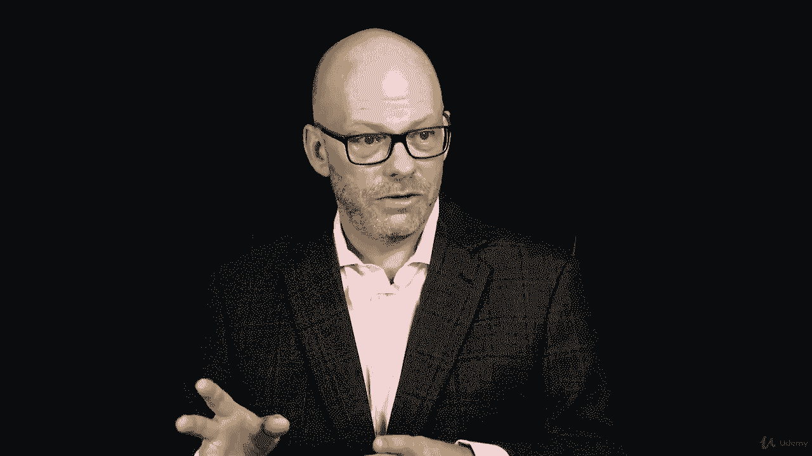
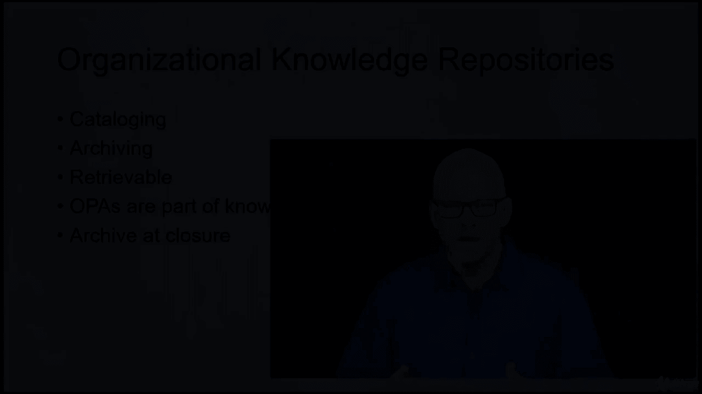
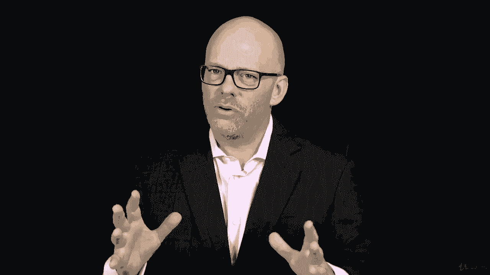
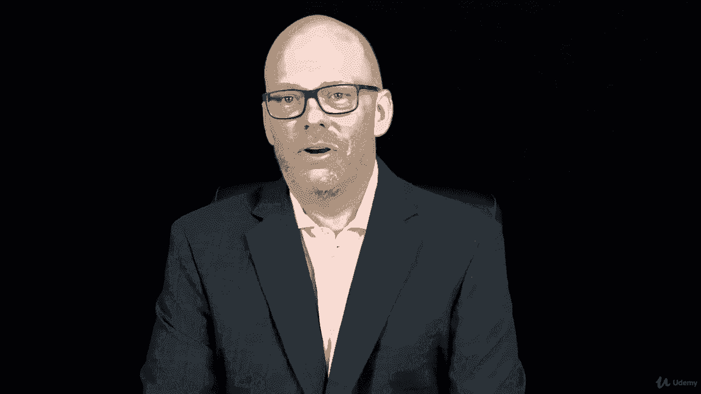
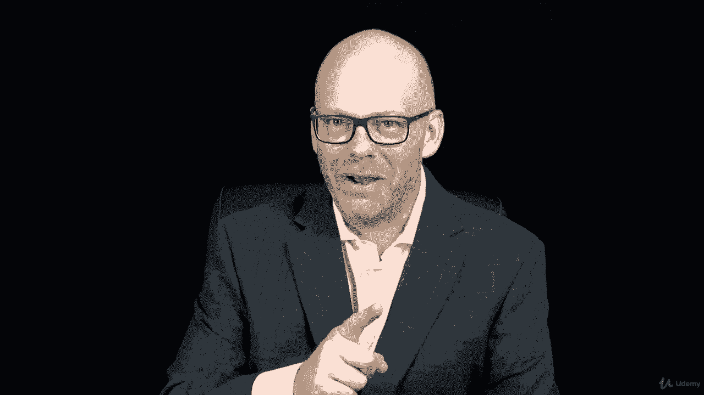

# 【Udemy】项目管理师应试 PMP Exam Prep Seminar-PMBOK Guide 6  286集【英语】 - P82：14. Section Wrap Project Environments - servemeee - BV1J4411M7R6

完成关于项目环境的这一节做得很好。

我告诉过你有很多信息，对呀，很多事情要盖好，你做到了，你删除了关于项目环境的第八节，在这一节中，我们讨论了企业环境因素和组织过程资产，你知道的EE F和OPA，所以我们会在整个课程中一遍又一遍地看到。

我们观察了不同的过程，环境特有的策略和过程，作为你工作的地方的首相，你必须遵循。

然后我们看了组织知识库。

六号针盒中的新工艺，我们将看到关于知识管理的未来。

所以你可以看到这将如何联系起来，所以这为我们建立了知识库的想法。

我们如何从过去的项目中获取数据和信息，我们如何快速访问，并能够在我们当前的项目中应用它，所以我们说的是编目，那么如何以电子方式对其进行编目，如何存档，它是可回收的吗，所以你要去挖。

你知道在某个地方有个壁橱，希望不是，但它是电子的，你可以搜索和检索它，组织流程资产，这些是您知识库的一部分，所以历史信息，这样我就可以从中吸取教训并将其应用到我目前的项目中，我们总是在结束时存档。

所以不存档从来都不是一个选择，我们总是存档一个闭包，因为这是商业价值的一部分，这是我们作为项目的一部分正在创造的东西的一部分，项目可交付成果并不总是客户得到的东西，也可能是我们得到的东西。

我们作为一个组织保留，所以知识获得工具设备，在这种情况下是知识，那么我们如何检索这些知识，我们研究了组织系统和框架，你的公司是如何结构的。

以及你完成工作所遵循的系统，或者你为了完成工作而创建的，所以你需要一个系统，然后我们观察了这些不同的结构类型，本节中最重要的可能是组织结构类型，我知道你完成了一项任务，正确地识别了这些不同的组织类型。

真的很重要，干得好，然后我们谈到了项目管理办公室，好的，非常好，你已经涵盖了很多材料，你在项目环境中取消了这些东西，勇往直前，我们越来越接近进入那些知识领域，我知道你想去的地方，但这些东西也很重要。

你要在这方面接受测试，这会影响你如何成功地回答问题，所有的权利，我为你骄傲，你取得了很大的进步。

继续走。