# 【Udemy】项目管理师应试 PMP Exam Prep Seminar-PMBOK Guide 6  286集【英语】 - P83：1. Section Overview Role of the Project Manager - servemeee - BV1J4411M7R6

看看你已经在哪里了，你准备好进入第九区了吗？项目经理的角色太棒了。

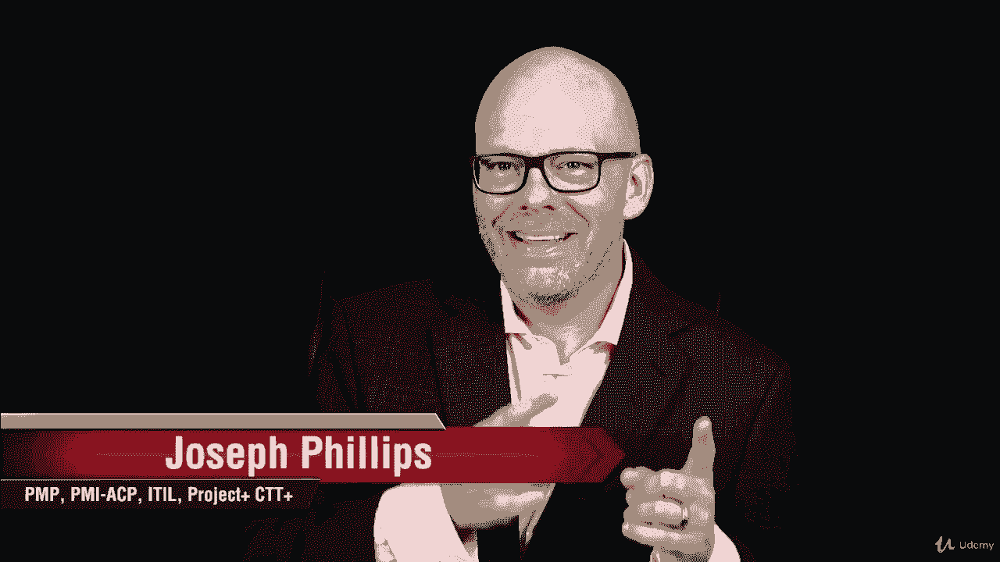

干得好，在这一节里，我们将谈论你。

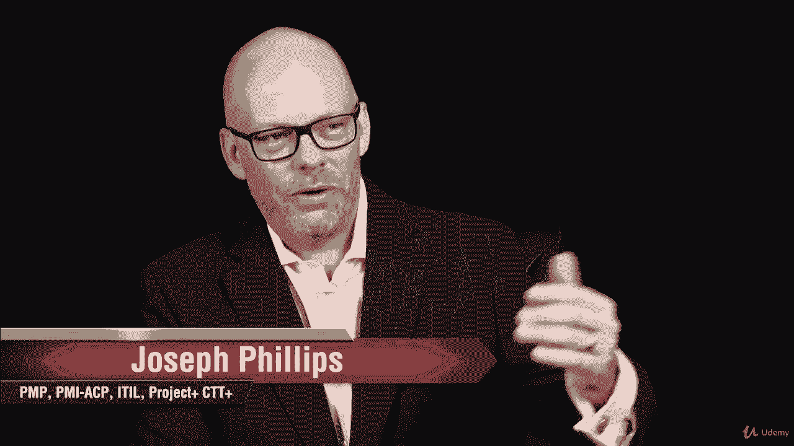

项目经理，其他人都在谈论你。

为什么我不能，我们真的要谈谈项目经理的角色。

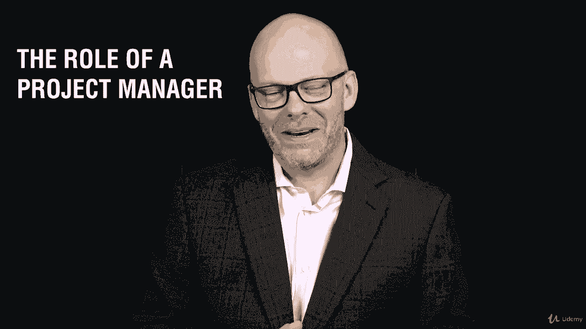

那么什么是项目经理，你如何影响人们，你工作的地方。

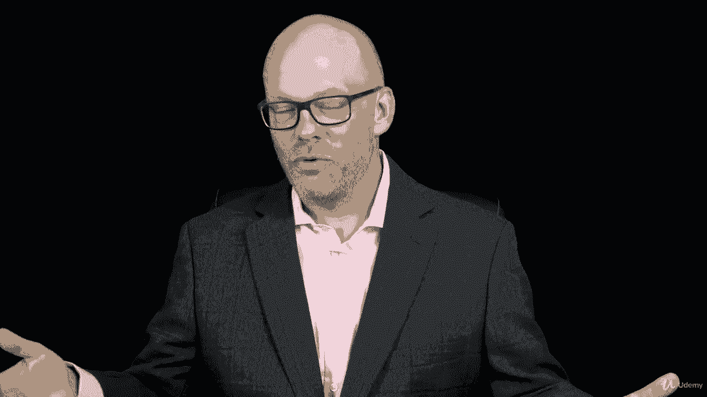

你需要的能力呢，管理能力、技术能力、业务和管理技能，所以我们要谈谈领导管理，技术上精明，然后你如何应用它来完成事情。

所以我们将考虑一点领导力。

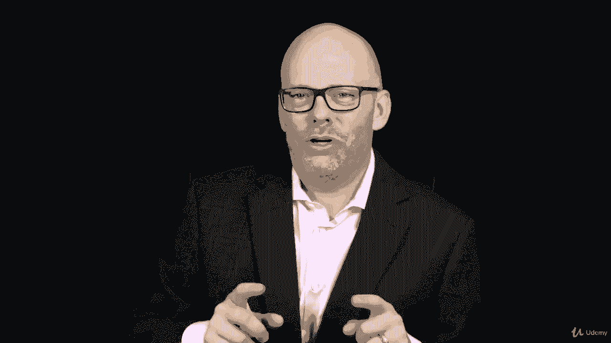

我们将看到领导力开始越来越多地渗透进来。

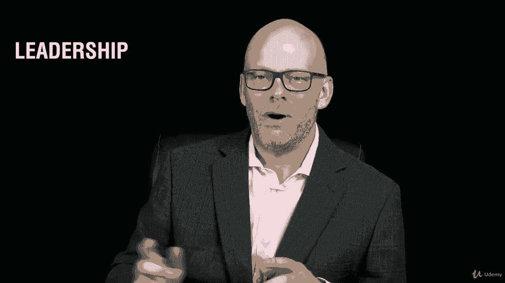

在这些部分中，我们将讨论领导技能，我们还需要承认一些事情，很多经前综合症患者不喜欢，我不是特别喜欢。

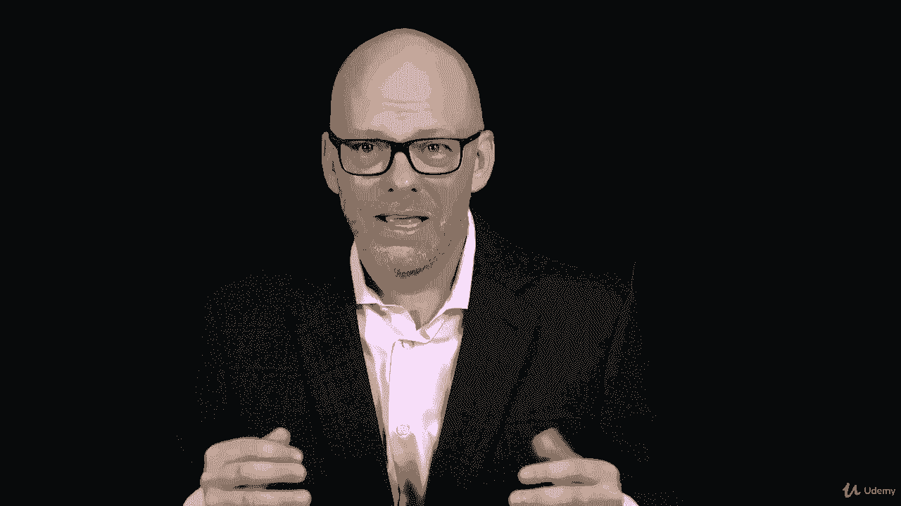

但它们是存在的，这就是政治，所以我们需要谈谈政治，这对我们作为项目经理有什么影响。

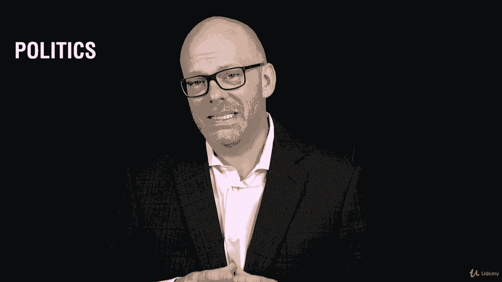

所以我们需要讨论政治，权力和把事情做完。

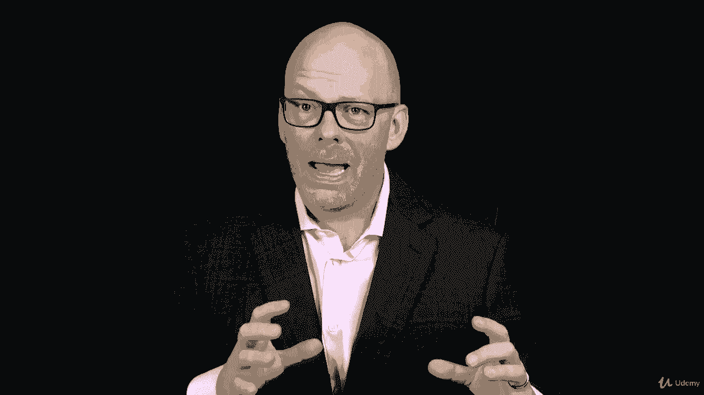

那里有一个小配方，我是说不是一个真正的数学公式。

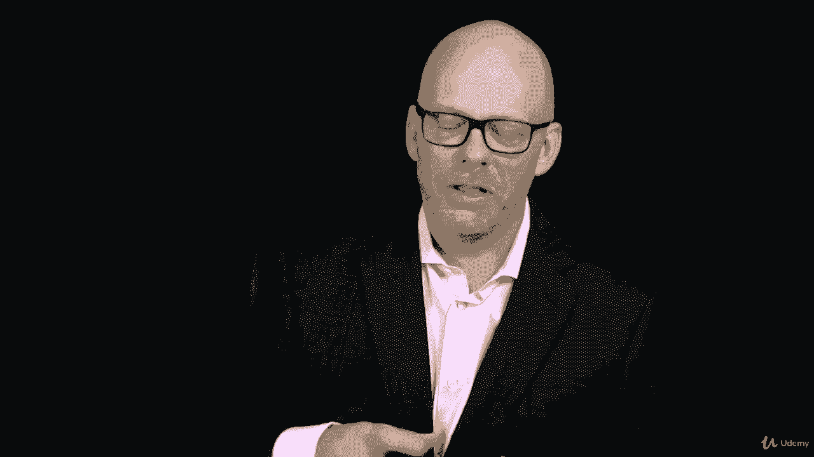

但仅仅是政治和权力结合在一起的想法，它们影响我们如何管理项目和完成事情。

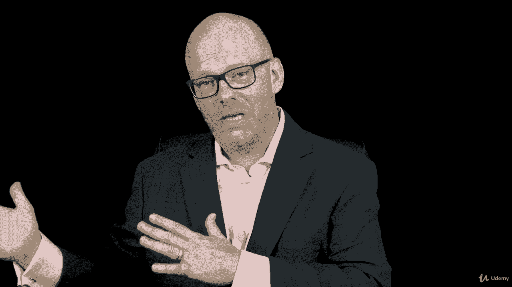

我们将研究领导和管理之间的区别。

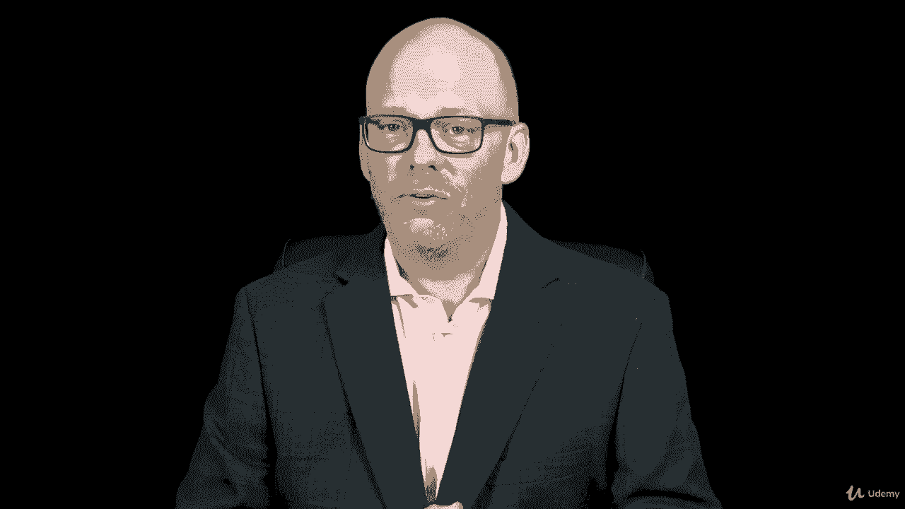

这里有一个真正明显的区别。

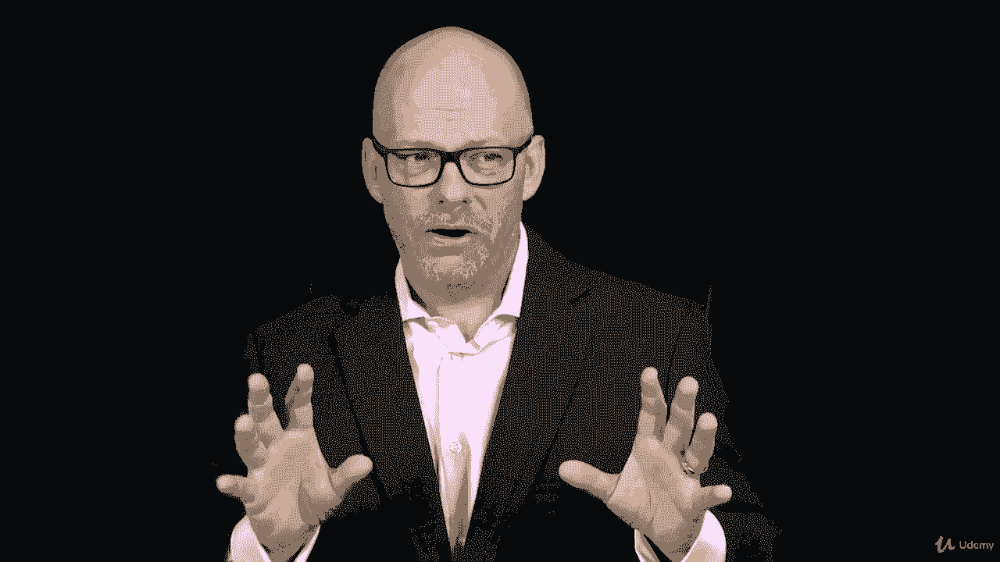

那我有个任务给你，那很有趣，它是看经理说的话和领导说的话之间的区别。

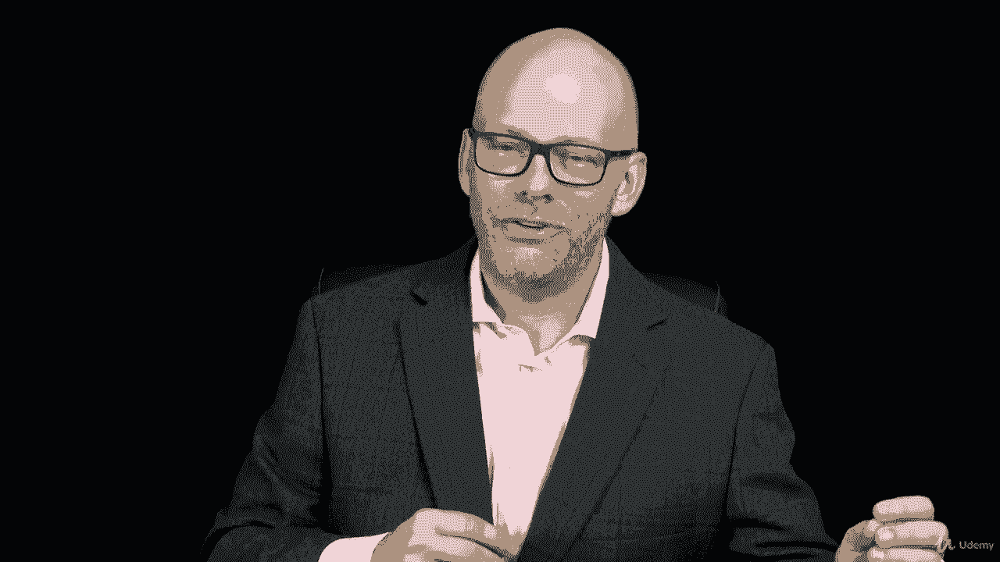

所以你会，当我们讲到这一点时，你们要做这个作业，所以这里有很多信息，我特别喜欢这个特别的部分。

因为我喜欢谈论领导力和管理以及一些情商，所以我想你也会的，然后我们会在稍后的课程中再次看到渗滤。

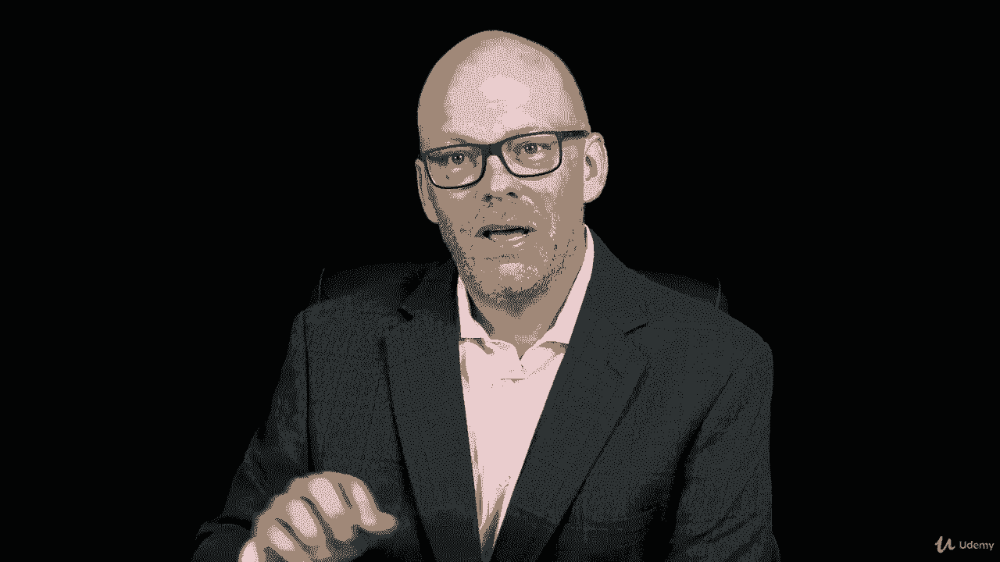

当我们在第九章谈论人力资源时。

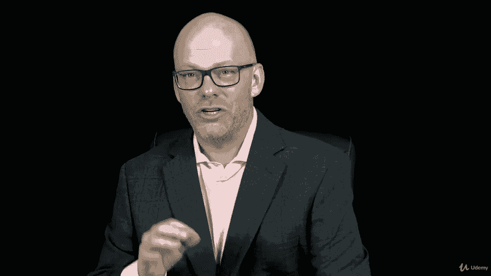

在针盒和资源管理好的。

