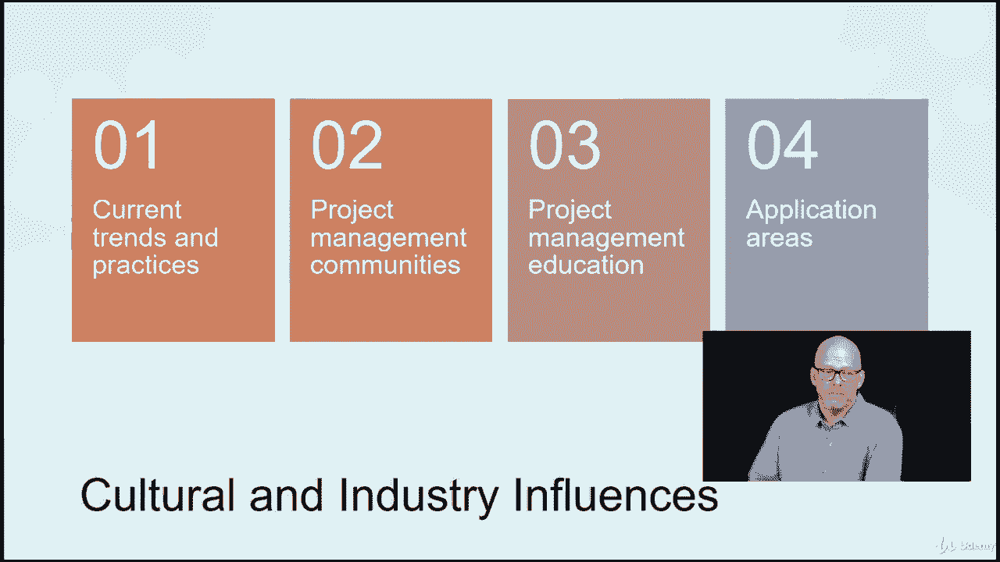

# 【Udemy】项目管理师应试 PMP Exam Prep Seminar-PMBOK Guide 6  286集【英语】 - P85：3. Project Manager’s Sphere of Influence - servemeee - BV1J4411M7R6

作为项目经理，您可以在项目中影响不同的组织、团体和人员，同样是那些人，利益攸关方，顾客，项目团队成员和经理可以对你产生影响，以及如何管理项目，所以我们需要了解我们的组织结构，文化、政治和权力。

这些都对我们作为首相有影响，然后我们如何根据项目影响他们，让我们先来看看项目经理对项目团队的影响，显然项目经理可以影响项目团队成员，因为我们给任务，我们希望他们把工作做好，项目团队也可以影响项目经理。

他们可以说，影响他们的决定，或者试着和项目经理协商如何完成工作，他们有多大的自由来做这项工作，所以团队和项目经理之间有一种关系，在那里他们可以相互影响，组织管理人员。

想想那些职能经理或者部门主管他们对项目经理有影响，因为他们控制着项目经理将在项目中使用的资源，PMO，如果你和PMO一起工作，记得我们有指令、控制和支持，这样他们就可以影响项目经理。

然后你可能有一个指导委员会，尤其是在项目开始之前，或者你必须与之合作的印心，所以指导委员会可以帮助选择项目和设定目标，或项目的KPI，并真正帮助设定项目的愿景，和优先级别，所有这些人都对项目经理有影响。

项目经理也可以逆转他们可以影响团队，经理们，PMO和指导委员会，所以这是一种共生或双向的关系，那么一个人如何才能很好地影响，再次交流，沟通技巧，因为你是，当你想影响某人的时候，你在争论。

不一定是好斗的论点，但你在争论你的案子或你的立场，或者为什么会发生一些事情，也有积极的态度和提供项目领导是影响人们的一个很好的方式，这对针背来说是一件非常重要的事情，我们想要好的士气。

我们希望项目经理有一个好的态度所以这很重要，当你好斗的时候更容易影响别人，但你可以陈述你的情况，争论不休，但你也很快乐，你有良好的态度和良好的士气，更容易和这些类型的人一起工作，所以影响组织。

当谈到影响时，这里的一些特征，思考政策，你有政策，嗯，有时你必须弯曲或弯曲那些，一点点可能不得不为你辩护，为什么我们需要思考运作模式，你如何把事情做完，你被要求做的，组织中影响项目的潜在文化是什么。

你的政治联盟呢，你是，项目经理，你有多少政治资本，或者存在哪些影响您项目的政治联盟，并能够认识到信息不同的动机，所以你并不总是知道为什么有人在做决定，或者试图影响项目的决策。

你有没有遇到过那些问你问题的人，他们不停地问问题，直到他们基本上能得到答案，他们想去说好和乔的项目，他们是这样做的，所以你你，你没有，你并不总是知道人们在追求什么，所以这是积极倾听的一部分。

就是能够听到，并真正理解，产生这些问题的原因是什么？利益冲突，你是先知和续集，或者我们只被允许在项目现场，从早上六点到晚上六点，所以你知道我们的规则，但我们有，你知道一些团队成员，他们几乎完成了工作。

他们只需要再过一两个小时，他们可以用它做完，这将真正有助于项目，但我们有利益冲突，你不能在六点以后到那儿，因为这对邻居有破坏性，但团队想完成这件事，因为他们快做完了，所以你在这里有一些冲突的利益。

或者我希望这种改变发生，但我不想付钱，所以很明显这是一个利益冲突，尤其是在矩阵环境中，就像一个平衡的矩阵，召回项目经理和职能经理共享权力，他们分享预算的所有权，当谈到影响，我们也要考虑社会。

经济和环境工程的影响，所以市场和经济条件会影响项目的运作方式，以及你在项目中可以做出什么选择，你可能会有环境问题，尤其是在建筑方面，你正在建造的东西可能会破坏环境或影响环境。

所以有关于物理位置的法规和环境问题，工作正在进行的地方，对项目及其结果可能有一种社会观点，那么公众对你的项目有多看好呢，因此，这可能会影响您管理项目的方式，我们有国际影响力，所以如果你的项目扩展。

多个国家，可能会有一些文化问题，一些语言问题，不同的经济模式，每个国家的不同法规和法律，甚至一个国家的不同地区，然后是社会影响，在多个地区或地区之间会有所不同，或对您的项目有影响的国家。

所以他们影响你的项目，当谈到影响时，我们需要认识到四件事，就文化和产业的影响而言，一个，目前的趋势和做法是文化的一部分，你的组织文化，但是整个文化，您的项目正在发生的地方，你所在行业的项目管理社区呢。

在您的组织内，你如何利用这些或从中学习来更好地管理和影响，不管你在哪里，我们还想看看项目管理教育，那么我怎样才能在这个领域成为一个更好的项目经理呢，所以如果我从来没有管理过一个建筑项目。

我有一个相当陡峭的学习曲线来拥有相关的学科知识，所以我需要一些教育应用领域，我刚才说的是，我在那个应用领域有什么经验？该应用领域如何与公众合作，或者与文化和组织合作，或者它是如何受到。

或者它如何影响利益相关者，所以你想一想，以及当你做一个IT项目或建设时可能产生的干扰，或医疗保健或制造业，这对利益相关者有什么影响，文化的一部分，这会让他们对你的项目产生消极或积极的影响。

这些都是我们作为项目经理要考虑的，当涉及到影响他人可以影响我们，但我们也可以对他们产生影响，所有的权利，干得好。

