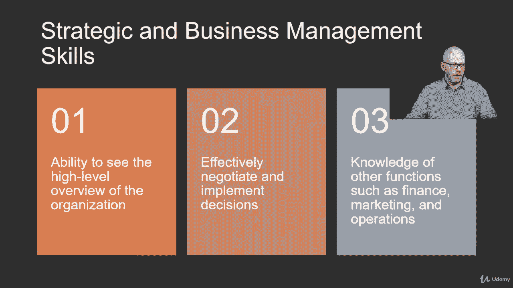
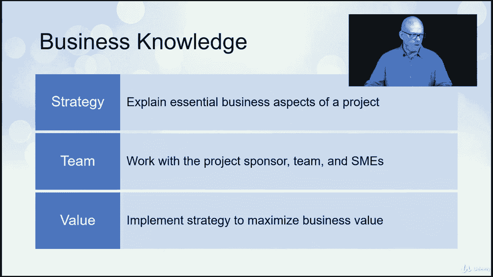

# 【Udemy】项目管理师应试 PMP Exam Prep Seminar-PMBOK Guide 6  286集【英语】 - P88：6. Strategic and Business Management Skills - servemeee - BV1J4411M7R6

作为项目经理，我们确实需要一些战略和业务管理技能，这意味着我们有能力看到为什么选择一些项目，有些不是我们项目被选中的原因，以及它如何适应组织的愿景，它如何支持战略。

以及该组织试图通过我们的项目实现的目标，所以关于策略，我们需要知道三件关键的事情，当涉及到战略和业务管理技能时，首先是能够看到组织的高级概述，看看组织，它的目的是，为什么它存在于市场上。

然后组织是如何运作的，顺序是如何创造利润的，它如何创造商业价值，它如何为其客户或利益相关者提供服务，我们要考虑的第二件事是有效谈判和执行决定的能力，作为项目经理，我们需要能够做出决定。

我们需要了解我们项目的目标，我们项目的要求，然后做决定，通常我们只需要做出正确或错误的决定，做出决定并顺其自然，我们能做的最糟糕的事情之一就是什么都不做，所以做个决定去吧。

我们需要了解的第三件事是其他函数的知识，我说的是金融，营销运作，部署，组织的后勤，所以我们需要的不仅仅是项目管理技能，我们需要对，我们的项目在组织中是如何运作的，然后组织是如何运作的。

业务知识，说到商业知识，有三件事我们需要知道，战略，团队和价值策略是我们需要能够解释我们的项目是如何支持，业务战略，战术，目标，那么您的项目的业务方面是什么呢？它如何支持在组织目标中的作用。

团队合作我们希望能够与他人合作，我们必须能够作为项目经理与其他人一起工作，所以这意味着项目发起人，项目团队，主题事项，专家，供应商，咨询人，你必须能够和彼此相处，但能够根据项目的目标进行团队合作。

然后估值，项目如何支持业务价值，以及如何最有效地最大化业务价值，如果我们想寻找机会和机会，或积极的风险机会，我们将获得投资回报的地方，那么我们如何才能最大限度地提高业务价值。

组织中的业务技能，所以我们需要知道的一些技能，以及它如何适合任何组织，我们需要了解组织的战略，任务，什么是高级目标和目的，我们的项目如何支持，组织创造什么产品和服务，我们的项目如何影响这些或影响这些。

运营呢，日常操作是什么样的，项目如何适应这一点，或者如何可能破坏这一点，那么手术是什么，市况如何？这对你的公司有什么影响？所以你认为你的纪律在那里是一个非常竞争的地方，你们的市场不景气，市况如何？

就您的组织及其所涉及的应用领域而言，这对你如何处理项目管理有什么影响，上市时间是我们需要考虑的因素，比如说，如果您是一家软件开发公司，可能会有一个时间上市因素是一个决定，不管我们是否发起一个项目。

而是创造那个产品需要多长时间，为了把它推向市场，我们必须考虑市场窗口或竞争，市场怎么样？市场有多拥挤或饱和，现在这是一种时尚还是一种趋势，我们需要一个短期或长期的解决方案，所以这些都是商业技能的因素。

在组织中，项目管理技能和业务技能有一些重叠，就像你想象的那样，我们有风险和问题，所涉经费问题，所以你有一个预算和成本估计，我们要做一些成本效益分析，在针盒的四号模块中，我们将研究净现值和投资回报。

现值和未来价值，也有商业价值，我们已经谈了很多关于商业价值的问题，我们如何实现利益，我们如何设定期望和策略，并获得投资回报，然后我们如何平衡范围，预算，时间表和质量，所以在商业和项目中都是如此。

所有的权利，干得好，勇往直前。

