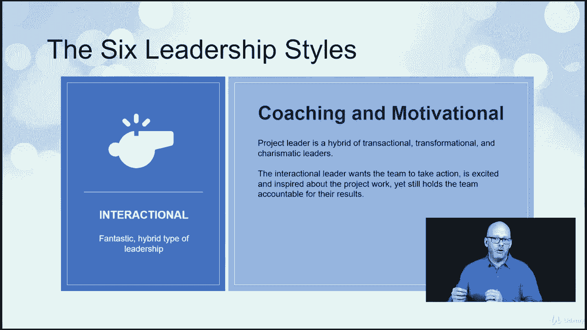

# 【Udemy】项目管理师应试 PMP Exam Prep Seminar-PMBOK Guide 6  286集【英语】 - P89：7. Leadership Skills - servemeee - BV1J4411M7R6

为了成为一个有效的项目经理，我们必须能够管理和领导，所以我们需要有一些好的见解，对领导技能有一些很好的理解，所以领导才能我们说的是有远见，乐观积极，管理关系和冲突，当然啦，我们在有效地沟通，积极倾听。

询问和倾听反馈，给有信用的人信用，然后以行动和成果为导向，领导技能，我们说的是把事情做完的能力，但是激励、团结和指导人们，我们需要认识到一个好领导者的八个特征，你能引导人们，你可以带领人们走向结果。

你可以激励你想激励和指导项目团队的人，你必须能够谈判，那是领导的一部分，但我们谈判是为了一个公平和平衡的结果，我们有韧性，我们可以解决问题，通信，我们知道沟通有多重要，你可以解决。

你能解决问题并提供速赢吗，你必须能够思考批判性思维是一种技能，那只是一朵花，不是每个人的花园里都长的，所以思考是很重要的，人际关系，所以当我们思考领导力时，我们应该认识到领导力的八个特征。

但实际上是与有能力与人打交道的人打交道，利益相关者是人，我也是，所以利益相关者我们想与利益相关者打交道，这意味着有一些人际交往技能或软技能，更正式的说法是情商，理解情绪和行为的能力。

那么反应或反馈背后可能是什么情绪，或者你在与你打交道的人中看到的行为，它也是控制自己情绪和反应的能力，专业一点不要让我们的情绪对其他情绪产生负面影响，所以我们可以影响别人的情绪。

所以你在考试中有一些关于情商的内容，和人打交道，项目管理和领导要求我们成为一个有远见的人，能够看到项目的最终结果，我们需要能够描述产品，我们正在创造的东西，能够阐明项目目标，我们的主要业绩指标是什么。

我们怎么知道我们成功了，所以交流一下，和那个说话，所以说，当人们问人们，被，或主要利益攸关方，你的项目进展如何，是知道他们在找什么的能力，主要业绩指标是什么，他们对什么感兴趣，然后说我们在范围内。

我们的进度有点落后，成本不错，所以那些走廊会议是一个很好的机会，尽管能够定义目标并阐明目标，这样你就可以传达项目的目标，不仅仅是对利益相关者，也是对项目团队，当你在运动时，在赋值和值之间建立联系。

然后是的，在某种程度上，作为一个有远见的人，你必须能够梦想，你要做梦，帮助别人做梦，帮助其他人意识到他们可以取得比他们意识到的更多的成就，乐观、积极和合作，您希望与项目团队进行一些合作。

以及与利益攸关方和供应商的合作，等等，我们需要能够管理项目关系，所以这意味着建立信任和满足担忧，让人们同意，寻求共识，然后平衡相互竞争的目标，所以我们已经见过几次了，成本，范围，这些都是竞争的大目标。

所以投票进行权衡，促进谈判，那个，说服的想法，谈判，妥协，所以团队成员和利益相关者之间必须有一些让步，所以我们帮助促进了这一部分的促进可能是解决冲突，冲突是自然的，事情并不总是令人愉快的。

但我们需要能够帮助促进冲突的解决，我们将在第九章再次看到这一点，当我们谈论人力资源和冲突管理时，在Imbo的第九章，发展个人和专业网络是非常重要的，但长期的关系很重要，是呀。

我们想要的关系只是在项目期间，有时这就是工作的本质，但长期的关系很重要，这有助于你工作，如果你一遍又一遍地和同样的人一起工作，你明白其中一个或另一个是如何工作的，你有关系，你们关系很好。

这使得做出决定和获得反馈变得更加容易，并为项目中的个人提供指导，然后能够理解政治，理解你的政治资本，以及它如何影响您的项目，以及如何利用这一点来完成事情，领导沟通很重要，已经看到了首相90%的交流时间。

交流的一部分，虽然，管理期望，所以我们想提前设定对项目的期望，就像在我们的开球会上，在我们早期的一些计划会议上，所以管理期望，接受反馈，所以反馈并不总是令人愉快的，有时这被视为批评。

但是接受反馈并理解为什么我们会收到反馈，尤其是如果我们看到一些趋势，然后作为项目经理，我们能给我们的项目团队提供建设性的反馈吗，然后询问和倾听是我们交流模式的一部分，我们想专注于重要的事情。

确定工作审查的优先次序，并根据需要进行调整，创建适合项目的优先级排序方法，那么什么是最重要的，这就是我们的工作，高级战略优先事项呢，所以我想看看，这是支持高水平的东西吗，这是温和的吗，还是低优先级。

所以我们需求的优先级的一部分，我们这个时代最紧迫的事情，我们的资源最宝贵的用途是什么，我想对项目限制保持警惕，时间成本范围，但也可能有其他限制，制约因素，任何限制你选择的东西，所以我想控制住这些。

并确保我在平衡项目的需要，有了这些限制，在战术优先事项上灵活，所以我不想爱上一个解决方案，如果我的项目团队有办法做他们认为更好的工作，我相信我的团队，那么他们应该做这项工作，但让我们失败得快，失败得多。

我的意思是我们，我们不想花很多时间去看某件事是否有效，所以让我们尝试一个更小的方法，看看它是否有效，如果没有，让我们一次又一次地尝试，而不是投入大量的时间和金钱，直到项目后期才找到解决方案。

让我们看看它现在是否有效，所以在我们的方法上要灵活，关于我们的战术，然后我们必须能够管理大量的信息，知识管理系统的一部分我们谈到了早期的领导技能，我们知道作为一个领导者，我们必须有一个愿景。

我们必须乐观积极，我们想寻求与他人的合作，能够管理关系和冲突，能够交流，询问和听取反馈，给予信任，注重行动和成果，我们现在来看一下，六种领导风格，首先是事务性领导者，有时被称为例外管理。

事务性领导风格是关于奖励和惩罚的，领导者奖励表现最好的人惩罚表现最差的人，中间的每个人都在洗，所以你是个例外，这就是为什么它被称为例外管理，因为你是一个例外，或者是受到惩罚的例外，该组其余成员的例外。

然后我们就有了仆人领导或仆人领导的概念，这是一个专注于项目团队和服务对象需求的领导者，这是一种领导风格，大多数与自适应、敏捷或scrum相关联，它的主题是领导者为团队运送食物和水。

身体上并不意味着携带食物和水，但这意味着它确保团队成员拥有他们需要的东西，为了完成工作，然后我们有一个自由放任的领导人，自由放任的领导人，这意味着把手拿开，所以他们不做决定，团队都是自己领导的。

团队让他们做出决定，所以这确实给了团队一个自主权的机会，但有时领导者可能会缺席，或者看起来领导不想做任何决定，所以这是一种危险的领导风格，所以他们激励和激励团队，他们告诉团队你可以做得比你想象的更多。

你能完成工作，他们想授权团队采取行动，寻找创新，然后我们有一个魅力四射的，一个有魅力的领导者是一个和你一起工作的人，就像我现在做的那样，它认为一个不仅有动力和高能量的人，激励着团队。

但他们也激励着团队帮助他们实现目标，现在就去做，因为他们经常参加，所以他们很有魅力，他们非常兴奋和快乐，他们希望项目团队成功，然后我们有互动，这是一种混合类型的领导，更多的合作和激励。

所以你有一个事务性的，都融合在一起，在互动的地方，他们和团队一起参与，他们激励和激励团队，但团队仍然要为他们的行为负责。

他们的工作成果，所以这是你应该认识到的六种领导风格，您可能会看到一些情况，您有一个问题，他们描述了一种领导风格，然后你必须挑选出被描述的领导风格，所有的权利，干得好。

