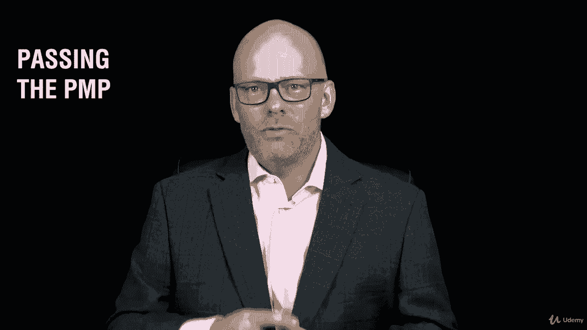
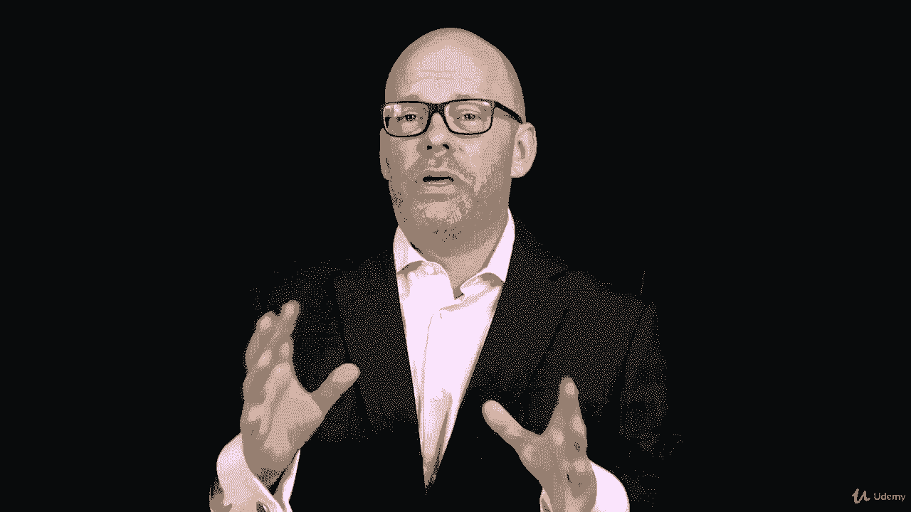

# 【Udemy】项目管理师应试 PMP Exam Prep Seminar-PMBOK Guide 6  286集【英语】 - P9：1. Section Overview Get the Most from the Course - servemeee - BV1J4411M7R6

欢迎来到我们关于PMP课程的第二节。

本节的备考研讨会，我们将讨论如何从分数中获得最大的收益。

你已经付了课程的钱了，你在课程上投入了时间。

这门课的目标是你通过PP，所以我们不妨制定一个关于。

你怎样才能最大限度地利用这门课。

没有人想上一堂课，然后从中一无所获，你需要看到一些投资回报。

所以我要向你们展示我是如何设计课程的，帮助你从这门课程中获得最大的收获。

我们的第一个目标是你通过PP。

我知道你能做到，我们的第二个目标，但是要有一个很好的理解和一个很好的基础，你如何应用这一点。

在你作为项目经理的角色中。

因为我们希望有一些好的做法，我们希望看到投资的回报。

超越P和P，别搞错了，我们首先关心的是你通过P和P。

那是我们的首要目标，你和我。

是你赚了P和P，所以在这个课程中，我将从一些常见问题开始。

我从2000年初开始教这门课。

我在网上教了很长时间书，我一遍又一遍地得到同样的问题。

这些问题中的许多都在整个课程中得到了回答。

但我认为它们很重要，我只想为前面的人设定答案。

所以你知道接下来会发生什么，你可能会有一些这样的问题在你的脑海里嗡嗡作响。

所以我们要谈谈常见问题，我也要解决这个问题。

我在挣pduse吗，专业发展单位或联络时间。

有什么区别，所以我们会确定的，在剩下的课程中，这一点就很清楚了。

是呀，你得到了结业证书，我每天从人们那里得到的第一个问题是。

我有结业证书吗。

所以你知道那些人不是在看这个特定的讲座，否则他们就不会给我发邮件询问结业证书了。

所以在这一节中，我将向你展示如何申请完成证书。

为什么你需要它。

如果你被审计，就像我们在上一节所说的，所以结业证书。

我们来谈谈，我们还将考虑制定一个学习策略。

你想要一个战略和一个项目，嗯，你在学习的时候需要一个策略。

所以你在为通过考试而学习，那是我们的头号目标，我们要看整个PIN机器人指南。

第六版，别担心，这是一个很高的水平，但我们要走过它的所有不同部分。

这对我们剩下的课程也有帮助。

在整个课程中，我确实有一些资源，所以我将向你展示如何下载这些资源。

以及如何导航界面以下载这些。

这样你就可以利用这些资源，然后你会有一个任务，我们将给你一些资源下载。

这样你就可以测试一下了，然后我会谈谈保持你的P和P。

一旦你通过了考试，你就会通过考试，我想保持积极的心态。

我将在考试后谈谈，嗯，你现在做什么，你是一个pp。

你如何保持这一点，然后我有一种新的讲座。

我将在这门课上与大家分享，它被称为PMP教练。

我要给你一些直截了当的建议，让你继续赚你的P P好吧。

这一节有很多信息要谈。

所以让我们现在跳进去谈谈。

