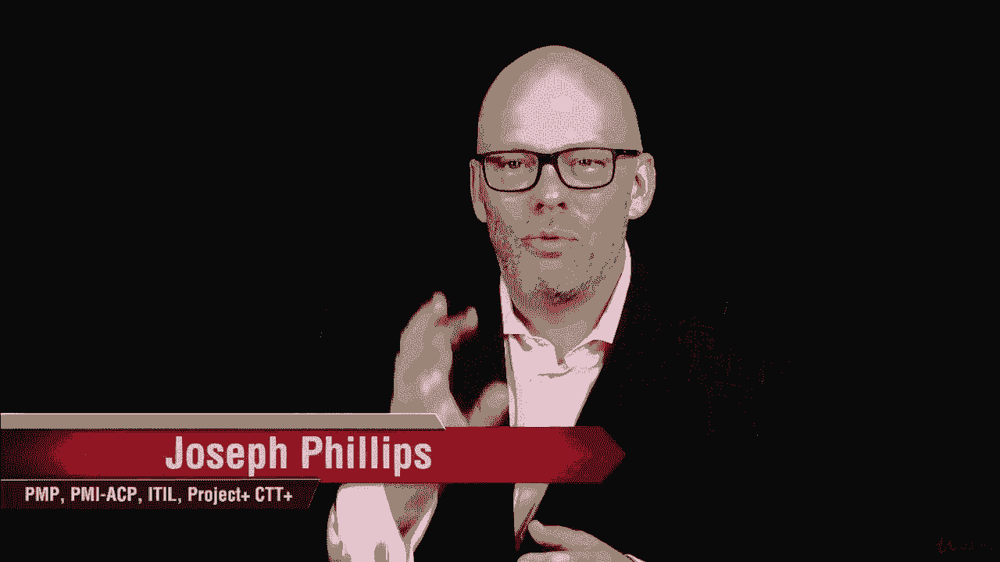
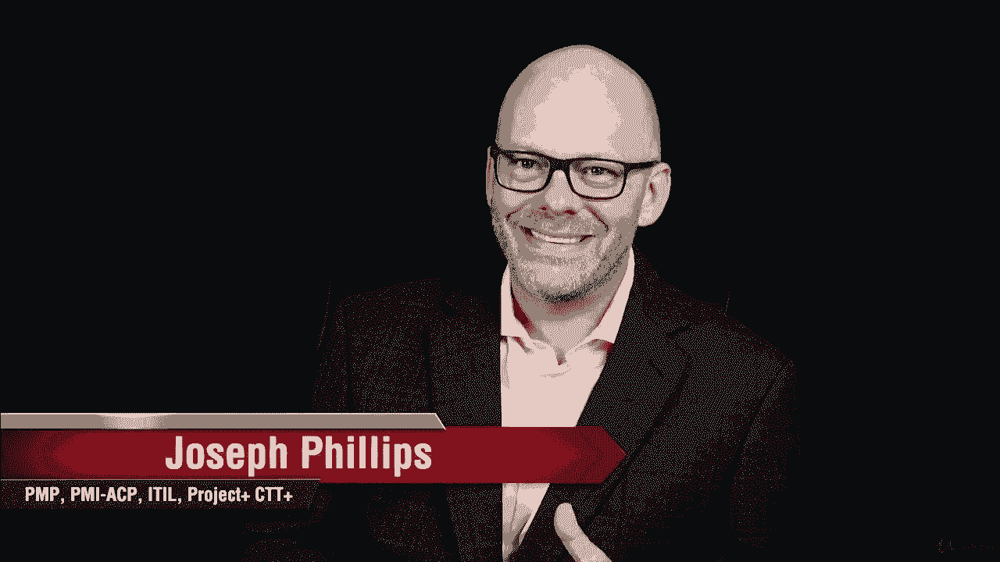
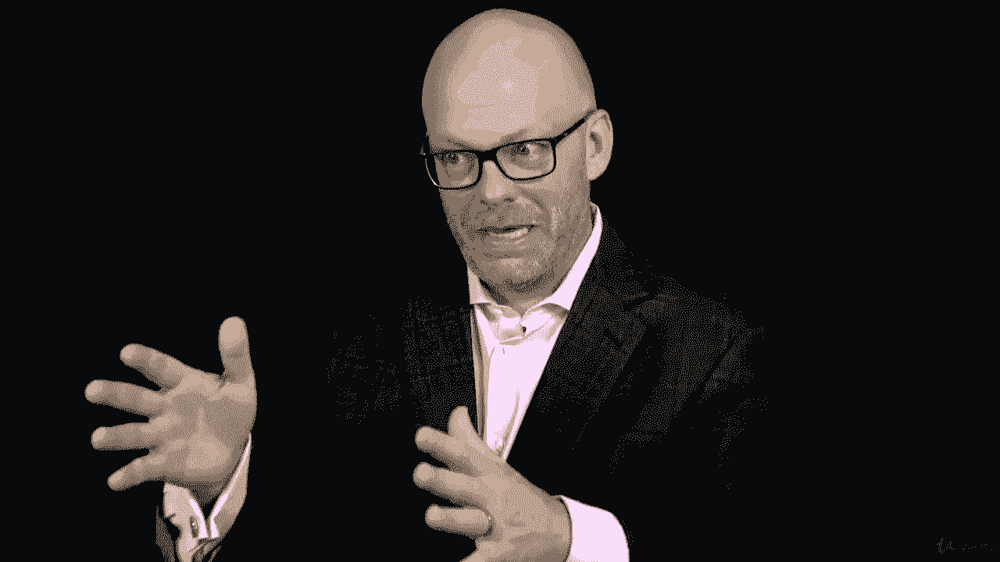
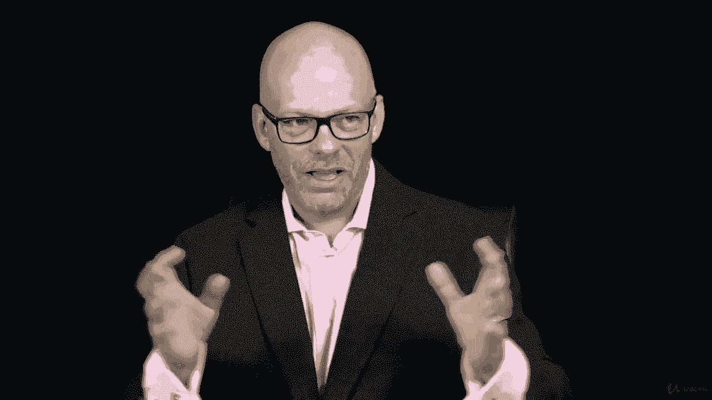
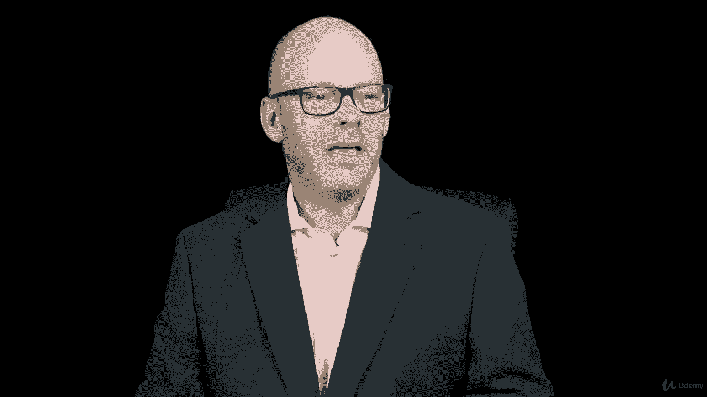
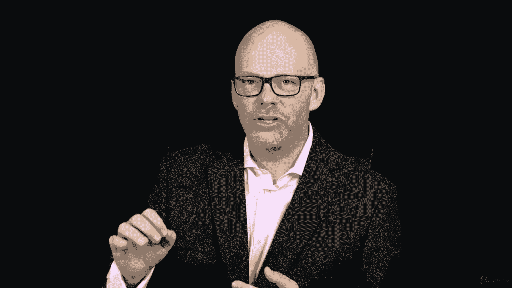
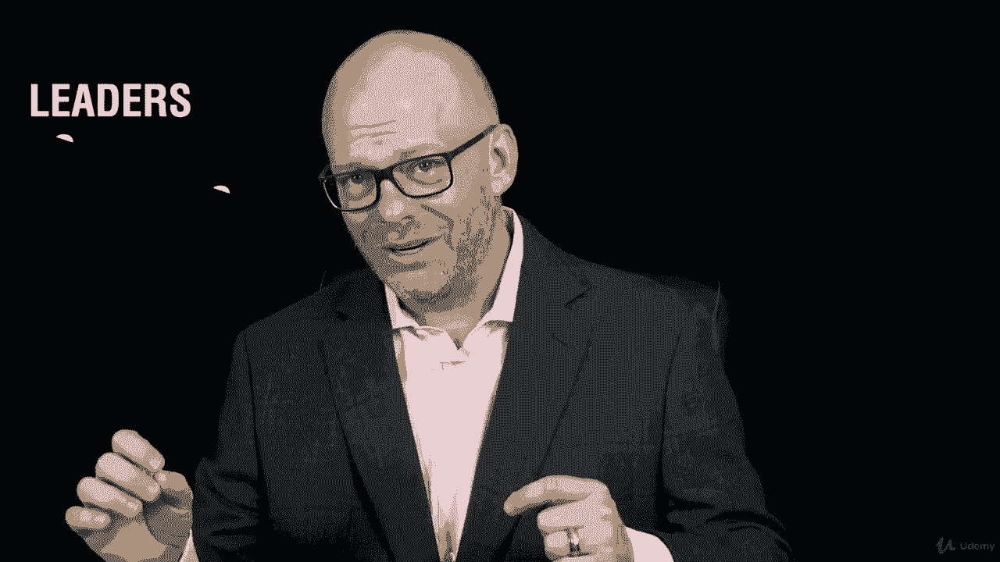
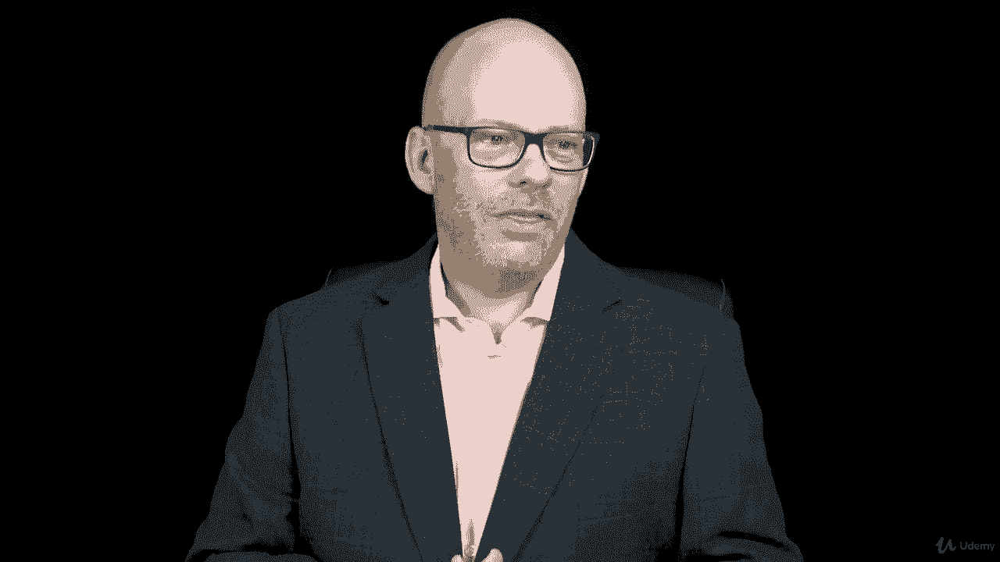

# 【Udemy】项目管理师应试 PMP Exam Prep Seminar-PMBOK Guide 6  286集【英语】 - P94：14. Section Wrap Role of the Project Manager - servemeee - BV1J4411M7R6

干得好你做到了，你完成了这一节，谈论项目经理的角色。

你真的有了很大的进步。

在这一节我们讨论得很好，什么是项目经理，作为项目经理你的影响范围是什么。

当你试图影响人们完成项目时。

当你管理一个项目时，这是你的最终目标，当然也是为了创造商业价值。

业务价值是通过完成项目来创造的，就我们而言。

我们谈到了项目管理能力。

技术技能，你需要的商业技能，当然还有领导力你完成了一项活动或任务。

在那里你观察了领导者和经理所说的话之间的区别。

所以说，我希望你喜欢，我认为这是一种有趣的练习，我们研究了执行集成，那么在这个级别上执行集成意味着什么呢，在进程一级，在组织一级，然后我们谈了很多关于领导风格的问题。

然后在我们的教练那里，记住这是关于解决问题的，很多人怀念的，当他们准备通过PP时。

好的，干得好，你取得了惊人的进步。

表明你致力于赚取PP，你在投入工作，你在做别人不愿意做的事。

这样你就可以做别人将来想做的事情。

所以继续前进。