# 【一即是全】史上最好的敏捷课程（上） - P1 - 老莫爱AI - BV1Jc411x7ex

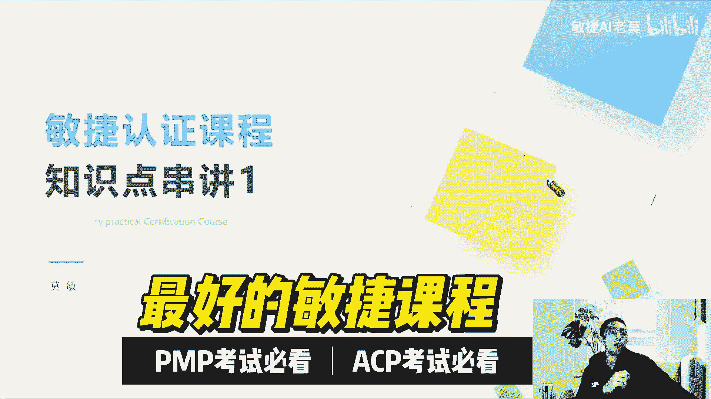

OK同学们听到消息请打一啊，听到声音可以打个一喂喂喂，听得到吗，同学们听到打个一啊，OK猫团团，我记住了你的名字啊，这个是我们的第一次见面，还有一位同学叫00351的。

还有一位叫手机尾号尾号3071的啊，OK古老师之前跟大家聊的，其实是那个传统的部分，pm不可new的部分，我会跟大家聊的是敏捷和pm，七的跟不可期的部分，从今天开始到以后的所有的直播。

都是由我跟大家见面吧，好那我们的那个直播内容呢，其实考试上来说，其实大家我我把难过很多，这种考生大部分考生其实都还是以考试为准，我去读这个PNP，并不是为了说从PMP上，学到什么项目管理的东西。

这当然会有这个因素在，但是这个不是主要目的，主要目的还是要拿证，那我们经过了跟大家这样这样一个交流之后啊，我们把重心更多的放在怎么样去通过上面，就是通过率上面，所以我们可能会在通过率上面。

可能会着重的去讲考试的一些考啊，什么部分对于知识的覆盖面，可能有一些考试没有考到的这个考点，我们会比较虐的，比较快速的我们就通过了，然后快速的通过了，只在于帮助大家更好的去理解，在考试上面怎么去应用。

现在PMP的考试啊，大家考考试大纲，大家也看了一下传统的瀑布型啊，预测型基本上占了一半，敏捷型和混合模型基本上也是一半，也就是说一半的啊，那接下来我的权重就告诉大家，这一半分数是比较好得的啊。

敏捷的分数这一半是比较好得的，那么敏捷的这一半分数为什么好得，是因为敏捷的知识点比较少，他纯用大脑记住，要记住那个知识点的东西比较少啊，所以叠起来这个东西敏捷，大家只要记住综合一些的一些应用就选了。

要好活力活用，而不是更多的，不是在我要记住某一个每某一个词，某一个定义，某一个概念上面，它跟传统的确实不一样啊。

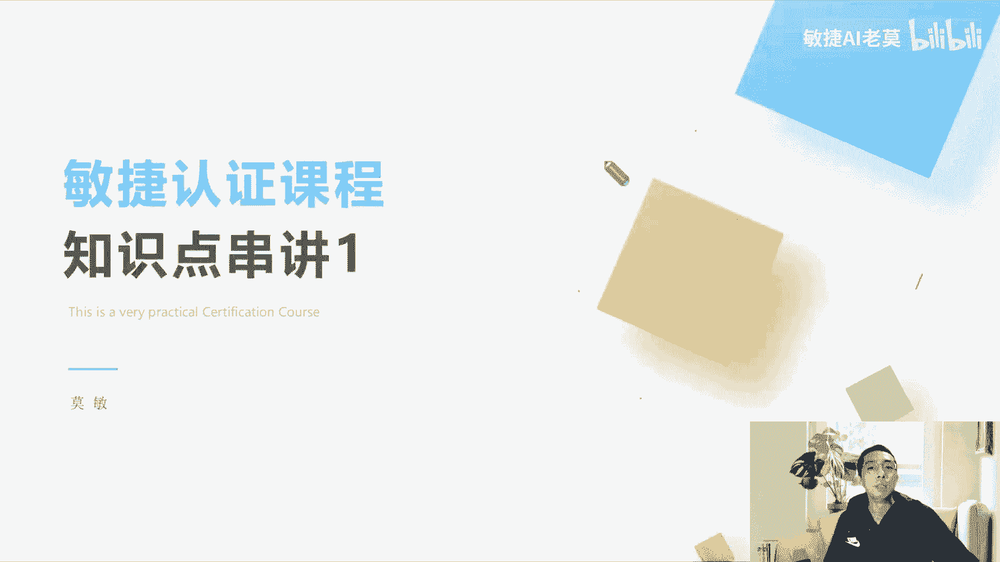

好那今天是我们第一堂课，那我们先介绍一下深圳闵行管理咨询，有啊现在已经改名叫闵行科技了，大家中文报名的时候，你们可以看到啊，闵行科技这个名字，我是公司的创始人啊，OK那我之前是在腾讯啊，做欢乐斗地主。

是做产品经理的，在腾讯学院也做过高级讲师啊。

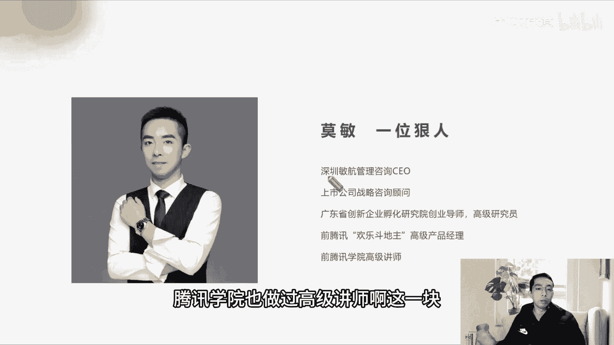

这一块可好，那么说起敏捷就不得不说啊，我们现在目前所处的这个环境为什么偏PMP，他会专注于这个敏捷这一块的话题，现在变得越来越多了，因为现在其实是乌卡时代，也就是说多变性就是啊。

确定性和多变性同时存在的这样一个时代啊，所以我们要适合用适合这个时代的一些，项目管理方法啊，以去去做考试的题目啊，这样OK那么敏捷总共有12345啊，今天总共有五点，今天我们可能跟大家说的是123点。

123点啊，后面这五点是放到下两节课里面，下一次直播是本周四，下一次下下周是周二啊，我们会把敏捷的这个课程全部学完，那么学敏捷就相当于这个东西比较轻松了啊，我们就像讲故事一下一样。

把大家知识点给贯穿下去啊。

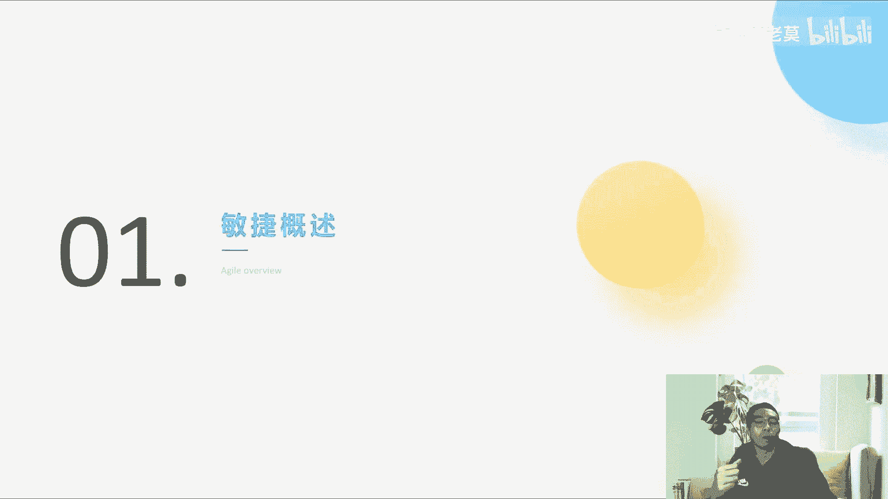

OK那么从敏捷开始的话，我们必须要先学习一个叫敏捷宣言啊，这个是敏捷的起点啊，那么敏捷的起点它是软件方法论，你要记得，这敏捷刚开始的时候是用在于软件方法，软件开发方法，它就有啥四个价值观。

一个是个体和互动，高于流程和工具啊，就是你要强调个体的作用，而不是整个流程的作用啊，流程在敏捷看来，流程是用来约束人的个体的作用，比如说像雷军说要让听见炮火的团队做决策，也就是说冲在前面的这些人。

这些团队它更容易形成一种决策，所以我们要尊重个体啊，所以就在这里，第一就是个体的互动，第二个是工作软件高于详尽的文档，也就是说工作软件我们看结果而不看过程，详细的文档其实就是过程，结果大于过程啊。

你在这里你想你想所有做题的时候，你都在想结果大于过程，按照这个思路去想就好了啊，第三个是客户合作高于合同谈判，也就是说我要把怎么样，客户要拉进来，拉进来跟我一起，以前我们可能是说跟客户是甲方乙方的关系。

现在我们强调的是说甲方也要参与进来，为了保证我们的工程质量，所以甲方要跟我们一起参与进来，所以参与感这个事情很重要，题目当中只要是涉及到参与的客户，参与的这个选项，你就优先要选它。

对在敏捷里面要优先选客户参与，把客户拉进来，一起去思考我们这个产品怎么去打嘛，因为他重视结果嘛，对不对，最后就是响应变化更高于遵循计划，在吴老师讲的那一部分里面，我们还可以听到一个叫变更委员会，对不对。

BCBCCB是专门来处理变更的，所以所有的变更出现了，都是由年会来去处理去分析，但是在敏捷这里显然多一个这样的委员会，他显然就变得不那么敏捷，所以我们就把变跟委员会啊。

这个组织它其实在敏捷里面它是下放的，下放给谁，下放给团队，那这个团队其实包括团队的项目经理，包括团队的产品经理，也包括团队的每一个人，他其实是下放授权的，每一个人其实都是病毒委员会的议员。

所以你要欣然的去接受变化啊，比如说老板给你提的需求，比如说用户不满不满意给你提的需求，他会直接到你这里，你要欣然的去分辨，第一个是欣然的接受啊，好多东西我们要接受，第二个是欣然的去分辨它的优先级。

是不是跟你现在有的，手头上的工作的优先级一比，如果优先级他更高，那我们要优先做客户变更的事情啊，这个就是敏捷，为什么叫敏捷嘛，叫灵活啊，所以说这个就是敏捷千元，所以我们考试的时候。

我们只要按照这个思路去往下走啊，展开所有后面的题目，都是从这个价值观里面去展开来说的啊，OK那么我们明白了敏捷宣言的四大价值观以后，我们后面会有12大原则和实践会继续展开。

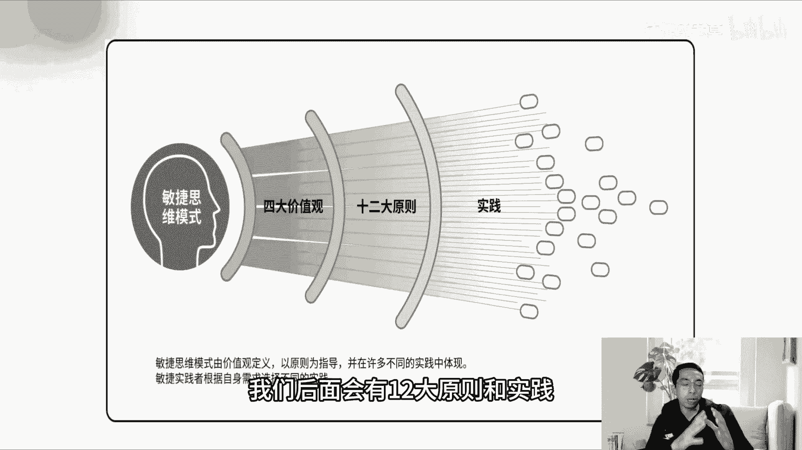

那么12大原则，且这个就有十十二个点，那么12大原则考不考了，12大原则必考必考，所以12的原则我会跟大家怎么样把它扩展啊，跟大家详细的去讲，第二大原则，第一个是通过持续不断的及早交付，有价值的软件。

使客户满意，什么意思，我们要不断的去交付，就像微信一样啊，打个比方，你像微信，微信，它动不动一个版本，动不动一个新版本，对不对，一个月一个版本，两个月一个版本，当然现在微信更新的是没有以前那么频繁啊。

以前微信更新是非常频繁的，那么它就持续不断的在原有的上面去升级版本，4。05。0这种补丁，他为什么要打这种补丁呢，就因为他认为后续的这个版本，它吸收了很多建站用户的一些体验的问题啊，用户的一些需求啊。

它会把它收集好了，不断的加在他的版本里面，所以微信的版本也是越做越大，东西越来越多，功能越来越丰富啊，是这样的，第二个是新郎面对需求变化，就是用户提出的需求啊，你要看用户的提出的需求。

那么只要是对我们有价值的对吧，那么我们肯定要愿意去接受，因为最后用户要去买单，所以我们要欣然面对需求的变化，第三个是经常的交付可工作的软件，也就是说在你的能力范围之内，你交付的越频繁越好啊。

为什么越频繁越好，因为你越频繁，你就越能够更早的发一个新版本，更早的让用户体验到你的版本，他就更早的可以吐槽啊，你就更早的能够收到他的意见，你就能够更早的改啊，所以天下武功唯快不破，体现在第三点啊。

第四点，业务和业务人员和开发人员必须相互合作，我前面说的，你一定要具体的在价值观里面把用户捞进来，其实在腾讯里面其实经常会做这种这种，我们在腾讯在做游戏的时候，这个游戏它还不完善的时候。

那个时候我们就开始做内测了，会邀请一些忠实用户过来去体验我们的新版本，让他给我们提意见，他提的意见我们在接受了，我们慢慢的拉入更多的用户来去去去体验啊，在腾讯游戏里面有一个游戏服务，有一个体验服。

体验服大概是人不多啊，也就三四千人啊，因为一个腾讯的游戏，你像斗地主的话，一个游戏一发他可能几千万人可以更新，但是他一般都三四千人先去使用这个体验服，提各种意见，再去修改，你这个版本稳定之后。

你才全部发送啊，不要一下子全部发送啊，这样的一个阶段啊，OK这个我们经常我们的第四点，第五点是激发个体的斗志啊，以不以信任，其实两个字，两个字就是授权啊，充分信任个人给他授权，所以在做敏捷的时候。

我们为什么说做敏捷有一定的门槛，就不是任何团队都可以做敏捷，就是敏捷团队对人的要求很高，它一定不是流水线，不是流水线上的工人啊，因为有很多流水线上的工人，他是你分配给他什么活，他就干什么。

他只接受分配的工作，你要让他做决策，他不可以，他不做决策也负不起这个责任，他也不想去负这个责任，但是在敏捷团队里面，我们授权给他，是希望他能够在他的能力范围内，他能做决策的。

比如说这个需求我到底做不做啊，不是说每一个需求过来的，我先问一下我的领导啊，这个需求做不做，你给他赋予信任之后，他自己去判断啊，这个需求是插入到现在做，还是放到下个版本去做啊，由团队自己决定。

这个是第五点，第六点是面对面的交谈，所以第六点至关重要，考试考的非常多，他有时候会问啊，因为我们现在的很多团队啊，他是虚拟团队，什么叫虚拟团队，就是很多团队的人不在一起啊，你知道疫情疫情的时候。

很多人都回家办公，那么大家的家肯定不在一个地方，对不对，那么在虚拟团队的时候，我们还是要用虚拟的工具去沟通，但是在敏捷的这个考试里面，只要是出现能够尽量的面对面沟通，我们还是会要求大家面对面的沟通。

即使你是全球性的团队，还是要要求怎么样，你至少在项目立项的时候，大家能够在一起能够去讨论一下需求，大家形成信任之后，再分散到全国甚至全球各地啊，所以一次面对面的沟通是非常重要，能够面对面尽量面对面。

这个就是选项，这个已经把考试的选项给到大家了啊，大家听懂扣扣个一啊，OK第七点是可工作的软件，可工作的软件是啥意思，就是什么，我们看结果，可工作软件其实就是一个结果，不看过程，第八点是步调稳定延续。

也就是说假如我们一周一个迭代，就是一周完成，假如说一个迭代是一个版本，一天一周完成一个版本，那么你下一个版本还是一天一周，你不是说金这一次是一周发一个版本啊，下一次我们两周发一个版本。

下下次三周发一个版本啊，这不叫步调稳定延续啊，所以我们一定要做到步调稳定延续啊，第九点是坚持不懈的追求卓越和良好的设计，也就是良好的设计是我们的基础啊，第十是以简洁为本，简洁为本。

其实考试里面考的与之相反的就是镀金，镀金这个事情到底能不能做，要不要去做，比如说你去做出了一个超越客户的需求啊，什么叫镀金对吧，比如说啊客户他只想要一辆家用车，对不对，家用车帮助你那个客户上下班代步的。

你老人家太好了，给客户整了一个越野车，你说越野车多霸气啊，车子又高又威猛，客户觉得不需要，为什么，因为你这个东西超出了他的需求，而且你花了更多的成本，花了更多的心思去做这个事情。

那么他在敏捷当中他就是浪费客户要什么啊，我们就要为客户付出什么东西啊，所以在这个里面它是在敏捷开发里面，它是有保险系数，他要的东西就是客户，客户要的东西，像那个一样，就像那个别人说乔布斯和库克是吧。

是两种性格，乔布斯说我知道用户要什么东西，所以我不用去考虑用户的需求，我做一个东西，用户肯定喜欢和库克就不一样了，库克说用户想要大屏的IPHONE，那我就做一个大屏的，那客户想要什么东西。

我就满足客户做他想要的东西就可以了，他比较稳步的，在项目管理领域里面，我们就是要稳，所以在项目管理里面，我们要学库克啊，我们要是稳产品，产品创新里面，我们要学乔布斯，那是产品的事情。

但是现在是考的项目管理，所以我们要怎么样简洁为本啊，刚好满足客户需求就可以了啊，第11点是最好的架构，需求和设计出自于自己团队，自主经营团队反复在考敏捷，有只要考到团队。

起码是有一半以上的分数会考到自主进团队，自主团队180道题目里面至少出现五题，至少出现五题啊，所以这个分数一定要拿到，这个是个大头，第12题，团队要定期的反思如何提高成效，定期的反思就是过程啊。

我们要反思这个过程做的好不好啊，这个东西也是要考，这个是必考啊，这两个是划重点。

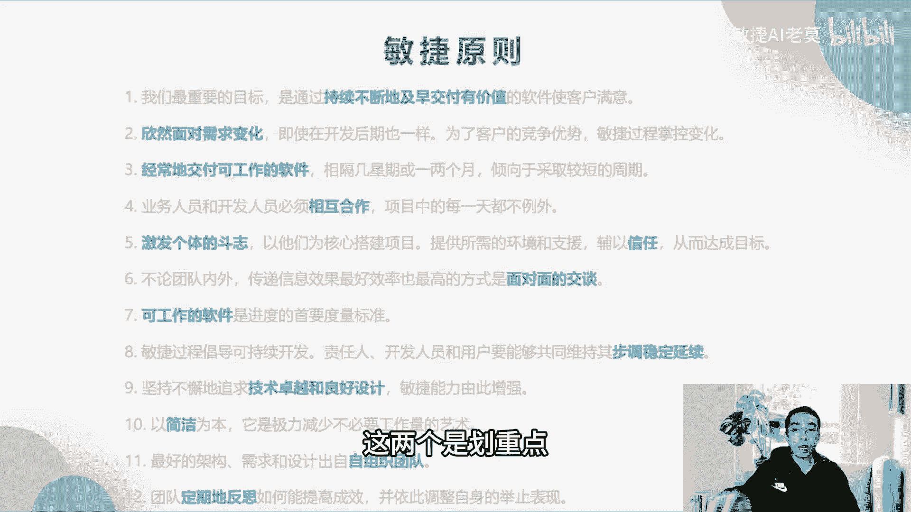

十一十二，这个是重点啊，OK好最佳实践我们就一笔带过，因为最佳实践每一个团队也会有自己的实践，那么最佳实践当然不会考你，你到时候拿PPT你对一下看一下就好了啊，你看一下稳定的团队啊，可以预见数量啊。

单节流它大概是一个什么样的意思就行了啊。

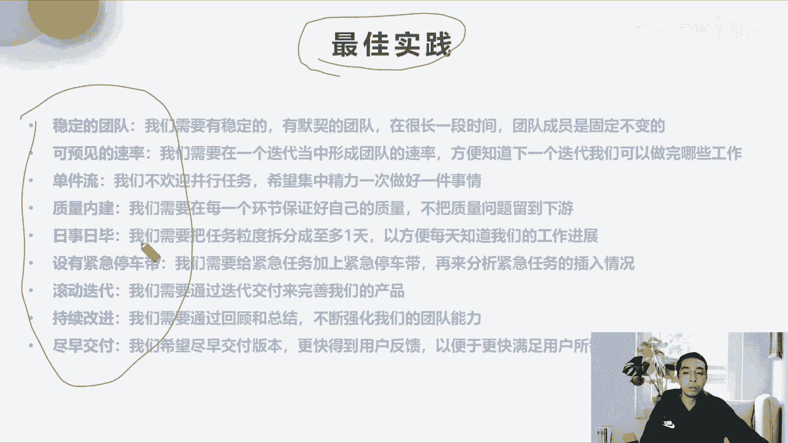

行了，这个这个不会考的啊，OK传统开发和敏捷开发对比大家要分清楚啊，这个对比要分清楚，因为你不分清楚，你没法考啊，含量是什么，传统开发它的含量是范围，也就是说我给十个活，给你一个任务。

那么这十个任务呢你在一定的周期内你要完成，那没有在一定的周期内，比如说十个任务一个月完成，那么一个月没完成怎么办，项目延期，所以在pm不可new里面经常会听到项目延期，项目成本超支啊，所以我们要算什么。

CPI和SPI还记得吗，我们在成本管理里面要算这个东西，但是在敏捷里面他不用算这个东西，为什么，因为它看需求，所以它的变量是需求是范围了，给你十个活一个月做完还是一样的，但是又有新插入的需求怎么办。

那这个十个需求到底做不做啊，答案是十个需求，可以有一些不做，只要是能够达成相同的价值，或者超出原有的价值就可以了，他是看结果的，而不是看你完成多少活啊，所以这个是他们俩最大区别，要砍就砍需求啊。

所以听懂的同学啊，可以打个一，我看一下有哪些人已经get到了考试的重点啊。

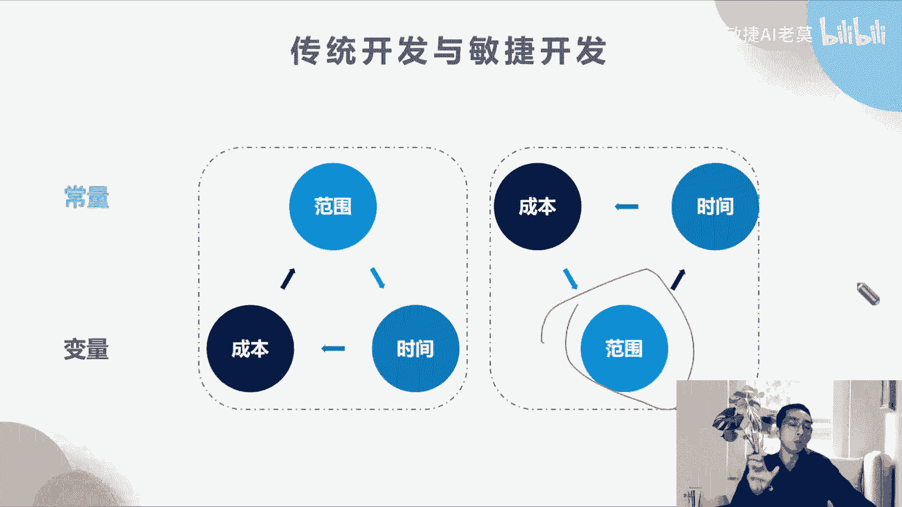

OKOK好很好好好，那我们经常会在敏捷的题目里面，我们会看到精益和敏捷，对不对，精益和敏捷到底什么样的关系呢，其实金翼是敏捷的爸爸，你可以这样想，其一是敏捷的爸爸，为什么呢。

因为敏捷它其实是从精益里来的啊，它只是精益在软件行业的一种应用啊，那么精液是哪个行业的，精益是制造业的，是由谁提出来的，是由丰田啊，丰田汽车提出来的，精益精益开发，精益开发本质上是杜绝浪费。

他把所有的在制造业的生产过程当中的浪费，归结为七种浪费，给他想办法去解决这七种浪费，这个是丰田的经营方法，敏捷其实它是吸收了很多这种主流的一些思想，加上它的底座是精益的思想产生的。

所以敏捷它是精液的子集啊，OK看板是什么，看板其实是精益的一种工具，那么精益看板为什么看板放在这里，因为看板既有精益看板，又有敏捷看板啊，敏捷看板是一种简化的，用把把它简化了啊。

变成状态墙就变成敏捷看吧，后面我们会说精益看板和敏捷看吧，会拿一个图给大家一看，你就明白了，OK所以敏捷里面包括还有很多方法，敏捷整个敏捷方法，所以敏捷里面其实你说敏捷是不是一种方法。

我觉得敏捷更像是一种价值观，价值观，它里面有什么水晶方法呀，有ROM方法呀等等等，有各种方法，但是这么多方法我们主要记哪种方法，我们考考试的时候主要是考这种方法，storm方法。

其他的方法顶多也就是一道题目，这几年其他的方法基本没考过啊，所以其他的方法你只要了解一下就行了，不要记啊，不需要记啊，大概是一个什么东西就可以了，那么敏捷一看，很多人把敏捷等同于com。

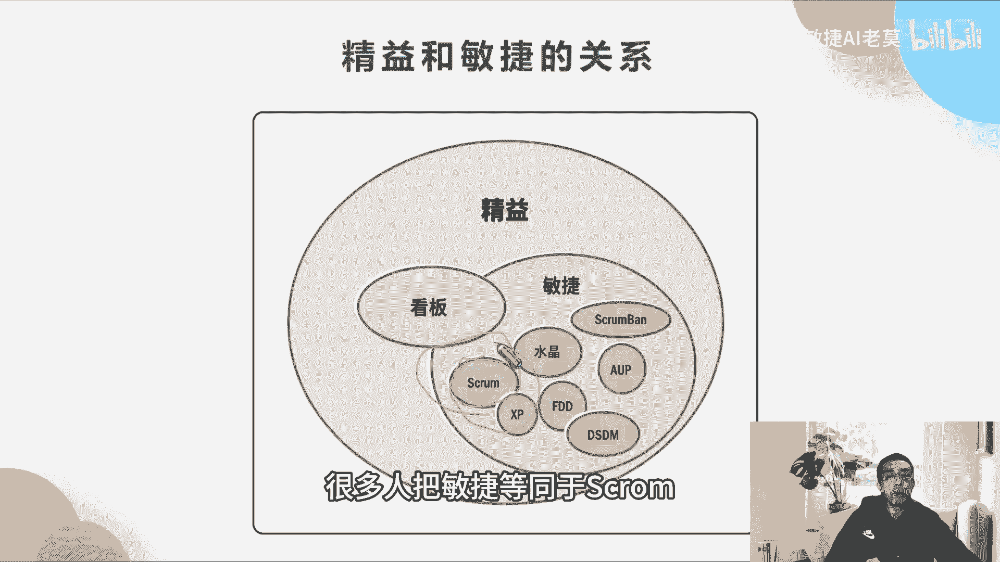

为什么呢，因为敏捷里面其实考来考去都是com啊，OK好机翼的七种浪费啊，第一个是部分完成的工作，第第二个是额外的过程，第三个是任务切换，第四个是等待，第五个是运动，第六个是缺陷。

123456怎么只有六种，就是少写啊，这个不要紧，因为机翼的七种浪费不要记，这不是考点，你只要知道了经历大概是你看你可以看描述啊，工作开始了，但但没完成部分完成的工作，随着时间推去，失去它的价值。

也额外的工作，切换的工作就是你完成A任务的时候，同时完成B任务，你在切换的时候，它会有这个这个浪费，只有等待这个浪费，你大概明白什么意思就行了啊，不用记什么，比如说什么多项这个什么等待造成的延迟。

它到底属于七种浪费的哪一种，不会这样考你，你把它全部看完，描述，你都归结于这种浪费就行了啊，用经济方法去解决就行了啊，不要分门别类去记，没有那个必要，我现在是教大家简便方法啊，怎么去应对考试啊。

OK那么浪费的七个原则啊。

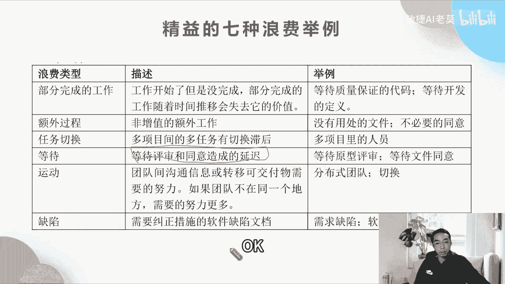

你看消除浪费，增强记忆的七个原则，就是怎么样去解决他的问题，第一个是消除浪费，第二个是正在学习，第三个是教师决定，第四个是尽快交付，第五个是团队授权，第六个是建立整体，第七个是目光长远，以前的考题里面。

其实唯一要记得是什么，第一个是消消除浪费，这个要记啊，没有价值的东西就是浪费，所以有价值的我们都要排到很高的优先级，没有价值的我们就把它放到很低的优先级，这个就直接得分了，后面其他的什么啊，第二点。

第四点，第五点，第六点，第七点，其实都啊不需要去记，我们只要记第三点，第一点和第三点，第一第三点是什么，第三点是教师决定教职决定，其实你很多人一看，这不就是跟敏捷的这个相违背吗，敏捷不是说越快越好吗。

为什么做决定要迟呢，对不对，就很多人不理解就在这里怎么了，因为教师决定并不是说他不理解，而是正好相反，教师决定更加敏捷，就是说你不要草草地决定这件事情做不做，而是等收集到很多信息以后再决定做不做。

这个其实就是减少浪费，更敏捷的一种方法啊，打个比方，我我今天拍了一个视频，拍了一个短视频，我拍了拍了一个版短视频以后，我放到网上去，这个视频爆了，突然一下爆了，我也不知道怎么爆的。

那是不是意味着我就可以离职，全职去做那些短视频的up主，不可以，为什么，不可以，因为一个视频爆了，它可能是一个偶然，可能你刚好这个视频压住了某个热点啊，使得大家全部倾向于你。

如果你这个时候这么快就做决定哦，原来我的视频拍的有很多人喜欢看，我就辞职专门搞短视频，最后发现一分钱没挣到，还耽误了时间啊，耽误了青春，最好的事情是什么，我持续去拍视频，比如说我这个视频爆了。

我持续去拍，我拍十几20个待发，看我这十几20个是不是能够继续的，比如说我十几20个，可能又报了三四个，那么这个时候我就我就会觉得哦，原来我拍摄视频特别有天赋啊，那我收集到这么多信息以后。

包括我去问那个视频的那些，那些看我视频的那些人，他们为什么喜欢我的视频，他们会给各种原因哦，我已经通过拍很多视频，我们大概总总结了一段时间，比如说我可能拍了半年视频以后。

我总结了一套我怎么样去打流量的一种方法，怎么样去吸粉的方法，这个时候我觉得哎，我输出的这个视频的质量很高，有很多人喜欢看，我确实能够靠这个东西去变现了，这个时候你去考虑你自己是不是要全职出来搞。

是更稳妥的一种方法，所以要教职决定啊，所以我这个例子就是在在做这个事情啊，OK听懂的同学打666啊。

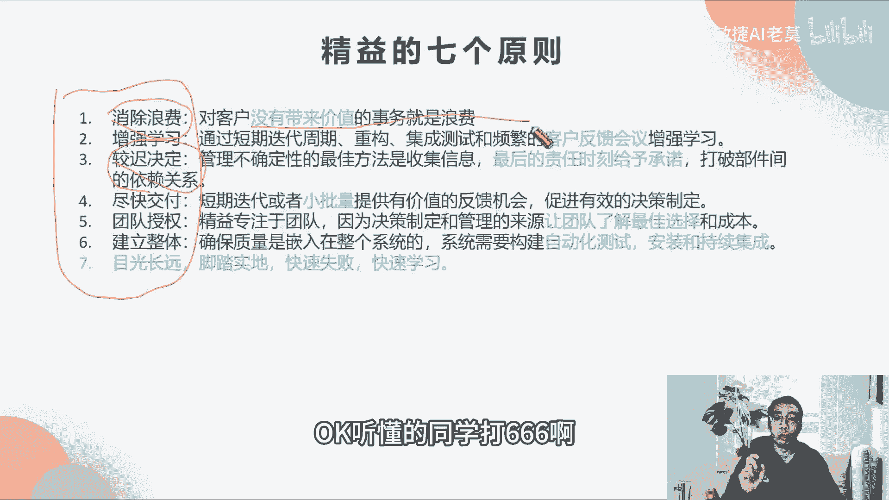

OK好，那么减少浪费的模型不会考啊。

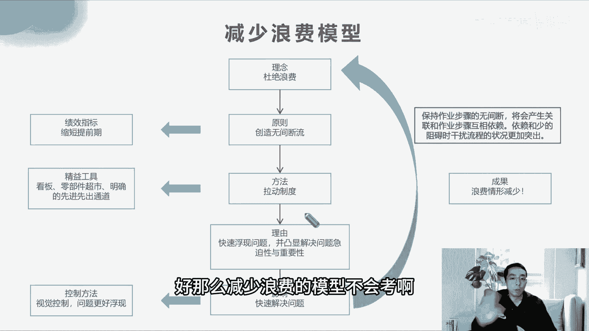

这个我们就跳过了好看板啊，简化的看板也叫敏捷看板，我现在给大家去做一下啊，这也叫敏捷看板，其实敏捷看板你发现没有，它是一个敏捷看板，其实它是一个状态强，它上面详细的显示的，比如说你正在进行中的。

正在实施的这个需求，它有多少需求啊，完成的有多少需求，有多少个需求，你可以在上面看得到一些状态，它其实就是一个精益的简化看板。

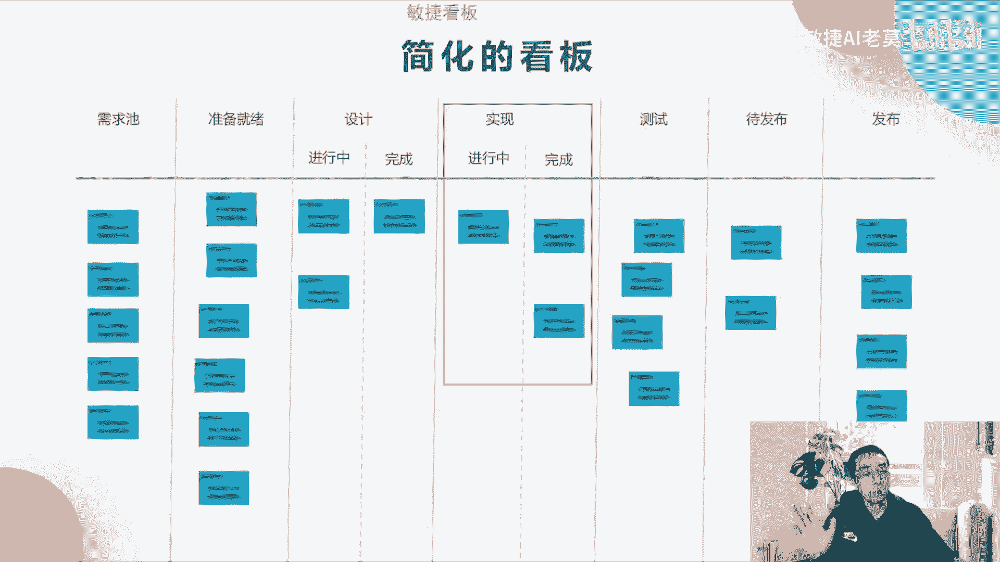

还有一种看板呢，详细的看板也称之为精益看板，这才是精益看板，他们俩的区别是什么，大家仔细看一下，精益看板上面标红色的是有数字对了有数字。

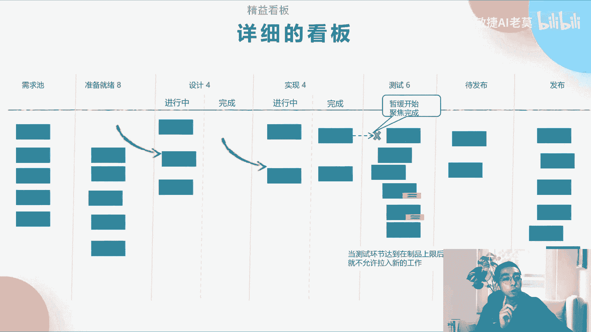

敏捷看板里面没有数字，数字就是他们最大的区别。

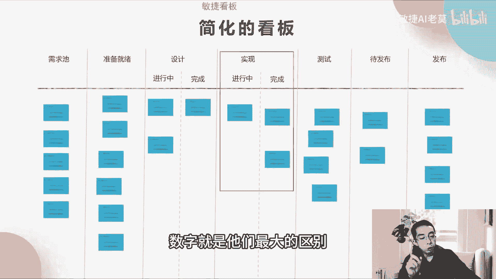

那么为什么要加数字呢，这个数字代表什么含义呢，比如说这个里面有四啊，这个四代表什么东西，这个四代表它底下的任务不能超过四个，最多就只有四个，最多也只有六个，为什么会有这个数字去限定它啊。

这个限定数量我们叫做IP的数量WIP啊，再制品的数量限制他有什么好处，限制它，我们一眼就能够看到系统的瓶颈，就是我们的堆积，上游的堆积就是下游的瓶颈啊，比如说这个是有六个，那这个四个这个四个已经摆满了。

摆满了是没有瓶颈的，但是你要看到上游，它上游写的是它只有三个，说明没有瓶颈，因为上面还没买吧，你看上游准备就绪，有八个，他这上面才摆了12345才摆了五个，这个是没有瓶颈，那么有瓶颈，我打个比方啊。

比如这个里面有六个，那上游我们看如果是四个，我们如果在上游加加四个，这个就是瓶颈，你原本你只能放四个任务的时候，你你堆积了八个任务，那么它其实就是瓶颈了，所以这一条生产线就要停了啊。

在丰田里面它增长线就要停了，停了以后要把上游消化完了之后再往下游走，这个就好比什么，就好比你春节的时候，过春节的时候吃饭是吧，吃完上顿吃下顿，你为什么会觉得很难受，是因为你上一顿的饭他都还没有消化。

你就下一顿又接着吃，就会告诉你说我吃不下了，我实在是顶不住了，我的胃就开始给你发出警告，你要么就可能拉肚子了，要么就肠胃出现问题，导致消化不良，你就很难受，气胀啊，什么东西，这同样是这样的。

要保持管道的通畅，在做项目任务的时候也是一样的啊，谢谢点赞啊，OK所以这个我们的看法看出你的瓶颈，比如说你的胃已经撑满了，你现在还吃东西，你的胃就会报警，就告诉你的大脑不能再吃了，所以你的胃就是瓶颈了。

明白吗，上游不断的堆积的时候，你的下面就是就是瓶颈，所以我们要消灭瓶颈，必须从占有出发，所以在精益看板里面，它是一个拉动的模型，拉动模型我只有说我比如说的说的点，我下一顿我吃，我要吃东西的时候。

必须是我的肠胃已经排空的情况下，所以是拉动模型，我的肠胃很空的时候，这个大脑就告诉我，我饿了，我要吃东西了，这个时候我们吃东西是没有任何问题的。

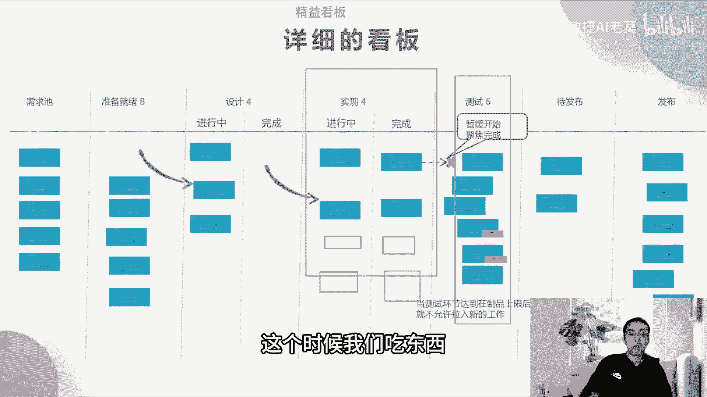

对不对啊，所以是这样的一条线，所以再次品再制品是什么意思啊，再制品其实就是中间经过的所有的东西，你包括你说我们用丰田来做举例的话，丰田它的再制品是什么，在一条生产线上，它所有的再制品就是没有产生价值的。

一些中间件组件，这个东西就叫做在制品，比如说啊你那个汽车，你肯定是从流水线下来以后，你肯定是组装成乘车乘车卖到4S店，大家买的这个车，这个才能够产生价值，才能给公司提提供一些什么叫做现金流。

但是你说我这个车子我还在生产线上，我的一个轮胎它能不能产生价值，它不产生价值，生产线上的轮胎是不产生价值，而有些人说莫老师啊，轮胎怎么不产生价值呢，我轮胎坏了以后，我去网上买一个轮胎。

或者是我去那个维修店去换一个轮胎，他不是单拿一个轮胎给我卖1000块钱，2000块钱吗，这个怎么不是价值好，那是单独的轮胎的价值，不是流水线上轮胎的价值，流水线上轮胎对于流水线来看，它就是不产生价值。

它是一个什么，它是一个零件，或者你说你说它是一个组件啊，也没关系，它就是不产生价值，只有装到车上形成一个整体以后才产生家庭啊，所以再次品就是啊各种各样的零件，包括你说诶我我我是做软件的。

我怎么去理解他们价值，我告诉你你的代码就是在制品，你的代码是中间产物，比如说我写了多少行代码文件，这个储存代码的TXT文件，这个文件其实它就是一个什么在制品，它不产生价值，只有代码被编译以后。

它形成了真正的功能，它这个功能能够让用户去观看啊，去下单啊，能够产生这种效果的时候，它才是有价值的东西，OK好听懂的同学可以打六六啊。

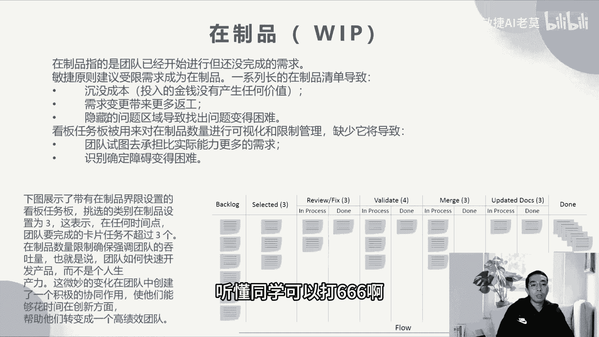

好OK那ROMROM其实是大家用的最多的。

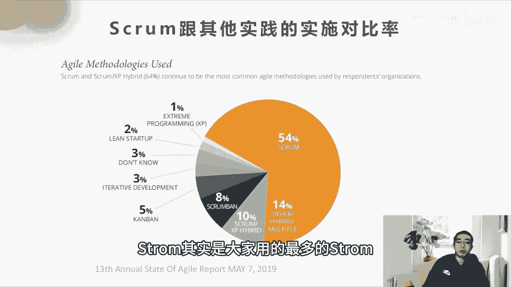

ROM用的最多，所以考试主要是考这个东西啊，OK好那这个东西就是重点了，这个东西必须要给大家展开讲，那么考试的话基本上就是考这些，所以敏捷你只要记住这张图，其实就已经考完了啊。

就所有的东西都是从他这边来的啊，它的结构框架我们称之为3355，33553种角色，三种弓箭，五种仪式和五种价值观，第一种三种角色在敏捷里面，我们天然会把这个角色啊，考试里面会考三种角色。

第一个是产品负责人，我们叫PO叫product owner啊，产品负责人啊，product就是产品的意思，owner就是负责人的意思啊，第二个是敏捷教练，敏捷教练，那么敏捷教练我们称为SM啊。

不是你们想的那个SM啊，4SAM叫ram master com，就是这个单词啊，ROM它是一个这个那个叫叫什么橄榄球运动啊，master就是教练橄榄球的教练这样的，然后第三个就是团队啊。

团队那三种弓箭是什么弓箭，我们前面说了弓箭其实就是赛制品，就是没有产生价值的东西，它不是结果啊，但是为什么我们要学这个东西呢，是因为这个里面在过程，这三个工件在过程里面非常重要啊。

第一个是产品代码列表啊，在我看来，我给大家看的就是它可以等同于需求池，所有的需求都在这里面，比如说他给你客户或者你的那个领导，给你提了需求，加起来100个，这100个需求它就是产品待办列表。

那么你可能一个月只能做十个需求对吧，那么只能做十个需求，那么这十个需求在这一个月里的十个需求叫spring，spring代表列表，spring是什么意思，spring就是疑似那个橄榄球开球的意思啊。

你如果不能理解橄榄球，你就理解足球就行了，因为你足球其实跟橄榄球其实很像啊，就是他开球是什么意思，就是当对方踢进一个球进球门的时候，是不是要重新来，那攻守双方是不是要变一下啊。

比如说是A队踢了一个球进去了一比零，那下一次开球是谁，就是B队，对不对，所以下一次就是另外一局啊，另外一局的时候，另外一局就是spring代码列表，就是它其实是一个迭代一局。

就是一个迭代完成一局就是一个迭代完成，它就很短很平，叫短平快啊，所以十个100个需求里面取十个需求，这十个需求就是spring代表列表，最后就是增量，增量是什么意思，增量就是我做完这十个需求出来的结果。

就叫增量啊，为什么叫增量啊，不叫结果，因为你做完100个需求才叫结果呀，就是你拿到最后的结果，但是敏捷他看的是什么，看的是每一次小的成就啊，所以叫增量，那五种仪式啊，五种仪式，第一种是冲刺计划。

这五种仪式一定会要考，这个是必考点，冲刺计划会议通知，计划会议，其实等同于我们传统的项目管理里面的，计划会啊，但是在这里面因为一次冲刺很快嘛，比如说我们一周一次，那么一次冲刺就是一周。

每日战略会议就是站着开会啊，时间是15分钟，然后战略会议里面讲一些主要的内容啊，它主要是同步进展和暴露问题用的啊，第三种是充斥评审会议，从此评审会议是评审什么东西，评审结果，比如说你这个车做出来之后啊。

这个可能还是一部样车，那样车得有人开呀，开完以后有有那个车评人了对吧，评一下你这个车怎么样，好不好开呀，油耗怎么样啊对吧，你这个车这个操控怎么样啊，方向性怎么样，底盘整不整啊对吧。

各种这个评测最后的结果就叫评审会，回顾会是什么，回顾会是回顾，你知道吧，造车的这个过程，你这个过程好不好啊，出了什么问题呀，你这个良品率是多少啊，对不对，你的团队有没有做到啊，这个是过程的回顾啊。

叫冲刺回顾会，所以他们两个一定要分开啊，结果的回顾和课程的一个过程的回顾，一定要分开，最后是代办事项梳理会，代办事项梳理会是什么意思，就是每次你来的一个新的需求，我是不是就要梳理一下。

我新的需求和以前的需求的关系啊，新的需求能不能插入到现在的版本里面，大家立马做了，还是说下一次做了，还是说以后做啊，这个东西都需要代办事项梳理，待办事项梳理，每一个需求进来以后都要去进行一次啊。

新的需求插入需求都要进行一次待办事项梳理，他还有一次很长的会议在哪里，第一次冲刺计划的时候，就每一次冲刺计划会，就是计划会之前我们总要梳理需求，就像我前面说了，这个100个需求里面我拿十个需求来做。

这个100个需求，拿十个需求的会议是什么会呢，就是这个会，所以拿十个需求是靠什么去拿，我们要在社会上说清楚我们的价值是什么对吧，怎么去拿，那么价值是不是恒定的，价值一定是钱吗，不是啊。

价值是由战略决定的，公司的战略，什么是价值，你就是什么价值啊，比如说小米公司，它发布一款汽车，他可能刚开始做这个汽车的时候，他觉得我现在就是要打成招牌，我不不以赚钱为目的，所以打响招牌，不以赚钱为目的。

我把价格标低一点，那赚钱就不是他的战略目标对吧，那在他的战略目标是什么，比如说我不能有这个很明显的这些bug，对不对，我的品牌要立得住脚，我的质量一定是要可靠的，我的服务是要跟上的。

所以质量可靠这个东西对于开发人员来说，它就是价值啊，那么你赚钱的需求可能会摆在刚开始，会摆在我们的质量需求以后，对不对，但是一旦小米汽车它运营了45年以后，他开始觉得哎呀。

我在市场上已经占领一定的优势了是吧，这个时候我可以把价格卖贵一点，就像小米手机一样是吧，我把价格卖贵一点对吧，小米以后再也不走什么平价路线了啊，我们要走高端路线，那么走高端路线的时候。

当然战略在战略上我们要走高端路线，这句话出来之后，那么所有赚钱的利润率，提高利润率的需求都变成了高高价值的需求，所以价值是怎么样滚动的，随着产品的生命周期是不断不断的滚动的，而不是恒定的啊。

OK大家要记得价值，那么五种价值观啊，五种价值观其实就是对事不对人啊，开放啊，我们要很开放对吧，我们要接受大家的批评啊，任何人的批评，第二个专注啊，我们团队只专注于做一件事情啊，不要说我既有A任务。

又有B任务，团队很多人很多事啊，勇气是我们具有勇气去挑战权威啊，也有勇气去接受大家对我们的批评对吧，这个是勇气，然后承诺是我们只要承诺，我们能够做得到的事情，我们一定决定全力去做啊。

比如说我决定我承诺啊，我5月份一定要完成这个小米汽车的交付，那么大家就拼了命的干啊，把大家目标定到5月份，然后按照这个目标不断的去干啊，这个是大家承诺的啊，然后尊重就是互相互相尊重，我们也尊重团体。

尊重个人，甚至我们要尊重我们的用户啊，尊重我们的客户，这个是尊重啊，这五种价值观就在这里好，当你把这些东西全部理解之后，我们的课程才正式开始，下面所有敏捷的东西都是从这里出发，这里是原点啊。

听懂了这个原点的同学可以打个666，OK好，是不是非常容易，知识点很少能有50%的分数啊。

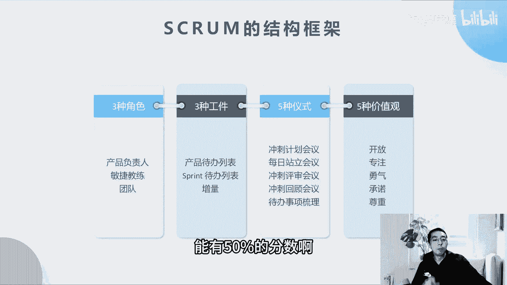

好拿三种弓箭啊，三种弓箭后面展开一下。

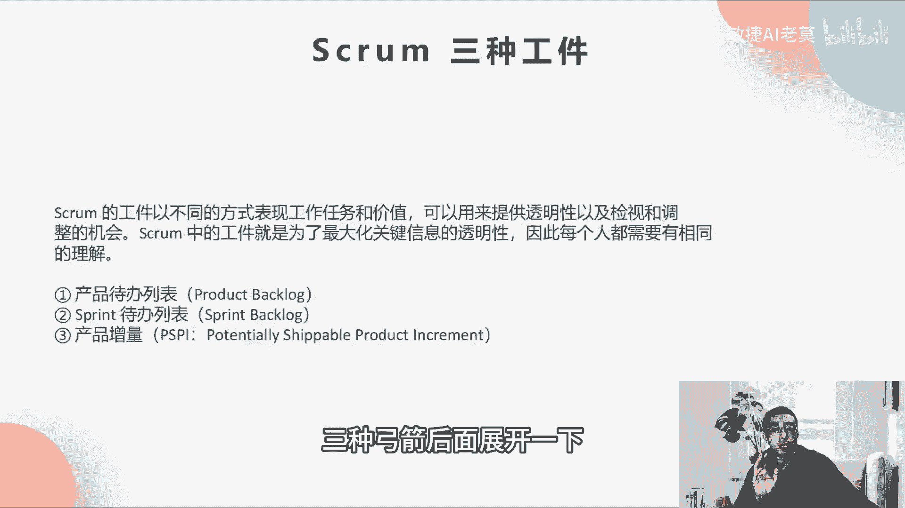

现在就不讲了，这个这个已经是在这里展开了五种仪式，大家可以看PPT啊。

可以看PPP，这个我已经讲过了，然后可那么还有一种现在这个东西考得很少啊，现在考得很少了，这个是敏捷的起源，就是敏捷的雏形，敏捷前面我敢展示一个大的图啊，就是敏捷，他是有17个专家一起开一个雪鸟会议。

然后在那个会议上对吧，我们产生了敏捷，那么在这个会议上有很多很多的专家，他们有带着不同的这样的一些，软件开发的方法过来的，所以敏捷里面就会包含这些思想啊，第一个专家是DSDM啊。

他带着动态开发方法这样一个方法的专家过来，这个动态开发方法不要记啊，我们动态方法里面我们只需要记一个什么东西，莫斯科技术，莫斯科技术是敏捷需求排序的，这个用的最多的方法啊。

我们中国人管它叫P0P2P3P4啊，比如说master p1啊，should shot2wop三，Cop 3wop4，就是优先级，其实就是优先级，所以我们其实在第0PAP2P3P4的时候。

其实也用的就是这个用的方法，那为什么master是P1，我们没有说P0呢，为什么孟老师刚才说P0P0是紧急需求啊，所以P1是什么，P1是强制需求，就是没有这些需求，你这个迭代其实就没有价值啊。

最有价值的那皮P2的话是什么，不是强度性的，但是是高度渴望的，比如说用户他提了好多次想要这个功能对吧，第三个是可以有，有的话会更好啊，比如说有一些以体验优化对吧，就加进去，第四个就是不会有啊。

可以不去满足，放了以后再说这个事情，所以P1P2P3P4就是这样的啊，你只要记住，莫斯科的方法是来自于这个什么都可以，开发方法里面的就可以了啊，其他的东西我们就不用管了啊。

水晶方法，水晶方法现在考得非常非常少了啊，可能一道题目都没有，水晶方法，它是一个什么意思，其实就是你只要记住我这句话就行了啊，你不要不要去记住这些东西啊，这东西太多了，水晶方法就是很多人。

人多的时候有很复杂的流程去管理，人少的时候用很轻量化的流程去管理啊，这个就是说我为什么敏捷讲究的是小团队，因为敏捷的这个管理方法非常的轻量化啊，所以水晶方法就是这样的水晶方法，它有很多颜色啊。

有有这个白水晶，黄水晶，橙色水晶，红色水晶，红色水晶是最最大的，就是它的方法最复杂啊，颜色从浅到深啊，所以在敏捷里面我们讲的是透明水晶，其实就是人很少，十个人不到，我们到7~9个人是最合适的啊。

7~9个人，那么7~9个人用的，就是这个水晶方法里面最低的啊，你大概知道一个这个意思就是这样，但是考试的时候考了一个渗透式沟通，渗透式沟通是什么意思，渗透公司渗透式工程，渗透式沟通。

你可以理解为两个字叫默契，团队有一种叫沟通是不断的去明面上的，我们我和你不断的沟通，第二种是我们沟通久了以后，团队会就会产生默契，对吧，就像说我们踢足球或者打篮球对吧，可能我们为什么很多人说哎呀。

我们打篮球的时候，很多强强联手反而而输给了那些很一般的人，就是看上去团队好像没有什么明星球员，但是也赢了，为什么呢，因为他们强强联手的人，基本上很多人是从各地各个地方调过来的对吧，他们磨合的时间很短。

磨合的时间不够长，所以他们之间没有形成这种默契，如果说大家磨合的时间很长，那么他场上的十个人可能就和一个人差不多，就一个眼神，你就知道我要传球给你，比如说可能后卫在接到这个球，往前传的时候对吧。

他到底传给谁，其实如果是最后一个后卫，他拿到一个球，他要传给前面的九个人啊，传了传了几个啊，不是除了守门，还有还有那个八个人啊，还有九个人，那么前面的九个人他到底传给谁，这个时候其实第一个是要看战术。

第二个是大家共同的去跑，到那个能够最有位置的那个点，你就传到最低位置的那个点就行了，这个是长期的默契形成的，所以渗透式沟通考验的就是默契啊，OK就是这个意思啊，然后特性驱动开发这个FDD。

FDD是什么意思，它跟敏捷有什么关系。

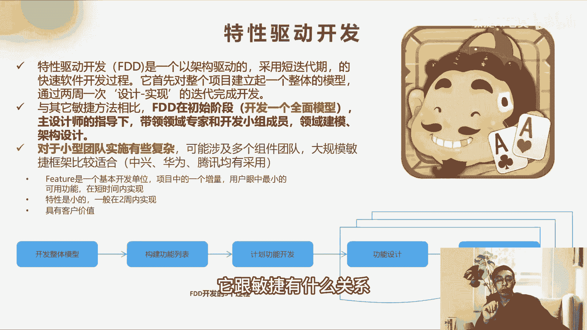

它跟敏捷的关系是就像斗地主一样啊，就是你们做1。0版本的时候。

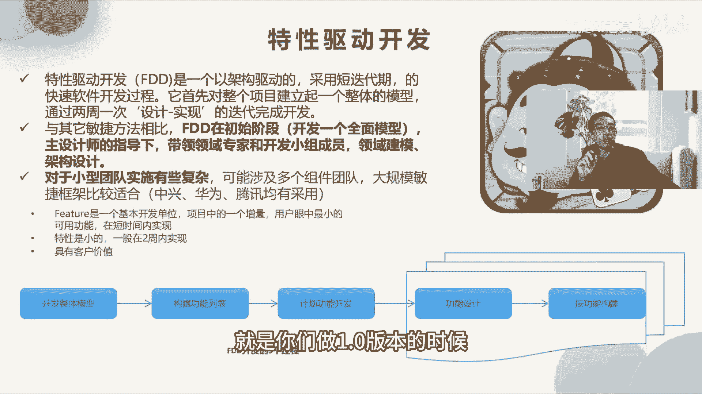

很多时候是这样的，就是我在整体设计的时候，我是整体一起去设计的，但是呢我在实施的时候，其实我是按一个小版本，一个小版本的来的，这个叫特性驱动开发，就是我完成一个特性啊，比如说我做一个网站对吧。

那么这个网站整体全部规划好了啊，为什么，因为我对这个网站很清楚啊对吧，那么第一个特性可能是我们的这个网站的浏览，第二个第二个特性是网站的下单，第三个特性是网站的这个这个这个退款啊。

那么这些东西它就是一个特性，一个特性的去做的啊，那么这个特性驱动开发，你大乍一听的话，同学有同学问问哪句，这不就是瀑布吗，那它跟瀑布还不一样，瀑布是整体设计，整体开发特性驱动开发是一个特性。

一个特性的迭代去做我整体网站设计好了，一个迭代能够帮我的，就比如说第一个迭代能够把我那个网站，比如说我这个电商网站啊，第一个迭代能够让用户直接能够下单，就是他已经把下单跑通了。

第二个迭代有一些什么周边的推荐功能啊，什么东西，所以它不一样的地方是在这里啊，那么瀑布是什么，瀑布，就是就是我我前面说的就是第一个，就是我们先把登录做完，那先把登录做完了，客户能不能下单，下不了啊。

所以在特性驱动开发里面，他一定是第一个版本它就能闭环，第二个版本又闭环一次，只是闭环的时候他在上面又新新增了一些东西，但是它又是你们能够闭环的啊，这个叫特性驱动开发，这个敏捷还不太一样。

所以特性驱动开发，你可以理解是一种混合型的敏捷混合性，它既有既有这个预测型的这样一些方式，又有敏捷的方式啊，是预测性，这个也是17位这个大神里面，其中一个他是带着这个思想来的啊。

所以敏捷的思想是碰撞出来的。

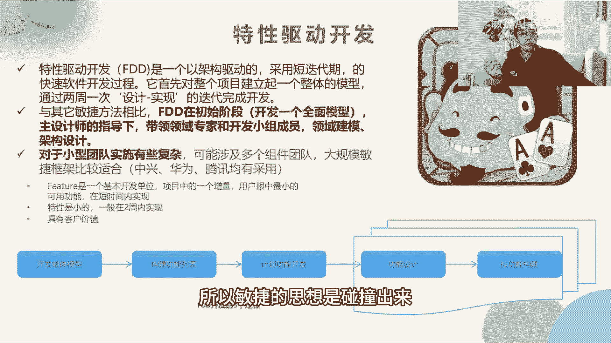

还有一个自适应开发方法，自适应的开发方法基本上就是敏捷的雏形了啊。

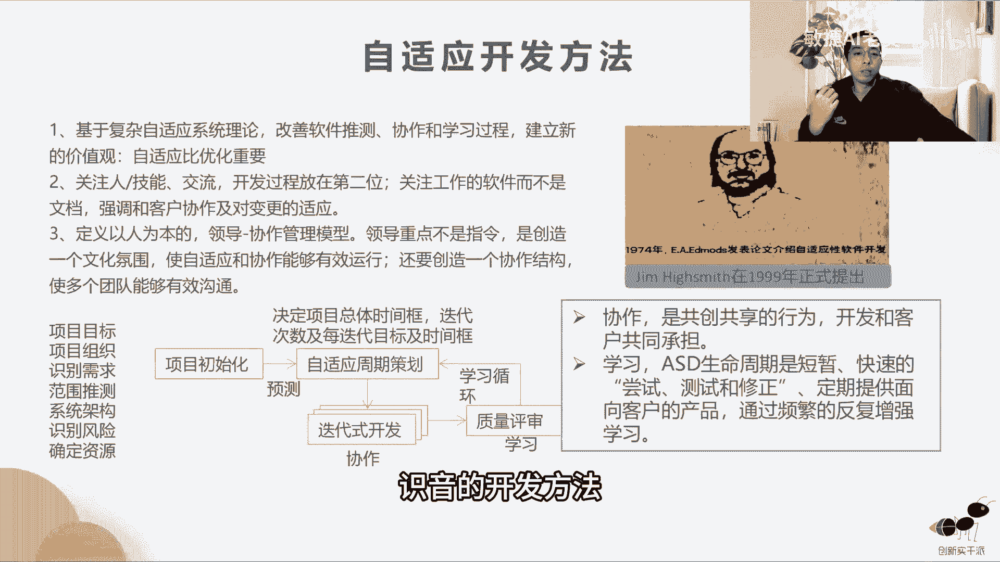

这个这个不考了，我就不说了，职业集成，持续集成是一种敏捷的一个软件开发，那个实践软件开发实践它是什么呢，它是一种工程工程化的东西，它只是说我做一个敏捷的这样一个这个方式，我们用敏捷的方式去写代码。

那写代码的时候，他能够做一些什么事情，就是当我把代码提交之后，它能够自动编译，自动测试，然后自动去部署，然后他去把软件能够让你去使用，就所有的一套自动化的操作，我们叫做持续成啊。

OK记住这个概念就行了啊，因为持续集成这个东西，它不会不会在那个考试当中，他能考得很细，为什么，因为很多考偏僻的人，他不是不是做软件的，所以他根本不清楚职业职能到什么东西对吧。

你只你只需要记得说持续集成，就是相当于一个程序员，他写完一些代码之后，你就立马可以通过这111套自动化的工具，你能够看到这个代码提交以后，他做出来的一个更新的一个效果啊，这个是持续集成。

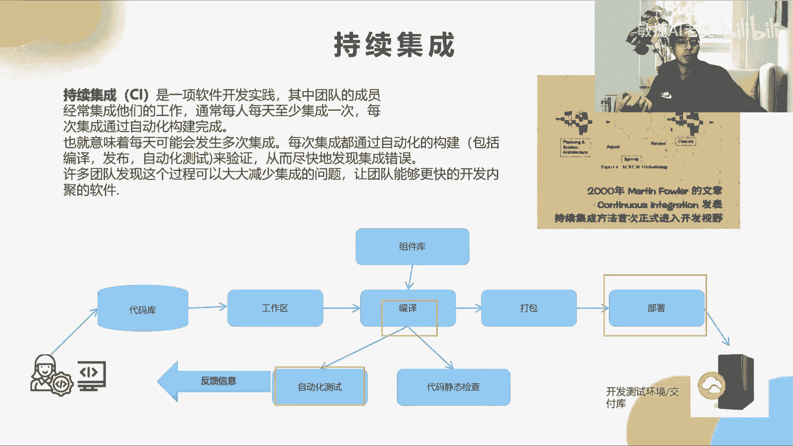

这样理解就行了，好第二个生命周期选择生命周期选择啊，生命周期其实有两种生命周期，其实前面我我聊了聊了产品生命周期对吧，那么产品，我我刚才说产品从研发阶段到引入期啊，引入期。

比如说引入期可能是我们做小米汽车啊，这个时候是刚开始啊，只要需要去刺激用户购买的时候，这个是引入期，发展期是什么，就是快速建立品牌，然后各个地方它可以有小米汽车，卖了小米汽车的这个4S店对吧。

各种各样的4S店体验店已经出来了，这个叫发展期，成熟期是指小米汽车已经在中国，已经占领了很多的这个市场份额了，对不对，它的生产量也上上去了，生产量上去之后，它的成本是不是就就就下降了。

因为它的平台要分担嘛，他的那个平台就分担它的成本，它的平台分担成本，它成本已经下去了，然后这个时候我们称之为什么，割韭菜的时候对吧，那割韭菜的时候就成熟期，考虑更多的是怎么样盈利对吧。

然后更最后就是衰退期，衰落期就像诺基亚一样，最后没人买了，对不对，因为已经进入另一个时代了，可能没人买了，这个是衰退期，那么像像那个传统的汽油车是吧，也会渐渐进入衰退期。

可能未来10年它就衰退期就到底了，然后未来你看到市面上基本上都是电动车了，对吧，产品一定会符合这样的生命周期。

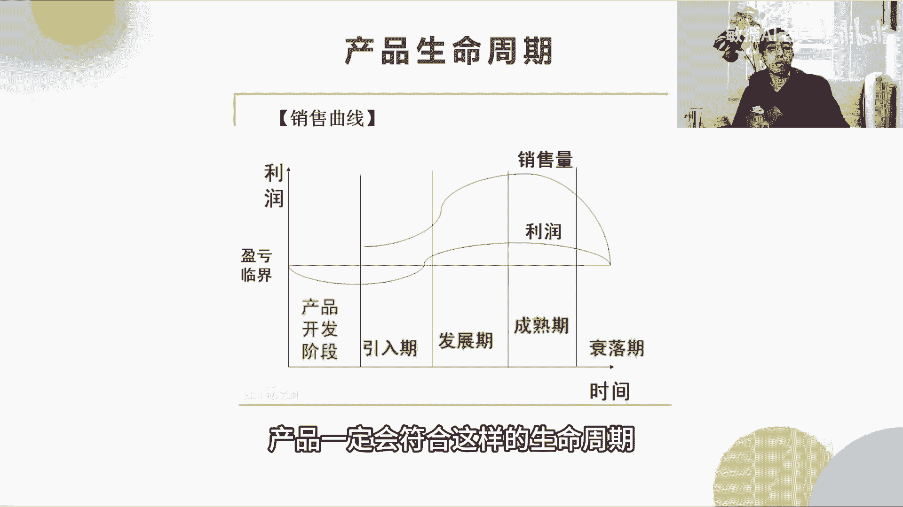

这是产品生命周期，然后项目生命周期，其实它是产品生命周期里面的，就是其实我们现在做项目，很多是为了产品服务的对吧，一个产品要做很多个项目才能够完成啊，那么项目生命周期它是包括启动规划，执行监控收尾。

我们其实在mp第六版的时候。

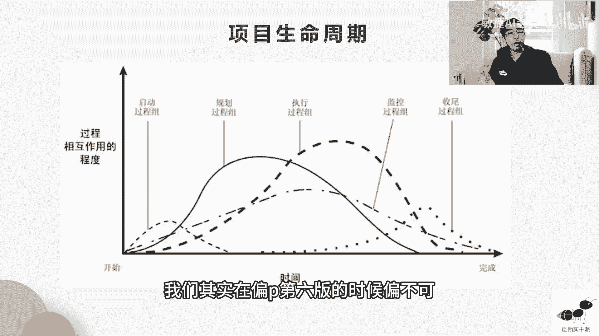

PMBOK第六版的时候其实反复再说啊，下面这个运周期，那么我们讲项目生命周期的时候，我们会讲我们有四种型啊。

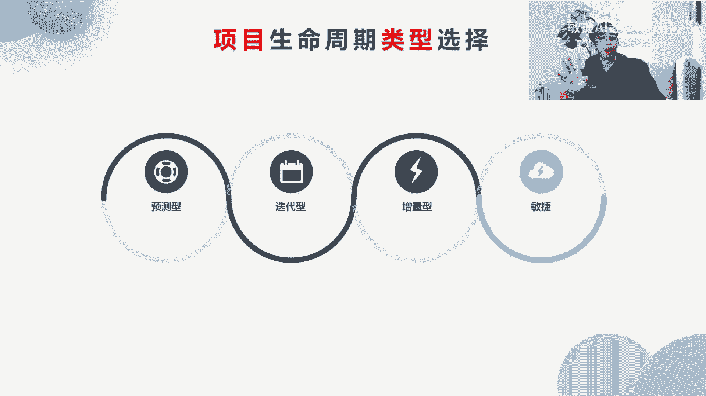

四种形，预测型，迭代型，增量型和敏捷型，然后预测型其实就相当于建房子，建房子其实是预测型啊对吧，我们现在有个设计图先设计对吧，然后再勘探，然后我们再打地基，然后在上面浇筑对吧，然后封顶封顶完了之后。

我们再怎么样啊，怎么样在做外装，然后做内装吧啊包括我们做一些软装，然后入住这些东西啊，我们其实是预测型，什么预测型就是也称为瀑布型，为什么它不可逆，就像瀑布流水一样啊，你不可能收时光倒流是吧。

而且你你看你看你能不能不封顶就入住啊，不行，它这个过程一定是从上至下的。

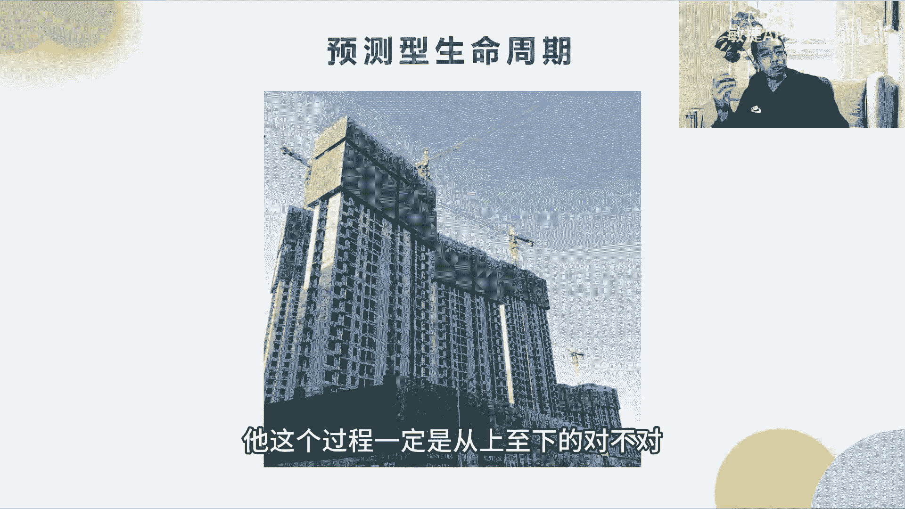

对不对，这个叫预测性，这预测型的特点，所以预测型经过的就是分析设计。

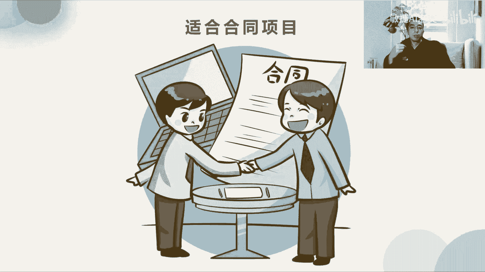

构建测试交互啊，这个是一套的，它一定是不可逆的。

它单单向箭头的，他比较适合的什么项目啊，就是那个签合同的项目，就是甲方，假如甲方要乙方完成100万的合同对吧，100万的合同，那么乙方就会看合同里面有多少个任务，比如说有十个任务。

那么这十个任务我做完我就交付交付给你，我只要在规定时间交给你就没事了，可以我就可以拿到这个钱了，这个就叫做合同啊，叫做预测型，所以预测型其实你说现在敏捷的时代，预测型被淘汰了，不是它也有它的用户场景。

如果是这种项目运用预测型是最快的啊。

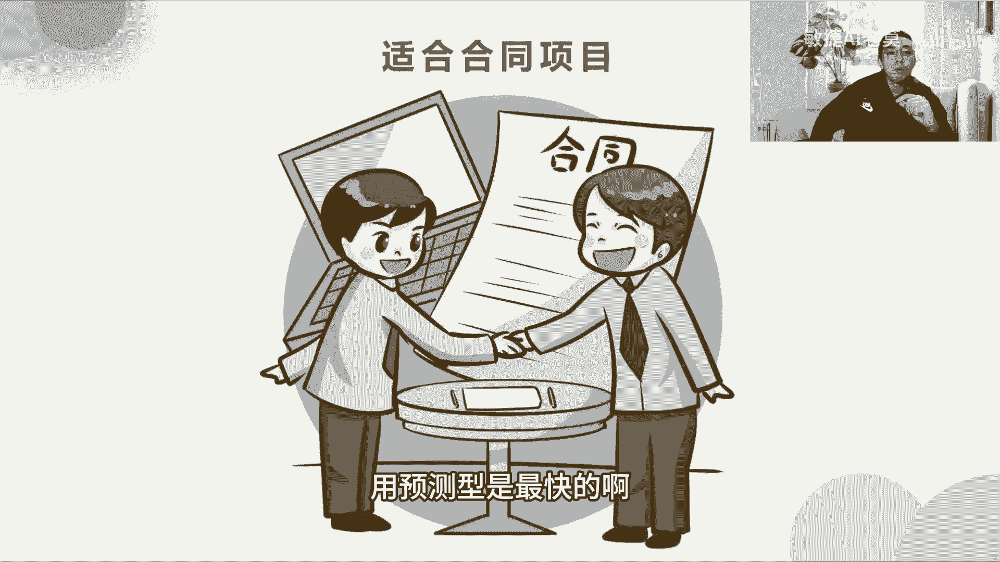

你反而用敏捷型，你就不知道怎么搞了，第二种是迭代型，迭代形式是什么意思，迭代形式每出来一种，它就做一个圆形，每出来一个就是说做一个圆形，一个改善，但是他这种改善呢，他一定是外部用户或者内部用户。

他经过他自己的反馈，反馈完了之后我改善一下，反馈完了以后我改善一下这样的啊，比如说我在做房子啊，那个起房子的时候对吧，我先分析分析完之后，我们会设计原型图纸啊，当用户去确定这个图纸的时候。

我们再开始下一步啊，然后我们在这个建模房子以后，我们做各种测试，这测试测试被验收了之后，我们再下一步啊，然后知道交付是这样的，就这个不断地去循环，如果达不到标，我们继续达不到，达不到标准。

我们继续达不到他满意的继续。

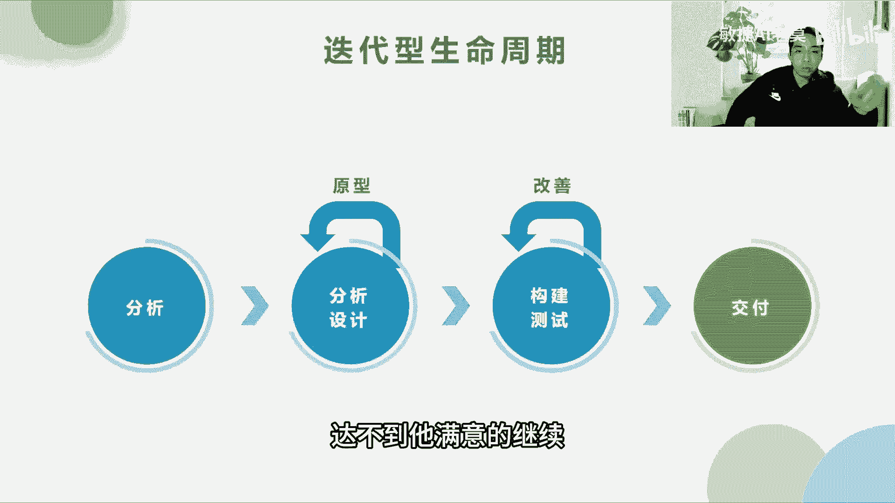

所以迭代形式很能够听得进意见的啊，它比较适合运维的运维类的产品啊，就是在软件行业来说，它比较适合什么，就是像微信这种产品，他已经很成熟了，他已经发到这个外网了啊，已经很多版本了。

然后他倾听用户的这个声音，然后用户给他提提声音，它就迭代提声音迭代啊，这样的比较适合这种增量型，适合什么增量型，它其实每一个增量他都要走过这个步骤，但是增量它不用听用户的声音，这个是他们最大的区别。

最大的区别它不用听用户的声音，它可以按照我们的版本的计划去增量，但是为什么要的增量，就是因为它每一次迭代的这个代价比较小，你可以理解说哎呀，什么叫整脸，比如说拿手机举例子，IPHONE对吧。

以前的时候IPHONE以前不是还有啊什么啊，Iphone 4iphone4 s，IPHONE5IPHONE5S对吧，你会发现IPHONE其实它也是有大年小年的，在大连的时候，不是中国的那个大连。

就是每一次IPHONE要更新的时候，他有时候在大连的时候，他会怎么样更新的，连外观都有变化，就是它外观变化会比较大，对比如说你像IPHONE8到IPHONE10，从以前的这个下面有个按键变成全屏幕。

这个是更新比较大的啊，这个叫做我们的这个整体的这个更新啊，叫做全新发布，然后呢IPHONE10到IPHONE11，它其实是什么修修补补，你可以理解为修修补，所以它就是一个增量。

IPHONE11到IPHONE12，它也是个增量啊，然后带IPHONE13之后，他好像就是从那个这个圆角变成了直角对吧，那圆角变成直角，它就是一个大的更新啊，然后到IPHONE14又是小更新。

然后大家现在IPHONE15又是小更新啊，说明年IPHONE16又有大更新，所以小更新就是那个对吧，OK蒙娜丽莎那个话是对，其实如果你你你学过敏捷，你看到了很多这种敏捷的这样一个，这个敏捷名画的时候。

你会看到那个蒙娜丽莎那个画，可以把它分别出来，分别出来啊，蒙娜丽莎这个话说的是什么，就是一幅画从素描到慢慢去上颜色，这个这个这个阶段啊，我们叫做迭代啊，叫做迭代型对吧，那么如果你是做那个增量是什么。

增量就是慢慢的增啊，慢慢的增是什么，就先画左边对吧，然后再画右边啊，然后再画下面，就这样的话，我们叫做增量型啊，叫增量型，你像那个就像人画画和机器画画啊，我们我不知道你们看过那个。

其实AI画画就像不是AI画画，就像那个打印机啊，我们以前搞的那个看的那个打印机，那个打印机以前是叫针式打印机，它真实打印机画画是怎么画的，他画一个人，他是从头顶开始的，吱吱吱吱吱吱吱这样打。

然后一个人出来，就是他画头顶的时候，你根本不知道这个是什么人啊，现在3D打印机其实也是这样的，他画了画了一个人的头顶，你不知道他画的是什么，直到他把脸全部画出来，你才知道哦，原来是爱因斯坦对吧。

OK你甚至不知道他画的什么东西啊。

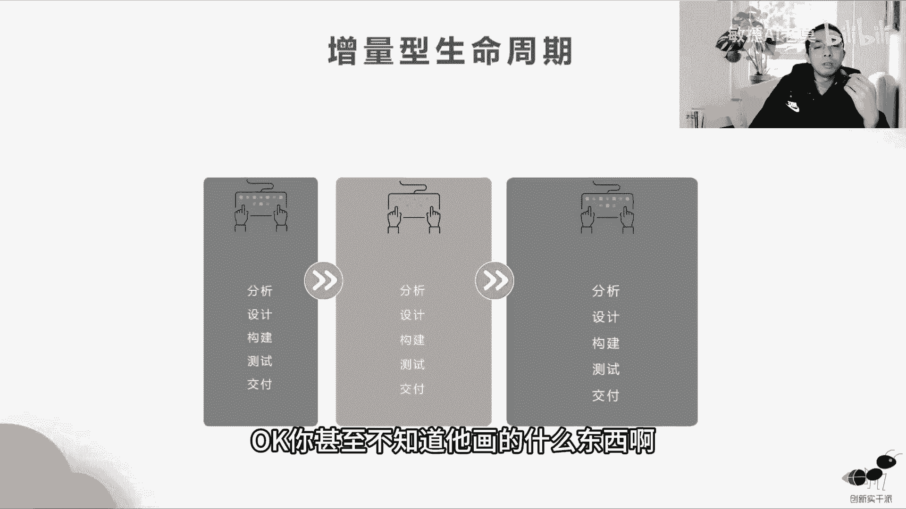

这个是其实是增量型的特点，OK它适合从0~1打造产品啊。

增量型是适合这个场景，所以每一个这个类型，它都会有一个特定的场景啊，那敏捷型敏捷型其实是什么，就是增量型和迭代型的混合体，它其实有增量型的快速的优点，因为它增量就是每次只更新一点点，增量的优点。

又有它能够接受用户反馈的优点啊，接受用户反馈叫做分析啊，这也有这个优点。

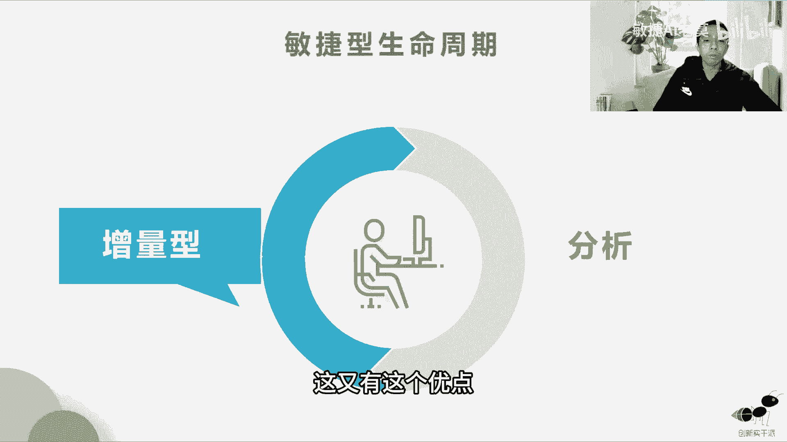

这个叫敏捷性，所以生命周期的特性比较我就放在这里了啊，就是每一种这个应对场景，比如说预测型，它适合接单型啊，接小程序的单代迭代型适合什么0~1啊，然后哦不增量型适合年代0~1。

迭代型就适合什么APP已经上线，需要持续迭代，反馈就是有反馈的，这种敏捷型适合于竞争性产品啊，所以敏捷型最能够适应现在的什么乌卡时代，对不对，这一页PPT大家可以记一下啊，这个PPT是考试会考的啊。

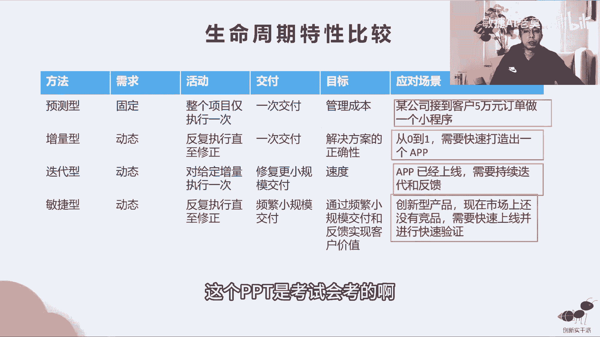

考试会考好，这个基于迭代的敏捷和基于流程的敏捷，考试基本上不会考啊，这个可以略过一下，基于迭代的敏捷是我们所说的正统的敏捷，基于流程的敏捷是中间的过渡方式啊，你可以把它理解为混合式敏捷。

就是说我们当我们还不能够很稳定地说，我每周一个迭代的时候，那么我们就按照原来的方式啊，我们每每每一次完成十个功能作为一个迭代，这个叫基于流程的敏捷啊，OK这个考试不会考啊。

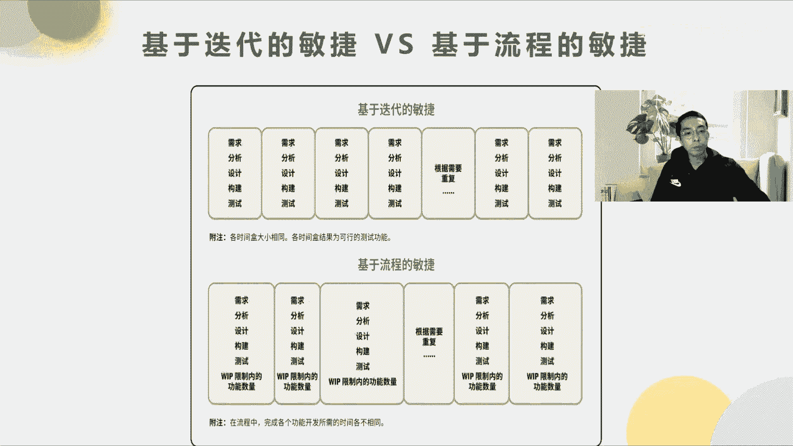

敏捷适用筛选器，这个敏捷适用筛选器，是用来适应说你的团队的文化呀，你的团这个项目啊，文化团队和项目这三点综合来看，你的团队是不是能够适用于教敏捷。

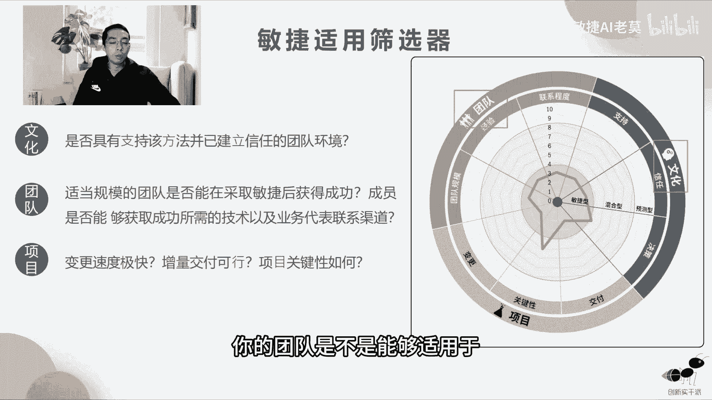

这个考试不会考啊，我就快速过了，然后这里有一个调查表啊，你可以看一下，非常支持，比较支持，一半支持，不再支持，完全支持他，调查表打开是这个东西，如果你得分越低的，三分以下是说明你的团队是适合做明节。

如果你的得分是在三分以上，那么是不太适合做敏捷，他这里有九个题目啊，九个题目三分是27分，也就是说你的总分低于27分的时候，你的团队是比较适合做敏捷啊，你的总分高于27分。

说明你的团队不太适合做敏捷啊，OK混合型敏捷啊。

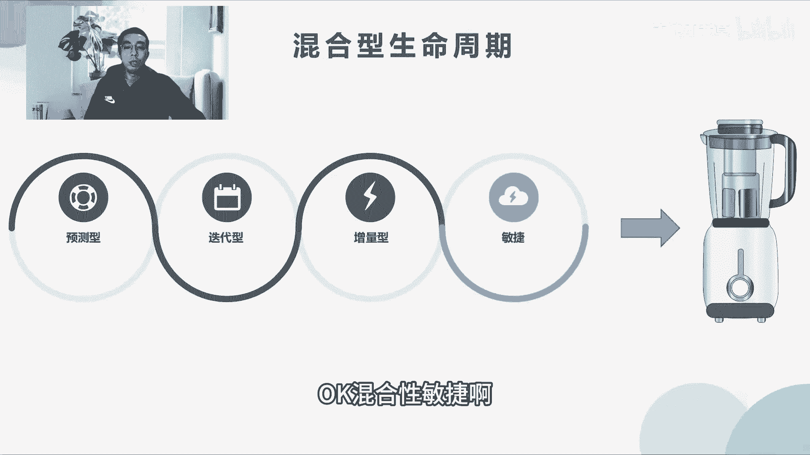

就像搅拌机一样，把它全部混在一起，混合性的敏捷呢哪种混法不会考啊，但是大家稍微知道一下就好了啊，比如说敏捷型和预测型啊，先敏捷后预测，这个是一种混合的方法，这个就像我们制药一样，制药的时候先要临床。

临床才能批量生产对吧，那临床的过程它其实就是敏捷型对吧，找各种人动物做试验的耐药性怎么样，这个叫敏捷型啊，不断去调整，当调整完了之后发现没什么问题，大家批量生产。

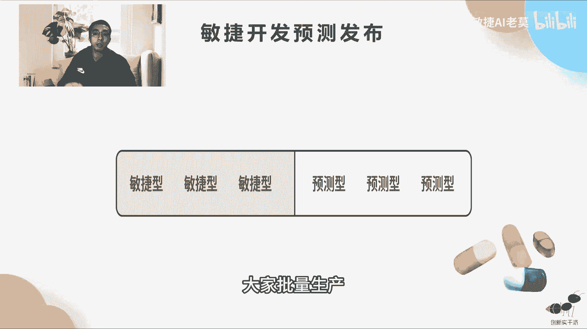

批量生产的时候，这个时候就用预测性啊，然后这个有预测为主，敏捷为辅的这种心啊，这个是什么意思啊，就像那个我和我的祖国有一个叫升旗吗，升旗就黄渤演的那个，就是那个在整个天安门升旗的这个整个过程。

他其实已经做了很多实验对吧，那这个过程其实从刚开始这个旗子的设定，到投入到投投入研发，投入生产，这个是一路上都是预测性，但是他遇到一个意外，就是说它不能在现场调试。

所以他要在不断的在一个二比一的模型对吧，他要做一个二比一的这个旗杆对吧，一比二的情感就是比正常旗杆少一半对吧，然后他去做这种升级的这个事情啊，做这次升级的就是不断去试啊，不断去借一些东西啊。

那这个是这个调试的过程当中，其实是预测为主，敏捷为辅的这样一个过程啊，这里面就会有敏捷型的练习。

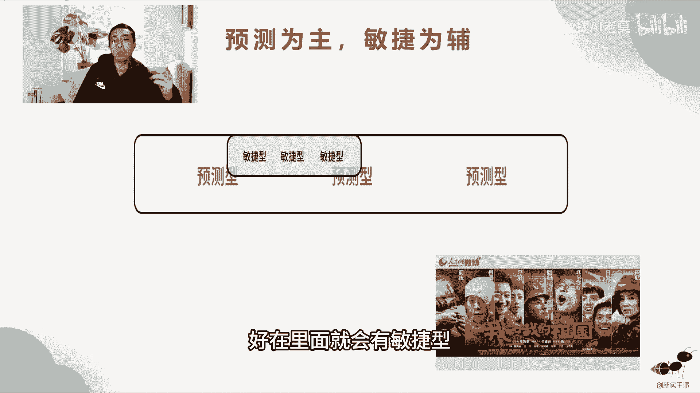

我们就不做了啊，敏捷为主，预测为辅的啊，就像说我们其实配电脑啊，配电脑了，我们在这个整个配电脑的过程当中呢，我们是敏捷型，为什么，因为电脑的不同的，你像组装电脑，不同的配置，它适合不同的人啊。

你去电脑城装电脑的时候，通常老板会问你，小伙子，你买电脑是用来干嘛的对吧，那你说我是用来上网课的，那么上网课的他可能会觉得说，那你预算多少钱，在你的预算范围之内给你配一台能够上网课的。

但有一些说小伙子你干嘛呢，说打游戏的，那么上网课和打游戏的，这个是两波不同的人群，针对人群用针对不同的人群，用不同的零件，那么针对不同的人群做出改变，这个是敏捷型，所以是敏捷为主的。

那用不同的零件去组装，就属于预测性，那个零件就叫预测性，因为什么英特尔他们说的什么I5I7I九，这样的芯片是吧，用的什么256的内存，512的内存对吧，用的是什么1T的硬盘，2T的硬盘，这个都是定死的。

这个零件都是每一年晚上去增长，每一年这些零件会更新对吧，那么它的更新他不会说你因为你打游戏，我就更新什么什么什么东西，他都是按量生产的对吧，我今今天更新了什么，明年更新了什么，后年我可能容量往上加。

它零件本身是冰冷的对吧，但是但是在那个交付的过程当中，组装的过程当中，我为了服务不同的客户，用不同的这个方式。

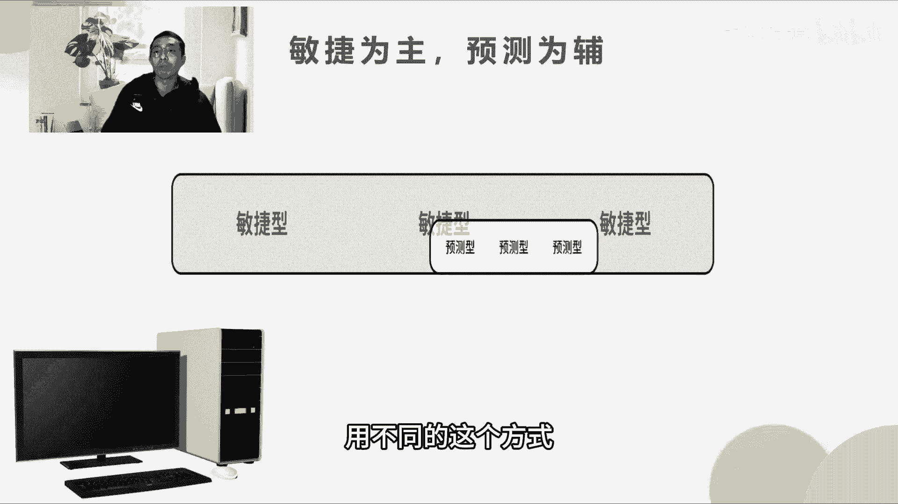

其实就是敏捷型啊，所以是这种方式好，OK这个也不做了，混合型的敏捷方法，混合型的敏捷方法有几种啊，就是第一个混合就是什么时间和好，就是在那个在那个步瀑布的时候啊，如果是说我们需要一定的固定的节奏的时候。

我们就用时间和这种方式，就是会会有这样这样的混合啊，那如果你在瀑布的时候，在瀑布模型的时候，我们引入了回顾会议啊，我们也是混合敏捷的方式啊，如果我们在混合的时候，在那个预测的时候，我们使用的看板的。

或者我们使用了测试驱动开发啊，或者我们用了大规模敏捷，或者做了敏捷培训，只要出现这样这些字眼，我们都认为是混合的敏捷开发方法啊，OK所以在题目里面，我们就要去认真去看混合型的敏捷方法里面。

我们通常使用的是敏捷的解法，只要你看到是预测型，但是里面混合的敏捷的方法，你基本上你的选项里面，都是倾向于用敏捷的方法去解决这个问题啊。

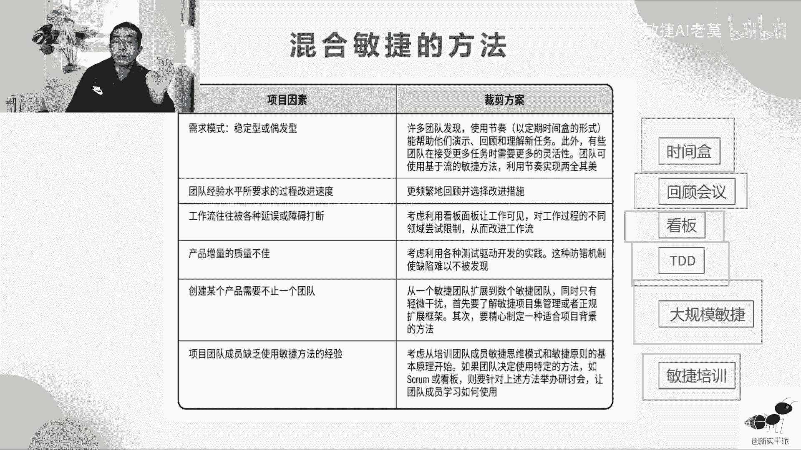

OK这个是创建敏捷环境啊，创建敏捷环境。

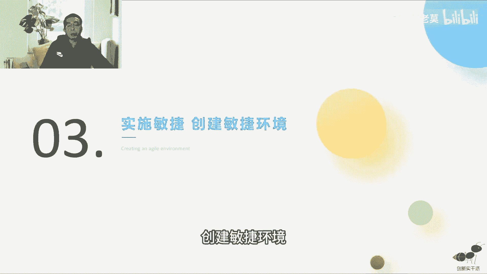

创建敏捷环境，前面也说到了那个团队3355对吧，那么团队3355的话，你一般是团队是5~9个人啊，这个不会考你，大概你知道团队人数比较少就行了，然后你这张图纸请你印在你自己的脑海里面。

团队就相当于这个就是还原是剁手，他是决定方向的，你像那个最后的一个人拿卡着那个大奖，他让船掉头，他就掉头，想让船往左往左右往右，它是决定方向的，所以它是PO啊，产品富人那个击鼓的是SM。

他是让团队按照他的节奏来走啊，他是来控制节奏的，那这个流程不要乱啊，大家不要乱，这个是SML去做的啊，OK那么团队鸡和猪的故事，鸡和猪的故事不会考，但是这个寓言故事是在敏捷里面非常经典的啊。

请大家记住鸡和猪是什么故事，就是鸡和猪他们要开一家那个餐厅，这个餐厅是卖什么的，是卖鸡蛋和火腿对吧，然后鸡就说我们一起去干这个餐厅，我已经迫不及待了啊，马上开这个餐厅，我们就赚钱了。

然后猪说那卖什么东西啊，你再说清楚一下，他说卖鸡蛋和火腿啊，这两样东西大家都吃的比较多，猪说什么火腿，那我不能给你开店了，那为什么，因为卖火腿，你用的是我的腿啊，我才四条腿对吧，我能卖几个出去对吧。

那鸡蛋你天天都有生对吧，你每天都能蹦出一个鸡蛋，那我给你开，你，你这不要了命吗，这个是说明什么，这租是跟这个这个事情它是息息相关的对吧，你不要去租，你不要去去指挥他，要去要去做什么事情对吧。

要去损害他的利益，而是说你要给他放权，比如说我要开一家店对吧，那这家店到底卖什么东西啊，你让猪去决定，因为它是息息相关的东西，所以他这个比喻就是鸡其实跟这个事情，他是B没有那么相关的人啊。

卒是利益切实切切实实相关的人员，那么在整个整个船里面，就是整个过程里面，你像敏捷团队SM和团队，他都是什么团队的猪，就是所有事情都是他来做决策，他的息相关的，即相当于什么，相当于其他的外部改写啊。

比如说客户啊，对不对，比如说领导啊对吧，比如说老板啊，比如说供应商啊，这些都是团队的鸡，就是鸡，它只能够在结果的时候，要结果的时候，他能够进入团队，你不能去指挥团队啊，指挥团队要是要由团队的猪。

比如说SM去组织去指挥，不能够由领导来组织，也不能够由那个这个供应商来组织，你可以提需求对吧，客户可以提需求，他提完需求做不做这个事情由团队来决定啊，就是这个意思啊，OK那这三个角色跟大家说清楚了。

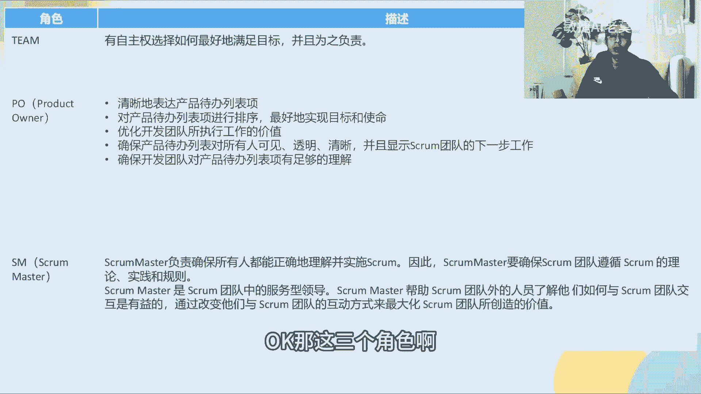

那么第一个角色SM啊，我们记住第一个是敏捷专家，就是他在这个团队当中，他一定是最有权威的，第二个是他是障碍清除者啊，就是比如说啊有一个考试考到了，说有个人他要去影响团队对吧，那你要做什么事情。

你要把这个人拉走，他是老板，你也要单独拉开，你不能让他直接去指挥团队，比如说在展会上去指手画脚啊，什么东西，你要把它单独拉开，领导你想看什么东西，我就给你提供什么东西，但是请不要骚扰我们的团队啊。

你以这种方式去答这个题目就对了啊，C是仆人，是领导，不论是领导说的是什么，就是你要做一个放权的领导啊，就是让大家多做决策，让大家自组织起来啊，然后第一就是变革的引领者对吧，我们要去充分的去理解变革。

并带着大家去变革好。

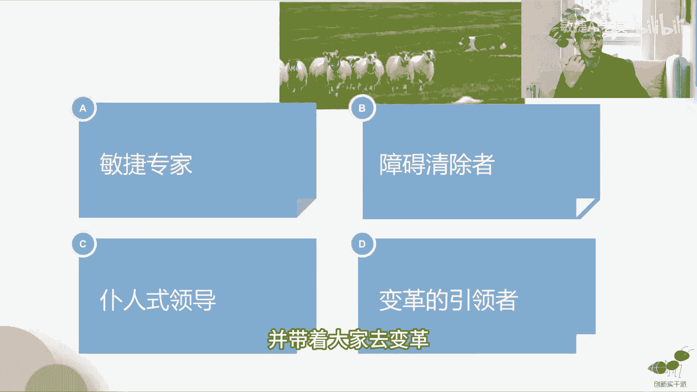

那我们来做一道题目啊，哪个团队成员应该引导或者促进迭代评审啊，迭代审核你们觉得是哪个a b CD d com主管，为什么我说过了考试，我后面会跟大家说啊，因为考试的那个题题目，我会陪着大家去做模拟题。

一是最最正确的，为什么呢，1D是ROM主管对吧，这个主管是什么，因为我们的关键词是引导啊，引导一定是主管com组啊，或者是说叫做敏捷教练啊，或者叫com教练都是一个意思啊，在com开发团队中。

谁负责确保遵循敏捷实践啊，ABCDE好，敏捷教练，这道题目说的有点怪啊，这scp master和敏捷教练其实都行，BBD都行，其实这个是个多选项啊，这个两个都可以啊，然后42题，根据com理论。

产品负责任的主要职责是ABCD是哪个D，尽量控制吗，不对啊，投资回报率对，因为产品的负责人主要看的是结果啊，OK好，这个题目有点长啊，考试的时候基本经常会考这种题目，作为敏捷团队的领导，乔伊注意到。

每日的战会时长远超于建议的15分钟，为保证会议简短而高效，它可以a b CD b r board，对就是B正确答案是B啊，有些人说VC为什么不对，券指团队成员分享相关的，我们刚才说了。

领导者是仆人式领导，仆人式领导不应该去劝阻大家做什么东西啊，所以这个关键字劝阻这个事情，就直接你看到劝阻这个事情就不要去选，然后继续，其实在这个敏捷的会议，因为站立会议只有15分钟对吧。

然后所有的会敏捷里面倡导的是开会后会，就是你们还有专项会议要解决问题，解决问题在专项会议上解决啊，我们的站立会议，请记住，站立会议是不解决问题的，他是暴露问题同步进展，因为他只有15分钟。

问题暴露出来怎么办怎么办，我我们开专项会，就是暴露的这个问题是属于他的干系人，是由哪些人，比如说有ABCD4个人，这个会议这四个人留下来啊，我们来专门讨论其他人，没事就散了就散了啊，就删了就行了啊。

好仆人是领导，仆人是领导，其实考的更多的是什么，就是倾听，就是我们要有倾听的这个讲法啊，帮助他人成长，所以你看这些词，你总结的作为一个你不需要记所有的东西啊，他不会考什么，不论是领导有哪几种特性啊。

什么ABCD什么提升自我意识啊，不会考不会考，他那个属于概念题，它基本上是考场景题啊，所以无论是领导，当你遇到这些事情的时候，你应该怎么处理啊，他应该就是考这些对吧，那处理包括你的倾听啊。

包括帮助他人成长啊，就这些，但是你这些东西不用太去记啊，你只要知道普瑞士领导，第一个就是我答答题的时候偏向于放权，让他们自己去自己去搞，第二个是团队遇到事情去找我，我先听听听，当我了解足够的信息之后啊。

我再去做决策啊，而不是我上来就拍一个板子给出决策，这个肯定是不是正确答案啊，记住了啊，如何做普认识领导啊。

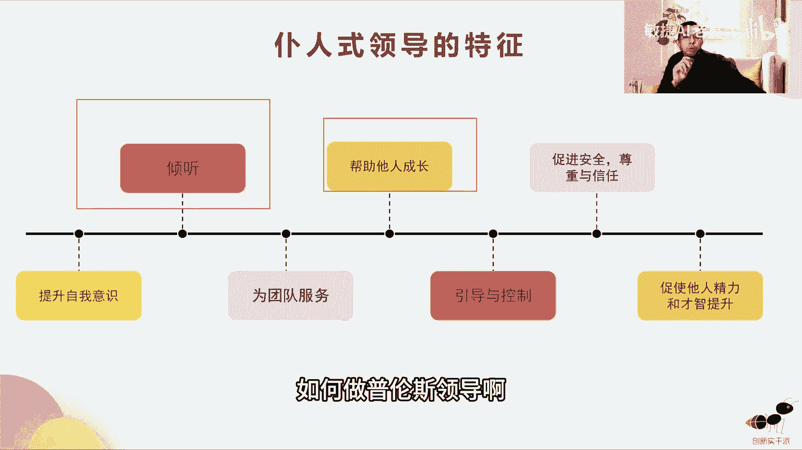

建立目标，鼓励团队做事，结果啊，这几个在这个场景里面，基本上我们都会按照这样去思考，就是当大家士气，比如说大家的士气受到影响的时候，士气受到影响的时候，我们应该干什么，很多人会选团建。

就第一个就只能选团建，那你就错了，士气受到影响的时候，首先问有没有共同的目标，没有共同的目标，那肯定不行，第一个就是要建立共同的目标，如果有了共同的目标还受到影响，鼓励团队啊，如果鼓励团队还没用。

然后我们又反弹了之后，发现团队的凝聚力下降，这个时候怎么办，请注意，团建是在于凝聚力下降，就是团队的凝聚力下降的时候搞团建啊，不是士气不高的时候士气不高，建立目标，第二个找原因啊，鼓励团队士气不高。

到底什么原因造成的，你说团建就能搞定吗，不一定啊，四期目标第一个是士气不高，第一个是没有目标，或者是说这些团队可能遇到了很多，难以解决的问题对吧，他可能遇到了一个问题，那么我们就需要怎么样对症下药对吧。

比如说他可能遇到了一个外部的干扰干扰问题，那么我们就要去排除他这个干扰，比如说他们遇到了一个技术问题对吧，包括他们过来找我啊，我就跟大家说，我说你们先做决策，然后他说我们做完决策以后。

有一个希望能够引进一位专家，那这个时候我们就一起去啊，我们作为普通市领导，我们就帮助大家去找找一些专家，给大家组织培训，解决这个问题，让大家士气上升啊，不是说士气一下降，我们就去团建。

这个是这个是不可取的啊，记住了啊，这这样打肯定会错的，好领导，不论是领导如何正确导入敏捷啊，培训是第一步，所以培训你当你来到一个新的这个团队的时候，你第一个你要做培训培训。

所以培训这个东西大家请记住了哈，你要导入敏捷，你先要做培训啊，这个就是我们要做的问题的答案啊，历年考试的时候经常考这个东西啊。

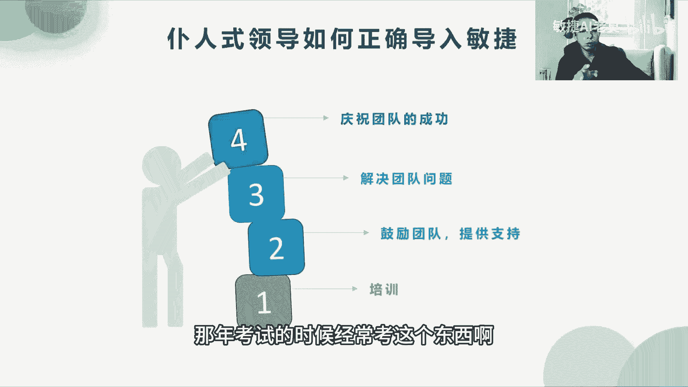

OK好，不论是领导的一项职一项那个职责是什么对吧，ABCD你们觉得是什么，对B提供支持，对了啊。

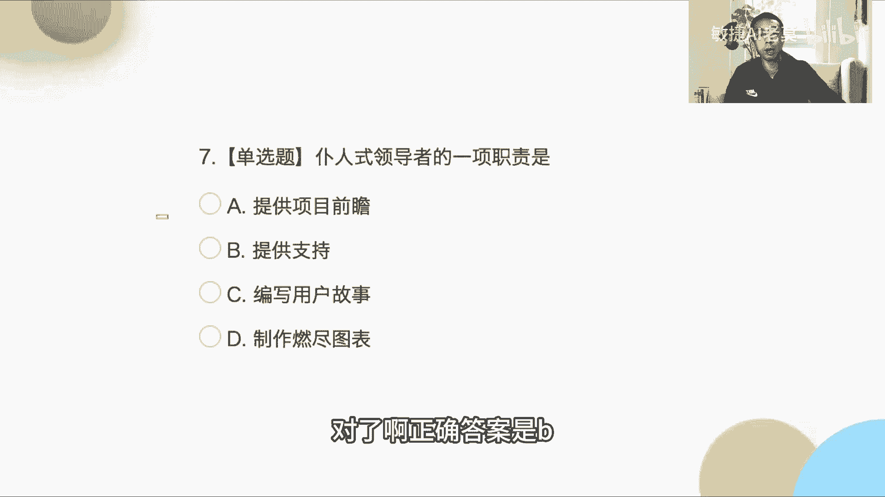

正确答案是B，然后我们要去转变一下，从以前的发号施令的项目经理，转变到现在的SM啊，这个是一个转变的东西啊，你们可以把这张图稍微记一下，有个印象，就是以前的项目经理可能是站着发号施令的啊。

现在的这个SM，可能更多的是说，跟大家一起共同去解决问题的啊，就变了角色产品负责人。

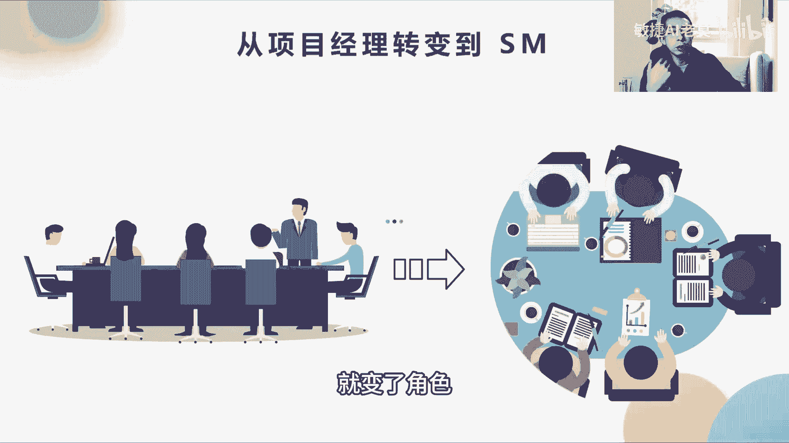

产品负责人就相当于什么狼王啊，投篮一样的对吧，他的职责啊，投资回报率负责，所以他看的是结果，你只要知道看的是结果就行了，那还有一个是什么，这个需求池谁来管，是他来管啊，产品产品负责人他来管。

所以考试当中经常会考这些啊，然后还有一个是什么优先级，谁来拍板优先级，大家可以一起排优先级，但是拍板优先级的只能是一个人，那这个人就是产品负责人啊，OK定义价值啊，定义价值是由他来定义的啊。

但是他大家排优先级的时候，就根据根据那个价值去排优先级的啊，OK然后决定是不是发布啊，这个东西是不是发，然后最后向利益相关者汇报，汇报的是结果啊，汇报的是结果，所以是他是产品负责人。

所以他参与几乎参与团队的所有的会议啊，比如说计划会啊，比如说代办事项梳理会啊，这个是代办事项梳理会哈，然后比如说回顾会啊，比如说我们的那个评审会啊，OK最后是一个产品或团队只能有一个啊。

有多有多个产品负责人就乱了啊。

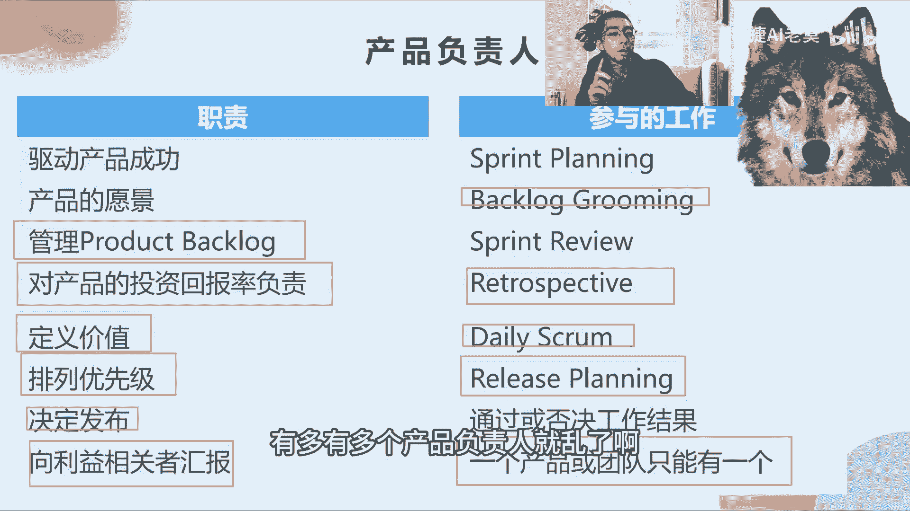

只能有一个拍板的，OK好，OK这个是我们的那个团队啊，团队团队要专门的人员，专门的人员，然后跨职能团队，OK集中和办公通才和专家组成的这个混合团队，稳定的工作环境，这个是团队的特点啊。

这张表大家反复去看就好了啊。

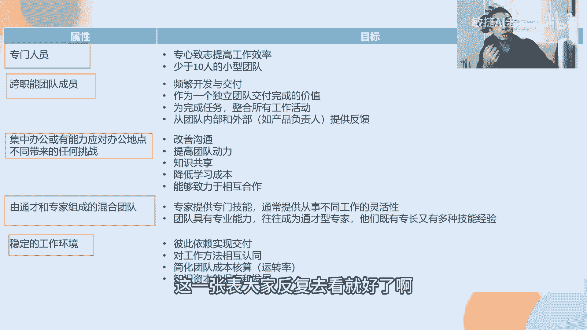

这我就不召回宣科了，那么敏捷的团队一定是小团队的，我们前面其实也说了5~9个人，对不对啊。

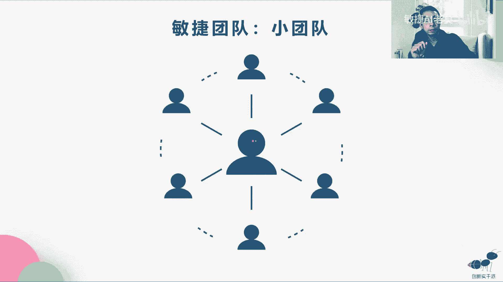

他们最倡导的方式是集中办公，好，那12题说为提高团队绩效，对团队教练和指导的尺度是ABCD，对由团队需求和组织规模决定的，OK就是大的团队，我们指导指导就应该怎么样复杂一点啊。

包括你说有有一个团队叫做大规模敏捷团队，叫ROM of com，对于这种团队的话，我们需要用这种大规模敏捷的这种方式去管理，那么小团队，比如说5~9个人的团队，就有这种敏捷方式。

标准的敏捷方式去管理好了。

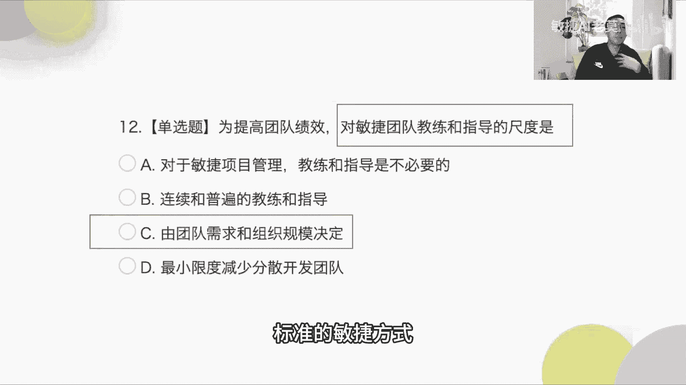

好稳定有序的工作环境，就是如果你的团队流通性太大，就是人进进出出的算不算稳定不算啊，敏捷一定是更支持的是稳定有序的工作环境，为什么呢，因为敏捷不重视文档，文档是什么东西，文档一定是说可以继承的对吧。

文档的好处是有一个人走了，下一个人过来，他能够根据怎么样，这些文档能够立马去工作对吧，但敏捷走了一个人，后来走了很多人的时候，这个时候很多继承的东西都在脑子里面是吧，所以敏捷也有它的局限性啊。

敏捷有它的局限性，我刚才说了两点局限性，第一个这个团队的稳定度是一个，还有一个是对人员的要求比较高，大家能够主动去做决策，而不是说这个事情我不管领导，你只要派活给我做决策的，所以我不做啊。

如果团队没有没有可以做决策的这种氛围啊，只是按部就班的像流水线的工人啊，你让我打一颗螺丝，我就打一颗螺丝就行了，你不要说让我去看这个板设计的有什么问题，这个我不管啊。

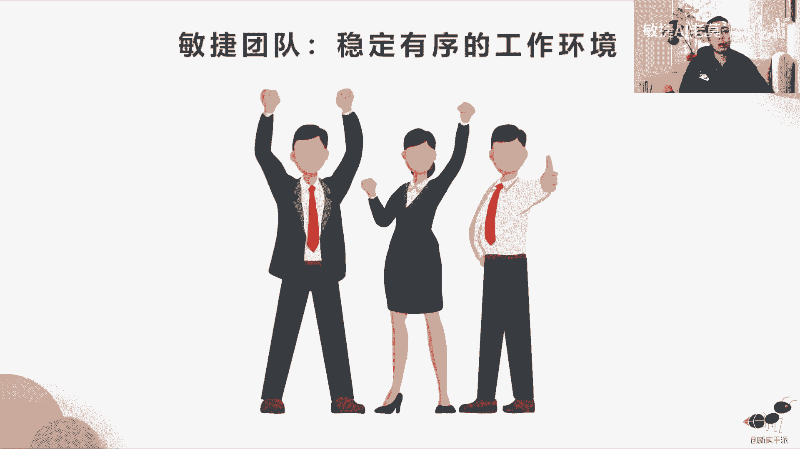

那么这种团队就不能做敏捷团队啊，K敏捷有一个重要的思想，就是团队成员之间有高效的信息共享，以下哪一种方式，保确保沟通的这种思想的可行性，也有符合敏捷宣言，ABCD第一啊，符合敏捷宣言的一定是首选。

以后档案里面有面对面的沟通，一定首选面对面的沟通。

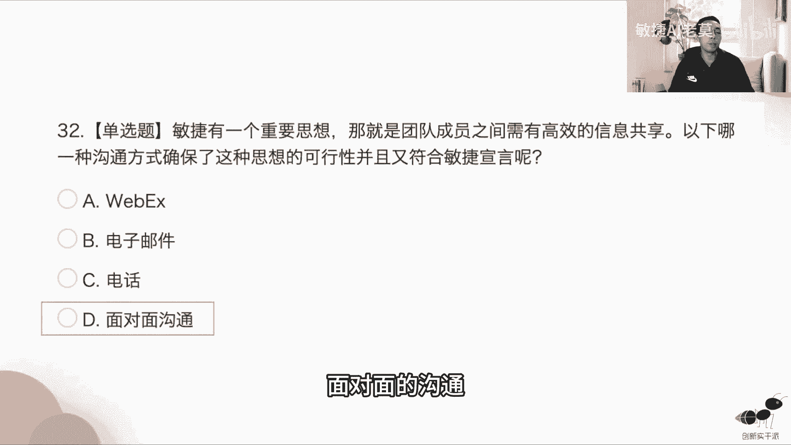

可以敏捷的人才的能力一定不是I型人才，而是T型人才，T型人才是什么意思，它既有宽度，也有广度，即在一个专业领域里面你很强，然后又又其他领域的设定啊，就像一个说一个人人都是产品经理。

就是一个懂产品的这个开发人员啊，比如说我我我懂用户，然后我又是开发的这种人是最好的对吧，或者是说我是产品经理对吧，但是我也懂开发，因为我以前做过开发，那这种产品经理跟开发的沟通起来就更顺畅。

所以敏捷里面，他特别欢迎这种跨学科交交流的这种人啊，因为他能够站在不同的角度提出这种问题。

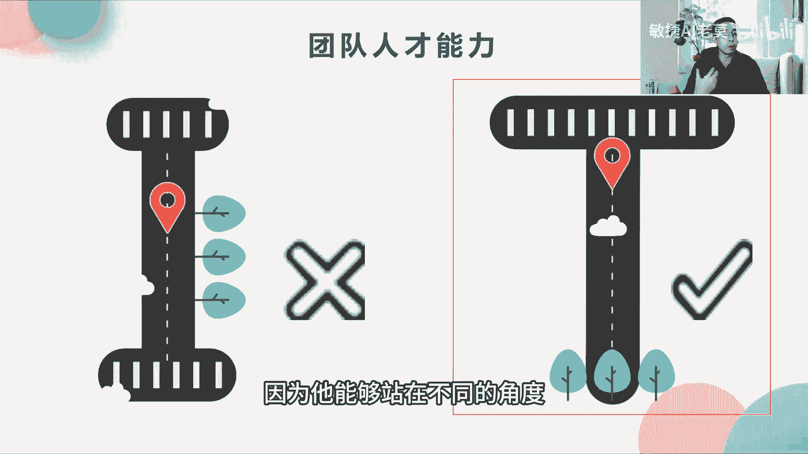

特别适合团队一起做决策啊，OK那么分散团队如何管理，其实敏捷里面说了，就是分散的团队比这个大家集中办公的团队，他对管理的要求更高啊，请记住了，他要求不是更低，是更高，为什么呢。

团队分配在你说每个人都在自己家里面，那么我们是不是要条条框框要定的更好一点，更多一点啊，比如说你不能穿睡衣来参加我们的会议对吧，那那会显示的不正规啊，但是你集中办公的团队又怎么会穿睡衣呢。

所以这条规矩根本不会有，对吧啊，那么分散团队他就要定这种啊，比如说我们每天打至少喷两次或者三次对吧，我早上大家开一个会议啊，比如说分散团队，每个人在家办公的，早上我们要开个会对吧。

大家约定早上九点钟开会，那中午我们要同步一下进展，因为大家不在一起，我不知道你忙了哪些东西，中午再同步一下进展，然后我们晚上再同步一下进展对吧，那一天同步三次，那这样的话是不是我们的管理沟通，这些东西。

其实都会都会比那个集中办公要更严一些啊，因为谁也不知道你在家里到底是在带孩子呢，还是在工作，还是在上班对吧，但如果你是在集中团队，大家一起在集中，那肯定是不会带孩子的，肯定不能带着孩子来上班。

那肯定是大家都是在集中，所以分散团队，他对这个沟通管理，沟通的要求其实是更高的，不是更低啊，大家在考试的时候记住这一点就行了啊。

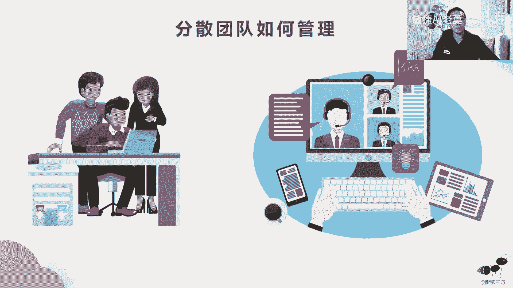

OK所以他要定出各种各样的沟通规则啊，好那敏捷的环境啊，就从我们这个敏捷的环境到这里，我们就已经结束了啊，那我们今天的这个课程就已经完全结束了，那么今天的课程的最重要的一个东西就是三，三五。

就是com3353个角色，三种弓箭对吧，然后五种五个仪式啊，也叫五个会议啊，然后还有这个这个就是那个五个价值观啊，对事不对人，这种我们把这个东西记住了，那今天的内容，今天的课程内容。

我们就学到了下一节课学什么东西，下一节课其实我们要学的是我们的实战，就是敏捷的过程当中，这三种角色和这三个哦，和这五个会议我们怎么融合起来去做呢，到底在实践当中我们应该怎么去做。

然后碰见了这个考试的这些场景题，我们又应该怎么去回答呢，对吧，那具体的这个套路是什么，就是在我们周四晚上的课程里面，会跟大家剖析一下，对吧好，那今天的课程就到这里啊，然后有什么问题。

我们可以在后面的这个这个群里面去聊啊，大家在做题的时候有什么问题，也可以跟我多多聊啊，我看有一些同学已经在我这找我再聊了，好那没有什么，我们今天就先结束，我们下一周，哦不对，我们周四再见，好辛苦。

