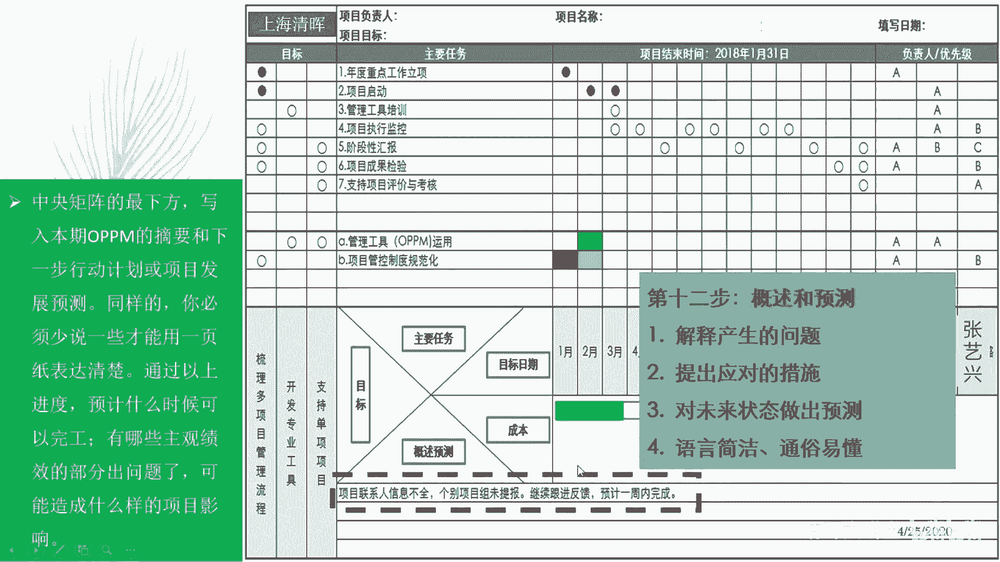
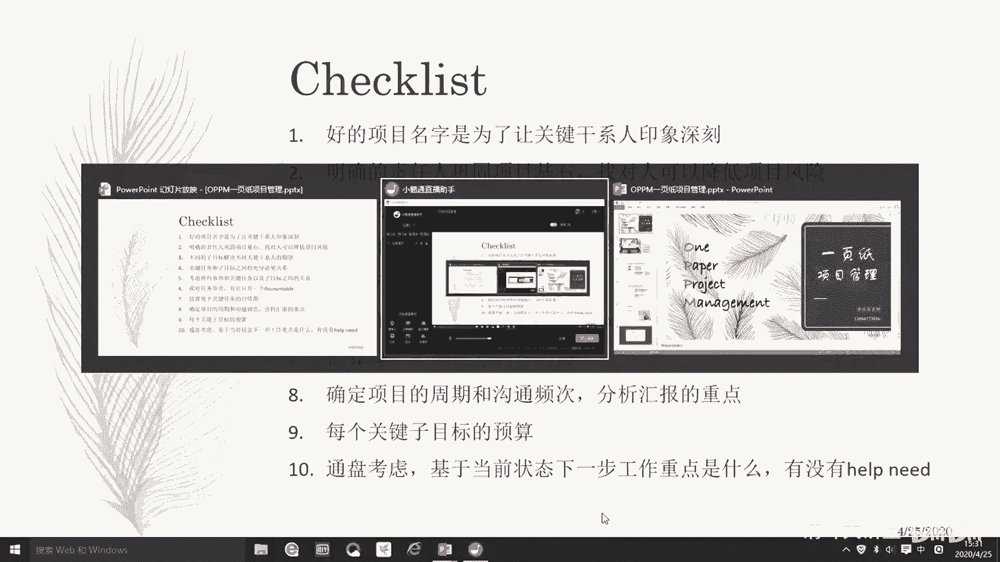
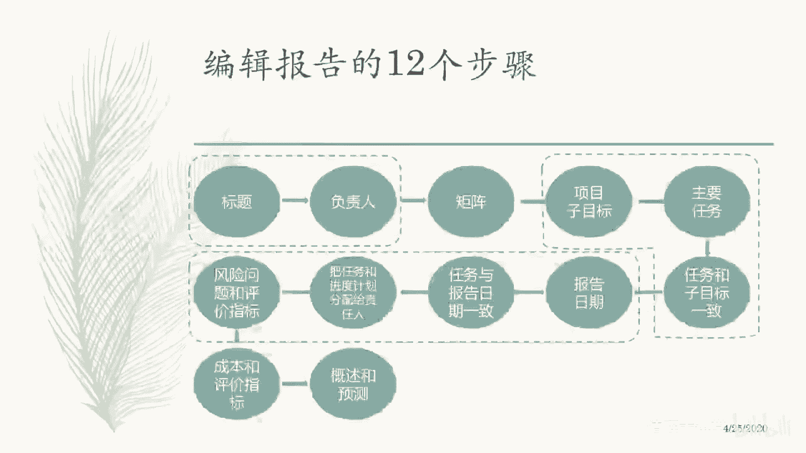
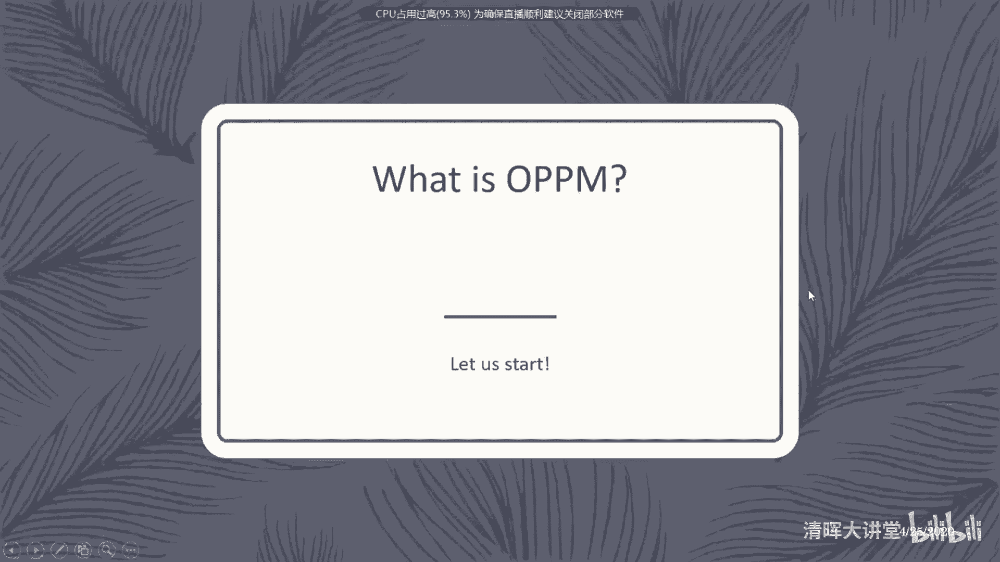
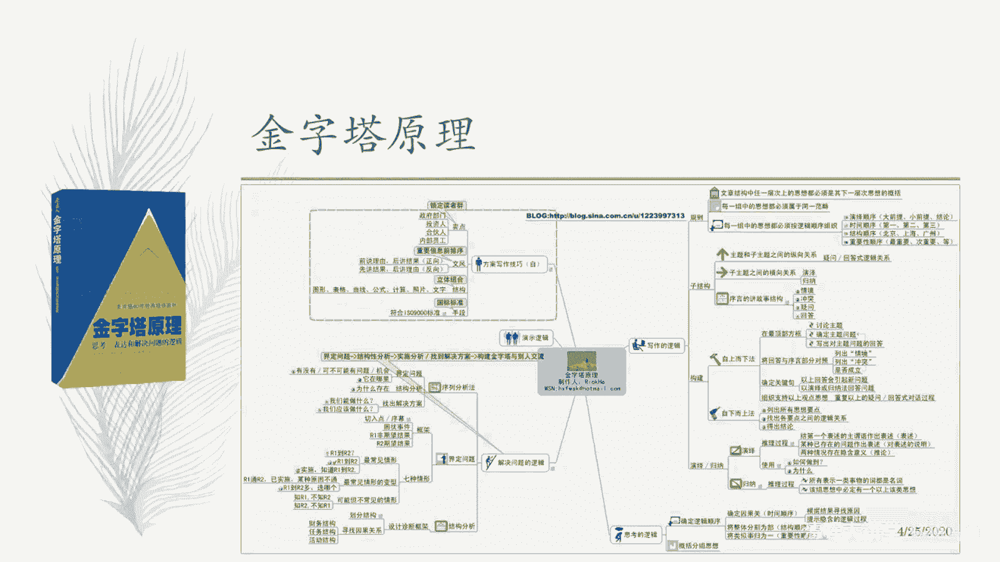

# 🚀一页纸掌握项目管理！60分钟教程，助你高效管理，事半功倍！ - P4：3.用OPPM报告项目的5个步骤 - 清晖大讲堂 - BV12E2JYsEpT

每到一个报告周期，你都应该去更新一下这个填写的日期，然后呢，报告项目提示到当前这个位置的时候，的一个总体状态是什么，包括执行情况和你的什么问题，风险的情况，以及你基于当前的情况。

你下一步可能哪几个重点工作项是什么。

OK吧，那么完成这个东西，然后呢，每个报告周期都简单的用五个步骤，在这个原来基础上去更新，就是当前的这个进展，用粗题表示报告日期，填好主要任务进展情况对吧，黑圈和黑黑黑黑圈，黑圈白圈圈啊，黑圈空圈对吧。

黑圈空圈在风险问题突出什么什么东西对吧，然后指望这个数据的是转化成直方图，就是成本的情况对吧，再或者完成下一步工作看怎么做对吧是吧，哎这个东西你天天跟橡皮筋一样，你能你能没感感觉吗。

哎好然后呢这是我们更新表格的五个步骤啊，对吧好，反正对大家有帮助就好啊，OK然后呢这个叫什么，这个下面就是我们的练习演示互动啊，就到这个环节了对吧，现在03：30，我们差不多讲了一个半小时间。

然后完了之后呢，这个叫什，请各位朋友们啊，尝试在纸上就是应该叫什么，这个我我给夏老师发了个模板，马上让我们在群里面去发这个模板啊，夏老师可以发了，发到这个模板到群里面去，然后呢我们叫什么。

这个马上可以大家可以开始用这个模板呢，其一我们刚才所讲的开始练习啊，这个多给大家点时间好好练习一下，填一下啊，然后呢填完了之后呢，我这边列列出来一个check list啊，我现在就不讲。

然后呢你每填一个去对照这个切割list看一看，看一下叫什么，你填的这个结果是不是，如我们刚才所讲的那些这样的内容一样的，或者有没有碰到类似的问题，或者你有哪些感受都可以对吧。

然后呢这个模板呢可以自己自己，大家可以去调整也可以啊，你要去增加复杂度也可以，或者你要去搞新花样都行对吧，自由发挥，但是我我说一个工作的，我说一个这个工这个讲法，当大家练习一个重点啊，你先把基本的填完。

然后用你你有新的idea再去改模板再去做，大家听懂了吧，你可千万不要还没有把基本内容想清楚，填完了之后，他就开始想心思去怎么去变它的模板，你别干这种事情啊，好OK然后呢在模板呢每个人填一个。

那这个时候我们就省去一些小小组讨论环节了，这个就很可惜，因为小组讨论过程中，大家会有一个更深刻的认识，这个激荡啊，特别好，那现在没办法这个条件，那我们就各自同学们去练习。

然后每个同学呢拿一个生活中的小事啊，拿一个生活中的小事去填一下，然后完了之后呢，我们大概花个30分钟给大家去填啊，或者是20分钟对吧，等会我们请夏老师再这个叫什么，这个15分钟之后看一下大家的填报进展。

然后完了之后呢，看一下我们到底是给大家20分钟时间，还是25分钟还是30分钟对吧，就是说大家全部都写完了之后呢，然后呢请各位同学们呢发到群里面来啊，就是发的时候呢尽量是发发图片。

你不要发整个excel了，就发图片就好了，发图片发图片进来之后呢，我们可以直接去看到，看到这些内容，我们挑几个挑几个，我来看一看，挑几个典型的我们来讲一讲对吧，挑几些点讲一讲。

这样的方式呢再帮大家巩固一圈，OK吧好，那就请大家接着什么开始练习吧好吗，正好03：30啊，非常准时，请大家开始练习吧啊这个叫什么，在线的所有同学啊，表格里面每如何根据每一个任务的执行的进度。

就是用颜色标记嘛，就是摆去摆空心圈涂黑，就代表这个任务已经完成了嗯，就这个意思表达执行的状态，大家都练习一下吧啊都动手练习一下啊好吗，大家都综合练习一下啊，这个这个这是个好机会啊。

就咱们就花一点点时间就可以，就可以有这个这么有收获哦好吧，那我们就把切割例子放这边，然后大家再练习一下啊，Ok。

怎么样，大家做的怎么样，不着急啊，这个咱们现在时间还没充裕啊，这么卡哇伊啊，丈夫为什么会有两个妻子，为什么会有三个，大家都做的怎么样，不着急啊，主要是练习啊，这目的不是为了为了叫什么做而做啊。

他就是在做的过程当中，你能够把你项目里边的这些事儿啊，把他的关联关系能梳理清楚，这是最最大的一个收获啊，lily这个同学啊，我来看一下啊，好，首先呢，你这个项目的名称呢是西红柿炒鸡蛋的制作嗯。

非常的清晰，项目的负责人呢是爱人对吧，项目目标适合六岁宝宝，适合六岁宝宝，这是项目目标好，那么为了适合项目的这个目标对吧，你首先要找这个给宝宝提供这个食物的责任人，对不对，妻子吃的对吧。

那还有就是丈夫对吧，这是主要责任人，先把人找了对吧，那么初步评估的话，妻子负责做丈夫呢，负责带孩子和买菜对吧，这样的话这个这个项目才能达成，对不对，好目标里边啊，适合宝宝，做目标的一个分解啊。

做目标的一个分解，那食材新要适合65吧，食材新鲜肯定的对吧，嗯子目标清洗干净，就感觉像是个动作啊，不像这个结果吧，口味清淡嗯，就适合六岁宝宝了，那一样吗，所以是用食材新鲜代表营养是吧，感觉好像是分解的。

不是此目标，就是你没有，就说你可以这么去看吗，刚才不是说过了吗，适合六岁宝宝是不是实在新鲜干净，口味清淡，就适合六岁宝宝呢，就如果说你认为是这样的话，那那当然没问题啊，就是这宝宝如果觉得合适日新签对吧。

然后项目的这个叫什么，关键一个责任人是那个叫什么，是关键的一个叫什么，这个这个花钱或者叫什么用户是宝宝对吧，他还喜欢适合他还喜欢，如果他不喜欢吃怎么办，哈哈哈哈嗯好，然后呢，这个总目标分解开。

不管怎么样，我们先按这个意思来啊，就是新鲜，就是叫什么，吃完不会拉肚子，干净也不会拉肚子对吧，口味清淡也不会拉肚子，都是为健康来的，都是属于叫什么不会造成伤害的这种营养啊，营养的话可能新鲜也有一点吧。

感觉这个这个好像说的嗯，差那么点意思啊，适合六岁宝宝把它展开之后，什么是社会类的宝宝，我要重新定义一下，你是从食材和从成果角度入手，但是但是但是这个食材或者成果有了之后，能够从哪几个维度去诠释。

适合类似宝宝这个事情对吧，这个很重要，嗯食材新鲜，然后呢跟食谱学习有有关系，这个这个有关系吗，食材新鲜跟食谱学习有啥关系，我不太明白，食材购买这个倒是的，食材购买为什么要跟清洗干净相关啊。

这个感觉感觉你写的这个食材信息限制定，不像是个目标，像是质量要求，像是质量要求啊，但是我不能一定说质量要求它不是一个目标，但是我觉得更像是更像是一些详细具体的要求，对吧，嗯然后呢你食物谱学习和食材新鲜。

这个确实感觉好像没有什么直接关系，明白了明白了，你这个过程当中的话有很大的一个点在，就说你的烹饪过程要是那个叫什么，这个烹饪过程就是换句话说要烹饪出一道，就是说嗯叫什么这个合适的菜，就是说既不会糊。

也不会淡，也不会咸，或者就是对这个烹饪过程有一定的要求对吧，我我大概明白这个意思了，但是呢你这个烹饪过程要求里面呢，又没有把这个子目标给明确的显现体现出来，所以导致你写的任务的时候呢。

大多是强调这个过程要是叫什么这个呃，这个叫严谨的，靠谱的，然后安全的，并且是什么这个这个这个科学等等这些东西，但是呢你做了这些事情之后，你要给你要带来的这个结果，又好像又没有把它说的特别透。

所以呢没有舔出来，你做这些事情能够适合任何宝宝对吧，比如说换句话我们再用另外一种方式来倒过去，反推嘛，因为这个很重要，确定目标和这个和子目标以及任务，这个过程它就是个关键分解的过程。

你要从上往下能够找到一个支撑关系对吧，这个才能够让你把这个项目给做准了，这个很这个思辨过程很重要对吧，或者换句话说你这个坐在里边呢，食谱学习购买，清洗料理这几个事情呢，放到所有的这个菜。

都可以按照这个主要任务去做，对不对，是这意思吧，要么就说你说这个食材新鲜，你的主要任务就是说叫什么，这个到某某菜市场对吧，什么什么限蔬菜去买买，那个叫什么东西啊，达到达到什么这个叫什么，这个那就叫什么。

这个颜色泽怎么怎么样的一个东西对吧，这是个主要任务，对不对，那这个就跟你的食材新鲜就非常的吻合了，是这意思吧，就是说实在购买的事情，你要把这个关键任务要说清楚嗯，这个讲的这是我的看法啊。

另外就是在咱们项目里做计划的时候，我我多说一点啊，不是说你啊多说一点，我发现公司项目你做这个项目计划时候，动不动就喜欢写那些非常general的话，就是这种啊项目规划啊，项目这个KO啊，项目执行。

项目检查，项目验收，项目交付，哇塞每次做计划做成这种东西，我就觉得那我嘿嘿，那我还要你相信你干啥，真是的，这个这个大家都知道对吧，关键是你怎么做的呀，你怎么体现出来，你这个目标我怎么信得过。

你把这个任务交给你做呀，你一你的规划是啥，怎么样能够把这个目标给支撑起来对吧，就是你要稍微写的，让你的这个管理者上级你也向上汇报嘛，向你管理者看到这个你的计划里面，是能够把那个意思给体现出来。

那个支撑关系给体现出来，他就觉得你的计划做的靠谱，这个scope合适对吧，咱们不能写那种太尖那的流程性的东西啊，当然是个练习啊，是个练习，那么主要任务主要的任务的这个想法，问题是说没有新鲜的食材对吧。

那是一个风险对吧，那么在食材料理时受伤去做的过程中，可能叫什么，这个由某些特定因素导致中断了对吧，那好然后呢这个叫什么这个执行的状态啊，那你可能用这个红黄绿来表示，执行的顺不顺利对吧。

用这样的方式来表示这个这个叫什么，这个这个执行的情况，然后呢又把这个问题做显性的，定性的一些显性的问题，单个的问题体现出来对吧，然后呢，这个时间你的目标日期呢写的这个东西呢，是按照叫什么九点09：30。

9。5，100：10分啊，就20分钟的方式，一个KDINGS对吧，又10。35，嗯这个时间目标目标日期这个点呢，其实我们建议呢尽可能是均匀的，因为主要是要汇报的沟通，但是这个年有点感觉。

好像没有体现出来这个沟通的这个必要性啊，就是在这个任务里面，比如说A这个任务实务实务学习的时候，只是妻子去做，负责去做就行了，那妻子要向谁汇报或者向谁沟通呢对吧，所以这里面最好得有一个这个这个叫什么。

这个这个叫什么项目的负责人对吧，换成另外一个人，不是自己又去做某个工作，就像具体团成员，某个accountable去做某右侧的这个项目经理，所以你这完就出现这个问题，你应该会不会下。

比如说是自己的妈妈呀，爸爸呀对吧，他作为一个监督者，你向他汇报对吧，向他告诉我做的这个进展怎么样对吧，他们给你指导，那这样才有汇报意义，不然的话你又是负责人，又是做的人，自己跟自己汇报。

那就失去沟通的意义了对吧，这是1。2，OK然后费用的情况下大概是列了一下对吧好，我觉得这是个练习啊，没关系，就是这个过程当中，我相信就是，哈哈我我说的对吧哈哈，这个很正常很正常。

因为我们现在就是在训练自己，有目有目标为导向的意识，这个目标为导向，是最容易让我们平时做工作的时候，是按照工作操作手册，按步骤的方式去理解问题，这个叫法是其实这两个方式是不一样的，刚才不是讲过了吗。

所以像你要训练自己这个思维吗，好我们再来看其他同学的啊，这是个练习啊，大家不要有压力啊，就是咱们就聊一聊，谈一谈啊，好看这个PDF这个同学的啊，嗨呀，这个做的挺好的挺棒的，excel好。

穆sama mosa mask，马，然后呢项目的名称是改善物业服务质量与效果，改善啊，这是一个这是很重要的一个点，就是你要能体现出改善的效果对吧，项目目标要业主打五分，那我上来就要质疑你了。

这个你你这个咋呼应啊，你这项目打五分就改善了吗，是不是啊，亲这个呵呵，我个人虽然我不懂这个行业啊，但是从你的这个表述上看，你上来就被别人质疑了，啥叫改善啊，就是说业主从原来的几分提高几分才叫改善吧。

这样才能够呼应起来嘛对吧，万一又是之前打的就是五分，五分是中等分，满分十分对吧，或者说一周以前打的就是五分，现在还是打五分，人家保持嘛，改善肯定要提升嘛，要把提升那点提出来嘛。

所以你的目标就让他跟名称呼应起来，业主打分平均提升0。5分哎就差不多了，对吧好，然后完了再看一下下面其他的啊，这样看下啊，哎呀有点不是很清楚啊，嗯好改善啊，第一个卫生无卫生死角管家服务改善意识增强。

这子目标对吧，嗯诠释就是因为这几个点业主打分能提高，对不对，这是合理的啊，这个倒是蛮蛮蛮分解的，这个就很具体，就是对，这就是叫目标分解嘛，就是对吧，这个结这个目标一定是项目成果，目标不是项目管理目标啊。

这咱们点那个前面说过好多遍了，可可不能把这个线混为一谈，然后呢符合smart原则的目标，符合smart原则的目标哦，这个这是要求啊，这个这个这个不是啊，就是上面一个微生物视角管家意识增强，可以啊。

这个我觉得做一个分解的话没问题啊，挺好的，很具体，然后呢要卫生无死角，跟什么工作相关呢，跟啊叫什么，管家服务态度及，什么是什么，是方式调调什么调优，还是调整了微生物死角跟管家服务的态度，方式调整是吗。

是调整吗，微生物思想和他的态度有有，这个能就是这是有关联关系吗，这个我不确定的啊，小区卫生及层管理环境整顿，这个跟哪个相关呢，跟哪个目标相关呢，然后呢小区业主互助活动举办意识增强是吧。

做这个事情能够提升观察自然意识，活动举办应该是有反馈收集吧，应该是这个意思吧，你把这个话得逻辑得说出来，就是你做这个活动的目的是啥，以结果为导向吗，结构化以结果为导向吗，业主导位分提升对吧。

卫生无死角和管家服务态度加强，他们就分数提高，那么怎么样卫生卫生物不死角呢，就是加强什么什么管理整顿对吧，环境哦对应该是第一条管理整顿，这是的对上是吧，第二个就是叫什么这个这个叫什么。

这个做一个切割list的，或者做一个检查，让这个卫生无死角对吧，也是一个重要的一个举措，诶，看得出明显有呼应关系，明显感觉到这是可行的，靠谱的对吧，第三个呢就是意识提升，这很重要。

比如说小区业主举行某个活动，请大家这么提议，集思广益对吧，收集出来，并且什么形成改进呃，具体的规章制度对不对，然后呢完了这个叫什么这个定期什么，这个这个叫什么，对管家进行培训对吧。

这个东西这都是跟你的能力是提高，是有直接关系的啊，这个其实最重要的其实就是看项目，主要是看前面这几个点，你这前面这几点说通了，自己想明白了，后面其实都是都是execution的问题对吧。

那是学你基本功了，你前面如果目标定的有问题的话，后面就有问题，好问题分析里面啊，小区域小区环境及卫生监督啊，卫生维护不不不什么东西，不不不什么，为什么有的什么无法及时调整，就感觉说的好含糊啊。

什么叫有时啊，你能不能具体一点，就是对咱们描述不能用这样的方式，这样的话会让别人觉得你的沟通只说到了一半，或者说就是说让别人想听下去吧，感觉好像又不知道从哪去获得，进一步的具体信息，你说不听吧。

就觉得事情其实挺重要的对吧，就是感觉这种描述方式，这种是描述方式不是很好啊，我个人个人感觉就是还是要拿书，拿个具体的事来说，这个事就摆出来之后，它的意义大家基本都能看清楚对吧好，然后呢。

管家对自己的服务和方式很满意，什么不足，那比较很满意，就是叫固步自封自负对吧，或者叫他不不听举，只是太乱，配合上不支持，这也这是个挑战啊，那这个东西影响到哪个目标实现呢，影响到他的管理意识。

加强那个目标对吧，所以你应该把圈放到那个第二列上去，就这个风险，就是B1的那个那个那个风险发发生了，会对内目标实现起个什么负面的影响啊，小区活动组织困难，小型活动组织困难。

这个感觉说的像是个problem，不像是个issue，你知道吗，我们一般谈问题管理指的是issue，你说的这是个problem，在我们的生活当中啊，有非常非常多的problem，比如说我没有钱对吧。

比如说我不够帅对吧，或者不够就不够聪明对吧，这都是problem，对不对，这东西呢会永远一长久的伴随着我们，有时候影响很大，有时候影响很小对吧，我们在意它，它影响就大，我们在意不在意它，它影响也就小。

这个每个人都会面临problem，这个problem不一定能够完全解除掉，消除掉，我们只能缓解它，但是医术不一样，医术是一旦发生了，就会得，就会就是非常会对你项目造成负面的影响。

而且呢这个一旦发生事情呢很具体啊，所以我们才要去定义问题嘛，所以问题完里面第一步在定义问题嘛对吧，你问题是啥啊，什么是问题对吧，就是这个问题管理的这个这个概念呀，你要强化一点，我跟你说的这个难易主的事。

大家都觉得很多事情是难以组，大家也能想象的到，但这是一个problem对吧，你应该具体说叫什么小区，因为业主时间难以凑到一起对吧，所以导致我们的这个会议，有时候可能不一定会压的足够多的人啊，打让效果折。

效果打折扣，这可能就是一个医术了对吧，哎这个这个是比较具体一点的，你你要把这个点说出来对吧好，这个就排的是计划，然后圈圈，然后完了之后呢，在这个叫什当前进展是14号对吧，这三个问题呢都是皇室状态有风险。

但是呢还是可控状态对吧，然后呢这个找到责任人，张三李四王五赵六田七对吧，这些人都是什么这些这个事情的负责人，为什么你一共就四个任务，会有七个会有五个负责人呢，这是为啥，直接改一改啊。

这个负责人不该有那么多啊，最后呢是预测啊，什么什么什么业主，设置啊，我猜测应该设置业主投入建议什么东西，对好的建议与意怎么怎么怎么的对吧，那么意味着意味着这句话呢，就是说应该对你项目管理而言的话。

设置这个东西，那么括号或者后面加一条啊，下一步准备由项目里提交这个变更，或者提交这个倡议出来，来添加到我们项目计划上来，就把项目计划增加一条，设置这个什么什么东西来支撑这个东西对吧。

公开服务怎么怎么的一个什么一个结果，那是不是新的举措呢，是不是也是变更呢，如果是变更的话，你都应该在下个阶段里面，在下一次报告里面，应该把scope进行一个更新对吧，代表就是上次没有的。

这新增加的一些工作范围内容，这样的方式，你的这个问题才会去避免对吧，OK好，大概是这个意思啊，大概是这个意思，嗯大概是这个意思啊，好再往下啊，大家继续填，我们继续讨论啊，可能大家对这个模板还不是很熟悉。

没关没关系，不着急啊，这个这个这个目的不在于就是说啊，目的还是让大家能够熟练一点啊，就是这个掌握的这个这个思考你的方式，这个很重要啊，项目负责人是这个人对吧，项目经理是他对吧，那么妈妈爸爸和小姨嗯。

然后完了之后是全家啊，5日有计划嗯，全家5日游就行了，为什么要计划，就全家5日游项目就是呵呵事情吧，项目不是一个文档对吧，项目对吧，项目全加5日游就行了，全家无人有目标，就是要开心开心。

要什么玩开心吃开心玩舒心对吧，可以没问题啊，好我们看你分解关系啊，就是说白了就就是叫什么这个嗯，其实说白了就是吃吃的开心，玩的开心两个嘛对吧好，你看你把这个目标分解变成了任务分解了。

这是你最大的第一个问题啊，我这个直白的提出来了啊，提前定好旅游所需要的事项，这是一个目标吗，这是一个手段吧，嗯大家对这个项目管理里面目标的这个定义啊，我感觉都是一个大短板，技术工作这么多了。

感觉就是说你做了这个事情之后，预计会带来什么结果对吧，这个结果呢又是最终你实现你的这个叫什么，项目标，是有帮助的，就说你要去诠释开心吃开心玩开心，你怎么样才叫开心对吧，是听明白意思了吗，等一会啊。

这段我觉得要讲一下，不然大家感觉话也会陷入这个问题里面去啊，咱们几百个人的同学怎么就花了这几分啊，是时间不够吗，还是大家都偷懒呢，好我来说一下啊，这个这个意思啊，就是说什么是目标啊。

项目的项目的这个未来的状态，用一种简要的方式就是用smart的方式去描述，这是项目的目标，我再说一遍啊，我再说一遍，就说项目未来的一个就是项目完成之后，未来能够给环境或者现实，或者用户带来的一个状态。

用smart的方式去描述它，这就叫做项目的目标，听明白了吗，未来的一个状态，用smart的方式去描述它对吧，你说老师我能不能不用smart，用别的方式可以啊，目的就是说让那个目标能够尽量能够达到。

目标的一些特征要求，就是具体一点什么这种之类的对吧，未来的一个状态，OK好，这是第一个啊，这是第一个，第二个啊，第二个呢就是说我们一般定这个目标，做目标的分解，就是目标和目标分解间呢。

往往是一个权势的关系，权势关系就是解释关系，我给大家举个例子就行了，大家所有人听好啊，举个例子就行了，什么叫做这个叫权势关系呢，我看一下我的这个直播，正常的吧，OK好，什么叫权势关系呢。

比如说每一个人呢都希望自己的家庭幸福，对不对，每一个人都希望自己的家庭幸福，意思是说呢就是每个人都有空，都有这个叫什么同样的一个愿景对吧，同样一个目标，但是呢每个家庭对家庭幸福的定义是不一样的，对吧。

比如说那个叫什么某个家庭里面，家庭幸福是一个大的一个目标对吧，然后完了把它分解下来，成子目标具体一点，比如说希望男主人呢这个叫什么，这个升职加薪对吧，那么升职加薪就是你今年的今年的目标。

比如说整体什么薪资提高1万对吧啊，然后完了之后叫什么东西啊，这个这个这个这个岗位能升升个一级对吧，这种之类的就是升职加薪是一个目标，第二个目标呢是那个叫什么东西啊，这个这个叫什么鬼。

比如女主人的给她的目标就是貌美如花对吧，哎对你挣钱养家，她貌美如花，对不对，就考试用考试来衡量标准对吧，给老人的目标呢就叫什么东西啊，这个叫什么这个这个这个这个给老人的目标呢，就那叫什么东西啊。

这个这个这个身体健康吧，对身体健康啊，用体检来做衡量标准对吧，那么这是我们的目标，衡量的标准分别是体检考试对吧，工资条对吧，然后叫什么这个这个什么这个叫什么这个啊。

别人的称赞的次数作为这个项目验收的标准，衡量目标嘛对吧，衡量目标的方法嘛，那么你是如何达成这些目标呢，这些子目标你如何达成呢，比如说这个叫什么老公在在工作上，这个叫什么，这个叫什么东西啊。

这个更积极努力一点，然后呢去学习一些这个叫什么知识对吧，然后那个叫什么东西啊，这个这个在工作上能够更好的去符合，领导的要求，什么这种之类的对吧，这是我们的一个点啊，这是我们这个点。

第二个呢就是说女主人呢貌美如花，比如说她的action或者她的task呢，就是她是那个叫什么这个健身呐，叫什么用护肤品保养啊对吧，去美容院呐做身体啊这种对吧，那这是可行的action对吧。

能够呼应支撑这个目标，那小朋友呢叫什么目标，是考试多少分以上提高对吧，那么怎么去做到呢，比如说小朋友的那个叫什么东西啊，这个这个这个这个学习啊，报个学习班啊，兴趣班啊，或者是叫什么这个上课叫什么这个嗯。

上课完了回来之后就讲嘛，父母可以问他些问题，今天的让他讲讲讲上课的内容啊等等这些东西，这是一个点啊，有老人身体健康对吧，可能的话是体检，体检上绝大部分都是正常的，那么这个叫什老人的，这个叫什么。

这个达成健康的方式，那就要注意了啊，大健康方，比如说锻炼身体啊，适度的锻炼身体啊对吧，然后在这个注意保暖呐这些action，所以呢意思是说幸福呢是一个大的目标，我们要把它转化成具体的子目标。

这些子目标是可以通过action，通过你的task去实现的，你只有这样的方式，你的项目才不会偏离他的最开始的初衷和轨道，我们管这个东西呢叫关键分解，知道吗，大家听明白了吧，所以这个点是这个点。

就就是我们需要去学习和提升的地方啊，然后呢回到这个同学，这个小fly还是FA这个这个你呢首先上来呢，这个目标就定义错了，你把action变成了目标对吧，准备好这药品就可以。

而且把这种这种叫什么这个叫什么，预防有问题的预防性的措施变成了目标，这个不是目标，你准备好药品就能够这么吃的，玩心开，玩得开心吗，不是吗，这只是个只是个必要条件，它不是个充分条件吗。

而且他不是个结果对吧，所以呢你要吃得开心，玩得开心，而是说你要去诠释这开心，怎么怎么去叫什么东西啊，这个叫什么，这个带来比如说详尽的计划对吧，哎详尽靠谱的计划对吧，然后呢第二个指目标呢就是说叫什么。

这叫什么，这个叫什么东西啊，这个呃在景点有游戏环节，或者有一些什么这个什么一个环节设置，哎，有有玩乐的，这个叫什环节设置对吧，第三个呢叫什么，这个目标就玩的开心或者是什么，这个就用心就是说叫什么。

这个这个目标是说比如说这个叫什么东西啊，这个，这个住宿达标对吧，住宿住宿就是衣食住行达标对吧，就是玩的开心舒心了对吧，毕竟你要把这个目标给描述出来，具体的描述出来啊对吧，或者第四个叫什么东西啊。

这个比如说有一些家人共处的环节，这样就更加温馨了对吧，那捐人环节环节具体是具体是哪些action，比如在一起吃饭对吧，在一起划船，这就是action，你就用这样的方式。

才会让你的项目跟你的上级汇报的时候，觉得哎你听的你听的这个idea吧，叫什么玩的开心痴，还确实有必要嗯，值得做，领导一听就觉得嗯是个值得做的事情，那你怎么做呀，你首先解释一下你这个目标是什么。

是啥含义啊，含义完了你再去解释下你怎么做，能够实现这些含义啊，咱们得把这个关系给理清楚明白吧，OK好就就简单说到这个地方啊，好好再看卢鑫同学的哎，感觉这好像比较那个什么一点啊，这个用的是专业的东西啊。

好技术负责人对吧，项目名称智能电柜交付嗯，项目目标交付电柜给用户并验，并确保验收，这是上目标是吧，嘶感觉像是一个里程碑呀，感觉描述是个里程碑，不像这个项目标五理解这个叫什么，项目标是嗯，我理解一下啊。

就是智能电棍交付对吧，比如说应该这么说嗯，项目标是智能电柜达到叫什么多少多少瓦，到多少多少瓦的运行的，这个这个区间是多少个小时，运行是正常状态，这是项目目标结果的状态，把这个说出来啊。

你那个交付电位的验收，这只是一个动作，代表你这状态达到之后，你自然而然就会产生这个动作，或者这个动作来去表征，这个这个这个这个这个这个叫什么，这个智能电位的状态是这个意思，明白了吗。

这项目标不应该是一个，不是不应该是个项目管理的活动的一个名称，而是一个结果的一个状态，你反复去琢磨这句话啊，项目上指的是你项目结果的一个状态是什么，因为你项目就是一次性过程，就是为了交付成果嘛。

就是为了给评价提高嘛，好然后完了之后呢，这个叫什么，这个完成所有原材料采购嗯，完成所有原生态结构，所有电柜完成成套就集成的意思是吗，检测电柜质量，感觉好像又是在说这个叫什么。

这个这个这个动作不断的说目标，那你为什么要检测电位质量啊对吧，因为见过质量达不到不验收，那换句话说那你的目标是什么，什么样什么样的标准，他才是叫什么质量质量标质量的，这个叫什能验收吗。

你不能拿个动作作为一个目标吗，哼动作本来就是要去做的对吧，比如检测质量，你这边应该是质量目标达到多少多少伏，或者什么这个这个运行时间不出错，不跳闸是什么一个一个标准要求，不写下来不就行了吗对吧。

所有的电棍完成成套和什么原材料的这个采购，你应该是说就说叫什么东西啊，这个叫什么，这个目标是说，电柜的所有的设计功能均已实现对吧，这个电棍的所有设计功能均已绝，均全部都实现对吧，然后呢这个叫什么东西啊。

这个叫什么啊，这个这个完成所有的原材料采购啊，我觉得这个感觉好像不是个什么目标，好像是个是个过程中的必要的一个条件啊，我觉得这个方面活动比较好，这就不就是说白了，就是你把这个功能设计工作都聚集都做完了。

然后完了之后呢也达到硬核标准，达到质量标准，这就是你的这个这个工作对吧，就是这是你两个怎么样，其他都不是的对吧好，那么叫什么这个啊，然后完了之后呢，就叫什么，这个这个主要任务里面。

就是如何去教什么东西啊，这个看我们的质量能够达到标准对吧，那换句话说呢，就是说啊，你要安排质量人员去设计这个质量标准对吧，你要安排这个质量控制人员去测试和控制，这个检查这个控这个这个产品的质量。

你要去叫什么东西啊，这个这个这个叫什么东西啊，这个哎啧这个叫什么，比如说去做质量控制的工作对吧，必须把这个确保结果得到客户的认可，这三个事情是你跟你这个达成这个目标相关的，对不对。

第二个呢就是完成所有的设计工作呃，完成所有的设计要求对吧，或者完成所有的设计功能，那么首先呢你要找，你应该有个电位的设计工作对吧，设计图完成这个电位设计图，第二个呢就是想把设计图得到评审对吧啊。

再就是叫什么东西啊，这个这个这个拼成完了之后呢，就说这个叫什么这个开展这个叫什么这个嗯，电规的叫什么这个这个这个样品设计，或者什么这个这个这个这个开模工作对吧，然后去采购干什么那些事情。

把这些工作完成了之后呢，你你的整个设计工作才全部完成对吧，就这样一个分解关系，这样的话呢，你的这个目标和你的子目标和你的这些任务呢，就形成一个叫什么几个支撑关系了，好风险里边呢供应商货期较长。

这是一个风险，是那你那你换句话说呢，那你那你去应对这个这个这个风险呢，应该有一些相关的一些措施对吧，货期较长，比如说分两个供应商对不对，防止垄断，分两个供应商对吧，比如说那个叫什么东西啊。

这个这个这个这个叫什么，这个货期较长对吧嗯，比如说啊这个叫什么，这个这个换其他供应商换材料嘛对吧，这都是叫什么这个这个可以去应对的措施，那你这个措施里面呢，你下一步是有没有呢，有没有应对措施呢。

还是说你上面的这主要任务里面，你有些任务就是说叫什么，做一个叫什么这个呃，能够去灵活调整供应商的和叫什么，这个这个有备有备品供应商，在市场上提前做好这个供应商集合的。

备品供应商的这样一个什么这个采购计划对吧，哎这样可能就是个应对措施啊，是一个主要任务对吧，那么当风险发生的时候，就启动这个任务，对不对，然后图纸不清晰对吧，这也是个风险，所以呢你要去做评审嘛。

那不正好对上了嘛对吧，然后一个是红色，一个黄色对吧，代表的状态，然后呢这个项目的这个频次呢是一天沟通一次，就一天开一次会对吧，因为这个比较具体，可能就是要20天之内把事情完成对吧。

然后呢相关的负责人分别是采购负责人，电气负责人，商务负责人，技术负责人，嗯这个我觉得感觉好像是蛮蛮夯实的，这个也符合题意啊，不管这个合不合理，我因为我们没办法去从你专业上去评判，但是呢看上去是蛮合理。

所以从ABC上看是比较合理，第二个呢，这几个角色里面，跟这些器件呢基本上对照不上的啊，OK啊OK这是我的一些看法啊，我的一些建议啊，这是我的建议好，然后下一个啊，等一会我来看一下鲁迅啊，小白的小白的。

这是王二项目标，没有项目名称，核酸检查，这是个虚拟的小事情对吧，项目标你可以写到完成检查呀，这也行啊对吧，就完成检查就行了对吧，那完成检查就是你的就唯一一个子目标对吧，就因为事情太简单了。

没有什么目标分解对吧，就是去完成检查就行了，或者叫什么东西啊，这个安全的完成检查对吧也行，那意味着说你完成检查之后呢，你还要有另外一个目标，就是要什么确保你的人身安全对吧。

这个目标的话通过一些这种穿防护服啊，戴口罩啊，注意人群隔离啊，注意排队间隔啊，这些任务呢就去支撑起来对吧，然后这些任务里面呢又是一种附属，附加性的任务，为了防止你安全的，但最主要的任务需要去先挂号啊。

先去这个怎么怎么的呀对吧，这是你的主要任务，对不对，所以呢你的项目标应该是你可以写完成检查，或者是什么安全的完成检查，那意味着你指标有两个，一个是确保安全性，一个叫什么，这个这个叫做完成工作对吧。

完成检查工作，那么安全性的话就有一些附加性的工作出来，比如说这个口罩号啊什么的，洗手啊这之类的对吧，那么完成体查了就有些工作啊，就这个意思好，然后预约时间对吧，怎么怎么怎么的嗯，这些都不完整啊。

大家填的都不是很完整啊，那我觉得是不是可以给予大家时间比较少啊，嗯然后像预预约时间，准备小区出入证件清毒清清理消毒交通工具，去往医院检查核酸对吧，挂号也没有这个这个挂大任务，这个任务太粗了啊。

你的这个这个里面有个小点，就是你是按这个section的方式去写的，没有问题，按照生生命周期这事情的步骤，一个一个段一个段选，而且这个每个段呢这个差异很大，很明显对这个没有问题。

但是啊你这个里面呢没有突出关键部分，就是叫什么东西啊，这个去往医院做核酸检，其实这是最重要的，这个里面要做的一些事情，你准备的周不周全，这个时候就很容易，比如你没带钱怎么办啊，比如说你手机没电了怎么办。

你没办法去刷卡，没有挂号怎么办对吧，你没法出示你前面预约的这个这个信息，怎么办对吧，比如说这个家庭医院如果人很多，那你怎么处理啊，啊是吧，这些哎你对你下面不写了吗，当天预约已满吗。

或者到医院时已经人很多，排队时间很长，你怎么办嘛对吧，所以这些都是关键信息，包含在你的去往医院去做核酸检查，这个里面你应该把这个重点展开对吧，像准备小区出入证，这个叫什么这个清理消毒工具对吧。

这其实都属于是这个出行前的准备，就一条就行了对吧，我觉得这个东西的话跟你去玩英文很简，都完全不是个重量级上的，你觉得对不对，然后呢回家消毒工作对吧，那就事后的一些这什么这些扫尾工作了对吧。

然后完了下下次再去取，就是完成整个核酸检查了，对不对，我只觉得就是说您这个这个写的那个里面呢，放了一个最大的一个值得改进的地方，就是说在主要任务上，你的颗粒度不在同一个层次之上啊，你思考问题的方式呢。

是按时间轴顺排的方式去做的啊，这个我稍微多说一句，还是刚才我们谈到翻了个问题，叫做叫什么东西啊，那个什么思维啊，就是就是叫什么这个经验主导思维啊，就是逻辑推导，就是按自己的这个理性推导，这种思维。

不是那种项目管理的，以终为始的思考思考问题的方式啊，这是我们给你提示一个点好吗，好这边还有一个所谓叫什么，这个静待花开啊，这位同学哦不对哦，这个讲过了啊，不好意思哎不对，近量花开没讲啊，好然后呢。

这个叫什么，这个项目的名称，质量系统实施好质量系统跟管理质量的项目标，通过质量系统的实施，实现产品质量的全生命周期管控，诶这个我觉得嘿嘿这个我觉得好，这个感觉挺挺那啥的，就像是个项目目标对吧。

实现什么什么刚才不是说过了吗，完成什么什么对吧，交付什么什么这些东西对吧，把最后的outcome说出来对吧，这个项目标好，那我看一下啊，这个叫什么这个时间管控啊，第一个呢文件的更新发布。

我假定你是已经鉴定过了啊，我应该算是一个支撑支撑的，怎么的对吧，梳理质量管理体系相关业务流程，那那这是一个动作呀，你做完这个动作之后是为了是叫什么，是为了去建立这个叫什么东西啊。

这个数据流业务流程完之后，是为了去更新这个更新这个文件嘛，所以梳理这个这个动作，他是为了支撑文件发布的，文件发布确实是一个结果，output对吧，它是一个结果啊，其实呢你这个里面呢就叫什么。

这个如果是我的话啊，我会重点突出来一个是质量系统的实施，这个点，就是比如说你说这个质量系统指的是文件系统，没有问题，那就质量文件系统的飞行发布，这是一个什么，这是一个output对吧。

第二个呢就是叫什么全生命周期，就是质量的时候，除非叫什么东西啊，这个全新周期这个东西能不能再诠释一下，我得把它作为一个子目标，把它给什么这个这个给立起来，一个系统的实施，你实现全世界这些管控对吧。

或者你把管控也突出来也行啊，那么既然管控的话呢，你除了发布文件之外，你应该有这集合吧，你应该有培训吧，你应该有叫什么这个检查吧，你应该有审计吧对吧，你应该有叫什么他这个报告吧对吧。

就是你可以再写一个就是什么叫什么，这个把日常叫什么管控机制建立起来对吧，或者是就是类似我的表达这个意思啊，就是你把这一个目标拆分成很几个，重要的子目标，让别人觉得。

你这个目标是通过这几个子目标的实现之后，这个大的一个目标它是自然而然就呈现出来了，就这个意思好，主要任务项目立项选型对吧啊，这个是老生常谈的吧，啊对你这个这个同学，你写的这个方式就让人家觉得这个叫什么。

这个这个就是感觉放之四海皆准啊，就是不光是你一个项目，其他项目也可以用同样的方式，那这样就失去汇报的意义了对吧，你领导会觉得你做的你你你会让你的领导，你会觉得你写的很完整。

让那你一定要觉得说你做的工作是胜任的，而且是无懈可击的，你考你该考虑的都考虑到了，但是呢其实你的老板觉得就是说，这是我给你发的工资，你该做的，他更更重要的是说你如何去支撑呼应我的工作，对吧。

支持你的performance对吧，你写的这东西，他他会觉得说我我敢把这个项目交给你做吗，我感觉有点不放心，哎对吧，你怎么去让我觉得你这个文件能够写的出来啊，你怎么让我就觉得你这个叫什么。

这个这个这些叫什么东西啊，这个实施能成功啊，或者是管控能够实现出来，这是他关心的问题，明白吗，好其他的这个倒没什么多的点啊，就是排这个直接进度计划，这个列下行了，培训效果系统培训效果对吧。

嗯是一个风险好吧，然后也是四有567月，就是大概要花多长时间啊，那么那么那你那你嗯，那你就是这个时间，可能到来年的4月份结束对吧，然后完了之后调研啊，工具啊，这个这个写的挺好的。

这个感觉像是有考虑过的这些工具对吧，然后这些人分别负责什么事情，有三个人对吧，分别负责，为什么为什么为什么系统测试系统上线，这个有两个BC没有A呢，哦这个我也不太明白，是不是你没有理解理解意思。

就是每一个任务至少有一个A，就是就说就是有一个负责人，如果有多个A的话呢，就把这个A变成BC，就是把这个A呢排个一片级，就这个意思啊，不是说你的点感觉像是说这个张三李四，王五他们在这个任务。

他们在这个任务里面，张三他就是一直偷偷完整的负责人，李四呢是次要负责人，王五呢是在次要负责人，你把这个优先级先定下来了，然后呢再分别分别去负责这些事情啊，这个我觉得呢，这个这个可能跟设计这个。

咱们这个这个的设计意图可能有点不太一样啊，但是如果说你们公司或者你自己定义，这样就行得通的话，那也行啊对吧，那么就看这里面没有人遗漏就行了是吧，确实没有人，这个这个任务里面除了那个叫什么东西。

这个叫什么，第十个没写以外，其他都有人去负责的啊，这个也没什么说的，但是感觉跟我们讲的这个不规范啊，好就先说到这个地方啊，Ok，那我来找找看啊，这个这个这个这个这就比较多啊，然后这个同学是叫做什么。

这个嗯嗯普建军可能是这样啊，就是钓鱼竞赛活动嗯，OK好钓鱼竞赛活动啊，然后完了之后呢，这个叫什么这个项目名称，钓鱼竞赛活动向目标公司团建，哈哈这戏又是老问题了，这个你要么就写项目的名称是公司团建对吧。

冒号或者破折号钓鱼活动，你项目目标，你团建团建出来一个要团结出什么效果啊对吧，实际上希望大家在这个团队过程当中，是能够叫什么开心还是叫什么减压，还是那个叫什么东西啊，这个有收获还是怎么怎么的。

这个叫项目目标，明白了吗，这个不是说不是说你说一个事儿，就项目目标，因为你团建本来就是个事，它不是个状态啊，这是我我体力第一个建议啊，第二个是说好团建吧，就假如说你希望这个叫把这个大家能够叫什么。

通过团建活动能够就是叫什么，这个你看你果然你看你看你你的这个叫什么，就此目标把你的目标体现出来了，增进认识，丰富生活对吧，然后完了叫什么东西啊，这个促进交流对吧，而且交流跟这个叫什么东西。

这个增进认识是不是有重复，这个也要注意一下是不是这个目标目标，其实这两个目标也包含关系对吧，把这个叫什么这个目标变成一些具体任务去做，其实呢说白了就是让大家这个叫什么放松嘛，第一问呢是这个叫嘛。

这个叫什么东西啊，这个丰富业余生活可以啊，这个写一个比较这个OVEROVERALL的这个也行对吧，然后完了能增进认识这两个目标就行了对吧，就无外乎就是相当丰富生活，第二个呢增进认识这两个点啊。

然后呢主要任务里面啊嘶啊主要任务里面啊，主要任务里面呢就是说比如说比赛通知对吧，启动也意思就是说我们要去做个比方，就决策做的这个我觉得特别好，就说呢很具体，这个我觉得就是好的好的。

就是说我们不是写那种非常简陋的方式，而我要做一个这个这个活动的一个启动工作，那就放在这个所有人都都都都都叫什么，觉得就是感觉好像是废话，但是领导一看说，哎，你通过一个别的通比赛通知的，这个什么这个编辑。

并且发布对签合或者批准，并且发布通知来作为一个项目的启动，也挺好的，我觉得这个特别好啊，好然后比赛奖品的准备规划，这是啥意思啊，是规划结果还是规划过程啊，然后参赛人员统计以及裁判任命识别干系人。

然后我大概有点我大概有点明白你意思，因为刚才我强调说，你要用生命周期的方式去去描述它，对吧，嗯好可以啊，这个也不是不可以，但是你一定要把这些任务和这个关目标，之间的关联，关这个支撑关系，是不是啊。

你感觉像是写一个赛程，赛事赛程一样的，但是呢我问你丰富员工的生活，在哪个地方体现出来，你就说是叫什么，这个里面是有这个叫什么这个这个叫什么，这个这个宣布比赛就是些节点，那你这些活动全部做完了。

他就业务生活就丰富了吗，就是你的这个这个设置里面，就是我们讲目标对设计嘛，你是目标对，叫什么这个这个什么这个my st目标对，这schedule，我感觉今天好几个同学都是这样子的。

就有一两个同学可能做的是叫目标对设计，就是我们的叫，结果对你的design对吧，对你的scope啊，你这个感觉不像scope，像是个my stone，比如说你要丰富员工生活对吧，比如说你组织钓鱼。

钓鱼里面的，比如说有叫什么这个叫什么，比数量的环节，有比重量的环节对吧，有那个叫什么东西啊，这个叫什么这个团队什么这个环节哎，这就很丰富了对吧，你因为这样的方式，大家会觉得这个活动里面很丰富。

大家愿意参与进来对吧，这形式很多样，而且奖品种类也很多对吧，奖品也是为了促进大家愿意参与进来的，对不对，所以你得把这个问题给整清楚，第二个增进认识，你咋增进认识啊对吧。

比如说你可以在那个叫什么这个开始之前，搞一个叫什么动员大会，每个小组呢有一个这个入场仪式对吧，然后马都能喊口号对吧，谁吸引别致，谁就有个什么这个入场环节讲哎，这不就正经认识了吗，对不对。

第二个比如说你可以安排一些这样什么东西啊，这个钓友的交流啊，或者是那个叫什么东西啊，这个这个这个叫什么东西啊，这个钓鱼活动当中的一些这个叫什么东西啊，这个这个啊一些一些小环节设置，比如说啊钓鱼的时候呢。

必须要怎么这个R是一个人弄，然后呢他在很远的地方，这个这个叫什么，这个每种鱼都吃不同的饵对吧，然后要拿什么饵呢，只能叫什么，这个远远的就是打手势去比划交流意思，而不能用面对面的沟通的方式。

哎这增进大家的认识对吧，就是提高沟通的难度，因为你本来就是玩嘛活动嘛对吧，你听到难度，大家可以自定意识促进相关的认识，促进了解，不都达到了吗，不都达到了吗，对不对，所以呢好几个同学都是把那种叫什么。

就是按部就班的那个项目的my stone，作为我们去向项目的发起人，干系人或者发起人，或者这些重要干事汇报的这个什么方法，你这样上来的话，其实还是那句话，就是让大家觉得你写的你不能说你错。

但是感觉到不是他们想听的，因为他把任务交给你啊，他你怎么让他去相信你能把事情做完呢，是不是啊对吧，我觉得就是也是也是同样的问题啊，但是我觉得这个这个这个过程，我觉得嗯是是事实，应该是有些帮助的啊。

这个这个这个呵呵好吗啊，嗯应该没有什么重话吧，呵呵好，然后领导目标啊，这个这个叫本人，项目名称是家庭客厅重装工程嗯，很清楚就是装修重新调整对吧，项目的目标重新装修，客厅和餐厅重新装修，这是一个动作对吧。

应该是说嗯，应该是说啊我我举我说的意思，看你能不能明白啊，你的目标写的是重新装修，对不对不，这是不是个目标，这是个事儿，这是个动作，目标指的是什么，你重新装修完了之后，结果比如说叫什么。

这个原理是没有没有装修或者很随意的，现在就说打造打造叫什么这个啊，叫什么这个这个叫什么，这个全呃，这个什么这个呃中国式就是这样的，这个比如比如徽派文化的装修风格，这是结果对吧，就是让家里的这个专业。

结果就是我不管之前是什么，我的目标就是打造这个叫什么室内，叫什么东西啊，这个美式的叫什么装修风格，打造欧式装修风格，打造了什么日式装修风格对吧，这是目标，你重新装修只是个动作。

动作是做了带来的目标的实现啊，这不是目标啊，呼然后呢这个子目标里面对吧，嗯比如说你对你对专家的诠释，增加书房的功能，这个是的啊，这个确实就是写的，虽然字不是很好，但是确实是一个这样的是一个子目标啊。

就是你把你这是增加的书上的功能，但如果能写具体什么功能就好了啊，就是比如说就是这样嘛，增加书房的这样，那这个这个这样的这个呃叫什么东西啊，这个藏书功能或者是叫什么东西啊，这个电子电子阅读功能对吧。

这些东西就很清楚了，增加这个叫什么这个储物空间，哎这个挺好的，这个很明确啊，增加储物空间对这个是对的啊，三地面占据空间减少嗯，这也什么样，这都对，所以这个同学我觉得此目标写的比较好啊。

就是说项目名称和子目标，这个我觉得这个分解关系我觉得做的特别好啊，只是说你项目标的定义的有问题啊，啊明白吧，你要达到个这三个加在一起能达到啥效果，就是比如说目标是更加实用也可以呀对吧。

让家里装修更加实用，那实用的话啥是实用啊，增加功能，增加储物，减少占据诶，特别的实用，特别好啊，特别好，OK然后主要任务里面对吧，好制定装修目标就不定已经有目标了吗，你还写一句干嘛。

因为我写的那个红色那个smart原则只是提示，就是说每一行每一个目标都应该smart1遍，就是你可以看一看嘛，第二个选择装修公司对吧，然后呢你凭啥选择装修公司啊，就是你你也要你要去沟通你的艺术意图吧。

根据你的意图让别人提供方案再去选择吧对吧，这可能是不是要调整一下啊，然后出方案，然后定制装修计划对吧，然后呢再去什么这家具的清理，然后人员到位等等这些东西，OK好啊。

这都是也是按照这个max stone的方式去写，但是呢写的比较具体一点，这个稍微好一点，比较具体一点，感觉有些实质内容在里面啊，这个能够让领导看，到时候能看到你的这些MASTO表述的方式里面。

有没有些漏掉的跟前面支撑的环节啊，这个多少还好一点，然后呢这个风险和问题呢，可能会对别人有影响对吧，然后呢可能会有一些这个这个材料有问题啊，这都对，这都挺好的啊，然后呢相关的负责人里面，装修公司老板对。

然后设计师啊，专工项目经理工人业主，你看这就不对了吧，你的负责人里面应该说白了核心就叫什么，这个装修公司老板和叫什么，比如说项目经理两个人，或者专业公司老板和设计师两个人就够了对吧。

一个是呢一个是呢负责设计的，一个是负责跟你签合同的，那么如果说你还要再具体点，比如说他们如果是公司没有施工队的话，那你还有个包工头对吧，也是你的中央干线，是这意思吧，好比如说我还要叫什么，你要去验收啊。

你要去对他们的结果去去去判断呢，是你自己亲亲自啊，还是你的爱人这一块参与或者家人一块参与啊，这也是责任人对吧，所以这几个人在一起这个事能成对吧，这几个人在一起这个角色权了。

能成你就是往这个角度去考就行了，OK吧好就是这个嗯可以啊还行，好这是到哪个了，啊下面一个啊，这个是叫什么，这个长周HXPP1500project james是许对吧，然后这个什么提高改进啊，叫什么。

JB211千五百f and gate support from hx for their products，Selling authority，要去改善这个产品是吧，或者叫什么推出这个产品。

promote推出这个产品是这意思吧，推广这个产品啊，然后呢这个叫什么，这个获得叫什么呃，这个叫什么，HX和他的产品销售团队的授权的支持，销销售授权团队的支持是吧，那你下目标一个就是说去获得他们知识。

再去推，再去再去这么推广，对不对，这意思吧，OK这是总目标行啊，自己写也没错，子目标那个分两个啊，一个是获得授权呢，呃获得知识啊，第二个这叫什么东西啊，这个推广啊，推广方案啊，对不对。

这不是两个子目标吗，那主要任务里面由谁来去做，这个什么方案的一个制定，对不对，比如推推广方案嘛，Contact h x gm miss，周gm通用吗，然后呢获得这个量和这个叫什么。

这个这个这个demand需求和量是吧，然后呢这个叫什么和这个叫什么，这个工厂去讨论是吧，production讨论获得生产产能计划对吧，然后呢这个什么和技术讨论，改变这个JB21的什么一个什么这个规格嗯。

this discuss什么的，mr。周gm miss周provide报价给什么，为什么这个为JB的报价是吧，哇塞这里面的这个你没你专业背景怪怪，这个没这个看不懂啊，然后order to supply。

就是下单对吧，Arrange shipment，就就是就是交交交期嘛，discuss什么的，MR周五，然后discuss hx selling authority，就是叫什么，这个讨论这个叫什么。

这个这个销售授权什么上市是吧，嗯这东西没人敢评价，我们不都不懂啊，关键是哈哈哈哈哈，但是基本上我感觉像是一个叫什么，这个谈订单的一个过程啊，基本上谈订单的过程确定规格嘛，确定交息嘛，确定这个量嘛。

确定一些质量标准，然后给报价嘛，然后再安排这个交期之后呢，就叫什么获得这个奖的这个销售授权，就是一个叫什么这个具体时间工作这些，这都这个这个任务都还蛮清晰的，就你子目标为什么不写啊，因为你不写的话。

没人不明白你怎么跟上面的标，这个任务间关系是不是匹配的，这怎么去判断呢，然后sport market price这啥意思啊，就是这个市场价格可能调整还或者不合适是吗，gm的周TM的insist dom。

这应该是个人吧，这个太挑战了，我写这个，因为很多专业的东西我们都不太熟啊，不敢说，然后呢，责任人分别是周JAMES是许对吧，那你既然是相亲的话，你为啥又是又是参与成员的，或者你在项目中技术，项目管理。

又是一个具体的某个工作职责的一个推进对吧，管理对吧，嗯那也行吧，你这么写也行，然后呢，滴滴滴滴滴，这你相当于是每个事情都都都对此负责，嗯好，然后TM这个人呢是对什么这个C的A和C啊。

TM这个人是对那个叫什么啊，这个这个SPK负责应该是技术是吗，然后呢这个A周他是一个主要负责人对吧，那你跟这个A是啥关系啊，你既然把你放在一个是这个accountable里面，你跟这个A是啥关系啊。

是你大一些还是A大一些，如果你大一些的话呢，那还说的过去，那你的优先级就错了，那应该是你A你应该是A叫什么啊，这个周应该是D，如果你不是这个叫什么这个这个叫什么，这个你的这个州的，就你就周的权利。

或者你应该向他汇报，或者他的权力比你大吧，我感觉也是这样子的啊，那你的项目负责人不应该是你啊，你应该是周啊，所以你在这个设置上呢，你就会有一个叫什么这个问题存在，就是叫什么项目经理的这个角色的定位和。

哪些人是你的发起人，哪些人是你叫什么这个执行人，哪些人是你的重要客户，他需要重要参与进来对吧，他来负责这个事情，我觉得你要把它理清楚，因为这样的话就会导致一个明明应该是，你去take leading。

但是完了之后呢，你需要向他汇报，那不就角色混乱了吗对吧，我就说你这个叫嘛，你的JM是许和周这两个人，A和D这两个什么这个accountable的这个，priority的问题好吗，哎不A可能啊。

我看大概内容啊，好啊，我这快速的讲一讲其他题了，我感觉大家都犯的问题都有，感觉都都都是都是同类型的问题对吧，把max stone变成了这个scope，这个是最大的一个挑战啊。

所以大家对scope的这个理解啊还是不够啊，什么叫scope唉，什么时候把你们抓的回炉再造一下，好好的给你们这个拉一把，这个这个太功利的考试，这个太害人了，Ok，诶这个不是我们那个什么模板里面的吗。

就是那个哦不是这个吧，好这个是房屋外墙贴瓷砖，嗯嘿嘿，这一说感觉有个笑话吧，我有个项目接不接给长城贴瓷砖，给喜马拉雅这个这个喜马拉雅山装电梯，OK好啊，项目标是本月内完成房屋外墙瓷砖嗯。

这个我觉得虽然小，但是它很具体，这个特别好啊，然后子目标美观便宜安全，嘶美观便宜安全，跟你这个月完成这个这个瓷砖有关联关系吗，有分解关系吗，有包含关系吗，嘶，你应该这么分解吧。

如果你这个因为你写的是非常具体的一个，scope形式的一个目标，就是对吧，非常scope形式的目标，你如果这么写的话，你应该是说墙屋外墙就是叫什么，这个你多大面积嘛，你不说不完成长城宽多少的。

一个一个一个叫什么，这个这个叫什么瓷砖的一个一个贴嘛啊，并且那个叫什么这个达到这个叫什么，这个达到指另外一个怎么就达到这个叫什么，这个嗯满意效果嘛，那满意效果的话，你就可以接下去诠释这种就比较美观。

便宜安全啊，这种东西对吧，你有感觉你这个写的像是一个要求便宜啊，作为此目标的话，干脆关键跟这个外墙瓷砖有啥支撑关系，我不太明白，就是因为便宜这个这个砖就能贴完是吗，还是什么东西对吧。

你不能把约束条件作为你的项目目标，因为你的贷款如果要便宜的话呢，你就会降价对吧，你降价完了之后呢，这个事情就完成了，跟你完成外墙贴贴瓷砖，其实没有什么实质的关系，你明白我的意思吗。

或者是说你的目标里面就写这么写啊，经济实惠的，本月内完成外墙瓷砖贴诶，那就可以了啊，那这个是可以的啊，就是一个关系啊，包含关系吗，分解包含关系吗，主要任务就是搭架子瓷砖，购买外墙修整外墙贴瓷砖。

瓷砖固定啊，这个也是按步骤的方式去写啊，这为什么没有什么太多可说的嗯也行，那你水泥呢，黄沙呢，然后这个这个叫什么，这个在哪去招包工队啊，张三李四王五对吧，三个人咋出现的呀。

是他们具体去负责这个事情还是怎么说啊，意外条件是嗯阴雨天气有影响对吧对啊，天气不好，C瓷砖的价格过高，你看果然吧，其实你在那个里面就是因为有个经济实惠，你项目标每天看这经济实惠的完成的东西。

不然的话你这个下面突然出来子目标，就感觉到这个上面的帽子都盖不住啊，就下面的内容把上面容内容顶翻了，你明白我意思吗，就是你应该前面有个说说经济实惠的，在本月内完成这个外墙贴算对吧，哎是这个意思嗯。

对你还有一个在本月内啊，你还有一个在本月内这个目标，嗯本月内这个目标，那你现在也是按照一个月的方式去写的对吧，OK好吧，这是我的一些看法啊，我我来看看，我来一个个找一下这个这个一个个来啊，这个。

嘶都大家感觉都写的是那种流水账，这个这个这个这个这个感觉，还有这个比如这个同学写的啊，这个景宁写的这个是什么，某公司投标项目可以，OK项目目标是中标，嘶这么挑战OK吧，那就中标也行。

但是你做哪几个事情能够确保它中标呢，把这个流程跑完，他就中标了吗，还有个任务叫成功中标，这个这个成功中标应该是个结果吧，你怎么能把它做个任务去呢，就你既然成功中标是个任务的话，那你上面都不用写了。

就这个任务不就行了吗，就是就中标了吗，你明白我的意思吗，就说就说你项目的目标是完成，就是叫什么这叫什么这个完美的，或者叫他这个漂亮的完成一次投标工作，争取能够中标对吧。

因为你中标这事你没办法去保证的呀是吧，就是就是但是你可以控制你的项目预期到的，就是这么这个完整完完整，就是滴水不漏的完成一次投标工作，并且争取能中标对吧，然后完了之后呢，这个滴水不漏。

你就可以把你的这个加上，前面的一些准备工作啊，标书的要求啊什么的，全部展开了，这样以后你就会觉得你做这些任务的话，跟你人目标是呼应起来的啊，就这个意思啊，你下面提出的这几个我觉得很专业啊，其实挺好的。

我就就就不要，就我就不那个叫什么这个班门弄斧了，什么客户意向取消啊，资金出现问题啊，这都这都是叫什么这个这个招标的，这些这个风险对吧，前期沟渠沟通的这个职位调动啊，难度大这些东西对吧，Ok。

感觉大家都喜欢写那种流水账，这个这个很有问题啊，这个这个这个很有问题，哎不线运动我讲过了啊，讲过了，LISA嗯，MARY现在是party on筹备嗯，这个很好啊，筹备对吧，是筹备对不对。

顺利完成这个筹备，受信及朋友们都开心啊，顺利完成准备工作啊，为了让他们能开心，所以你要准备到位，对不对，那你准备到位，准备里面的话，最重要的就是他们的需求是什么，对吧嗯，挺好的。

那么第一个子目标就是朋友们吃得舒服，吃得饱吃，那你就不应该是一个生日会的一个筹备，你应该去举办一次成功的生日会是吧，项目标就是叫什么，这个大家都开心，准备呢是为了让大家开心，一个前置条件。

他属于是一个任务是吧，如果你只是说完成筹备工作，就按照筹备要求来就行了，你问需求就行了对吧，如果你想做一次叫什么这个叫什么，这个叫什么快乐的，或者叫什么这个高薪的一次生日会的话，那你既要有筹备啊。

又要有购买呀，还有布置啊，还有现场那个叫什么这个这个活动安排呀，还有烘托气氛呐，还要怎么怎么的嗯，这些东西列这清单list列出来之后，你才能够让你的这个叫法，成功的生日会体现出来。

对吧嗯我理解你上面的帽子盖小了啊，有问题好，然后呢朋友们吃得舒服，吃得饱嗯这是一个目标，OK啊，客人们都感觉在童话的王国中，嗯这是一个目标，可以啊，这是不同维度的冰雪奇缘气氛营造，冰雪奇缘气氛营造。

他不就是为了让客人们感觉到，在这个讲的王国中吗，就是冰雪奇缘的气氛营造，他属于是感觉到童话王国的一种，具体的一种措施或者方案是吧，或者他是一个一个主要任务，就是说白了呢让感到同胞王宫中。

具体任务是说打造一个冰雪奇缘的气氛，并且呢有现场人员带动营造它是吧，嗯就这个意思啊，然后完了之后呢，这主要任务呢你应该分成叫什么素菜，购买肉食，准备熟食准备，那就是为了吃饱对吧。

哎对你这个对应关系我觉得是理的很清楚啊，这个是我是觉得很就是特别好读的一个原因啊，所以你这个里面比其他几个同学的，那个那个几个目标关系啊，容易阅读一些，有的同学在那边关系很乱的。

就说明要么就是目标定的参差不齐，要么就是活动层次不齐，所以才会乱有这种态度的交叉啊，有不是说不可以有交叉，只是说你这个定的太乱的话，大家就会觉得呃太太乱了，就没法阅读了，就失去阅读的阅读的含义后。

我觉得你没想清楚场地布置购买对吧，那是为了让大家感到气氛中啊，还有演出哎，就是为了营造气氛，这个想的都很对，这个逻辑关系都很对，我觉得这块做的挺好的啊，只是上面的名字，帽子盖的太小了。

然后呢下面这两个子目标，这个叫什么冰雪圈的气氛营造，这不是个目标，这是个这是个动作营造嘛，动作嘛对吧，他的目的是为了实现这个什么同化的感觉嘛，OK吧这个做的挺好的啊，这个比较简单，而且挺好的啊。

我觉得这个是可以说是领会了这个，OPPM的意图啊，OP m的意图啊，这个挺好的啊，可以好嗯，好这个差不多了，这个这个感觉这个这个时间差不多到了啊，嗯没关系啊，这个还有很多同学现在没没点评到啊。

但是还有更多同学就没发上来，这个我觉得这个嗯，希望你们下去能够好好锻炼一下吧好吗，这个咱们其他同学的几个我就不再展开说吧，共性的问题哎这个谢谢你让我做一个总结啊，好回到我们的讲义PPT上来啊。

这个叫什么东西啊，这个叫什么公益性的总结呢，说白了呢，大家对项目和项目管理理解呢，还是有很大的一个误区，你理解啥是项目和项目管理是有很大的误区，这就是为什么在大家理解目项目的目标上。

存在这么大的问题的原因，都想着怎么去管项目，把技巧掌握好，但是反而会忽略了，本身项目应该往哪个方向去走，他应该怎么去，它的本质是什么，它实际上就是一个从无到有的一个演变过程，在这个演变过程中。

因为你的管理，他才会让这个演变过程变得更加有效，更更加平稳，更加成功，是这个意思，所以呢你一定要先理解这个项目是什么，然后呢理解项目是什么的话，一定要理解你最终要交付给带来的成果是什么。

outcome是什么对吧，然后再去看下这个过程环节有哪些点去设置，这就是项目的前段部分叫做启动规划部分，规划内容以什么为准呢，以所谓的叫什么东西啊，这个叫什么方案为准，方案和目标的呼应关系为准。

后面的执行部分才是管schedule，资源问题，风险变更啊，这些东西对吧，执行的可行性向后靠的是可执行性，所以呢对项目要理解清楚，要对项目周生命周期有个深刻的认识，对项目升级有个深刻认识的话。

一定要把你工作的项目流程和学的偏僻里面的，项目生命周期这个东西呢对应起来，虽然项目生命周期在项目里管理里面讲的很少，大概也就第一章里面可能讲了一点点，但是他很真的很重要，它是基础，他是你管理的对象。

你把它理解透了之后，你项目管理工作自然会上一个层次啊，再往上个层次，就这个意思啊，除了这个之外呢，就是一些技能性的东西对吧，这是我开篇开篇的时候跟大家讲的，为了把今天这个听到听说到位。

你应该有一些基本的一些背一些base对吧，一些一些基本的基础。

就比如说这个叫什么东西啊，这个你要有生命周期的一个概念，第二个呢你要有结构化的思维分解关系对吧，结构化的思维展开分解，你要有这个收益意识，你做了什么东西能带来什么，而不是你想要做什么对吧。

你的目的是为了带这个东西，所以你才做，而不是为了做而做，而不是为了这个，你就习惯性的去上门就班，让so what对吧，做了很多工作，但是没带来效果，再一个就是风险和问题，我觉得这个今天没没讲到啊。

就是就是因为今天今天大家写的内容不多，所以风险和问题这个概念的话没有很好的展开，把这个问题暴露出来啊，这是一个小小的一个缺憾吧，但其他上面几个点基本上都暴露出来，大家在这方面的一些问题。

所以呢给大家推荐一本书，金字塔原理啊，先去看啊，现在去看好吗啊，金字塔原理这个下去好好看一下，我相信把这本书看了之后呢，对立项目管理，特别是定义项目标，做项目的WBS对吧。

还有就是形成这个结构化思维很有帮助啊，花个两三天时间把它搞透好吗，这个是提高的方式，OK吧，什么时候我们再开一门金字塔原理的课啊，这个就讲一讲，看好吧，都是些方法啊，嗯行了，就这么多吧，这个也没啥说的。

这些本来就是个小工具，没有必要上纲上线对吧，前面虽然铺垫那么多，都是让大家明白，就说所有的管理工作都是有管理目标的，都是有目的的，咱们不能为了管而管啊，咱们得有的放矢啊，第二个呢技能上越专业越夯实。

越越清楚越好啊，技能上就这个意思明白了吗，这是我们所谓叫什么金字塔原理啊，金字塔原理啊，就是帮助大家在这个结构化思维上有提升，然后呢这个opp p m的这个工具呢，这个模板呢到时候也发给大家啊。

我们我再多发一个例子性的啊，多发一个这个例子型的，有一个有一个例子，我觉得也写的挺好的啊，我就发到群里面来，然后完了之后大家再去参考一下，看一下人家怎么做的一个实例啊，这个我觉得写的特别好。

大家可以以基于这个东西继续去扩展，在公司里面用等等这些东西，OK吧好，那今天咱们就到这边吧，好吗啊，谢谢大家啊，谢谢大家啊。

