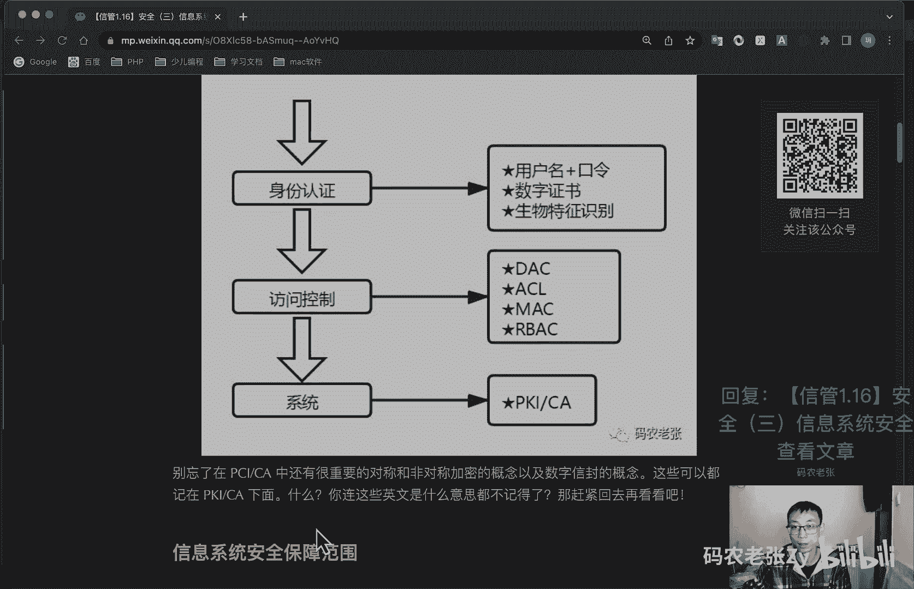
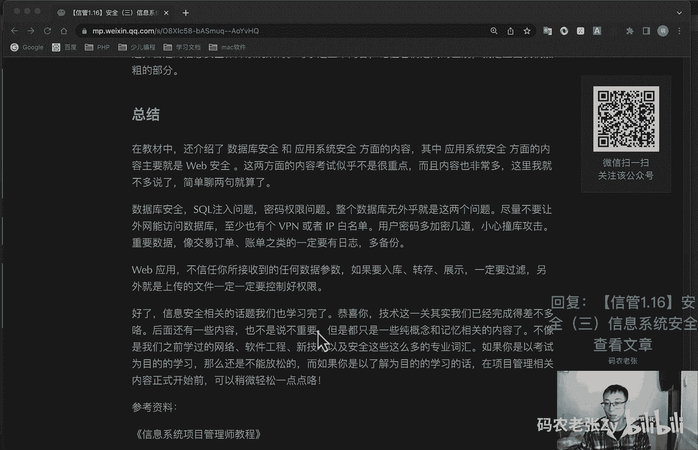
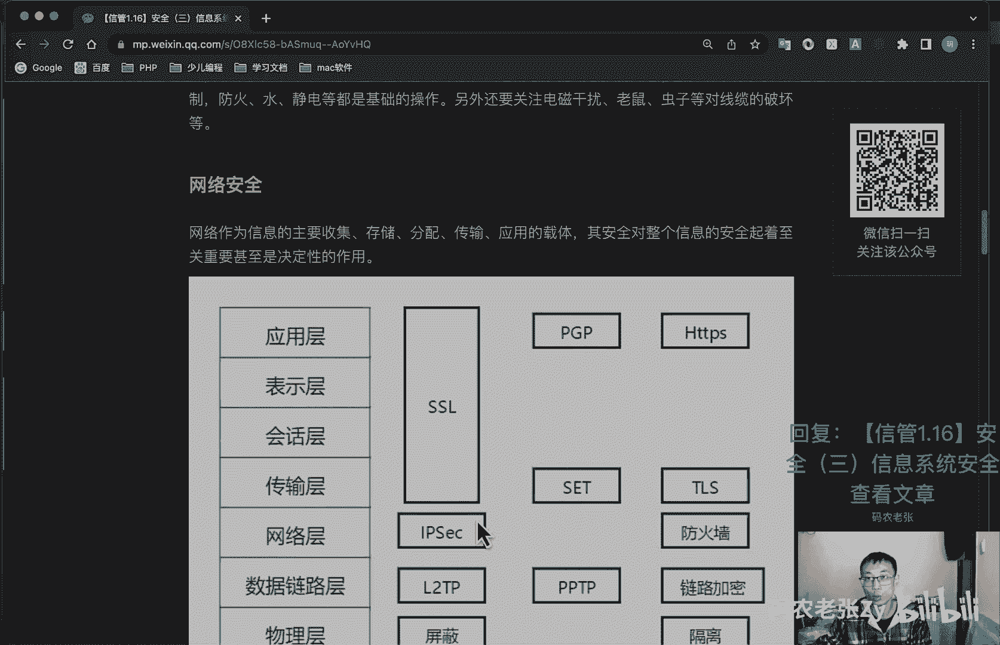
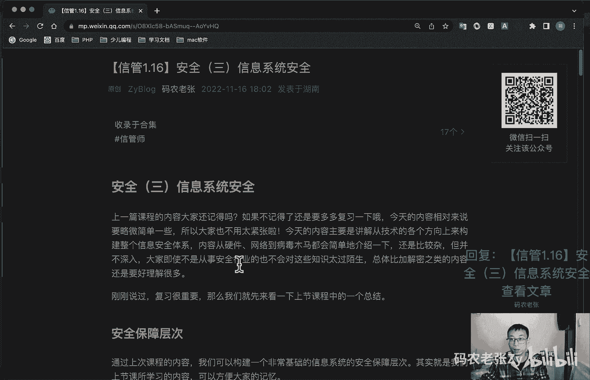
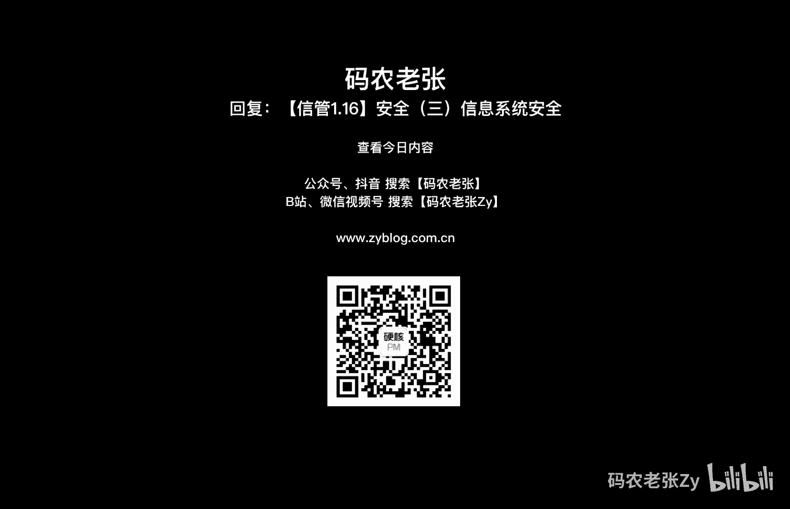

# 【信管1.16】安全（三）信息系统安全 - P1 - 码农老张Zy - BV1L3411Q7R5

hello，大家好，今天呢我们来学习的是信息系统项目管理师，第一大篇章的第16篇文章，安全的第三篇文章，信息系统安全，上一篇课程的内容大家还记得吧，如果不记得的话，就要多复习一下吧。

今天的内容相对来说要略微简单一些，所以说大家也不要太紧张了，今天的内容呢主要是讲解，从技术的各个方向上来构建整个信息安全体系，内容从硬件网络到病毒，木马都会简单的介绍一下，还是比较杂的，但并不深入。

大家即使不是从事安全行业的，也不用对这些，也不会对这些知识太太过陌生，总体比加解密之类的内容还是要好理解很多了，上一篇文章真的很崩溃对吧好了，刚刚说过复习很重要。

那我们先来看一下上一节课当中的一些总结啊，我们先来看一下一个汇总的东西，就是这个安全保障层次，通过上次课程的内容呢，我们可以构建一个非常基础的一个信息系统的，安全保障层次。

其实是我们上节课学习过的那些内容，好，我们就一步一步来看，首先呢我们要登录对吧，登录之后呢，我们要通过什么呢，通过什么来登录的，就是这个信息身份认证，登录就是一个身份证证对吧，我们需要用户名和口令。

也就是密码，用户名和密码来进行登录，或者说我们可以用数字证书来进行登录，比如说我们就用s h对吧，x h h进行远程登录那种形式的，我们就可以用数字证书，或者我们用生物特征识别。

就是就是上篇文章也说过的，就是那个指纹啊，或者说是那个视网膜，这些都可以进行身份认证，在通过身份证之后呢，其实也是我们登录成功之后呢，我们就要进行访问控制，访问控制有哪些呢。

d a c a c l m a c和r b a c，还记得这四个是什么东西呢，如果不记得了，回去看一下好了，最后我们登录之后呢，就进到系统里面了，我们在系统里面进行数据传输，或者进行数据操作的时候呢。

最后还进行一下pk i或者是c的一些加解密，或者是呃，就是通过认证的一些站点密集一些操作，最主要是在数据传输上面好吧，这些东西啊这些东西对吧，别忘了，就是这这里面就是这个pk和c里面。

还有非常重要的对称和非对称加密的概念，以及数字信封的概念，这些呢都可以记在pk c d底下呃，如果里面这些东西的就是这一大堆英文，是什么东西都不记得的话，那么就赶紧回去再看一下，上篇文章很重要很重要。

三篇文章还是比较重要的好。

信息系统安全的保障范围呃，信息系统呢一般是由计算机系统和网络系统，操作系统，数据库系统和应用系统组成的，与此对应的是呢，信息系统安全呢也包括计算机设备安全，网络安全，操作系统安全。

数据库安全和应用系统安全等等，我们先来看第一个就是物理硬件的安全啊，在物理硬件安全中呢，我们更关注的是机房服务气的硬件设备安全，现在一般服务器都是托管在运营商的机房，所以说相对来说呢。

我们只要选择信誉比较好的供应商就可以了，不过就像之前说过的，现在使用云服务的情况呢会更多一些，所以说这个东西其实也不需要我们太操心了啊，对于办公区域来说，就是说你办公室的那个呃小的设备机房呃。

这个呢都也也也包括你办公的那些计算机，设备的这些东西都是公司的资产，也是我们需要关注的内容，另外呢，很多公司就是在内部会有一个本地服务器，放在办公区域的某个房间中，充当本地一个小机房对吧。

在这种情况下呢，本地环境的防火防盗，安全就是非常非常重要的内容，人员进出的录像监控对吧，然后机房进出权限的控制，然后防火防水，防静电都是基础的操作，为什么防静电防静电，防静电就是在防火对吧。

另外呢还要关注电磁干扰啊，老鼠啊，虫子啊，对线缆的一个破坏等等好了，硬件安全就是这些非常简单，因为我们现在真的云服务用的太多了，所以说这个也不做重点的来看了，好我们再来往下看，就是网络安全。

网络呢作为信息的主要的收集和存储分配啊，传输啊，应用的载体呢，其安全对于整个信息的安全，起至关重要的一个决定性作用啊，我们还是拿最早开始学的，还记得这个是什么吧，还记得是什么吧，o si汽车模型对吧。

快速的修无数网传会表应，对不对，无数网传会表应好，物数网传会表应，可以看到我们在前面四层，在前面四层就是传输层到网上，我们都可以通过sl来进行加密，然后包括一些数字信封技术啊，包括httt s啊。

这些的都可以，还包括这些技术啊，t t l s什么的安全传输的那个tcp协议，对不对，好了，这下面那个四层呢，都可以通过这些来进行一个加密，就是啊进行安全的传输。

然后网络层呢可以通过这个ip s e c啊，还有防火墙啊这些来进行控制，然后数据链路层呢就是l two tp啊，p p t p啊，这是什么呢，还有链路进行链路加密，最后就是物理层，物理层通过屏蔽啊。

还有隔离啊相关的操作来进行这个操作啊，好这个呢具体的内容呢，大家也可以来这里看一下，我就不进行详细的说明了啊，最主要的是什么，在应用层的s s l已经是事实上的传输层，以及以上的加密标准。

他这个主要是这个针对那个tcp这一块来说的，就是他对tcp进行加密的之后呢，你去传输的时候，他走的协议基本都全是这个t l s这个协议了，好这个呢主要是上面的四层的，这个呢大家过来去了解一下就可以了。

然后就是htp s i h t p s呢，也可以过来看一下啊，htp s现在已经是那个已经是事实上的标准了，就是说你想开发app应用，或者是开发小程序之类的应用，没有htp s，你根本就没有办法上线了。

然后呢就是入侵检测系统啊，入侵检测系统是网络安全啊，是注重的是网络安全状态的一个监控啊，通过监控视图或者系统资源，寻找违反安全的迹象啊，这个就是下面那一层的网络那一层的对吧。

然后它主要用于是发现问题和阻断攻击，并且留下攻击的证据呃，以作为我们之前介绍过安全审计当中的，证据资源的来源啊，然后另外呢还有这里，还有一个比较重要的一个叫蜜罐技术啊，蜜罐技术是一种主动防御技术。

是入侵检测的一个重要发展方向，也是一个诱捕攻击者的陷阱，它是一个包含漏洞的一个诈骗系统，通过模拟一个或多个异兽攻击的主机和服务，给攻击者提供一个容易攻击的目标，攻击者往往就在这个蜜罐这台服务器上面去。

浪费时间了，延缓对其真正目标的一个攻击，好除了入境检测系统之外呢，还有一种入侵防护系统ip，它更倾向于主动防护，注重对于入侵行为的控制，直接对入侵活动和攻击性网络流量，进行一个拦截好了。

这个也了解一下ip，你知道什么东西就行了，入侵防护系统对吧，他是拦截的，蜜罐是监控啊，蜜罐是诱捕的，对不对，然后入侵检测系统是什么监控的，好防火墙这个东西啊，大家应该不会陌生啊。

我们电脑操作系统上就有自带的一个防火墙，对不对，不过在信息系统中，主要指的就是服务器级别的网络防火墙，这种防火墙呢，又分为硬件防火墙和软件防火墙之分呃，能够阻挡对网络非法访问和不安全，数据的一个传递。

能够使使本地网络客户，免受外部网络的一个威胁，它也是实现网络安全的一个主要策略，我们之前看过的那个图，就是讲那个呃，找那个局域网那个分层的那张图对吧，在这个图里面就是讲那个核心层，汇聚层。

接入层这张图的时候，我们在下面就看到有防火墙这个地方了，对不对，这个防火墙连接的是什么，就是外部的网络对吧，外部的网络流量，看internet和这个呢就基本上全是外部网络。

外部网络在接入我们内部网络的时候，都会通过一个防火墙，然后如果外部网络可以访问那些数据呢，我们会放在这个非军事区，也就是dmz区，对不对，放放在这个区域里面去进行访问，如果不能访问的内容呢。

我们就会通过防火墙在这里面直接把它给断掉，对吧，直接把那个，但是我们从内部可以从去访问外部的内容，对不对，这种呢就是防火墙的一个主要作用好了，就是我前面说的，就是在这一层的数据链路层的l to tp哎。

这个也是i p s e c，也是这个也是做那个隧隧道的，对不对，它是依靠i s p，也就是internet服务提供商，和其他n s p网络服务提供商，在公用网络上建立。

专用的安全的数据通信通道的一个技术，非常常用的一个工具啊，通过一种称为隧道，就是ip隧道的这样一个技术作为传输的介质，在网络传输中的一个综合应用，常见的隧道技术主要包括点对点p p p p p。

然后第二层隧道协议l to tp和ip安全协议，就i i p s e c，相信你的公司呢，所使用的应该是这三种协议之一，之前呢应该是p p t p和l two，tp会比较多一点。

现在呢这个可能的应该也不少了，好我们再来接着往下看啊，啊病毒和木马啊，在操作系统层面上，我们主要面临的威胁呢就是病毒和木马的问题，就是老马的我们还记得吧，就是当年的那个熊猫烧香，记不记得横扫全国对吧。

计算机病毒啊，计算机病毒这个东西啊，在编制或者是在计算机程序中插入的，破坏计算机功能或者破坏数据的影响，计算机使用，并且能够自我复制的一组计算机指令，或者是代码，注意它的特点是一个它会破坏。

它会搞破坏的啊，木马木马是利用计算机程序漏洞入侵后窃取，所以他不搞破坏，他一般不搞破坏，他只是窃取窃取你的文件的程序被称为木马，它是一种具有隐藏性的，自发性的和可被用来进行恶意行为的程序。

多不会直接对电脑造成危害，而是以控制为主，就看出来他们俩的区别了对吧，就是病毒啊，病毒很重要，它会破坏我们的电脑操作系统，甚至是影响硬件，而木马呢则是以控制和窃取为主，在早期来说呢。

就是这个病毒会比较流行一些，而这些年呢就是从这个熊猫烧香之后，大概没过多大，大概是什么呢，就是那个360免费的时候，我跟你说，360免费了之后，病毒这个东西真的少了很多很多啊，为什么大家细想一下。

细思极恐啊，也有很多人说过这个问题啊，好那就是木马就现在是比较流行的，为什么呢，我们现在就以利益为主，对不对，我肯定是为了要窃取你的东西，或者是把你的电脑当成肉鸡，用来去攻击别人来使用或者怎么样的好。

当然在大环境之下，电脑上的病毒和木马，中招的几率呢其实是一直在降低的，我们现在更关注的是移动互联网中，针对手机的各种木马和或者是钓鱼程序，就是说不管病毒还是木马啊，我们在防范的过程中。

一定要注意及时更新操作系统的补丁，二是杀毒安全之类的软件呢，还是要安装一些的，第三点呢也是更重要的一点，就是下载软件文档资料图片，音视频等资这些这些资源的时候，一定要确认它的来源是可信的。

软件呢我们最好要到官网去下载，就是那种来路不明的软件啊，文档一定要先查杀再使用手机也是同样的道理，一般来说那就是ios尽量不要去越狱了，现在基本上应该也没人越狱了，然后安卓呢也尽量要从手机品牌自带的。

官方应用商店来下载app，就另外再多说一点啊，就是现在网络诈骗其实比病毒密码是更厉害的，往往这类的诈骗呢都是伴随着钓鱼网站，钓鱼app或者是钓鱼短信一起的，就是什么东西叫钓鱼啊。

它呢就是模仿非常像正规网站的一些假网站，因为套取你的信息，比如说一个假的支付宝页面，对不对，然后诈骗你点击支付后，通知你说什么出了什么异常了，或者触犯什么法律了，参与了什么社会活动之类的。

接着呢就让你汇款转账，面对这些情况，年轻人还好，但是我们一定要提醒自己的亲朋好友，还有家里的老人啊，就是确保不转账，不汇款，实在搞不明白的，一定要找警察叔叔或者是银行人员去帮忙。

千万不要马上就冲动的去转账啊，啊这这个我们做i t的，就是这个应该是我们应该要担负起的社会责任，对不对，一定要向周围的朋友去宣传一下好，信息安全系统架构体系啊，整个安全体系呢。

我们可以用下面三维这个坐标图来演示一下，你看到没有，这是根据那个物数网传会表应对吧，os切成模型，然后我们可以横向又分出来这么多对吧，然后我们纵向又分出来这么多，哇塞这个这个这个感觉是非常庞大和复杂的。

一个工程，信息安全系统呢，是客观的，独立于业务应用系统而存在的一个信息系统，它可以有自己的架构模式，不需要业务系统进行参与，但可以就是作用于整个业务系统当中，好信息安全系统的大体又分为三种架构模式啊。

我们来看一下呃，有哪三种，第一种呢是什么，第一种叫做这个miss加miss加这个miss加s对吧，miss加mic r，它的系统为初级的安全保障系统，或者说基本的信息安全保障系统。

它的特点呢就是业务应用系统的基本不变，就是业业务应用系统可以基本保持不变，然后呢硬件和软件系统是通用的，就硬件和软件可以通用这一套那个安全管理呃，安全管理的架构，然后呢。

安全的设备呢基本上是可以不用带密码的，然后这个是最低级的一种了，然后中间这个呢叫做s杠miss，s杠miss这个呢是标准信息安全保障系统，它是一种啊涉密系统，特点呢就是包括硬件和软件系统也是海贼。

就这个还是通用的硬件和软件，它也是通用的，他这个也还是通用的，然后他会加上什么呢，pk i c a安全保障系统就必须要带密码了，就这个是不带密码，这个就必须要带密码了。

然后业务应用系统呢必须要根本的改变，就是原来我们业务应用系统可以可以，不需要有什么太大的变化，但是现在呢必须要跟随这个安全信息的管理，系统一块去产生一个根本的改变，它的主要的是主要的通用硬件软件。

也需要通过这个pc i a p，k i c a的一个认证好了，最高等级最高等级是s2 ，s miss或者s平方米四都可以啊，一比一般可能会说s2 miss s r mix。

这个系统被称为超安全的信息安全保障系统，它建立是它是建立在绝对的安全，信息安全的基础设施之下的，它的特点呢，包括硬件和系统的软件都是专用的啊，注意都是专用的，然后pk安全基础设施呢必须带密码。

然后e业务应用系统呢必须要根本改变，必须要根本改变，然后注意这几个地方是加粗的，这个地方最最低级的这个基本不变啊，通用啊，不带密码对吧，然后中间的这个就是还是通用的，但是带密码了，然后要根本改变了。

然后最高级的这个呢根本改变了，必须带密码，然后也所有东西都是专用的啊，这个就是就是这一块，这几个东西呢也是是需要去记住的，建设难度和投资水平肯定也是不一样的，对不对，那么企业呢应该根据自己的实际情况。

选择合适的信息安全保障系统，对于这三个内容呢，记住它们之间的区别，就是上面我们加粗的部分就可以了，然后这个图呢大家也去了解一下就行了，这个图其实就是上面那几句话里面的内容好了，总结一下啊，在教材当中呢。

其实还介绍了数据库安全，和应用系统安全相关的内容，其中应用系统安全方面的内容呢，主要就是web安全，这两方面内容呢考试不是很重点啊，而且内容呢也非常多，这里我就不多说了，我们就简单的聊两句就算了。

第一个数据库安全，sql注入问题，密码权限问题，整个数据库无外乎就是这两个问题，尽量不要让外网能够访问数据库，用户密码呢多加多多多给它加密几遍对吧，小心也有个撞库的攻击，然后重要数据啊，像交易订单啊。

账单之类的，一定要有日志啊，然后要多备份啊，这个东西一定要注意，然后呢就是外部应用，外部应用呢就是不信任你所接受的到的，任何的数据参数，如果要入库转存展示，一定要过滤，就不管怎么样。

xss过滤或者是呃是那个sql注入的过滤，一定要过滤，另外呢就是呃上传的文件，一定要控制好它的权限啊，就不能让它当做一个可执行的文件来，就当成一段程序代码来执行，这样的话别人就上传一段那个恶意的程序。

直接就可以给你做木马了好了，信息安全相关的话题呢，我们也学习完了，恭喜你，技术这一关呢其实我们已经完成的差不多了，后面还有一些内容也不是说不重要呃，但是都是只是一些纯概念和记忆相关内容了。

不像是我们之前学习过的什么网络啊，软件工程的新技术，以及刚刚学完的安全这一块的，这么多专业的一个词汇，如果你是以考试为目的学习，那么还是不能放松的，而如果你是以了解为目的进行学习的话。

在项目管理相关的内容正式开始之前，就是后面中间有这两三篇文章。

大家是可以稍微轻松一点的好了，今天的内容呢就是这些，大家可以回复文章的标题。

信管1。16安全，第三篇信息系统安全，来获得这篇文章的具体内容，以及相关的一个具体的一个解释好了。

今天的内容呢就是这些。

