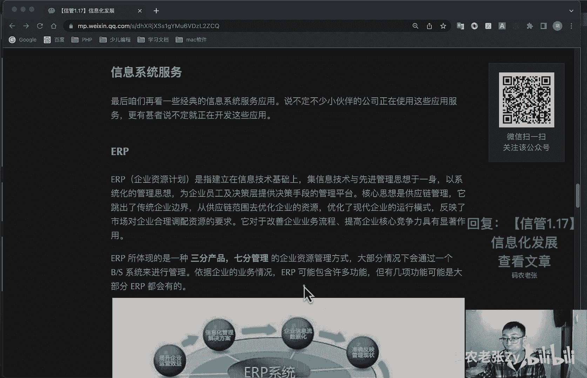
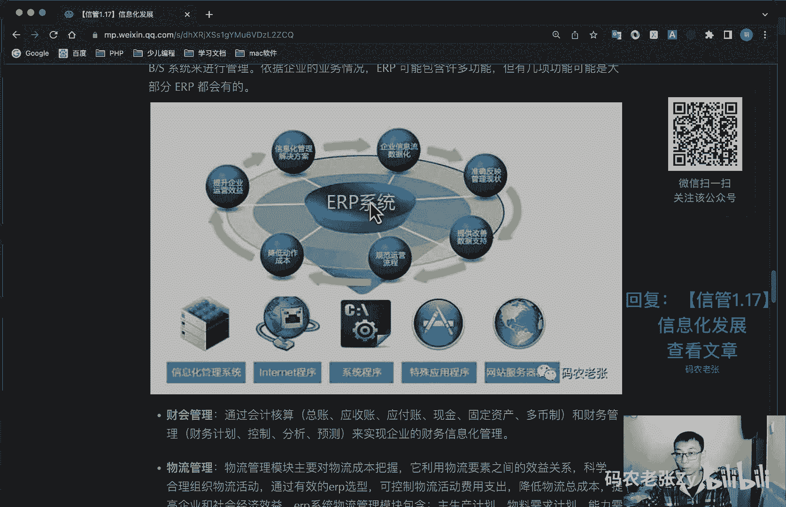
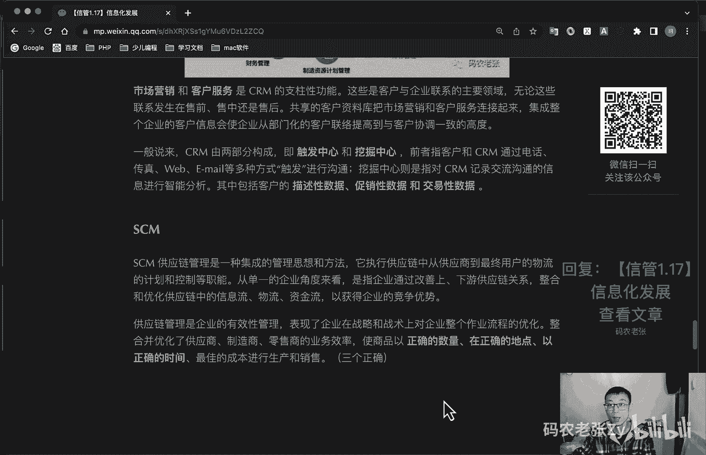
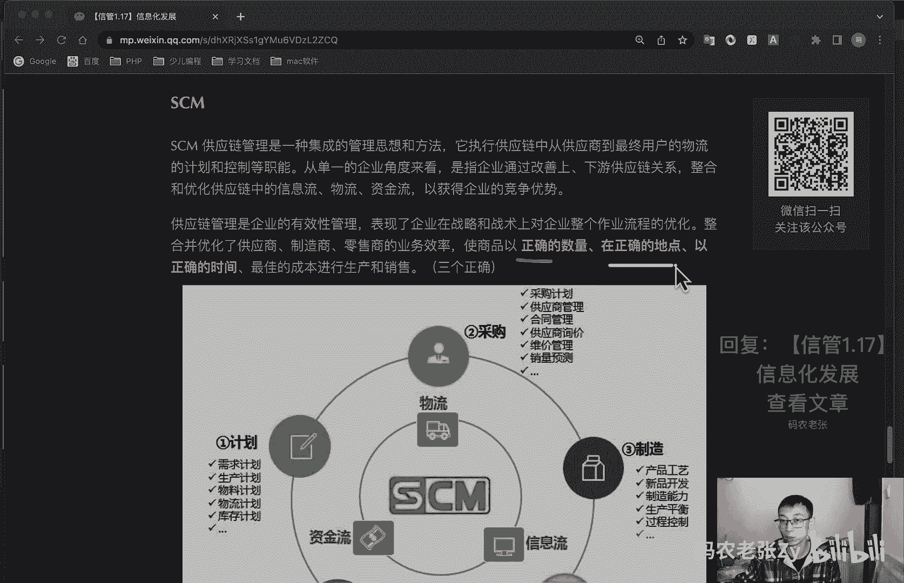
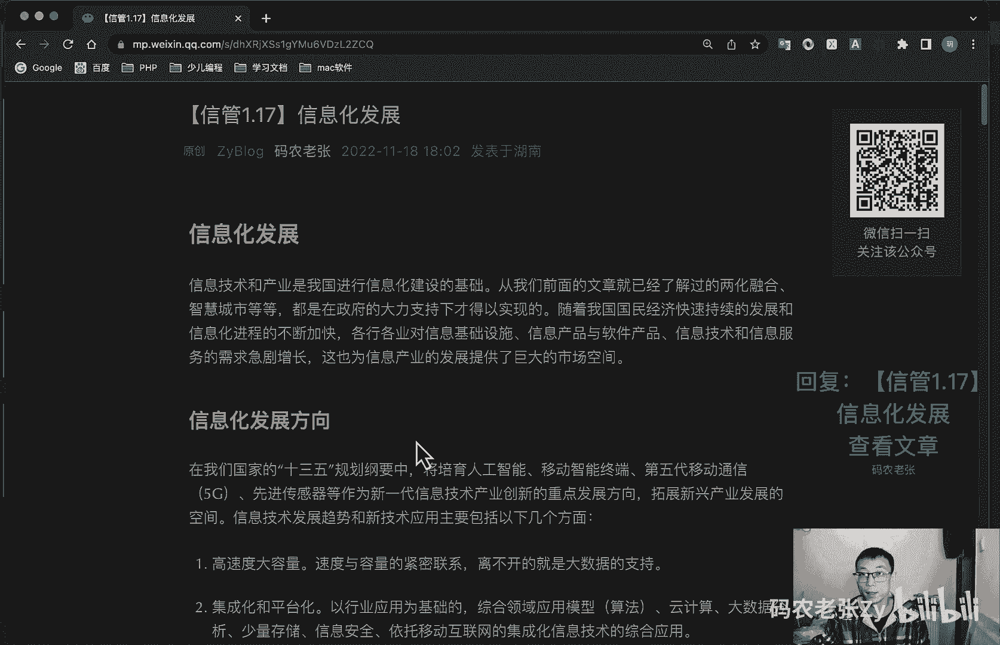

# 【信管1.17】信息化发展 - P1 - 码农老张Zy - BV1E44y1o7ax

hello，大家好，今天呢我们来学习的是信息系统项目管理系，第一大篇章，第17篇文章，信息化的发展，信息技术和产业，是我国进行信息化建设的一个基础，从我们前面的文章就已经了解过的，两化融合。

智慧城市等等啊，都是在政府的大力支持下才得以实现的，随着我国国民经济快速的持续发展，和信息化进程的不断加快呢，各行各业对信息基础设施啊，信息产品与软件产品，信息基础和信息服务的需求急剧的增长。

这也为信息产业的发展，提供了一个巨大的市场空间，我们今天就来了解一下好了，第一个我们看一下信息化的一个发展方向，在我们国家的13 五规划纲要当中呢，将培育什么呢，人工智能，移动智能终端，第五代通信。

移动通信技术也就5g技术，先进传感器等，作为新一代的信息技术产业，创新力和重点发展方向，拓展新兴产业发展的一个空间，信息技术发展趋势和新技术的应用呢，主要包括以下几个方面，第一个就是高速度，大容量。

速度和容量的紧密联系，离不开的就是一个什么大数据的一个支持嘛，第二个呢就是集成化和平台化，以行业应用为目的啊，综合领域应用模型，然后这个主要包括一些算法，然后云计算大数据分析下少量存储啊。

然后一些信息安全依托移动互联网的集成化，信息技术的一个综合性应用，就是集成化，还有一个平台化，第三个呢就是智能化，以智能制造为标签的各种软硬件应用，为各行各业的各类产品带来换代式的飞跃。

甚至是一个革命啊，智能制造智能化啊，第四个呢就是虚拟计算，一种以虚拟化的网络，云计算等技术融合为核心的一种计算平台，存储平台和应用系统的共享管理技术，虚拟计算呢是云计算的一个基础。

也是云计算应用的一个主要的一个表现好，第五个呢就是通信技术，包括什么光通信啊，5g啊，4g啊，这些技术，已经极大地影响了人们的工作和生活的方式，对吧，这个也不用多说了，第六个呢是遥感和传感技术。

传感技术与计算机技术和通信技术一起，计算机技术和通信技术，传感呢在交互控制，传感与交互控制，在工业交通医疗，农业环保等方面的应用更加深入，可以说呢，传感和识别技术，是物联网应用的一个重要的基础。

它是物联网的一个重要基础啊，然后第七个呢就是移动智能终端，无线网络技术啊，移动45g的技术啊，以及不断飞速发展的手机芯片技术啊，让智能手机完全具备了，移动智能终端的处理能力，真的不用多解释了，好第八个。

以人为本，信息技术呢已经开始真正的面向公众为人所用，各种交互方式和手段，都已经在各种的信息系统中大量出现了，人们在使用各类信息系统时，可以完全模仿人与真实世界的交互方式，ai对ai，人工智能等等的好。

第九个信息安全，计算机和网络在各行各业中，已经深入到人们生活的方方面面，我们对计算机和网络的依赖也越来越大，如果计算机和网络系统的信息安全受到危害，将导致整个社会层面的混乱和巨大的损失。

信息安全关乎国防安全，政治安全，经济安全，社会安全以及民生和个人，是我们it从业人员必须时刻所关注的一个内容，好具体来看啊，我们先来看一下电子政务，电子政务呢是正机构应用现代信息和通信技术。

将管理和服务通过网络技术进行集成，在网络上，实现政府组织结构和工作流程的优化重组，超越时间空间与部门分隔的一个限制，全方位的向社会提供优质规范透明，符合国际水准的管理和服务，在之前的文章中呢。

其实我们就已经提到过了，对不对，或者是想换身份证的照片，都已经不需要去公安局了，我们直接就可以在网上办理了，同样的企业缴税啊，个人退税啊，电子身份证啊，电子驾照啊，交通违章处理啊，国家电网啊。

还有交水费啊什么的，你觉得电子政务相关的工程离你很远吗，其实我们现在已经天天在使用了，对不对，电子政务的建设原则呢，要遵循什么统一规划需求，主导整合资源，统一标准，它的主要应用模式呢主要包括以下四种。

这四个应用模式是比较重要的，讲出了对吧，甲出了一个叫政府，对政府就是government，对government叫g to g，他呢主要是政府的上下级，不同地区和不同职能部门之间，实现的电子政务活动。

包括人口信息，地理信息，资源信息等，用于社会经济统计，公安国防等于它就政府机构对政府机构相关的，呃反正公安机关啊，跟一些那个因为他掌握人口信息对吧，他那个户口啊什么那些的人口信息。

所以他会跟别的很多政府部门，都会有一些关联的，然后呢就是政府对企业，这个呢就是government to business对吧，呃g to b，这个呢是政府向企业提供的各种公共服务。

主要包括政府向企事业单位发布的各种方针，政策法规等等，好了，第三个呢就是政府对公众对吧，然后就g to c，g to c，就是前面说过的各种便民工具和系统，提供的各类服务。

就我们前面是大家现在经常都在用的那些了，好下一个呢就是政府对公务员有gto，这个呢就只要指的是政府内部的电子化管理，如oa系统，也是g to g和g to b。

还有g to c的一个基础好下面就有一张图，从这张图就可以看出来啊，就是政府办公自动化，也就g to e是整个呃电子政务的一个核心所有，另外在我们的第一节课程当中呢，也就是呃新管1。1信息化。

信息系统与信息化中提到的两网一站，四库12金，就是电子政务的一个典型规划和应用，还记得是什么呢，政府内网外网，对不对，一站是什么站啊，四库是什么呀，12金是什么，这个后面这两个本不要求完全记住。

但是你大概得有印象，大概得有印象，有可能出题的好，我们再来看一下电子商务，这个电子商务跟电子政务很有意思啊，他这是四个，对不对，电子商务这里也是四个对吧，这个当然这个电子商务的。

可能大家会了解的会比较多一些，电子商务呢是利用计算机技术呃，网络技术和远程通信技术，实现整个商务过程的一个电子化，数字化和网络化，实现完整的电子商务呢，就它不只是我们去淘宝啊，京东啊，买个东西这么简单。

当然对于我们这些普通的用户来说，确实是非常简单，但是对于整个电子商务体系来说，会涉及到买家，卖家，银行，金融机构，政府机构，认证机构，还有配送中心等等，电子商务呢也有四种应用模式啊。

也是大家比较熟悉的好，第一个是什么呢，b to b啊，这个不用解释了吧，京东就是企业和呃，不不不是京东，阿里巴巴，阿里巴巴就是企业和企业之间，通过互联网进行产品服务及信息的交换，阿里巴巴汇成网等等对吧。

汇通网还在不在，我都不知道，阿里巴巴现在其实也用的也比较少，这个我们普通老百姓接触的可能不多啊，但是阿里确实是通过b to b起家的，他们先做的就是阿里巴巴，所以他们整个集团名字就叫阿里巴巴对吧。

之后才做的淘宝啊，第二呢就是b to c帝都，现在就京东了对吧，京东啊，苏宁啊等等等等等，企业和消费者之间的电子商务，一般以零售业为代表，典型的就是天猫，京东呃，苏宁当当等等好。

第三个呢就是c to c c to c，最典型的就是淘宝对吧，消费者与消费者之间，通过电子商务交易平台进行交易，的一种商务模式，这个呢就是淘宝拼多多，以及国外的一倍的一个典型模式。

然后最后一种呢就是oto o oto o就online to offline，主要它是online to offline，就是线上对线下嗯，他主要就是线上购买，然后线下去消费商品或者是服务。

实体店提货或者享受服务的一个过程啊，曾经有过非常火的火爆的一个就是好多年前了，就是千团大战，对不对，也就团购业务刚刚兴起的时候，是oto o最高潮的时候，然后之后呢就是市场冷静了，下来之后呢。

就是现在的包括美团，饿了么，你点外卖那些的对吧，按摩美甲，旅游短租之类的应用呢，其实它都是oto o的一个主战场，国内的电商市场呢不用我说，大家也都清楚啊，每年的双11。

618都刷新的看不懂的消费记录啊，然后最偏远的山区呢也能通过网购，直接买到全世界的商品，这个东西啊，更是促使中国，用卡时代，我们就直接进入了网购时代和移动支付时代，总之呢电商行业确实是在近十多年来。

为我们的生活带来了翻天覆地的变化啊，好我们再来看一下啊，看一下这个信息系统服务，最后我们再来看一下啊，这些信息服务服务，我们第一个看的什么e r p r，p r也叫企业资源计划。

是只建立在信息技术基础上，及信息技术与先进管理思想于一身，以系统化的管理思想，为企业员工以及决策层提供决策手段，的一个管理平台啊，核心思想是供应链管理，它跳出了就是传统企业边界。

从供应链范围去优化企业的资源，优化了现代企业的运行模式，反映了市场对企业合理调配资源的一个要求，它对于改善企业业务流程，提高企业核心竞争力具有显著的作用了，e r p l所体现的是一种三分管理。

三三分产品，七分管理，这个东西讲出的地方都比较重啊，三分产品七分管理的企业资源管理方式，大部分情况下会通过一个bs系统来进行管理，根据企业的业务情况呢，e r p可以包含许多功能。

但是有几项功能可能是大部分e r p都会有的，我不知道你们公司有没有，反正我是没有经历过那么大的公司。

基本没怎么用过ip啊，好我们先来看一下压片包括的主要功能，包括那个财会管理对吧，通过会计核算啊，这些相关的一些东西和财务管理，来实现企业的财务的信息化管理，然后呢就是物流管理啊，物流管理的模块呢。

主要是对物流成本的一个把控，它利用物流要素之间的效益关系啊，科学合理的组织一些物流活动，通过有效的r p选型的可控制物流活动，费用的一个支出，降低物流的总成本，提高企业和社会经济总效益。

那第三个呢就是一个生产控制的一个管理啊，生产控制管理模块呢，是收银软件系统的核心所在，它是将企业的整个生产过程有机地进行结合，使企业有效的降低库存，提高效率，企业针对自身发展需要的完成e r p选型。

连接进销存系统，使得生产流程连贯，企业在e r p选型的时候，应注意到e r p系统，生产控制管理模块的一个重要作用，最后那个就是人力资源管理啊，随着企业人力资源的发展，人力资源管理成为独立的模块。

被加入到e r p系统，当中和财务生产系统组成的高效，高度集成的一个企业资源系统，e i p系统，人力资源管理模块呢，包括人力资源规划的辅助决策体系，招聘管理，工资核算，公式管理啊，差旅核算等等。

就是比较重要的，这四个模块，大家可以去了解一下c r m，c r m估计应该可能做过的同学，或者是用过的同学可能会稍微多那么一点啊，因为它跟这个销售有关，跟销售有关的话，就跟赚钱有关，对不对。

好c r m呢是客户关系管理系统啊，是指企业为提高核心竞争力，利用相应的信息技术以及互联网技术，协调企业与顾客在与顾客间在销售啊，营销和服务上的交互，从而提升其管理方式，向客户提供创新式的。

个性化的客户交互和服务的一个过程，其最终目标是吸引新客户，保留旧客户，以及将已有的客户转化为忠实客户，从而去增加市场，cr m系统建立在以坚持以客户为中心的理念上，就是利用软件硬件网络技术。

为企业建立一个客户信息收集管理，分析利用的一个信息系统，其目的就是能更改，就是能够改进啊用户的满意度，增加用户一个忠诚度，你看到没有，它可能会包括这么多的功能啊，然后市场营销呢和客户服务呢。

这两个东西是c m m的一个支柱性的一个功能，注意啊，市场营销，客户服务，这些都是客户与企业联系的一个主要领域，无论这些联系发生在售前售中，还是售后共享的客户资料库，把市场营销和客户服务联系起来。

集成整个企业的客户信息，是企业从部门化的客户联络，提高到与客户协调一致的高度，一般来说cm是两个中心啊，就是一个出发，一个叫触发中心，一个叫挖掘中心，前者呢和指客户和cm通过电话传真。

什么各种方式出发进行沟通，然后后者呢就挖掘中心呢，就是指呃c m记录交通交流，沟通的信息进行智能分析，其中包括什么描述性数据啊，促销性数据和交易性数据等等，这些加粗的关键字，记住他们都是跟cm有关的。

ok了好，我们再接着往下看，s c m c m是供应链系统啊。

它是一种集成的管理思想和方法，它执行供应链当中，从供应商到最终用户的一个物流的，计划和控制等职能，从单一的企业角度来看，是指企业通过改善上下游供应链关系，整合和优化供应链当中的信息流。

物流资金流已获得企业的竞争优势，供应链管理呢是企业的有效性呃，管理表现了企业在战略和战术上，对企业整个作业流程的一个优化，整合并优化了供应商，制造商，零售商的业务效率，是商品以正确的数量，在正确的地点。

以正确的时间，最佳的方式，最佳的成本进行生产和销售，三个正确，这个地方这个地方要记住啊，就正确的数量，正确的地点和正确的时间好。

这个三个正确啊，这个图呢大家可以了解一下就行了，然后s m的核心理念是降低运营成本，提高客户满意度，它是建立在产业链基础上的一个系统，我们这就接着往下看吧，bi bi呢就是商业智能啊。

business intelligence对吧，商业智能又称商业智慧或者商业智能制，利用现代数据仓库技术，线上分析处理技术，数据挖掘和数据展现技术进行数据分析，以实现商业价值。

bi的核心就是数据仓库加数据挖掘，加联机分析处理加数据备份，其实就是大数据的那一套啊，这它的实施步骤呢，也是和大数据分析的步骤是类似的，包括需求分析，数据仓库建模，数据抽取，建立商业智能分析报表。

用户培训和数据模拟测试，以及系统改进和完善等等，最后一个oa，这个呢应该接触的也是比较多的办公自动化oa，他们是将现代化办公和计算机技术结合起来的，一种新型的办公方式啊，办公自动化呢没有统一的定义。

凡是在传统的办公室中采用的各种新技术，新机器，新设备从事办公业务，都属于办公自动化的一个领域，呃，通过实现办公自动化呢，或者说实现数字化办公的，就可以优化现有的管理组织结构，调整管理体制。

在提高效率基础上的增加协同办公能力，强化决策的一致性，还有一个叫什么叫什么叫那个什么无纸化办公，对吧，无纸化办公也是指的这个oa欧文呢，其实主要解决的就是一个什么工作流的一个问，题。

最主要的最主要的问题就是工作流的问题，工作流呢也可以叫做信息流，就是工作流程的一个计算模型，即将工作流程中的工作如何前后组织在一起的，逻辑和规则在其中集中，以恰当的模型进行表示并进行并实施这个计算。

工作流呢主要解决的问题就是，为实现某个业务目标，在多个参与者之间的利用，计算机按某种预定的规则，自动地去传递文档信息或者是任务啊，在oa的这样的工作流管理系统的主要功能就是。

通过计算机的支持去定义执行和管理工作流，协调工作流执行过程中，工作之间和群体之间的一个信息的交互好了，总结一下，在今天的学习内容中的电子政务和电子商务啊，记得吧，记得那几个g图，什么g图。

什么g图什么对吧，还有那个哦b图什么啊，c to什么，对不对，就那几个什么什么图，什么什么什么图什么，那几个东西呢是比较重要的，剩下的这些呢就是应用系统大概是干什么的，了解一下就行了。

比如说sm是干什么的，对吧嗯，c i m是干什么的，对不对，然后oa是干什么的，e r p是什么，对不对，内容不多，不过呢还是比较有意思的，以后我们的工作生活是比较贴近的。

相信大家还是能够比较轻松的去掌握的，今天内容应该还是比较轻松的好，今天内容呢就是这些，大家可以回复文章的标题，信息信管1。17信息化发展，来获得这篇文章的具体内容，以及相关的一个具体的解释好了。

今天的内容呢就是这些。

