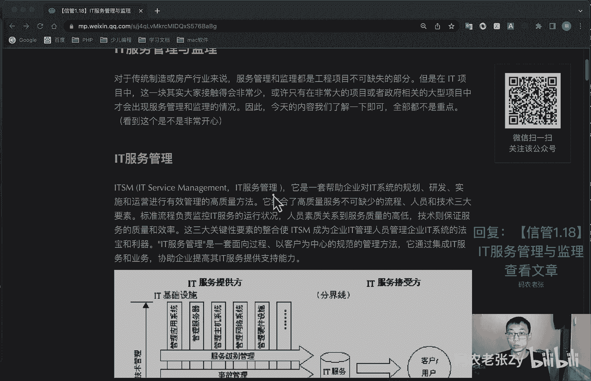
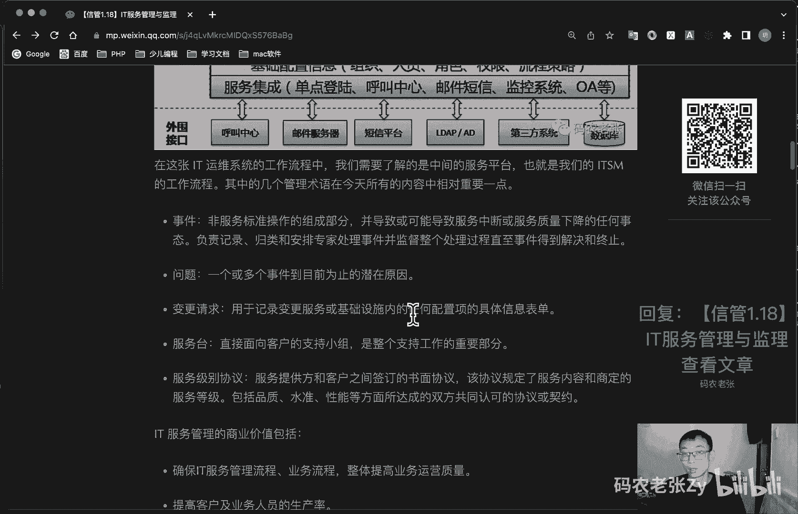
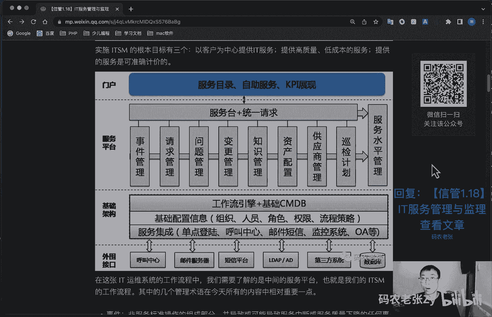
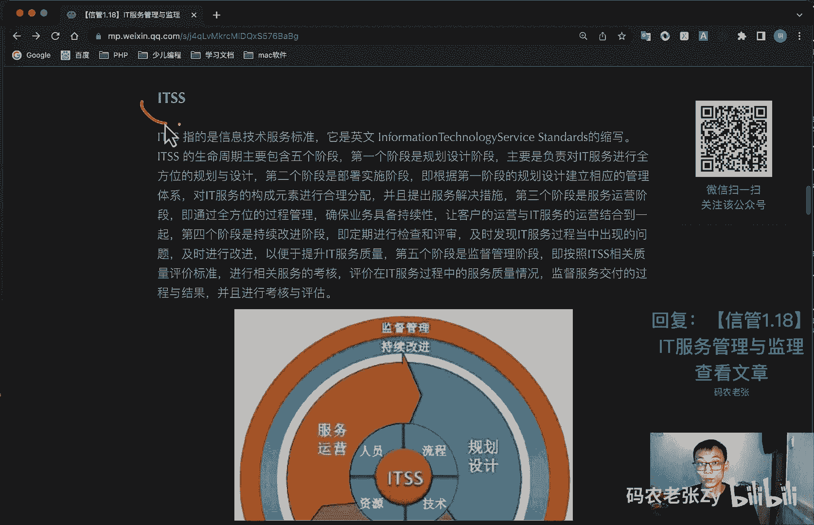
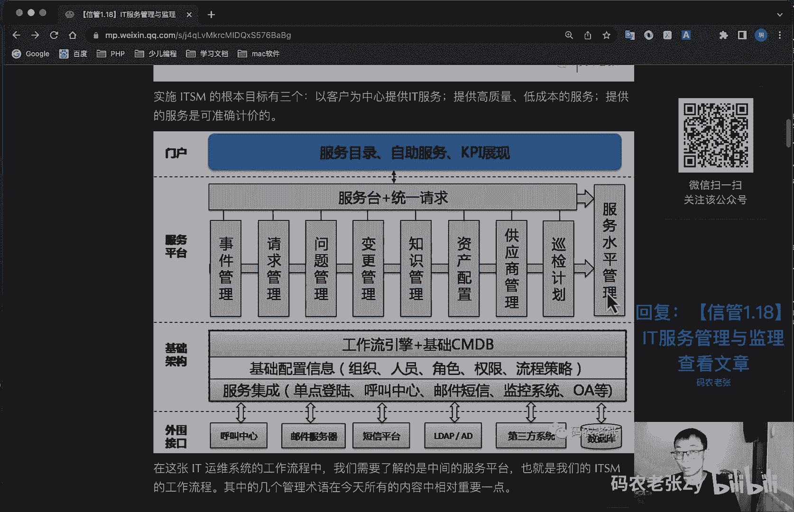
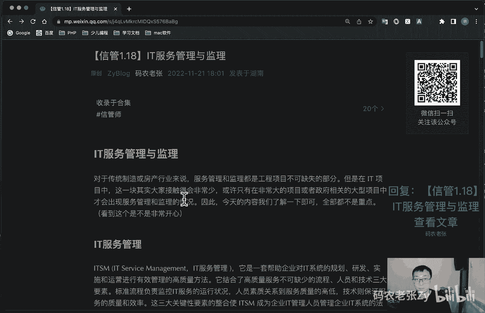

# 【信管1.18】IT服务管理与监理 - P1 - 码农老张Zy - BV1SM411C796

哈喽大家好，今天呢我们来学习的是信息系统项目管理师，第一大篇章的第18篇文章了，it服务管理与监理，这相关的行业来说呢，服务管理和监理都是工程项目不可缺失的部分，但是在it项目中这一块。

其实大家接触的会非常非常的少，或许只有在非常大的项目，或者是政府相关的大型项目中，才会出现服务管理和监理的情况，因此呢我们今天内容了解一下即可了，全部都不是重点啊，看到这个是不是非常担心。

但是呢有一点啊，就是这个监理啊，监理这一块也是稍微有一点点重点的，相关的一些内容的啊，这个大家注意一下好了，我们来看一下it服务管理，i t s m就是t service management。

这个it服务管理，它是一套帮助企业对it系统的规划，研发实施和运营进行有效管理的高质量方法，它结合了高质量服务不可缺少的流程，人员和技术三大要素，标准流程负责监控it服务的运行状况。

人员素质关系到服务质量的高低，技术呢则保证服务的质量和效率，这三大关键性要素的整合，使得i t s m呢成为企业it管理人员，管理企业it系统的法宝和利器，it服务管理呢是一套面向过程的。

以客户为中心的规范的管理方法，它通过集成it服务和业务，协助企业提高其it服务的支持能力。

好了整个呢就是这一块啊，这一块大家可以看一下，然后呢实施i t s m的根本目标有三个呢，就是以客户为中心提供it服务，然后呢就是提高提供高质量低成本的服务，然后就提供的服务是可以准确计价的。

然后这个图啊你就记住啊，有个什么i t基础设施对吧，有i t服务接收方，然后他描述的呢，其实就是一个这个i t服务的一个管理，的一个过程，大概你看到这张图，知道这个是什么东西就可以了对吧。

然后这里什么流程管理，服务管理啊，这些东西好在接下来往下看啊，呃在这张it运维系统的工作流程中呢，我们需要了解到的是中间的那个服务平台，也就是这一块这一块这个服务平台。

也就是我们i t s m的一个工作流程，其中几个管理术语呢在今天所有的内容中，相对来说可能会重要一点，主要就这几个什么事件啊，这些东西对吧，变更啊什么这些东西的好，我们就一个一个来看一下。

第一个就是事件，事件呢非服务标准操作的一个组成部分啊，并导致或可能导致事故中断，或者是服务质量下降的任何事态，它都成为一个事件，负责记录归类和安排专家处理事件，并监督在整个处理过程。

直至事件得到解决和终止，这个呢就是一个事件的管理，然后呢问题啊，问题这一块问题就一个或多个事件，到目前为止所发生的这个潜在的一个原因，这个呢就是一个问题管理方面的内容，然后呢就变更管理。

变更管理这一块主要就是变更请求，用于记录变更服务，或者是基础设施内的任何配置项的，具体的一个信息的一个表单，然后服务台，服务台呢是直接面向客户的一个支持小组，是整个支持工作的一个重要部分。

然后就是服务级别协议，服务提供方和客户之间签订的书面协议，以该协议规定了服务内容和商店的服务等级，包括品质水准，性能等方面所达成的。

双方共同认可的协议或契约啊，整个就是这一块啊。

服务水平管理这一块，服务平台这一块，然后it服务管理的商业价值包括什么呢，第一个就是确保it服务管理流程，业务流程整体提高业务运营质量，第二个呢就是提高客户及业务人员的生产率。

第三个就是通过实践管理流程，变更管理和服务台等，提供了更可靠的业务支持，第四个呢就是提高客户的满意度，第五个呢就是提供更加及时有效的业务，连续服务，好，我们再来接着往下看，就是i t s。

i t s s呢指的就是信息技术服务标准，它是因为这个什么informal information，information information，然后technology对吧，service。

然后这个什么标准的一个缩写，i t s s的生命周期呢主要包含五个阶段，第一个阶段呢是规划设计阶段，主要是负责对i t服务进行一个全方位的规，划与设计，就是这个规划设计阶段啊。

第二个阶段是部署实施的阶段，就是下面这个啊，这个图在这个地方啊，这个图在下面的就是一个部署一个实施的阶段，就是根据第一个阶段去规划设计阶段，建立相应的一个管理体系，对it服务的构成元素来进行合理的分配。

进行的提出服务解决措施，第三个阶段呢，就是这个服务运营的这样一个阶段啊，即通过全方位的过程管理，确保业务具备持续性，让客户的运营与it服务的运营结合到一起，第四个阶段呢是持续改进的一个阶段。

它在外面这个圈了，第四个阶段呃，即定期的进行检查和评审，及时发现it服务过程中出现的问题，及时进行改进，以便于提升服务质量，第五个阶段呢是这个监督的管理阶段，就按照t s相关质量评价标准。

进行相关服务的考核，评价在it服务过程中的服务质量情况，监督服务交付的过程与结果，并且进行考核与评估，然后呢i t s呢还定义了it服务是由什么人员，过程啊，流程啊，什么资源啊，技术啊这些东西组成的。

并对这些it服务的组成要素进行了标准化，另外呢就it服务人员来说呢，就是t对t服务来说呢，通常情况下是由具备匹配的知识，技能和经验的人员，然后合理的去利用一些资源，并通过规定的流程向客户提供it服务。

其实呢也就是我们圆环中间的对吧对吧，这四个部分啊，这四个呢也是它的一个核心要素，人员呢主要就是指的就是正确的选人啊，这一块正确的选人需要有知识技能和经验，然后流程呢指的就是正确的做事。

包括简洁高效协调的做事，然后技术呢是流程确保正确做事，然后技术上去确保高效率的做事，包括专业的能力，先进的标准以及安全的原则，最后呢就是资源，资源呢就是代表的就是有保障的去做事。

能够科学合理地完成要做的事情，并且获得配套的知识，然后这张图呢也是比较重要的，就是你看到这张图，你知道你要知道他在讲什么，他就是一个i t s s这个东西啊，就他这张图代表的就是这个东西对吧。

然后上面这张图，下面这张图呢，这个服务平台，一提到服务平台或者是什么服务水平管理。

这个呢就是它是什么i t s m啊，这两个东西你要分开啊，一个是tm一个是i t s，就差一个字母好，这个id监理啊，这个是今天也是比较重要的一个部分，这个呢就是信息系统，工程监理呢是指依法啊。

它是依法设立的且具备相应的资质的，依法设立，带有一定资质的信息系统工程监理单位，监理单位受业主单位，业主单位就是建设的就是甲方，业主单位对甲方受甲方委托，依托国家有关法律法规。

技术标准和信息系统工程监理合同，对信息系统工程项目实施的监督和管理，信息系统监理的主要内容呢，是我们今天要关注的内容包括哪些呢，包括这几个二头进制变和信安易沟通对吧对吧，投资控制进度控制。

质量控制变更控制，然后呢合同管理，信息管理，安全管理，沟通协调对吧，你看四个控制，四控三管一协调对吧，两种记忆方式，两种记忆方式，投进质变，信安和和安信安信合都可以，你看你看怎么读顺，怎么读比较顺。

你就怎么记，然后最后一协调沟通协调四控三管一协调好吧，就这个东西这个东西是比较重要的，这个东西需要记一下的，然后呢监理的工作范围包括哪些呢，监理的工作范围主要包括就是国家级。

然后第四集的一个系统的信息系统的一个工程，然后呢，贷款规定需要实施监理的一个信息系统工程，然后就是使用国家财政性资金，银行或者是国有商业银行贷款规定，需要实施监理的信息系统工程，然后呢就是涉及国家安全。

生产安全和信息系统工程，最后呢就是国家法律法规规定的，应当实施监理的其他的一个信息系统工程，所以说这个这个信息监理这一块，监理这个确实跟就是很很重大的项目，才会用到它，再来看一下总总监理工程师啊。

对于信息系统监理来说呢，我们国家实施的是总监负责制，也就是说呢由总监理工程师来全面负责，监理合同的实施，总监理工程师的职责包括哪些呢，主要就是确定项目监理机构，人员的分工和岗位职责。

然后主持编写项目监理规划，审批项目监理实施细则，并负责管理项目机构的监理，工作的一个日常工作，然后呢就是审查审查分包单位的资质，并且提出审查意见，然后就是检查和监督监理人员的工作。

根据工程项目的进展情况，可以进行人员的调配，对不称职的人员呢可以调换其工作，然后呢就是主持监理工作会议，签发项目监理机构的文件和指令，还有呢审定承包单位提交的开工报告，施工组织设计技术方案，进度计划。

审核签署承包单位的申请，支付证书和竣工结算呃，审查和处理工程变更，主持或者参与工程质量事故的调查，然后呢就是调查调解，建设单位与承包单位合同的争议处理，索赔审批工程延期。

还有呢就是组织编写并签发监理月报，监理工作阶段报告，专题报告和项目监理工作总结，审核签任分部工程和单位工程的质量检验，评定资料，审查承包单位的竣工申请，组织监理人员对待验收的工程项目，进行质量检查。

参与工程项目的竣工验收啊，最后呢就是主持监理工程项目的一些监理资料，这一部分的内容呢就上面这一部分非常多，大家了解一下就可以了，比较重要的是呢，就是大家记住总监负责制这个东西就够了。

另外呢除了总监理工程师之外呢，还有总监李代工程序，总监理工程师代表这一职位，其实呢也就是普通的接力工程师，就像什么一建和二建的不同的职责分工一样，对吧，这个普通的职位的职责呢就简单了，就两行。

第一个呢就是负责总监理工程师，指定或者交办的监理工作，就总监理工程师让你干嘛你就干嘛，第二个呢就是行使授权范围内的，总监理工程师的职责和权利，对于总监来说呢，下面这些内容呢是不能委托给总监理。

工程师代表来处理的，也就是说与项目相关的非常重要的事情，是不能让别人代办的，比如说哪些事情呢，第一个就是主持编写监理规划，这个这个东西很重要对吧，你不能交给那个你的小弟去解决。

然后第二个呢就是签发工程开工啊，什么复工报审表啊，工程暂停令啊，监理通知啊，这些都是很重要的一些东西，这些东西肯定也是不能让小弟去做的，然后呢就是审查签证，竣工结算结算的东西，也肯定不能让别人做。

就是调解建设单位与承包单位的合同争议，处理索赔审批工程延期啊，最后呢包括根据工程项目的进展情况，进行监理人员的调配，调换不称职的监理人员对吧，这些东西都是总监理工程师来做的，就是你小弟是不能来做这些东。

西，不不能做这些事情了，然后在考试的时候呢，可能会经常会问到什么，就是总监代表不能做什么事情，然后就这几条，就是这几条参考一下这几条就可以了，就总监代表不能做些哪些事情，总监代表一定要注意啊，这两个字。

总监代表啊是他的小弟啊，好建立文档，在建立过程中，有三个文档是我们需要重点关注的，其中最主要关注的这个文档呢是最主要的，就是这些文档是由谁负责或者是谁审批的，谁批准的，这个就够了。

主要是主要其实就三个文档，就一个监理大纲，一个监理规划，然后一个监理实施细则好，我们来看一下啊，监理大纲是由总监理工程师，注意总监理工程师主持编写的，由技术负责人审核的，由单位法人批准的。

简单记的话就是总监写技术使人法人批，这个是监理大纲，总监写技术神法人批，然后呢就是监理规划，由总监理工程师主持制定啊，你看上面是编写，这个是制定职监理单位技术负责人审核批准，然后建设单位批准。

这个怎么简单记呢，就是总监制定总监定总监定监理审，监理技术审，然后就是建设方批健身放屁，监理规划呢主要包括内容有工程项目情况，监理的范围内容和目标，监理工项目部的组织结构与人员配备，监理依据。

程序措施及制度，监理工具和设施等等，监理实施细则就最后一个了，他是在总监理工程师的指导和主持之下，又不一样了对吧，编写制定执导和主持，然后有监理工程师，监理工程师分别编写，普通的监理工程师就可以编写了。

经总监理工程师批准，这个怎么记呢，他就是监理写总监批就行了，监理写总监批呃，监理实施细的内容包括呢，作为指导监理单位，监理项目全部展开监理工作的一个行动纲领，作为信息系统服务管理主管部门。

对监理单位实施监理管理的重要依据，作为建设单位，确认监理单位是否全面认真履行，监理委托合同的一个重要依据，作为监理单位和建设单位重要的一个存档资料，这个就是监理实施细则好了，上面三大段内容不太好记对吧。

我们有个表格，就第一个建立大纲编制对象是谁，项目整体负责人总监，然后编制时间是项目监理招标阶段，然后编制目的呢是供建设单位审查监理能力，然后编制的作用就是增强监理任务，中标的可能性。

第二个呢就是监理规划，监理规则啊，监理规则是这个是吧，第二个应该是监理啊，监理规划，监理规则，这个写错了，应该是监理规划，他的编制对象主要是也是项目整体，然后呢负责人是项目总监。

然后编制时间呢是监理委托合同签订之后，然后编制目的呢是项目监理的工作纲领，编制作用呢是对监理自身工作的指导和考核，最后那个就是监理实施细则，就某项专业的监理，他编制的对象呢是某项专业的一个监理工作。

负责人呢是专业监理工程师，然后呢编制时间呢是项目监理部，建立责任明确之后，编制目的呢是专业监理实施的一个操作指南啊，最后呢编制作用呢就是规定专业监理程序，方法标准，是监理工作规范化好，最核心的。

最核心的其实就这几个，最核心的其实就这几个，这几个地方，这几个地方是很重要的，因为这个地方他选择题很容易出好，我们来总结一下今天的内容呢，其实对我来说还是很陌生的，我估计对不少人来说。

那都是都应该是很陌生的，为什么呢，呃就是不但但怎么说呢，也确实是有专门的这种信息服系统，服务相关的职位，就是这种还有什么信息系统，监理及相关的一个职位的存在，而且也专门有这种监理公司啊。

而且在很多大型项目以及国企项目中，这些都是必须的，比如说呢必须要有几个总监啊，几个监理啊，就是那种盖房子那种情况对吧，必须要有监理啊，必须要有资格啊，必须要几个一件，必须要几个二甲啊这种的。

另外像企业需要凭一些资质承接一些项目，也都需要这些岗位的存在，比如说那个啊对国企的一些外包，对不对，存在即是道理对吧，如果确实没有接触过，那么只要这些内容我们就了解一下就好了。

其中i it运维系统的工作流程，i t s s的核心四要素，然后监理工程师不可以委托的职责的，还有四个监理文档，就前面说要重点记得那几个部分呢，这些内容是我们需要重点关注的好了，最后说一下彩蛋啊。

恭喜大家，我们教材的第一章的内容就学完了，技术这一块内容呢，90%以上就已经完成了，为什么说是90%呢，因为后面我们还有一点点东西啊，主要是一些政策法规，专利权力，软件开发模型相关的内容。

这些内容呢我们在后面会慢慢的都会接触到，接下来呢我们就要开始项目管理，相关知识的学习，不过别急，趁现在刚刚结束，我们再回忆一下我们之前还学过了什么啊，我们再想一想啊，第一个信息系统信息化还记得是什么吗。

面向对象是什么，还记得吗，面向对象对是什么，然后呢计算机网络是怎么分成的是吧，七层模型，osi 7层模型，那七层物数网传会表应是吧，我读的很快啊，你能不能想起来，然后呢就有哪些协议。

然后网络存储和磁盘存储有哪些，综合不限制的是什么，然后呢需求有哪些类型啊，u ml里面最常见的图是什么图，用例图是长什么样子的，想一想面向对象的原则有哪些，软件测试呢，包含哪些类型。

软件的质量过程有哪些，经典的软软件设计架构有哪些，特别是bs和cs的区别是什么，这两个这两个你都忘了的话，那你就赶紧回去复习一下了，然后呢，计算机信息系统，安全保护等级和信息安全等级的分别是什么。

这个也很有意思的啊，这两个差一点点字啊，然后呢加密技术有哪些怎么分类的，然后网络安全是怎么防护的，大数据，物联网，云计算，智慧城市，还记得是什么内容吗，移动互联网区块链还有印象吗。

呃包括现在的可能可能会考到的什么web 3啊，或者是什么之类的东西啊，大家想一想啊，大家平常可以关注一下，也不是特别重点，然后呢就是信息化未来的发展，以及信息化的应用有哪些，最后就是今天的内容都有哪些。

就是重点就是这些了没了，好惊不惊，喜，意不意外，如果你大部分都知道了，那么恭喜你，早上考试的那75道选择题问题不大，如果你还没掌握的话，也没关系，当你学习完这些内容之后呢。

你也已经掌握了非常多的技术方面的知识，至少下次再和技术团队的小伙伴交流的时候呢，他们一定会非常惊讶你的成长，当然了，我也只是一名普通的程序员，信管师在技术方面的知识呢就是非常的宽泛。

所以可能有很多的知识不一定完全准确啊，大家还是以教材为主，对于不太清楚的知识点呢，多多去查阅一下网上的相关资料，接下来呢我们就一起进入到项目管理内容，的方面的学习了，好健身内容呢就是这些。

大家可以回复文章标标题，信管1。18it服务管理与监理，来获得这篇文章的具体内容，以及一些内容的一个详细的解释好了，今天的内容呢就是这些。

