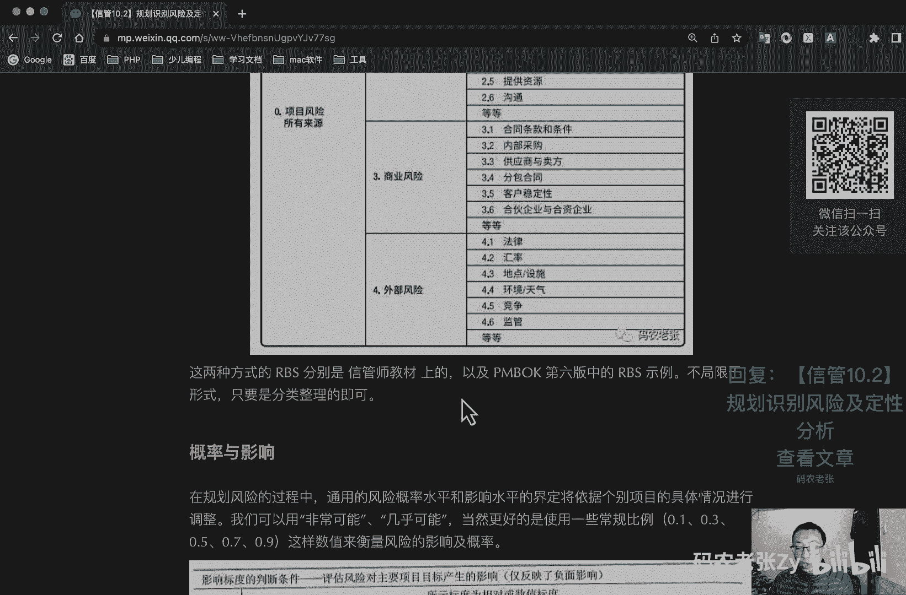
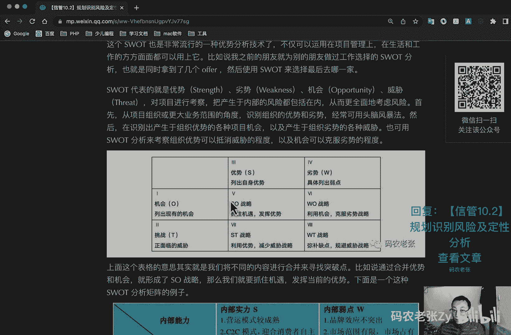
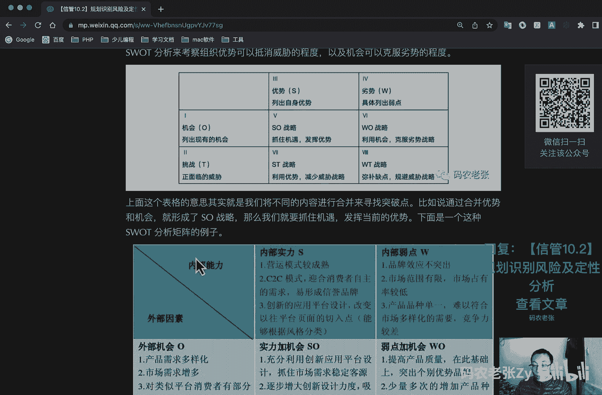
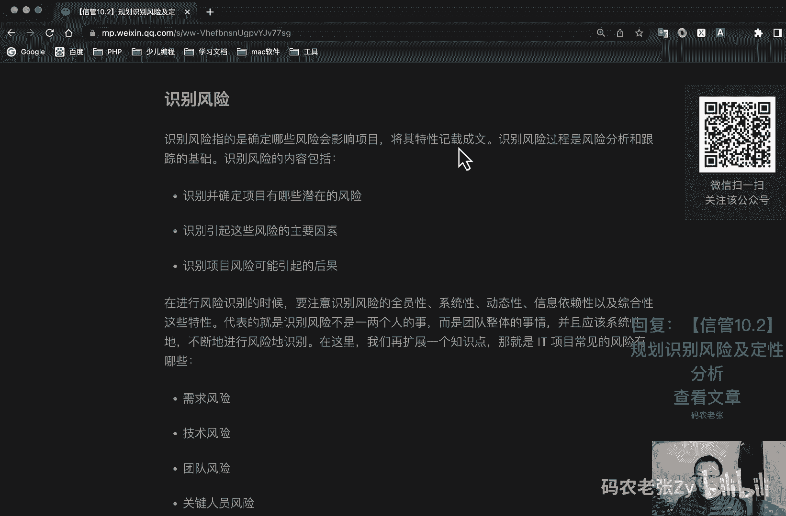
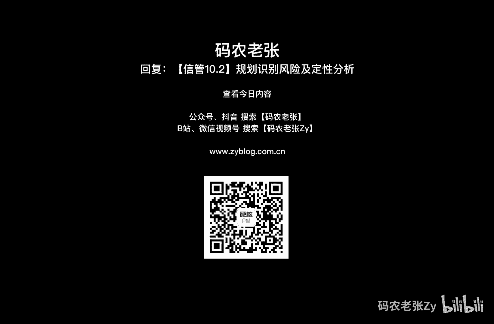

# 【信管10.2】规划识别风险及定性分析 - P1 - 码农老张Zy - BV1oX4y1U7q4

哈喽大家好，今天呢我们来学习的是信息系统项目管理师，第十大篇章的第二篇文章，规划识别风险以及风险的一个定性分析，在了解完风险相关的知识，以及项目风险的管理过程之后呢，我们就进入到每个风险过程的学习。

风险过程的内容并不算少，直逼范围进度，成本质量，四大核心模块也是我们需要重点关注的内容，当年的论文呢我写的就是风险管理通过的，其实相对来说呢，这样的管理过程呢更适合去写论文，为什么呢，因为工具内容多。

如果是干系人的话，反而就不好去凑字数了，好了话不多说，那我们就一个一个来看一下，好第一个就是啊很常见的规划风险管理，好像我们这个p m p里面，或者是我们新款式里面，所有的第一个基本上都是一个规划。

什么什么，对不对，好我们先来看一下，认真明确的进行规划呢，可以提高其他五个风险管理过程，的一个成功概率，规划风险管理的重要性还在于，为风险管理活动安排充足的资源和时间。

并未评估风险奠定一个共同认可的一个基础，规划，风险管理过程呢在项目构思阶段就应该开始，并在项目规划阶段呢早期完成，在这个过程中呢，我们主要关注它的输出，也就是一个风险管理计划，就这样一个东西。

风险管理计划，它的内容主要包括，第一个呢就是方法论，确定实施项目风险管理可使用的方法，工具和数据的一个来源，第二个呢就是角色与职责，确定风险管理计划中每项活动的一个领导，支援与风险管理团队的成员组。

成为这些分配人员呢，进就是为这些东西呢分配人员，并且澄清他们的一个职责，第三个呢就预算分配资源，并估算风险管理所需成本，将之纳入项目成本基准，制定应急储备和管理储备的一个使用方案，接下来呢就是时间安排。

确定在项目整个生命周期中呢，实施风险管理过程的一个次数和频率，并确定应纳入项目进度计划的风险管理活动，接下来呢是风险类别，主要是生成一个风险分解结构rb对吧，还记得有个什么r b s对吧。

我们今天就讲过，就是人力资源管理当中的一个资源分解结构，resource也叫做r b s，然后这边是叫做风险分解结构，好风险概率和影响的定义为确保风险就是定性，风险分析过程的质量和可信度。

要求界定不同层次的风险概率和影响，这里主要就是生成一个概率和影响矩阵，风险概率与影响矩阵，我们在下面会专门讲一个东西，然后呢就是修改的项目干系人承受度，对项目干系人的承受度呢进行一个修订。

接下来呢是报告格式，主要是阐述风险登记册的内容和格式，以及所需的任何其他的风险报告界定，如何对风险管理过程的成果进行记录分析沟通，最后呢就是跟踪说明，如何记录风险活动的各个方面。

好现在呢是r b s使用这个ibs呢，主要就是进行风险的一个简单分类啊，就类似于组织结构图一样的一个树形，分类方式对吧，可以确保系统持续详细和一致的进行风险识别，为保证风险识别的效率和质量的。

风险管理工作提供了一个框架，其实呢他跟那个w bs是非常像的，为什么呢，你看它有这种树形的，看到没有塑形的项目的对吧，然后每一个模块的对不对，然后底下的有技术需求方面的。

技术方面的什么这这这各个方面的对吧，然后呢它也有这种列表形式的，是不是跟w b s非常非常像，w b s的里面也是有列表形式的对吧，在项目就是r b s里面也有这个列表形式的，包括技术风险，对不对。

其实就把上面的这个列表了对吧，我们就可以作为核查表一个一个去打勾，看那个风险有没有问题或者有没有被解决好，这就是r b s啊，这两种呢，这两种方式呢分别是信管式教材上。

以及p m p p bk第六版当中的r b s示例。

不局限于形式啊，只要是分类整理的就可以了，好我们看第二个，这个是比较重要的，叫做概率与影响，在规划风险的过程中呢，通用的风险概率水平和影响水平的界定呢，将依据个别项目的具体情况进行调整。

我们可以用非常可能，几乎可能当然更好的是可以用一些常规的比例，比如说0。10。3，0。5，0。7，0。9，这样的数值来衡量风险的影响以及概率啊，这个呢就是一个风险。

就是一个风险的一个影响概率的一个表格啊，我们可以看一下，非常低对吧，非常低，0。50。05，这个应该是0。05，然后是低0。1，中等0。2，高0。4，然后非常高是0。8，这个就是它发生的概率啊。

让我们看到他们会就是产生了一个成本，就是非常低的话，就是非常小的一个成本增加，然后这个成本增加小于多少，这个是大概10%到20%，同样的就是对进度的一个影响，你的进度一般就是拖延，对不对。

这个呢就是对进度影响，你看他也是这样一路上去的运动上去的，然后就是范围就是不显著的范围减少，就非常就是风险概率非常低的情况下，就是范围的范围内范围内减少不是非常显著的，然后呢就是在次要方面受到影响。

然后就是范围的主要方面受到影响了，这肯定就是从从不太受影响的，然后从到次要的主要的到非常重要的对吧，项目最终的实际成果无法使用，然后呢就是质量啊，质量就是不显著的一个质量降低。

然后呢仅有要求及其严格的应用受到影响，然后就是质量降低，需要发起者的审批，就是一步一步的，都是从最低到最高的一个情况啊，上面这些内容啊就是通过这这四个对吧，范进制成的风险影响比例的确定。

这个只是一个示例啊，就这个表格它只是一个示例，我们需要根据不同的项目情况，进行不同的定义分析，通过定义之后的风险与概率影响的数值，就可以在概率和影响矩阵中，获得这个风险的一个具体的信息啊。

这个这个矩阵是非常重要的，这个矩阵怎么看呢，你看这边是竖的是一个概率对吧，竖的是一个就是就是这个风险事件，它可能发生的概率，就是从我们上面那个表格计算出来的，就是大概的去划划分出来的。

也不一定是计算出来的，划分出来的，这个呢就是一个概率，然后呢就是横轴，横轴是对目标的影响，就是比率标度，比如说成本时间或范围的一个影响，好这两个这两个数值相乘得到的结果呢，就是它的影响与概率矩阵的一个。

具体的一个数值，你看到没有，0。1x0。05对吧，获得了一个结果就是0。01，当然这个是一个那个就是舍弃了，就是只保留小数点两位的一个结果啊，好我们可以看一下这个概率发生非常高，0。09对吧。

这边这个也非常高，这边啊这个这个也非常高，0。80，然后他们合起来的结果是0。72，注意这个是颜色最深的部分，你在最深的部分，这一部分的风险内容呢，就是它的发生概率非常高，然后影响也非常大。

就是这样一种情况，然后呢你注意这个值啊，这个值它中间是分开的啊，这个影像质量中间分开的，这边是叫做威胁，这边是叫做机会对吧，还记得吧，我们说过风险它不一定是威胁，它有可能是机会。

所以说它这个是中间分开的啊，然后它的起始位置其实是从这里开始的，可以把这个中间当成一个就是那个坐标的一个，零值的地方，但是呢他这个就是从大到小的一个啊，就是从这个地方从这个坐标开始，它往这边是越来越小。

往这边呢也是越来越小，大概是这样一个形式的好，所以说中间这一块中间这个题型啊，中间这个题型就是就是影响比较深，然后发生概率也比较大的情况，一般是颜色最深的一块，当然也有可能在一些图里面呢。

它可能就是一个红色的一部分，然后呢注意这个图啊，非常坑人的地方，就是在于就是啊，就是这个影响第二声的一个地方，就大概在这样一个区域，这样一个区域，就是它的概率和那个他的影响相乘的结果。

在就是在中间靠中间这个位置的这个区域，它的颜色其实是浅的偏浅的啊，注意最浅的这个是中间的一个中间的一个曲度，然后呢最浅的这部分就也不是最浅的，就是这个概率影响最低啊，或者是这个目目标影响最低。

或者概率最低的这个这一部分，大概是这样一个位置，这样一个范围之内，这个范围之内呢，其实它的颜色是比中间这一块要稍微深一点的，啊，你注意啊，这个地方一定要注意的好，这个这个图啊，这个图就是这么看的好吧。

这个图这不开，然后这边是机会相关的，这边是机会相关的，它主要两个就是分成了两边，然后从中间这个地方是分开的，好竖的竖轴，纵轴是概率，然后横轴是对目标的一个影响，好了，我们看一下下面这个例子啊。

就比如说一个风险诶，我们认定它是一个威胁，发生的概率是0。7，对目标的影响是0。8，也就是说它的风险等级是高风险，对应对应的深深色的，这个地方应该是0。56对吧，对于这个它的发生概率是0。7。

然后他的那个，他的那个对目标的影响是0。8对吧，所以它的结果是0。56，0。56呢是这个里面比较深的一个部分，所以说呢它就是一个高风险的一个区域，好接下来呢就是呃就是还是要注意的。

就是这个浅最浅的部分是一个中风险的啊，最后就是第二第二声的部分就是中间灰色的，这个部分呢是呃呃低风险的，然后最深的这个部分是高风险的，就一定要注意这个最浅的部分，它不是不是低风险，他是中风险的好。

一般这些题目都会去给出这个图，或者说直接就是告诉你一个概率，告诉你一个影响，然后让你去计算出他们的一个风险，概率的一个结果，其实你就把它们相乘就可以了，这个这个题就不会出的太难，但是这个图就我前面说的。

你一定要看懂就可以了，好我们再来看一下识别风险，就第二个过程了，识别风险，识别风险呢是确定哪些风险会影响项目，将其特性的记载成文，识别风险过程呢是风险分析和跟踪的基础，识别风险的内容呢。

包括识别并确定项目有哪些潜在的风险，识别引起这些风险的一个主要因素，识别项目风险可能引起的一个后果，在进行风险识别的过程中呢，要注意识别风险的是那个全员性系统性，动态性，信息依赖性以及综合性。

这些特性代表就是识别风险，不是一两个人的事，而是团队整体的事情，并且应该系统性的不断的进行风险识别，在这里呢我们再扩展一个知识点，那就是it项目常见的风险有哪些好，最常见的估计大家也是经常见到的。

第一个需求风险，第二个技术风险，第三个团队风险，第四个关键人员风险，第五个预算风险，第六个范围风险，第七个就是商业风险，好具体这个风险的原因呢，我也就不多说了，各位就是在互联网公司工作过的。

或者是参与过这个信息系统开发项目，及信息系统项目开发的，肯定对这些风险的都不会太陌生，特别是什么呢，特别就是这个需求风险和这个技术风险啊，当然团队风险也是比较常见的，比如说干一半中年人离职了，对不对。

这个这个东西就很说不好了对吧，还有关键人员的风险，你的主权跑掉了啊，这个这个也不好说了啊，好对识别风险来说呢，我们最主要关心的就是它的工具与技术，以及输出的一个什么风险登记册，好工具与技术啊。

我们先来看一下，就是我第一个就是文档审查，包括对项目文档进行系统性和结构性的审查，项目需求和假设条件的符合程度呢，也是我们审查的内容，他们均可表现为项目的中项目中的风险指示器，第二个呢就是信息收集技术。

主要包括头脑风暴，德尔菲技术啊，访谈根本原因识别等等，前面三个呢之前我们就已经学习过了，也就不多说了，根本原因识别呢，就是对项目风险的根本原因呢进行一个调查，通过识别根本原因来完善风险定义。

并按照成因对风险进行分类，通过考虑风险的根本原因呢，就能做制定有效的风险应对措施，下一个呢就是核对表分析，根据历史资料呢，与以往类似项目所积累的知识，以及其他信息来源，左手制定，也可以将ibs的最底层。

就是我们前面说的那个那个对吧，把那个ibs当做一个表，一个一个去打勾对吧，那就那种形式就是一个核对表分析，优点呢就是风险识别过程呢是迅速简便的，缺点呢是所制定的核对表的，不可能包罗万象的。

你要你要列多少东西，你才能把所有的风险给列出来，对不对，你风险一般都是在你想象不到的时候，才会出现的，这个才叫做比较严重的风险对吧，所以说这个核对表，风险核对表分析呢它是有一定局限性的。

所以说应该注意探讨，标准核对表上位列初代的事项，在项目收费过程中呢，应对风险核对表进行审核改进，以供将来的项目使用，然后呢就假设分析，根据一套假定设想或假设，进行构思与制定的假检查。

假设有效性的一种技术，辨认不精确不一致，不完整的假设对项目所造成的一个风险，然后呢就是图解技术啊，这个因果图对外我们前面讲过的系统或过程流，流流程图显示系统各要素之间的相互关系，以及因果传导机制。

还有呢就是影响图变量与结果之间的其他关系，的一个图解表示法，好接下来呢就是一个s w o t分析，我们下面会详细的去说的好，我们再来看一下，识别风险的输出呢是一个风险登记册。

风险识别过程呢主要的成果就是风险登记册啊，它是项目管理计划中风险登记册的最初记录呃，通过搜集资料对风险形式的评估，以及根据直接或间接的症状，将潜在的风险识别出来，从而形成风险列表，包括已识别的风险清单。

潜在应对的措施清单，风险根本原因，风险类别更新，风险登记册呢属于风险识别过程，然后供其他风险管理过程和项目管理过程使用，所以说呢它是整个项目管理计划的一部分，在定性风险分析和定量风险分析中。

都会进一步的去完善风险识别，风险识别呢就是风险登记册，包括的主要信息都有以识别的风险清单，前端预算清单等等，就是上面刚刚说过的那四条内容，然后呢就是定性风险分析，更新风险。

项目风险的相对排序或者是优先级清单，按类别按照类别分类的风险，风险成因或需要特别关注的项目领域，近期就需要应对的风险清单，需要进一步分析与应对的风险清单，低优先级别的风险观察清单。

以及定性风险分析结果的一个趋势，最后呢就是定量风险分析啊，更新的内容呢主要有项目的概率分析，实现成本和实现目标的一个概率，量化风险优先级，定量风险分析结果的趋势等等，好我们重点呃。

就是今天的第二个重点就是打s w o t分析，这个动效也是非常流行的一种优势，分析技术的不仅可以运用在项目管理之上，在生活和工作的方方面面都可以用过它，比如说我之前的朋友呢就为别的朋友去。

就有一个朋友去为别的朋友去做过工作，选择了一个s w o t分析，也就是说你同时拿到了几个offer，然后呢使用s w o t来去选择最后去哪一家好，这个s w o t l代表的就是什么，就是一个优势。

然后劣势，然后机会最后就是一个威胁，对项目进行考察，把产生于内部的风险呢都包括在内，从而更全面的考虑风险，首先呢从项目组织或者更大业务范围的角度呢，识别下组织的一个优势和劣势，经常可以用头头脑风暴法。

然后呢，再识别出产生与组织优势的各种项目机会，以及产生与组织劣势的各种威胁，也可以用s w o t分析呢来考察组织优势，以抵消威胁的程度，以及机会可以克服劣势的程度啊，好这个表格的意思呢。

其实我们就是将不同的内容进行组合，来寻找一个突破点，比如说通过合并一个什么呢，通过合并我们的这个优势和机会，我们就形成了一个s o战略对吧，s w o t对不对，我们就是一个呃把握优势，然后抓住机会。

抓住机遇，发挥优势的一个111个这样的一个战略好，有这四个呢它就组成了一个四个象限，对不对，然后我们看第二个象限是什么呢，就是劣势对吧，和机会，这个是什么呢，就是利用机会去克服劣势的一个战略好。

第三种呢其实还是拿优势和挑战来对，来来进行一个什么呃，来来进行一个组合，就形成了一个s t战略，他呢就是利用我们的优势，去减少威胁的一个战略对吧，这个鞋的挑战其实它就是一个威胁对吧，然后呢。

我还可以利用劣势和威胁来进行一个组合，组成一个w t战略，这个w t战略呢其实就是弥补缺点，规避威胁的一个战略，好下面呢还有一个更详细的一个这个，大家自己来看一下就行了好吧。

但是这一块呢就是他的几个组合方案，这种形式啊，你还是要去了解一下的，比如说他可能会在题目中问你，一些这种相关的一个问题啊，就比如说我我我，我把这个s w o t当中的s和t，就是s和t结合起来。

形成了一个什么战略啊，然后上面出一个选择题什么之类的，这个呢你要知道他们，你首先得知道这个s代表什么意思对吧。

你要知道这个t代表什么意思，对不对，你把这两个先要搞清楚好，这个地方呢也是比较重点的一个地方。

可以画一个小星，好，画一个小心好，这个东西呢大家可以自己来再来详细的看一下，ok我们再来看今天要讲的最后一个，就是实施定性的一个风险分析，实施定性，风险分析呢是通过评估单个项目。

风险发生的概率和影响以及其他特征，对风险进行优先级排序，从而为后续分析或行动提供基础的一个过程，在这里啊，就是这个优先级排序，是风险定性分析的最主要的一个特征，它通常是为风险应对，规划过程。

确立优先级的一种经济有效和快捷的方法，并为后面的定量风险分析，如果需要该构成，就是如果你需要这个定量风险分析啊，去奠定一个基础，在这个过程中，我们主要关心的同样也是它的工具和技术啊。

先来看一下工具和技术，第一个呢就是风险概率影响评估，这个讲了好多遍对吧，好像很多过程里面都有它对不对，风险概率评估指的就是调查，每项具体风险发生的可能性，风险影响评估只在调查风险。

对项目目标如时间成本范围或质量的潜在影响，包括既消极或消极影响或者是威胁，也包括积极影响或者是机会，其实还是我们前面那个呃，风风险概率影响评估矩阵对吧好了，第二个就是啊，在这里又讲到了概率和影响矩阵啊。

还是之前我们讲的那个东西，就基于风险等级对风险进行优先级排序，便于进一步的定量分析和风险应对，和我们之前规划风险管理中的概率和影响矩阵，是一模一样的啊，这里会就是这里的东西会更加完善。

并且加入优先级的排序，最后呢也会更新到识别风险的一个，风险登记册当中，然后呢就是风险数据质量评估，评估有关风险的数据，对风险管理的有用程度的一种技术，它包括检查人们对风险的一个理解程度。

以及风险数据的准确性质量，可靠性和完整性好，接下来呢就是风险分类，可以按照风险的来源，就是使用风险分解的矩阵呃，受影响的项目区域，使用工作分解结构或者是其他分类的标准。

比如说项目阶段对项目进行的风险进行分类，以确定受不确定影响最大的项目区域，根据共同的根本原因对风险进行分类，可以有助于制定有效的风险应对措施好，最后一个就是风险紧迫性评估，需要近期采取应对措施的风险呢。

可以被视为有需解决的一个风险，实施风险应对措施所需的时间，风险征兆，警告和风险等级等，都可以作为确定风险优先级或紧迫性，的一个指标，好了，这些工具了解一下就可以了，实时定实施风险定性分析对吧。

定性分析最核心的啊，记住优先级排序啊，它是对风险进行优先级排序的好，我们来总结一下，今天呢我们学习了项目风险管理的前三个过程，分别是规划风险管理，识别风险和实施定性风险分析，在这其中的概率影响矩阵对吧。

这个非常重要，这是一个大型，然后就是s w o t矩阵，这是一个小星，这两个矩阵呢是重点的内容，另外风险登记册会在多个过程之中流转，也是一个重点内容，还需要知道的就是定性风险分析，最主要内容是干嘛。

想一想，最多干嘛，排序对吧，排序剩下内容呢就是各个过程的工具与技术了，多少，都要弄清楚每个过程有哪些工具技术好，下节课我们将学习的是项目，风险管理的后三个过程，其中定量风险分析和风险应对呢。

都非常非常有意思啊，不过相对来说呢重点也会更多一些，ok我们下节课再说好了，今天的内容就是这些，大家可以回复文章的标题，信管10。2规划识别风险以及定性分析，来获得这篇文章的具体内容，更核心的内容呢。

大家还是要在文章里面呢。

来仔细的再看一下好了，今天的内容呢就是这些。

