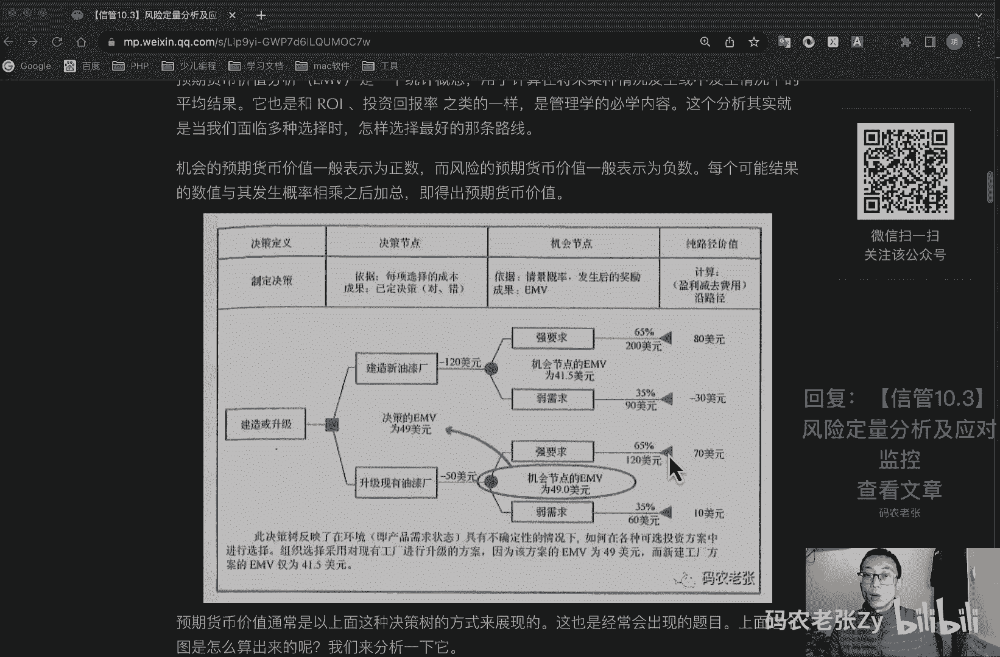
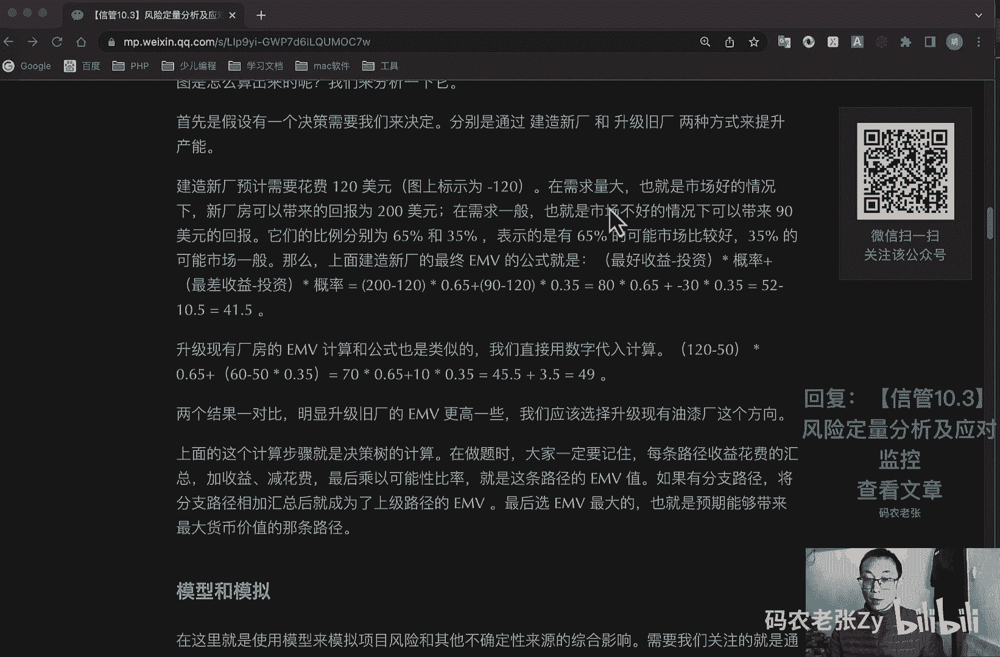
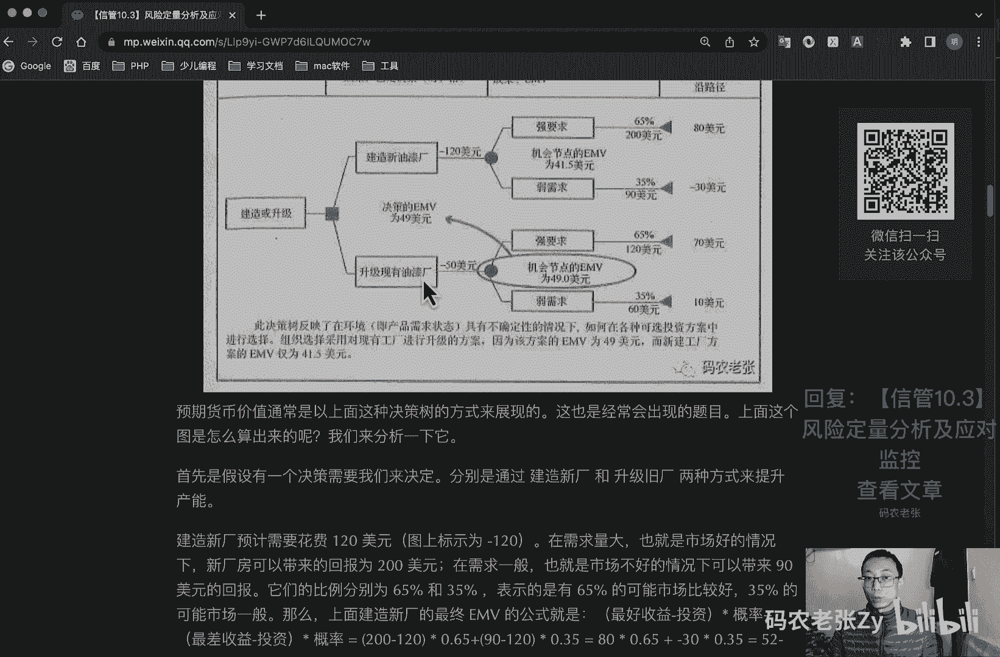
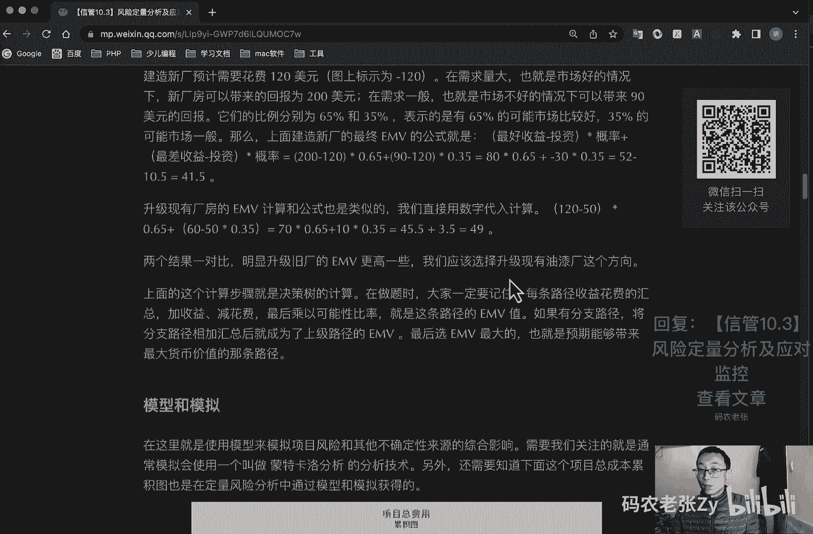
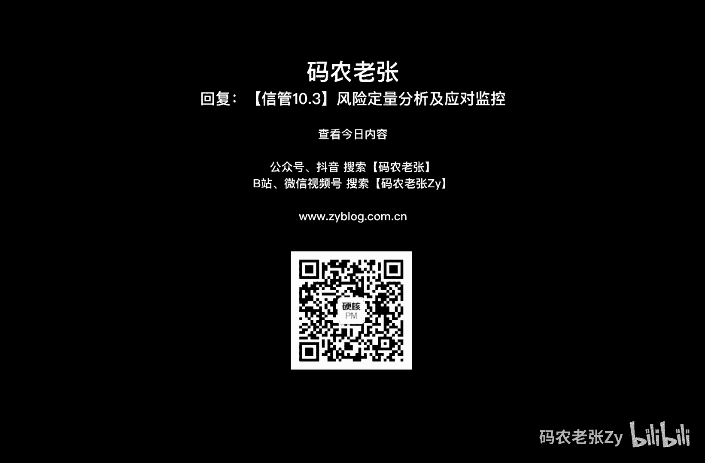

# 【信管10.3】风险定量分析及应对监控 - P1 - 码农老张Zy - BV1zx4y1w71u

哈喽大家好，今天呢我们来学习的是信息系统项目管理师，第十大篇章，第三篇文章，风险定量分析以及应对和监控，好通过前面三个过程，我们已经有了风险登记册，也就是一个所有识别出来的风险情况，然后呢可以通过定性。

风险分析呢来进行分类和排序，接下来呢我们就要继续通过定量，也就是数据的手段呢来继续完善风险登记册，只要有了详细的风险登记册呢，我们才能在后续进行风险的应对以及控制，这个就是我们今天要学习的内容。

好我们先来看一下实施风险定性分析，定量风险分析的过程呢，是对风险事件的影响进行一个分析，毕竟风险分配一一个数值，具体注意啊，定量定量啊，它一定是一个具体的一个数值，他对项目结果以及实现项目结果的概率呢。

进行一个量化，是一种进行项目决策的量化方法，最终评估的是具体项目目标完成了一个概率啊，通过向量化各项风险对项目总体风险的影响，确定需要特别重视的风险，在考虑项目风险的情况下。

确定可以实现的切合的实际的成本进度或范围，目标在某些条件或结果不确定，是确定最佳的项目管理决策，这些都是实施定量分析工具的主要内容，实时定量分析的结果输出呢，也是去更新风险登记册以及概率与影响矩阵。

它的工具与技术，主要包括数据收集技术和表示技术，以及定量风险分析和建模技术，其中的数据收集技术呢又包括访谈概率分布，专家判断，而定量风险分析和建模技术呢，又包括敏感性分析，预期货币价值分析。

决策树分析以及模型和模拟，我们重点要学习呢就是定性定量，风险分析和建模技术当中的这些工具啊，就前面那些什么专家判断概率分布啊，那些的都比较常见的吧，还有访谈什么之类的，我们主要就是讲后面这个里面的好。

我们先来看第一个就是敏感性分析，敏感性分析呢是有助于确定哪些风险，对项目具有最大的潜在影响，最常用的方式呢就是龙卷风图，这个大家就是只要知道有这个东西，并且看到这个图啊。

看到这张图知道它是龙卷风图就可以了，你看那个是不是像一个龙卷风那样的，不就是左边一个右边一个左边一个，右边一个这样拽下来的对吧，然后呢这个呢就是这个这个它的纵轴啊，它的纵轴呢。

其实就是我们的每一个风险情况对吧，你看这前面是风险标号，也或者是一个活动标号，然后呢它的横轴，横轴是与项目持续时间的一个相关性对吧，与项目持续时间的相关性，它有赋值，它有赋值，它也可能有正值，好。

这个呢你只要记住这是一个龙卷风土就可以了，然后大概知道它的纵轴和它的横轴，是一个什么东西就ok了，这个呢是敏感性分析里面会用到的一个工具，好记住这几点就好了，好我们再来看一下。

下一个就是预期货币价值与决策树分析啊，这个东西都是比较重要的，好先记一个单词啊，就emv，emv呢就是预期货币价值分析，它呢是一个统计学的概念，用于计算在将来某种情况下，发生或者不发生情况下的平均结果。

他也是和i o i还有投资回报率之类的一样，还记得这两个吧，我们最早的时候讲过的对吧，在可研的时候讲过的啊，最早的时候是管理学必学的内容，这个分析呢其实就是我们面临多种选择时，怎样选择最好的那条路线。

机会的预期价值呢一般表示为正数，而风险的预期价值呢一般表示为负数，每个可能结果的数值呢，已发生概率相乘之后的加总呢，即得出预期货币价值，好，我们先来看看这张图，看这张图它有它是一个什么呢。

它就是我们去建造一个厂房对吧，我们去建造或者是升级一个厂房，然后他就有两个决策，我们是建造新的一个厂房呢，还是对现有的厂房呢进行一个升级呢，好后面的就是相关的一个数值，最后我们计算出来的结果是什么呢。

最后我们计算出来的结果，就会去让影响我们的决策，就是我们到底要选择哪一边好，我们先来看下面这一边，这个强需求或者是弱需求呢，其实就是对应的，它的一个具体的一个实现的百分比。

然后呢这里呢我们建如果建新的油漆厂呢，我们可能要花费100 -120美元，他有可能会单位是万啊，或者他直接这么写，-120美元也可以啊，方便计算，怎么写都可以好，我们如果去建一个新游戏油漆厂。

然后在效益比较好的情况下，强要求的情况下可能会赚到200 200美元，然后是这个概率是65%好，那么这样的话呢，我们其实就是要拿200去减去我们的支出，对不对，200-120=80美元对吧。

80美元再去乘以0。65，0。65对吧，乘以它的概率好，我们还要怎么样呢，还要去加上他的这个效益不好的情况下，弱需求的情况下，他只能赚到90美元，赚90美元的情况下呢。

我们要拿90美元再去减这个120美元，其实就是-30美元对吧，在这里-30美元，-30美元，再乘以这个0。35%的这个概率，然后把他们两个概率相加之后，最后他的这个就是这个建造新游戏场的一个机。

会节点的emv应该是41。5美元，好。

这个整个过程呢，其实我在下面都已经，我在这里面都已经列出来了，就是我刚刚讲的那一套对吧，就是我们刚刚讲的那一套，200-120x0。65，加上90-120x0。35，等于80x0。65，加上-30x0。

65，结果就是50-10。5，就是等于41。5，其实在这个图上都标出来了，对不对，它的结果就是40 41。5，它的emv是41。5号，记住了好，我们再来看下面这一条线啊，下面这一条线是升级现有的油漆厂。

那它的投入肯定比造一个新的油漆厂，肯定要那个少很多，对不对，少很多的情况下呢，那么他只要支出50美元，然后呢在效益比较好的情况下呢，它可以有120美元的收入，但当当然没有新的游戏厂的收入高对吧。

但是他也有120美元的收入，那么我就120-50，然后乘以0。65，加上60-50，乘以0。33的结果，然后他最后的结果就是49美元，其实从emv来看的话，很明显这个49美元这个机会节点的。

49美元肯定是比41。5美元更好的，所以说在这条路径下面，我们如果通过emv的计算，我们应该选择的是升级现有的油漆厂好，这个呢就是决策树分析，也就是预期货币价值和决策树分析的整个过程，好。

更具体的结果呢大家就可以来这个地方，就是来文章里面呢再详细的来看一下，其实就是我前面讲过的那一套计算模式啊，就是如果就是你一定要记住啊，就是在做题的时候，你一定要记住，就是每条路径收益花费的。

就是收益花费的汇总加收益减花费，最后乘以可能性的比例，就是这条路径的eem v值对吧，我刚刚那种算法，如果有分支路径就是这样，如果还有别的分支啊，还有别的分支路径，我们刚刚上面其实很简单啊。

上面就是两个分支路径，对不对，我们就是就是在两个选择，还有可能有第三个选择啊，那个那个还是比较简单的，第三个选择把它后面的分支也全部累加起来，对不对，还有一种可能呢就是在这个分支底下呢。

他这个路径呢还有好几条对吧，还有好几条，这里只是一个效益比较好，或者效益比较差的情况下的两个分支，他当然还有还会有可就是在实际情况下呢，或者是在出题的时候呢，还会有更多的这种分支情况，不管他有多少对吧。

不管他有多少，他可能还有还有下一级的，只要他跟这个钱有关，跟这个投入有关，每一条路径的汇总汇总汇总，然后在这一层去给他全部加起来ok了，算出来就行了，算出来这一条路径的，算出来这条路径的或者别的路径的。

最后看谁的最高就可以了，就选择哪一个就是最好的了，这个呢就是e mv的一个计算，好这个就不多说了啊，然后具体的更具体的内容呢，大家直接回复文章的标题，然后就可以来这个文章里面好好的来看一下。

好的来看一下这个具体的计算过程，好我们接着往下讲，就是模型和模拟，在这里呢就是使用模型来模拟项目，风险和其他不确定性来源的一个综合影响，需要我们关注的就是，通常模拟会使用一个叫做蒙特卡洛分析啊。

看到蒙特卡洛分析，你要知道他是哪个地方的一个工具与技术啊，是在这里的，模型和模拟是属于风险里面的啊，风险定量风险分析里面的，另外呢还要知道下面这个项目总成本累积图，也就是在定量风险分析中。

通过模型和模拟获得的啊，跟我们那个呃成本的那个s曲线，其实是非常非常像的，好定量风险分析的内容呢就是上面那些了，我们再来看一下规划风险应对啊，这是我们今天的另一块非常重要的一块内容啊。

我们第一块重要的内容是什么呢，第二块重要的内容就是这个啊，这个mv这个呢可以打一个星，好吧好，我们再来看第二个非常重要的内容，就是一个风险的一个应对，规划风险应对呢是指为项目目标增加实现机会。

减少失败或者威胁而制定方案，决定采取措施对策的一个过程，包括确认与指派相关个人或多人，简称风险应对负责人，对已经得到认可并有资金支持的风险应对措施，担负起职责，规划风险应对过程呢。

根据风险的优先级水平处理风险，在需要时呢，在预算进度计划和项目管理计划当中呢，加入资源和活动，我们在这个过程中呢，将要拟定的风险应对措施，与风险的重要性相匹配，能经济有效的应对挑战。

能获得全体相关方的统一，并由一名具体负就是责任人，具体负责风险应对措施呢必须要及时，我们经常需要从几个备选方案中，选择一项最佳的风险应对措施，在这次这个过程中呢，我们需要关注三个工具与技术。

他们分别就是消极风险或威胁的应对策略，然后就是积极风险或机会的一个应对策略，以及应急的应对策略，根据我们之前在风险分类中学习过的内容，就知道风险它不一定是不好的对吧，也有可能是机会风险。

对于不好的风险呢有一套处理方式，而对于积极风险呢，我们也要有一套相应的处理方式，对吧好，我们先来看一下，消极风险或者是威胁的一个应对策略，就对于不好的风险来说，我们能怎么处理呢，就是当然要要么就回避它。

对不对，要么就把这个风险转移到别人那里去嘛对吧，要么就减轻影响，要么最后实在不行，我们就只能接受这个风险，然后我们再自己想办法去处理嘛，是不是好，那我们就一个一个具体来看一下，其实就这四个方法。

第一个呢就叫做回避啊，回避就是指改变项目计划，以排除风险或条件，或者保护项目标，使其不受影响，对受到的威胁呢，一些目标放松，要求回避，最典型的例子呢，就是担心有什么事情就不要去做这些事情。

比如说你怕卡鱼刺，那你别吃鱼呗，或者说吃没有次，等于对不对，回避掉这个风险，然后做项目其实也一样的，你觉得这个支付这个支付这个功能啊，或者是说你这个什么白条的，是类似于白条的这个功能。

就是平常你做的时候就风险就非常大的对吧，金融相关的项目，平常做的时候这种东西风险就相当大的，那么你如何用回避呢，就是你直接干脆不要这个功能了对吧，这就是一个回避好，第二个就是转移。

转移风险是指设法将风险的后果呢，连同应对的责任转移到第三方身上，转移是将风险管理的责任推给另外一方，而并非将其排除，最典型的例子就是什么买保险，不管是企业还是我们个人啊，保险都是对我们的。

将我们的风险转移给了谁啊，保险公司，但是即使有保险公司来管理风险，假如出事的话，我们还是肯定要倒霉的对吧，风险依然是发生了，但是呢我们要承担的内容很少，甚至说呢可能我们不太需要去承担什么后果。

这一块在商业保险里面，就是就是对于公司的这种保险里面来说呢，可能大家会接触的比较少啊，就是我们从我们个人的角度来说呢，其实买保险就是将我们的这些风险，将我们就是健康啊，或者是各个方面的一个风险。

就转移给了保险公司对吧，其实做做项目也是一样的，你也可以去买一份项目相关的一个保险，对不对，然后把一部分的功能的一些风险转移给他们，或者说你呃，就还是前面那个金融相关的例子对吧。

去接入一些第三方的一种那个风控啊，或者大数据的一些验证啊，然后跟他们去签一些合同啊，然后就相当于也给他们转移了一部分风险，对不对，好下一个呢就是减轻，减轻呢，就是指设法把不利的风险事件的概率或者后果。

会降低到一个可接受的临界值，这个好解释啊，就就比如说我们普通人嘛对吧，为了能够多活几年，戒烟戒酒啊，运动啊，喝枸杞啊，都是我们的一个减轻策略，但是对于项目来说呢，详尽的测试啊或者是调试呢。

它也是一种减轻策略，对不对，尽量的去给他测试，好对吧，就是一种减轻策略好最后一个就是接受了，这个就是指项目团队决定接受风险的存在，而不采取任何措施，他就是在上面其他三个方法啊。

就上面这三个方法回避转移和减轻呢，都不能使用的时候所使用的，或者说其他方法不具备经济性，通常来说呢未知未知的风险，大部分情况下呢我们是只能接受了，还记得讲个未知未知的风险啊，你不知道他发生的概率啊。

也不知道它发生之后的后果啊，这个就是未知未知的风险，这种风险呢没办法了，真的没办法，我们只能先只能先接受啊，注意我们是第一步，这里所强调的都是第一步，是怎么样的，我们第一步当然只能先接受了，对不对。

后面你要怎么弄的话，那后面的事了好，因为我们对于这个风险一无所知，对不对，好这个时候呢就只能这样了，好有消极的风险应对对吧，也有积极的风险应对积极积极的风险呢，其实堂堂也率指的是机会对吧。

如果把握住了机会，就能为我们带来许多益处，那么对于积极的风险呢，我们要扩大价值去争取，要么寻求合作去获利，要么提高它出现或成功的概率，要么也可以不做任何操作的去接受好，我们一个一个来看一下。

其实也就是刚刚说的这句话，ok第一个方法呢就是开拓，通过确保机会肯定实现，而消除与特定积极风险相关的不确定性，简言之呢就是通过分配更多的资源，扩大风险事件的价值，让更多人关注。

并且尽量保证这种风险的实现，投融资领域呢常见这类开阔技术的一个应用，ok第二种呢就是分享，分享呢是指将风险的责任呢，分配给最能为项目的利益获取机会的第三方，包括建立分享。

那就是风险的分享合作关系后专门为机会管理，形成项目团队，如果说上面的开拓呢是自己有实力拿下，那么分享的就是这可能自己的实力不够，然后就联合第三方呢一起保证去拿下机会，ok第一个是自己加大资金投入对吧。

第二个是找别人一起来合作好，第三个呢就是提高，通过提高积极风险的概率或积极影响识别，最大程度发挥这些积极风险的驱动因素，致力于改变风机会的一个大小，就是就就这个东西，就是说不一定能完全吃下所有的机会。

那么就提升他出现的一个机会，或者是说把握的一个概率，同样你这个也可以拿那个就是就是怎么说的，测试，就做做详尽的测试啊，然后去小规模的去进行一个市场一个投放啊，验证啊什么的都可以获得一些提高的效果啊。

好最后就是一个接受，同样啊就是接受这个东西啊，它是同时适用于威胁的还和机会的啊，这个是非常有意思的，就是你说上面这些都不行了之后，我们就只能去接受这个这个机会了啊，这个机会我们也只能去接受了。

ok这个呢就是它是同时适用于积极和消极风险，应对的好，最后一个就是应急的一个应对策略，可以针对某些特定事件专门设计一些应对措施，对于有些风险项目团队呢，可以制定应应急应对策略，即使在某些预定条件发生时。

才能实施的应对计划，如果确信风险的发生呢，会有充分的预警信号，就应该制定应急应对策略，采用这一技术制定的风险应对方案呢，通常称为应急计划，就是弹回计划，其中包括以识别用于启动计划的，一个触发事件等等。

好这个就是了解一下就行了，然后呢比较重要的是上面这两个，上面这两个他随便就出一个什么题，随便就出一个题目什么题，然后问你这是什么的风险应对措施啊，注意啊，注意啊，一定要审清楚题。

你要知道你首先得搞清楚它是机会还是威胁，对不对，搞清楚了机会和威胁之后呢，你要看他注意啊，第一第一次碰就是你第一反应去处理的情况下，比如说碰到一些事，我们只能去接受了，那么他的第一处理就是接受。

而不要看他受他后面的话影响，他后面可能又说他去干嘛干嘛干嘛了，去采取别的一些方案什么那些的，但是他第一步第一步他是接受的，那么他的这个风险处理方式呢，他就是接受这个是非常重要的，这个是非常重要的。

一定要搞清楚的好，这个呢大家也可以去网上啊，或者去买一些资料啊，多刷刷题，这个这个这个地方选择题啊，虽说分可能不多，但是它可能会让你要是当然也非常有意思啊，这个东西好，我们再来看一下最后一个过程啊。

就是控制风险，在项目生命期实施项目管理计划，包含的风险应对措施时呢，应持续对项目工作进行监督，以寻找新的风险和变化的风险，风险监测与控制只识别分析和规划形成风险，最终以识别风险和观察清单中的风险。

重新分析现有风险，监测应急计划的触发条件，监测残余风险，审查风险应对策略的实施，并评估其效力的过程，一般应围绕项目风险的基本问题，制定科学的风险监控标准，采用系统的管理方法，建立有效的风险预警系统。

做好应急计划，实施高效的风险，项目风险监控好他的工具技术啊，第一个就是风险在评估，对新风险这个东西很有意思啊，你这他他这个监控风险，也是要记住这几个名词啊，这几个名词第一个就是风险再评估啊。

对新风险进行识别，对旧风险呢进行重新评估，就叫做风险再评估，我们应安排定期进行项目风险的再评估，重复的内容和详细程度呢，取决于项目对于风险的目标的一个视效情况好，第二个叫做风险审计啊。

风险审计是检查并记录风险应对措施，在处理与识别风险及其根源方面的有效性，以及风险管理过程的一个有效性，第三个呢就是偏差和趋势分析，很多控制过程呢都会借助偏差分析来比较，计划结果与实际结果，为了控制风险。

应该利用绩效信息呢，对项目执行的趋势进行审查，可以使用正值分析及项目偏差，以及趋势分析的其他方法，对项目总体绩效呢进行监控，这些分析的结果呢可以揭示项目在未完成时，可能偏离成本和进度目标的程度。

与基准计划的偏差呢，可能表明威胁或机会的一个潜在影响，接下来呢叫做技术绩效测量，它呢是把项目执行期间所取得的技术成果，关于取得成果的技术计划进行相比较，他要求定义关于绩效的客观的量化的测量指标。

以便据此比较实际结果与计划，要求这些技术计量，绩效测量指标呢可包括重要性啊，处理时间啊，缺陷数量和存储容量等等，偏差值，就是如果在某些里程碑时间点，实现了比计划更多过少的功能。

有助于预测项目范围方面的一个成功程度，最后呢就是储备分析啊，在项目实施过程中，可能会发生一些对预算或者是进度，应急储备造成积极或消极影响的风险，储备分析呢只在项目的任何时点。

将剩余的储备与任务分析风险量进行比较，以确定剩余的储备是否仍旧充足对吧，什么储备管理储备，应急储备对吧，还记得吧，再再去再去想一下啊，回回忆一下这两个储备是干嘛的，好说出，在监控风险的输出中呢。

主要输出的就是变更的请求，也就是发现或者发生风险之后，要产生变更来应对风险，在这其中呢有个名词需要我们了解一下，那就是全变措施，好，又是一个名词，全变措施是指针对以往未曾识别或被动接受的。

目前正在发生的风险而采取的，未经事先计划的应对措施，就叫做全变措施啊，几个关键词啊，记住啊，未曾识别的被动接受的目前正在发生的风险，未经事先计划的一个应对措施，ok补充资料。

最后就是补充一些信息系统风险相关的内容，好我们第一看一下，就是硬件集成项目风险产生的原因，这个呢主要包括产品的日趋复杂性啊，依赖多个厂家的知识和技术来源啊，采用产品组合和功能交叉的方法。

项目管理与企业战略的一个紧密结合，产品更新周期的一个缩短啊，满足顾客的需求，市场的激烈竞争，参与者的利益不同，多方面与技术，专业技术的集成，依赖更复杂的工具，ok如果你是跟项目经理玩的比较好。

或者你本身就是就是产品比较好，产品经理，如果你跟产品经理玩的比较好，或者是你本身就是产品经理的话，这个东西不会太陌生好了，下面一个就是软件上面的主要风险啊，这个就是写代码的可能会比较常见的。

第一个就是项目规模的一个风险，看它的规模大小，然后就是需求风险，需求不明确，然后就外部因素的风险，内部管理的风险，最后就是技术方面的一个风险啊，技术选型好了，软件项目风险产生的原因呃。

第一个呢就是产品的定位错误，还是跟需求有关的，第二个人员流动对吧，第三个项目管理失败，第四个就是开发目标不明确或者是摇摆不定，然后呢就是开发计划，执行计划呢受到严重影响，接下来技术方案有缺陷。

项目经费超支或者不足，开发环境或过程的一个混乱，最后产品质量低劣，最后就是一个需求发生了变化啊，需求很重要对吧，需求很重要，好项目软件项目经理经常遇到的15种可预料，包括已知的风险及其预防措施啊。

这个我就快点读了好，第一个就是合同风险预防办法呢，是项目建设支出呢，项目经理就需要全面准确的了解和合同，各条款的内容，尽早告知合同方，就模糊或者不明确的条款的，来订立一个补充的协议。

第二个呢就是需求变更的风险预防的办法呢，就是项目建设出呢，就和用户书面约定好需求变更控制流程记录，并归档用户的需求变更申请，第三个呢就是沟通不良的风险预防办法呢，是项目建设支出呢。

就和项目各方干系人约定好沟通的渠道和方式，项目建设过程中，多核项目各方干系人交流和沟通，注意培养和锻炼自身的一个沟通技巧，下个呢就是缺乏领导支持的风险预防办法呢，是主动争取领导对项目的重视。

确保领导的沟通渠道顺畅，经常汇报工作进展，下面的进度风险预防办法呢，就是分阶段交付产品，增加项目监控的频度和力度，多运用可行的办法保证工作质量，避免返工，接下来呢是质量风险预防办法呢。

一般是经常和用户交流工作成果，采用符合要求的开发流程，认真组织对产出物的检查和平时证，计划和组织严格的独立测试等好，接下来呢就是呃系统性能的风险，我先把这个调一下，刚刚没有开倍速啊，没有开倍速好了。

这是正常的语速哈，接下来就是正常语速稍微加快一点啊，接下来就是系统性能的风险预防办法呢，就是在进行项目开发之前呢，先设计和构建出系统的一个基础架构呢，并进行性能测试呃。

确保架构符合性能指标后再进行后续工作，这样的工具风险预防办法呢，就是一般在项目的启动阶段，就落实好各项工作的来源，获得可能的替代工具，在这些工具需要使用之前呢，一般需要提前一个月左右。

跟踪并落实工具的一个到位适宜，然后呢这个技术风险预防办法呢，就是选用项目项目组比要说必须的一个技术，而且是你比较熟悉的技术啊，这个东西是这个东西，我是比较强的，因为因为我是做技术出身的嘛对吧。

所以说在技术运用之前呢，针对相关人员开展好技术培训工作，接下来就是团队成员能力和素质，风险预防办法呢就是在用人之前选对人，然后开展有针对性的培训，将合适的人安排到合适的岗位之上。

接下来是团队成员协作的风险，预防办法呢是在项目建设支出，项目经理就需要将项目目标，工作任务等和项项目成员沟通清楚，采用公平公正公开的绩效考评制度，倡导团结互助的工作风尚等。

接下来呢就是人员流动风险预防办法，是尽可能将项目的核心工作分配给更多人，而不要集中在个别人身上，加强同类型人才的培养和储备，接下来呢是工作环境的风险预防办法呢，就是在项目建设之前。

就选择和建设好满足项目成员期望的办公环境，在项目的建设过程中，不断培育和调整出和谐的人文环境，最后一个阶段啊，这还不是最后一个，我看看啊，接着往下再划一下，好倒数第二个就是系统运行环境风险。

预防办法呢是和用户签订相关的协议，跟进系统集成部分的实施进度，及时提醒用户等等，最后一个就是风斑霜的一个风险啊，就是预防办法呢一般是指指定封包经理呃，全程监督分包商的活动，让分包商采用经认可的开发流程。

督促分包商及时提交和汇报工作成果，及时审计分包商工作成果等等，好总结一下，今天的内容不少对吧，我们的重点需要关注的就是预期货币价值，e mv相关的计算啊，打一个新对吧，打一个新，然后呢积极和风险。

积极和消极风险应对措施，打个信，其实重点内容也不多，但他们内容呢也是希望大家能够多多了解的，至少那个印象风险管理相关内容呢，我们就结束了，之后呢，我们将进入到最后一个项目管理，知识领域的学习。

也就是项目采购管理好胜利就在眼前了，大家加把劲，ok今天内容呢就是这些，大家可以回复文章的标题，信管10。3，风险定量分析及应对监控，来获得这篇文章的具体内容啊，想更详细的内容呢。

大家还是要到文章里面来看一下的。

ok今天的内容呢就是这些。

