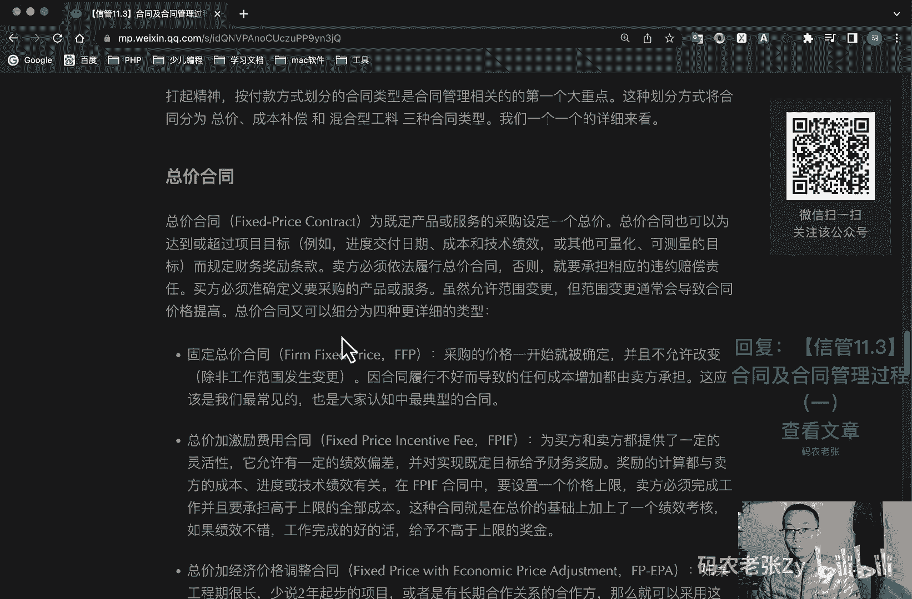

# 【信管11.3】合同及合同管理过程（一） - P1 - 码农老张Zy - BV1AL411k74f

hello，大家好，今天呢我们来学习的是信管11。3，合同以及合同管理过程呃，合同这个东西啊，我觉得就是大家应该都是多少会接触过一点的，为什么这么说呢，因为它有广义和狭义之分，如果按广义来说呢。

我们的口头的约定他也算是一个合同，就是说呢你答应的事情要做到，你有义务去完成对吧，你要答应解决这个问题，你就有权利去调动一些资源，通常来说呢，只要你发出邀约，发出一个邀约。

那么对方如果接受并且兑现一个承诺，那么这就是一个合同的一个过程对吧，合同的，不过我们主要研究的，还是以纸质的工程合同为主，也就是狭义的合同性质还是一样的，就是邀约和承诺的一个兑现，这是他们的一个共同点。

好我们先来看一下合同啊，合同它是民事主体之间设立变更，终止民事法律关系的一个协议，依法成立的合同，受法律保护的，依法成立的合同，仅对当事人具有法律约束力，但是法律另有规定的除外。

婚姻收养监护等有关身份关系的协议，适用有关该身份起关系的法律规定，没有规定的，可以根据其性质参照适用第三方规定，这个不算合同了啊，上面这一段话就是这一段话，就是这一整段话它是百科。

就是百度百科当中的一个定义，就可以看出呢，合同是具有法律效率的，不管你是购房合同和贷款合同，还是别的什么合同，只要是正规合法的合同，都是受我们国家法律保护的，说白了合同是一种约束行为。

让承诺方能够兑现承诺，明确双方的权利和义务，话说回来，我们更关心的其实还是那个什么项目，工程这一块的合同，但是他逃脱不了这个合同的这个大概念啊，好我们来看一下项目合同的内容，项目合同的具体条款呢。

由当事人各方自行约定，主要是说明当事人各方的一个权利和义务，项目费用以及工程款的一个支付方式啊，项目变更约定，还有最主要的就是一个责任关系，具体来说呢它主要包括哪些内容呢，第一个就是项目名称。

第二个就是标的啊，标的的内容和范围，然后就是项目的质量要求，项目的计划进度地点，地域方式，项目建设过程中的各种期限，项目情报和资料的保密风险，责任的承担，技术成果的归属，验收的标准和方法。

价款报酬以及其支付的一个方式，违约金或者是损失赔偿的一个计算方法，解决争议的方法，名词术语的解释，另外呢还可以包括一些补充资料，比如说相关文档资料变更，约定技术支持服务等等，这个了解一下就行了。

好我们再来看一下无效合同以及违约责任，正常来说呢，合同签订了之后，各方就要按照合同约定履行自己的权利和义务，但如果有下述问题，那么可以使当前的合同为无效合同，双方均可以提出解除解约，废除合同。

第一个呢就是一方以欺诈胁迫手段，订立合同的好，第二个就是恶意串通，损害国家集体或者第三人利益的，第三个呢就是以合法形式掩盖非法目的的，最后呢就是呃，第四个就是以损害社会公共利益的，第五个就是违反法律。

行政法规或者强制性规定的好了，那么对于我们信息系统项目来说，比较多的情况呢，可能是资金无法到位啊，这个一般是比较常见的一个问题，或者说是项目延期超时比较多见啊，完全违法的行为，相信大家也都是心里有数的。

不会贸然去签订这样的合同，毕竟遵纪守法是我们每一个公民的基本素养，如果发生了违约的情况，那么违约责任的承担呢主要也有几种方式啊，第一个呢就是继续去旅行，把合同执行完，第二个呢就是采取补救的一些措施。

第三个呢就是直接赔偿损失了，第四个呢就是支付违约金或者是定金好，一般来说比较常见的，可能就是各种补偿的赔偿的方案，也就是下面这两种啊，这个具体情况不同呢，可能采取的手段也是不同的。

合同类型和呃就是合同类型啊，第一个我们以项目范围来进行一个划分，项目合同呢一般可以按照两种类型划分，我们先来看第一种啊，也就是以项目的范围来为标准，来进行合同类别来划分。

这种划分方式呢可以将合同分为三种，分别是项目总承包合同，项目单项承包合同以及项目分包合同，项目总承包合同啊，他是买方将项目的全过程作为一个整体，发包给同一个卖方的合同，总承包合同要求。

只与同一个卖方式订立承包合同，但并不意味着只订立一个总合同，可以采用订立一个总合同的形式，也可以采用订立若干个合同的形式，这种合同呢一般适用于经验丰富，技术实力雄厚且组织管理协调能力强的卖方。

这样有利于发挥卖方的专业优势，保证项目质量和进度，提高投资效益，然后呢就是项目单项承包合同，一个卖方呢只承包项目中的某一项，或者是某几项合同，买方分别与不同的卖方订立单项目，单项承包合同，这样的合同呢。

有利于吸引更多的卖方参与投标竞争，使买方可以选择在某一单项上实力强的卖方，也有利于卖方专注于自身经验丰富，且技术实力雄厚部分的建设，但是这种方式呢对于买方的组织管理，协调能力提出了一个比较高的一个要求。

然后呢就是项目分包合同，这个呢就是卖方将其承包项目的某一部分，或者是某几部分，在发包给其他具有相应资质条件的分包方，与分包方订立的合同呢称为项目分包合同定理，项目分包合同呢必须同时满足五个条件啊。

这个是比较特点有特点的，第一个呢就是就是你的分包的分包商，必须是经过买方认可的啊，这个很重要，经过买方认可的，第二个呢就是分包部分，必须是项目的一个非主体工作，你不能把你完全主要的工作再给分包。

到底给别人了，对不对，那么那么这样的话，其实我我直接跟你的分包商去谈不就行了吗，我干嘛还要把这些工作交给你来做，对不对，好了，一定是非主体的工作，再接下来呢就是只能分包部分项目，而不能转包整个项目。

跟前面说的那个意思是一样的，好了，分包必须具备相应的资质条件，就是你分包商也必须具有跟你一模一样的，那些资质条件，你才能有资格成为，就是你这个分包商才能有资格来接我们的项目。

最后呢就是分包方不能再次去分包，我们只能分包一次啊，这个就是只能分包一次，不能你的分包方分包商，然后再去分包，然后再去分包，然后再去分包，那样到后面就扯不清了，对吧好。

我们接下来呢再看一种合同类型的划分方式啊，这个是非常重点的，前面那个就是呃小重点吧，小小的一个信号，这个就是非常非常重点的内容啊，非常非常重点，按付款方式进行划分的好，这个这个呢它会分为三种类型的合同。

分别为总价合同，成本补偿合同和混合型公料三种合同类型，我们一个来看，第一个呢叫做总价合同啊，就是这个英文单词，然后fpc也是代表这个总价合同的，他呢是为既定产品或者服务采购设定一个总价。

总价合同呢也可以为达到或者超过项目目标，例如进度交付日期，成本和技术绩效，或者其他可量化可测量的目标，而规定财务奖励条款，卖方呢必须依法履行总价合同，否则就要承担相应的违约赔偿责任。

买方呢必须准确定义要采购的产品或服务，虽然允许范围变更，但范围变更通常会导致合同价格的提高，总价合同呢它又可以细分为三种类型的合同了，第一个合同呢就是固定总价合同，简称是f f p。

采购的价格一开始就被确定，并且不允许改变，除非工作范围发生变更，因合同履行不好而导致的任何成本增加呢，都由卖方承担，这个其实应该是我们最常见的那种合同，也是大家认知中最典型的那个合同。

就是你谈好了一个价格之后，我要做哪些事情，对不对，然后我们两个把合同一签就完了，包括你租房子，买房子也都是一样的，你租房子租多久，是不是我们把那个把价格说好了之后，然后该交定金，该交那个什么押金。

交押金交完了之后呢，你就做就行了，如果你提前退租了，是不是押金我就不退了，或者说我这边不能租给你了，然后我可能就要赔你一些钱，对不对，这个呢一般都是直接就定好了，在合同里面全都是这些详细的内容。

全都已经写好了，这个呢就是固定总价合同啊，好第二种呢就是总价加激励费用合同，它的简称是f p i f啊，这这些简称很重要，为买方和卖方都提供了一定的灵活性，它允许有一定的绩效偏差。

针对实现既定目标给予一些什么财务奖励，奖励的计算呢，都与卖方的成本进度或者是技术绩效有关，在f p f合同当中呢，要设置一个价格的一个上限啊，卖方必须完成工作，并且要承担高于上限的全部成本。

这种合同呢是在总价的基础上，加了一个什么绩效考核，就是这个价格完全是固定的，这个呢多了一个绩效考核，如果绩效不错，工作完成的好的话，给予高于上限的一个奖金好，这个呢就是总价加激励费用合同。

然后呢就是总价加经济价格调整活动啊，这个比较差，叫做f p e p a好，如果工期很长啊，少说2年起步的项目，或者说是有长期合作关系的合作方，那么就可以采取这种合同，它是一种非常特殊的合同。

允许根据条件变化，例如说通货膨胀或者某些特殊产品的成本，增加或者降低等等，以事先确定的方式，对合同价格进行一个最终调整，这个好理解啊，就是说你现在的就我们之前学了那个货币价值，对不对啊。

就是就是计算那个净现值那一块的，你现在的100块钱跟2年后或者是很长，你们要合作很长时间，对不对，你现在签了个100万的合同，但是2年或后或者是5年以后，你的100万跟那个时候的100万。

就这个性质就完全不一样了，对不对，所以说呢这个就是总价加上经济，价格的调整和活动合同，他呢就是可以保护卖买方和卖方，免受外界不可控的一个情况的影响，合同条款呢必须规定，用于准确调整最终价格的。

可靠的一个财务数据啊，这个价格是可以进行一个调整的，最终调整的好，最后一种叫做订购单，当非大量采购标准化产品时，通常可以由买方直接填写，卖方提供的一个订购单，卖方呢造此供货，由于订购单通常不需要谈判。

所以说呢它又成为一个单边合同，好我们总结一下这个总价合同呢它有四种，对不对，我们上面讲了四种，对于总价合同来说呢，这种合同的买方风险是比较小的，卖方的利润是未知的，对不对，买方风险为什么小呢。

因为我们提前把把这个价格给确定了对吧，如果你卖方卖方用这些钱完成不了的话，那么跟我没关系的，对不对，我所以说我的风险是比较小的，你超出的超出的那些成本是不是你要去分，你要去承担的。

这个就是总价合同最大的一个特点，最大的一个好处，然后呢就是它的适合适合范围明确实呢，但不容易修改范围，为什么，就是你如果你要修改范围的话，那么我们合同的价格就要变，对不对，合同价格要变的话。

就要重新去签订合同，所以说这一块是稍微麻烦一点的地方，这就是它的优势和他的一个劣势都列在这里了，对吧，不容易修改范围是它的一个劣势啊，好其中固定总价合同呢就是固定总价合同，就是说好价格就不变的。

就是我们最常见的那种合同对吧，他的修改范围是要加钱的，然后合同可能要重新签或者是增加条款对吧，好，第二种呢就是总价加激励费用，合同这个东西啊，要看绩效，他多了一个绩效，绩效好了就给不超过上限的一个奖金。

然后呢就是总价加经济价格调整合同，这种合同是合作时间非常长的，需要强大的财务团队来支持的，最后呢就是订购单，它呢是一个单边合同，不谈判下单就可以了，我照你的单子给你发货就可以了，对吧好。

这个呢就是叫总价合同，好，我们再来看第二个非常重要的，叫做成本补偿合同，成本补偿合同啊，它的英文简写可以是什么c r c对吧，他呢是向卖方支付未完成工作而发生的，全不合法实际成本，也就是可保销成本。

对吧是吧，就是说就是这个怎么理解呢，就是说我要做一项工作，对不对，我要开发一个网站或者干嘛的话，那么如果就是乙方乙方，他发生的所有成本都是由我来报销的，明白这个意思吧，由我来报销了。

然后呢再外加一笔费用作为卖方的利润，作为卖方的利润k这种合同啊，买方的风险是比较大的，我们前面说总价合同，买方的风险是小的，对不对，因为我们谈好了之后，如果如果你做出来的东西，你的成本超支了。

那么是你乙方的问题，我们不需要任何的承担，但是成本补偿合同，就是你乙方发生的所有合法的实际成本，可报销成本呢，我们都要去承担的，所以说这个这个合同啊，他对买买方的风险是比较大的，对卖方的风险是比较小的。

适用于买方，只知道要一个什么产品，但不知道具体工作范围的一个情况，也就是说这种合同啊，他的工作范围是很不清楚的，也就是说他非常方便的去修改工作范围，ok这样的话其实我们也都看出来了。

成本补偿合同和我们前面讲的那个什么，前面讲的总价合同，他们俩就是完全相反过来的对吧，总价合同是买方风险小，卖方利润未知，而成本补偿合同呢是买方风险大，卖方利润是可知的，或者说是固定的，而且卖方的利卖粉。

他因为他是卖加一笔费用给卖方的对吧，所以说也也也不是说完全可知的了，就是说卖方的成本是比较就是比较透明的，我支出了多少成本都由买方来承担的，第二个呢就是它的劣势。

就是总价合同的劣势是呃不容易修改范围对吧，修改范围呢要加钱，要重新签合同，或者是重新增加条款是比较麻烦的，但是呢成本补偿合同，他呢就是比较适合这种情况的，就是工作范围不是很清楚的一个项目的啊，好。

那么它的缺点呢，就是在于买方对工程造价不易控制，卖方呢也往往不注意去降低一个项目的成本，因为我的成本都可以交给甲方去报销了，对不对，我们也就不会太注意去降低项目成本了，那么同样的买方也对甲方呢。

他一定要对工程造价是比较清楚的，否则就被别人坑了对吧好，同样的成本补偿合同呢，也可以先分为三种类型啊，第一个呢就是成本加上固定费用合同啊，成本加固定费用合同，它的简称是cpf f，这个呢就是为卖方报销。

履行合同工作所发生的一切合法成本，ok这个这个都是一样的，然后呢向卖方支付一笔固定的费用作为利润啊，该费用与项目初始估算成本的目标，成本的某100分比来计算，比如说我就给你2%的一个。

就是你那个成本的2%的一个金额，作为一个利润对吧，这个就是一个固定的百分比来进行计算，费用呢只能针对已经完成的工作来支付，并且不因卖方的绩效而变化，注意这里是固定的。

就是完成了我们就要把这笔钱就交给了乙方好，第二种呢叫做成本加激励费用合同，它的简称是cp i f，这个呢是为卖方报销履行，报销履行合同工作所发生的一切合本合法成本，这个也是一样的。

然后呢在卖方达到合同规定的绩效目标时呢，向卖方支付预先确定的激励费用，在cp i f合同之下，如果卖方的实际成本低于目标成本，结余的部分呢，由双方按照一定的比例去分成。

然后呢如果卖方的实际成本高于我们的，就是签订合同时的目标成本，那么超过目标成本的部分呢，由双方按鼎力去承担，注意激励费用呢就是目标达成时才会给你的，然后呢还要根据目标成本来计算，是不固定的。

而且如果我们超过目标成本了，我们双方要去承担这个超出的一个成本，如果我们是实际，就是就就是说我们乙方做出来的，它实际的成本是低于目标成本的，那么我们肯定是大赚的对吧，肯定是赚到钱的。

如果我们超出目标成本的，那么其实乙方可能还要亏钱的好吧，就这个意思，ok然后还有一种呢，就是成本加上奖励费用合同叫做c p a f，就是同样哈，还是为卖方去报销所有的合法成本对吧，这个就不用多说了。

然后呢买方在凭自己的主观感觉给卖方支付，支付一笔利润，注意这个是主观感觉啊，主观感觉很重要，这种奖励费用呢就是完全由买方，买方的主观感受来确定的，根据卖方的绩效来决定奖励费用，并且卖方通常无权申诉。

注意这里一定是买方的主观感受啊，一定要注意的是买方的主观感受，也就是说即使你绩效完成的很好，但是如果说我的主观感受，我感觉你做的不好，我不想给了，那我也就不用给了，这个就叫做成本加奖励费用合同。

ok成本补偿合同，这三种和这三种类型体系并不是很常见啊，估计大家可能都没听说过是吧，很多人可能都没有听说过，ok这个我们也总结一下它的共同特点呢，就是卖方成本风险小是吧，前面已经说过了。

然后买方需要审计人员来监督对吧，然后呢他是容易修改范围的，因为是根据工作量报销全部费用的，适合范围不明确的时候来使用的，好成本加固定费用，合同呢是有一笔固定的奖金的，只要绩效合格呢，我们就把奖金发给他。

然后呢成本加激励费用，合同呢要看绩效，最后成本不管高了还是低了，我们大家都一起要去分担或者是分成，最后呢成本加奖励呢，就是给不给看甲方的一个心情好，这三个合同啊很重要啊，好我们再来看最后一个大类型。

叫做公料合同，供电合同啊，简称是t and m这个中间是and的符对吧，就是time and什么这个对吧，t and m，它呢是指按项目工作工，所花费的实际工时数和材料数，按事先确定的单位工时费用标准。

和单位材料费用标准进行价值判断，它是兼具成本补偿合同和总价合同的，某些特点的一个什么混合型的合同，在不能很快地编写出准确的工作说明书，的情况下，经常使用公钥合同来增加人员。

聘请专家或者是寻求其他的外部支持，比如说你要新开一个项目对吧，这个时候呢你对这个新的技术，或者你使用一个新的技术去开一个新的项目，那么你对这个技术可能还不是太了解的时候，你就可以使用一个工料合同。

一小十的情况，或者是以什么什么情况呢去聘请一个专家对吧，让他过来给我讲两个小时的课，对不对，这东西都可以属于一个公料合同，这类合同与成本补偿合同的相似之处在于，他们都是开口合同。

合同价呢因成本增加而变化，在授予合同的时候呢，买方可能并未确定合同的总价值，和采购的一个准确数量啊，就是今天可能讲两个小时还不够，那么明天我们再来讲两个小时对吧，我明天再单独付钱不就行了吗。

好工料合同呢适用于风险分摊型的项目，需要注意对工作量的确定，也可以叫做时间和手段合同，或者说是单价合同啊，就你你来一次，我就给你一次钱，对不对，单价合同它是以单价来确定的合同，或者说你买什么材料啊。

你买多少就给多少钱对吧，这种合同谈判的速度呢其实也是比较快的，他跟我们前面讲的什么那个订购单，其实是有一点点像的，对不对，但是它的范围要更广一些，ok这个是订购单对吧，它的范围可能更广一些。

这个叫做工料合同好，我们最后来看一下就选择哪种合同啊，前面讲了那么多种合同，这几种合同的优势和劣势已经很明显了，在日常工作中呢，如果我们要选择使用哪种合同的话，可以注意以下几个点啊。

第一个看范围明确不明确，就是他出题里面可能也会出的，就是说我们这个事情啊范围非常明确，那么我们使用哪种合同呢，明确的使用固定不明确的使用成本激励好，第二个看身份是买方或者卖方，他也同样会出题。

就是说我当前是代表买方，或者是我当年是代表卖方来签那个呃，来做这个合同的话，那么我们肯定是买方优先选固定对吧，买固定固定总价合同对买方是有优势的，然后卖方呢就是优选成本激励合同，对不对好了。

然后呢我们看时间紧不紧急，如果题目里面出现了时间是比较紧急的，那么首选就是公立合同好，最后看管理是内行还是外行，内行就选成本激励合同，外行就选固定合同，ok总结一下，今天内容比较简单啊。

就是上面合同的知识，大家可以多了解一下，重点就是在于按付款方式划分的那些合同啊，划分出来就是三个大类，三大三个大类，固定固定总价合同，总价合同，然后就是成本激励，成本补偿合同，然后就是公立合同对吧。

然后在总价合同里面又分了什么呢，固定总价合同，总价加激励费用合同和，总价加经济价格调整合同，还有一个订购单啊，了解下去了，订购单就了解一下就行了，前面这三个是比较重要的，包括他们的英文缩写。

然后呢就是成本补偿合同里面又分了三种对吧，成本加固定费用合同，成本加激励费用合同成本加奖立费合同对吧，他们就是固定激励奖励，这个是固定的，这个是固定固定，然后看绩效的对吧，然后这个是激励，然后是超出了。

超出了就要一起去分摊，然后少了就一起分成，对不对，然后呢这个是奖励和奖励费用，合同呢就是给不给看甲方的心情好吧，这些东西啊一定要记住好吧，这是今天非常非常非常重要的内容。

也是整个采购管理部部分非常重要的内容，好嗯就比就他非常近，也也会经常出题的，什么什么cp i f是什么合同，对不对，这个就是去考他那个英文的一个简，称方面的内容，然后这个合同有什么特点对吧。

是如何去计算费用的，ok这些内容都是经常喜欢去出题的，还包括最后这一部分，最后这个部分，他也是经常在选择题里面可能会出的，然后上面这个部分，上面这些内容呢就是呃问答题，或者是那个论文里面，论文。

论文里面你也可以去写这个东西，这个东西都是有用的，ok今天内容呢就是这些，大家可以回复文章的标题，信管11。3，合同及合同管理过程啊，第一篇文章我们下一回还有一篇文章啊。

呃来获得这篇文章的具体内容以及相关的呃，相关的就是最最核心的这个部分啊，一定要仔细的过来来看一下好了，今天的内容就这些。

