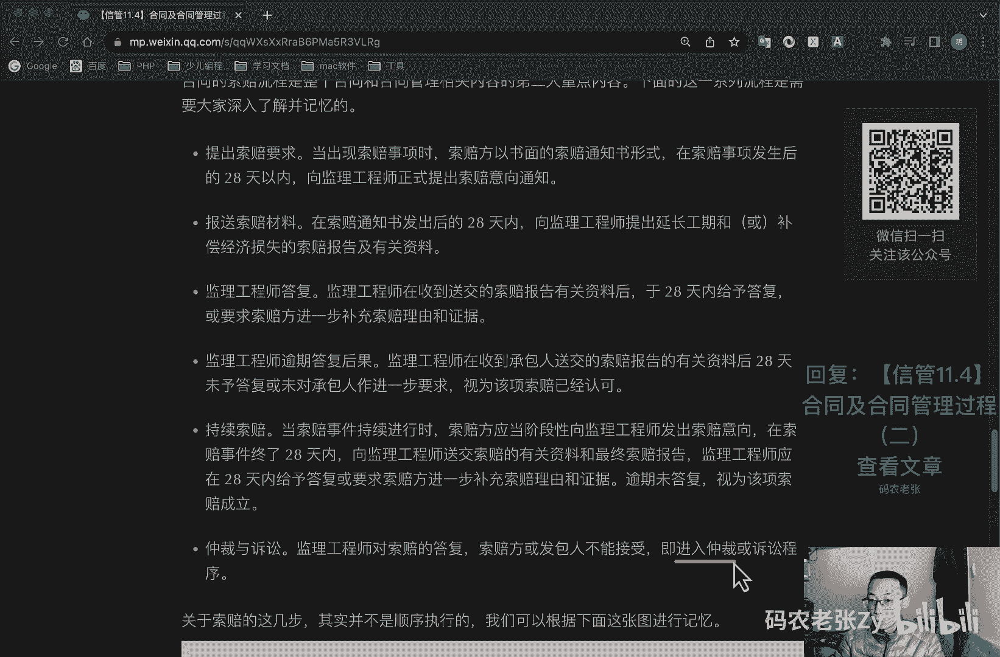
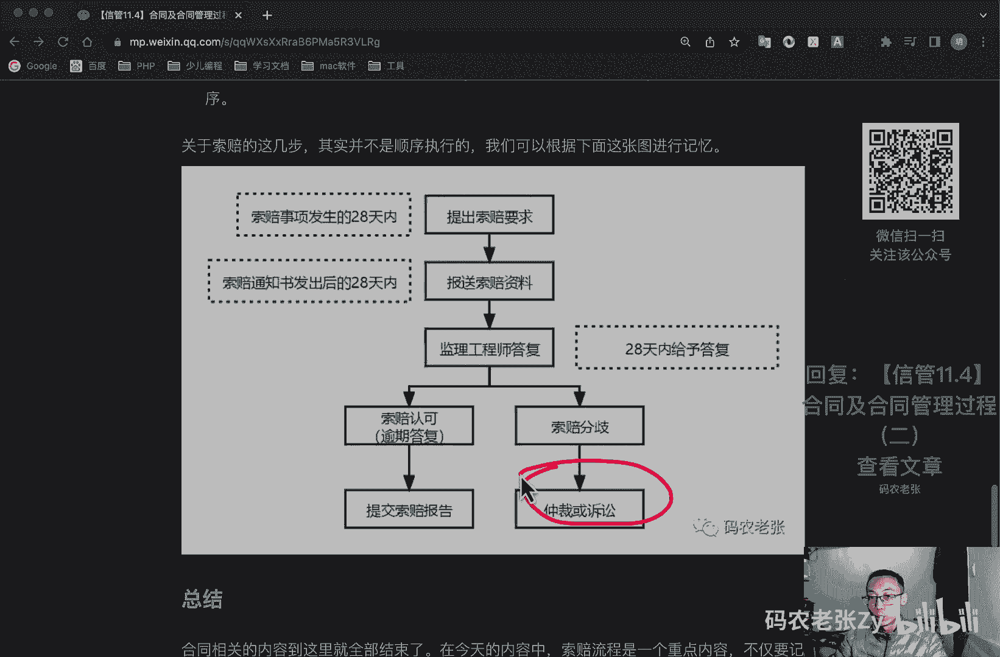
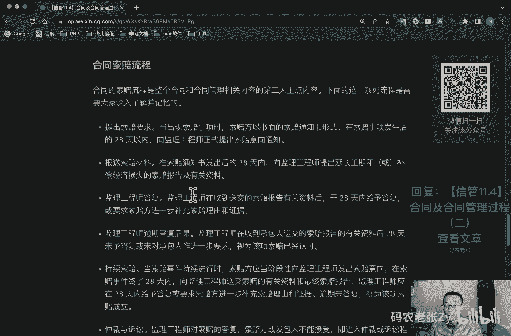
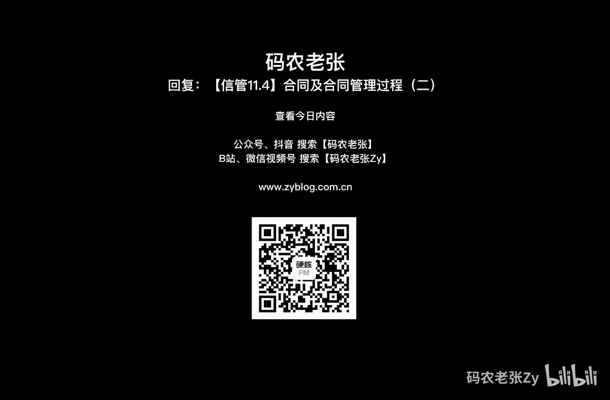

# 【信管11.4】合同及合同管理过程（二） - P1 - 码农老张Zy - BV1ah411379h

哈喽大家好，今天呢我们来学习的是信息系统项目管理师，第11大篇章的第四篇文章，合同及合同管理过程的第二篇文章，合同管理过程啊，不属于项目管理过程中的知识域，所以说呢他也不是p m p当中的内容。

其实截止到现在为止啊，整个pmp中相关的知识，我们就已经全部都学习完了，如果抛开我们第一大章，信息化和信息管理相关的内容，你就可以直接去参加pmp考试了，开不开心对吧。

但是信管师的内容啊其实还就还没完成呢，除了合同管理呢，我们后面还有不少内容，好像是重点内容已经不太多了，大家继续坚持下，ok那么现在的pmp考试呢，可能跟我那时候都已经不太一样了，同时这些已经说过了。

就是信管师教材里面的，就是到现在为止的考纲里面啊，他的他的p m p的内容呢，其实还是p m p五点版本里面的内容，那么现在应该是七点了吧对吧，现在最新的已经到期了。

那么所以说呢这个可能还是有一些差别的，但是呢最核心的内容啊，就是还是我们之前讲的那些内容啊，十大过程只是理论，还是那些相关的内容，ok大家也可以去看一看，看一看相关的内容了。

其实还还还是可以去尝试一下的，ok我们还是回来说正文啊，这这正正文这些，还有包括我们后面要讲的东西呢，还是信管师里面的内容还是非常重要的，好我们先来看一下合同管理过程。

合同管理过程中主要是为了提高合同水平，减少合同纠纷，加强和改善，建设单位和承建单位的经营管理水平，最终目标是提高经济效益，所以说合同管理呢不管对于甲方还是乙方来说，都是很值得学习的内容。

好我们先来看一下合同签订，管理，合同的签订观点呢，主要是确定各方的民事权利行为和能力，确定合同的类型，是使用书面口头还是其他形式的合同，在签订的时候呢，最主要的就是确定双方能够。

在合同的基础上达成互信对吧互信，为了使签约各方对合同有一致的理解呢，我们建议就是如下的，第一个呢，就是使用国家或者是行业标准的一个合同格式，第二个呢，就是为避免因条款的不完备或者是歧义，而引起合同纠纷。

卖方应该认真审阅买方拟定的一个合同条款，除了法律的强制性规定之外呢，其他合同条款呢都应与买方在充分协商，并达成一致的基础上进行约定，对合同中质量条款应具体写清楚，型号规格，适用的标准等等。

对于合同中需要变更转让解除的内容呢，也要详细的说明，如果合同有附件，要保持与主合同一致，不要相互之间产生矛盾，对于既有投标收入，正式合同书附件等包含多多项内容的合同呢，要在条款中列明适用的一个顺序。

为避免合同纠纷呢，保证合同订立的合法性有效性，可以进行一个公正，避免方案变更导致工程变更，从而引发新的误解，然后注意合同内容的前后的一致性好，我们再来看一下合同履行管理，合同的履行了管理呢。

包括对合同的履行情况进行跟踪管理，主要指对合同当事人按合同规定，履行应尽的义务和应尽的职责，进行一个什么检查，及时合理的处理和解决，合同履行过程中出现了一些问题，包括合同的争议。

合同违约和合同索赔等事宜，如果约定了仲裁，就约定且约定了仲裁就是仲裁裁决的终局性，就不能向法院提起诉讼了，就是你就说你在合同里面说了，我们最终就到仲裁就可以了，那么双方也都签字了是吧，盖章了。

那么我们最后就只到仲裁这一步就可以了，就后面就是大家都不能下向法院去提起诉讼的，但是一般来说呢我们解决争议的途径是谈判，先谈判协商对吧，然后呢我们调解一下，就是调调解完了之后调解不成的。

就是就是那个劳动部门去仲裁，对仲裁不行了之后呢，最后我们再诉讼啊，这就是强调了一下，就是如果合同约定了仲裁是有终局性的，那么到仲裁就是最后一步了，如果没有约定的话，那么后面还有一个就是可以走诉讼好。

合同分工管理，合同变更呢是指由一定的法律事实而，改变合同内容的法律行为，其一般特征如下，第一个呢就是项目合同的双方当事人，必须协商一致，第二个就是改变了合同的内容，变更的法律后果呢。

是将产生新的债权和一个债务的关系，好我们再来看一下合同档案管理，合同档案管理就文本管理啊，它是整个合同的基础，主要就是对合同文件进行记录和管理，在这里我们为了限制执行人随时修改合同。

一般要求采用电脑打印文本，手写旁注和修改呢，它是具有法律效力的，注意啊，手写的房租和修改是不具有法律效力的，好我们再来看一下合同违约索赔管理，合同违约索赔呢是今天的重点内容，其实它也是合同管理的一部分。

不过内容会略多一些，我们先拿出来单独说一下，合同违约呢，是项目合同当事人一方或双方不履行，或者是不适当履行合同义务，应承担，因此给对方造成的经济损失的赔偿责任，合同索赔呢是指项目合同履行过程中。

由于当事人一方未能履行合同所规定的义务，而导致另一方遭受损失时，受损失方向过时方提出赔偿的权利要求，正常来说呢，索赔只是索要经济赔偿，大部分都索赔啊，都是只要所所所要经济赔偿的。

而不是对某一方面去进行一个惩罚，我们要搞清楚啊，就是不管怎么样合同啊，合同签订之后，即使对方没有履行的话，我们要的应该是经济赔偿，而不要去强调去交什么惩罚，或者是要别的什么东西啊。

那那些其实都是不切实际的，或者说是呃，就是说那个结果并不就是就是最合适的，就是需要经济赔偿好，我们将卖方向买方的索赔称为合同索赔，而买方向其实就是像过失呢，卖方的一个索赔称为合同反索赔好。

再来看一下索赔的分类，从不同的角度按不同的标准进行分类呢，常见的有以下几种，按索赔的目的分类，主要包括工期索赔，主要是延长项目工期费用，索赔主要是赔补偿损失费用，然后呢按索赔的依据分类呢。

合同规定的索赔，然后涉及的内容在合同文件当中能够找到依据，第二呢就是非合同规定的索赔，在合同文件中没有专门的文字描述，但可以根据合同条款推论出一定的索赔权，然后呢就是按索赔的业务性质，包括工程索赔。

因施工条件，技术范围等变化引起的索赔，然后呢就是商务索赔，因设备采购，运输保管等方面引起的索赔事项，按索赔的处理方式分类呢，就是单向索赔，就是采取以实意索赔的方式，然后就是总索赔。

又称为综合索赔或者是一揽子索赔，对整个项目中所发生的数起索赔，综合在一起进行索赔，好索赔的依据和原则，索赔的依据无外乎于法律，工程标准，项目合同文件，相关凭证，其他相关文件等等。

而索赔在实践中应该遵循的原则主要包括，索赔必须是以合同为依据的，必须注意资料的积累，及时合理的处理索赔，加强索赔的前瞻性，有效的避免过多索赔事件的一个发生，好我们来看一下合同索赔的一个流程。

合同索赔流程呢是整个合同和合同管理，相关内容的第二个大的重点内容，下面这一系列流程是需要大家深入理解，并记忆的好，我们先来看一下，第一步呢就是提出索赔的要求，当出现就是第一步啊，第一步提出索赔的要求。

当出现索赔事项的时候呢，索赔方以书面的形式一定是书面，是要正式的形式来所出具，所就是这种索赔通知书的形式呢，在索赔事项发生后的28天之内啊，向监理工程师，注监理工程师正式提出索赔意向通知。

然后呢就是报送索赔的材料，在索赔通知书发出后的28天以内啊，28天以内向监理工程师提出，及有关的一个资料，然后呢就是监理工程师答复，监理工程师呢，在收到送交的索赔报告有关资料之后。

于28天之内一定要给予答复，或者要求索赔方进一步补充旅游和证据，然后呢，监理工程师逾期打伏的后果，就是，监理工程师在收到承承承包人提交的索赔报告，有关资料后，28天至28天之后未答复。

或者是未对承包人做进一步要求的，则视为该项索赔已经认可了，监理工程师一定要答复啊，然后呢就是持续索赔，当索赔事件持续进行时呢，索赔方应当阶段性的向监理工程师发出索赔意，向，在索赔事件钟表的28天之内呢。

向监理工程师送交索赔有关资料，和最终索赔报告，监理工程师呢应该在28天内给予答复，或者是要求索赔方进一步补充资料和证据，逾期未答复的，则视为该项索赔正式成立，然后呢就是总仲裁与诉讼。

监理工程师呢对索赔的答复，索赔发货发起发发起，然后就发包人不能接受的，即进入仲裁或者诉讼的程序好。

关于索赔的这几步呢，其实啊并不是顺序执行的，我们可以根据下面这张图来记忆啊，第一个就是提出索赔要求，就是索赔事项发生的28天之内，然后呢就是报送索赔资料，就是索赔通知书发出之后的28天之内。

这个是要发出索赔通知书的，这个是发送正式的一些资料的，然后呢就是监理工程师的答复啊，一定要在28天之内给予答复，如果不答复，如果不答复，就是索赔认可了对吧，或者逾期答复，他都是表示这个索赔认可了。

我们就要提交索赔报告了，然后呢如果索赔产生了分歧的话，那么我们就要去仲裁或者诉讼了。

好我们总结一下合同相关内容呢，到这里就全部都结束了，在今天内容中的索赔流程，就是我们上面这个图啊，刚刚讲完这个图是一个重点的内容，发一颗星对吧，不仅要记住每个步骤的作用，还要记住每一个重要的数字。

这个数字呢就是28，就你可以看到和索赔有关的时间节点，它全是28天好了，整个项目管理相关的内容我们就全部都讲完了，剩下还有一些内容是关于配置管理，组织项目管理等相关的信息，对于考试来说很重要。

对于想了解相关知识的同学来说呢，也有很多非常非常有用的内容，千万不要错过，当然了，我们下一篇下一课或者下一篇文章呢，还会讲一个就是一个啊采购这一块，它有很多一个法律条款对吧，法律法规相关内容的一个汇总。

也是在下一篇文章里面会讲到的，也是非常非常重要的内容啊，也会讲一些就是相关的一些其其他相关的一些，日常生活当中的一些内容，是非常非常有用的，好了，其他内容呢就这些大家可以回复文章的标题，信管11。4。

合同及合同管理过程的二，第二篇文章来获得这篇文章的具体内容，最核心的就是下面这个图啊，最主要的就是这个图，还有相关的一些内容也可以仔细来看一下好了。

今天的内容就是这些。

