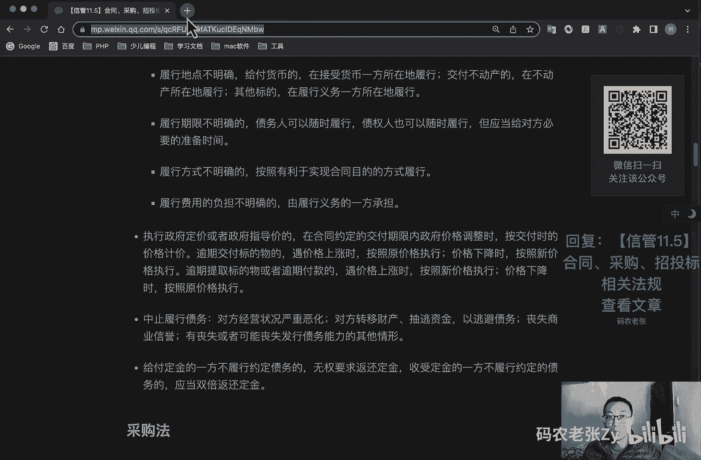
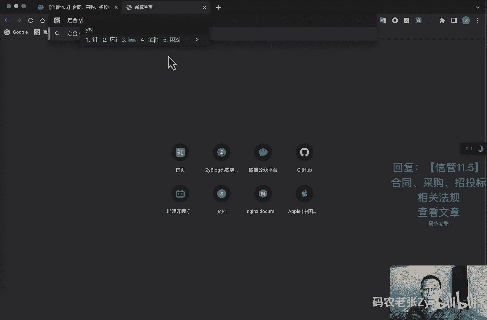
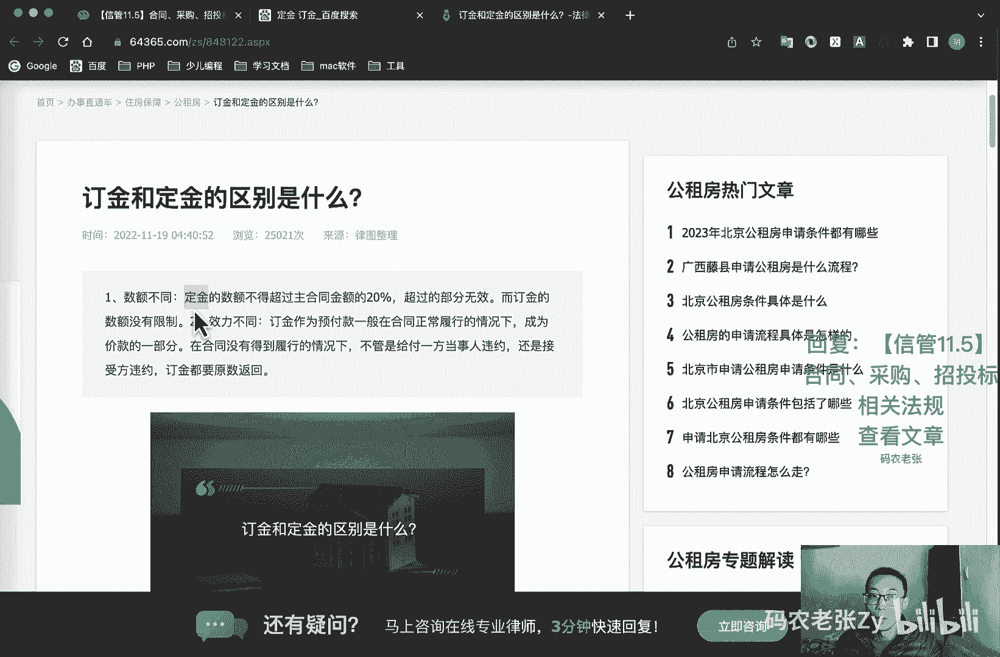
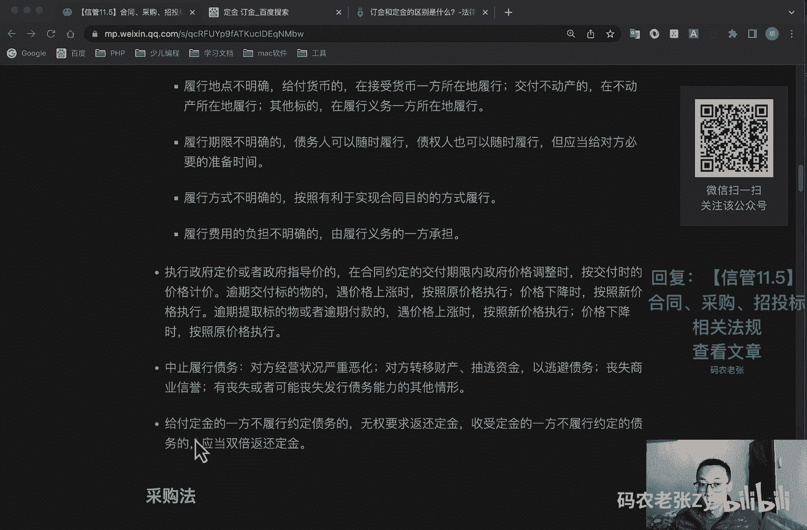
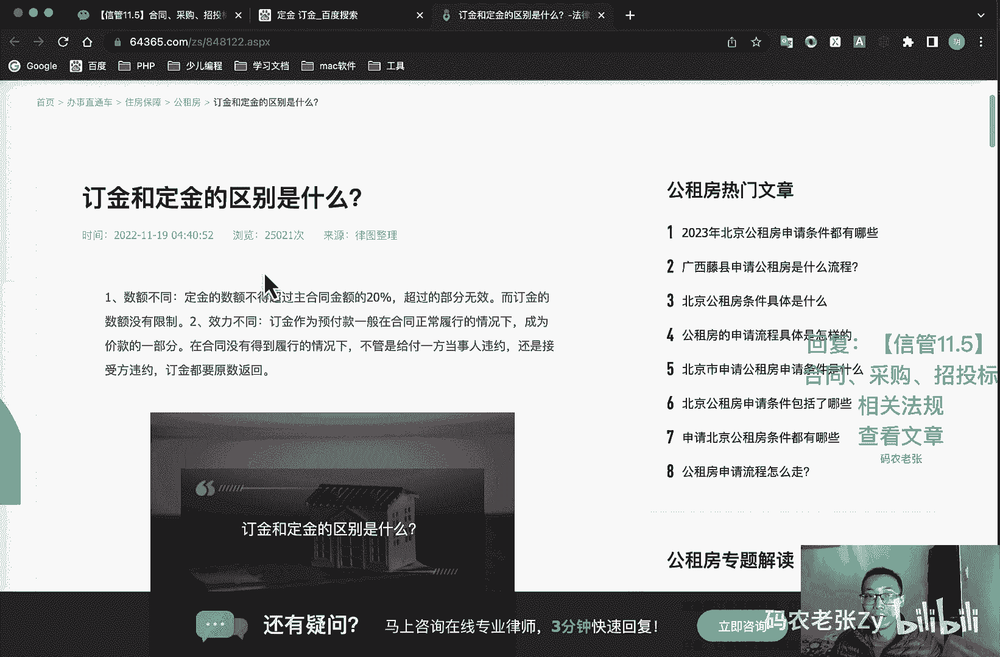
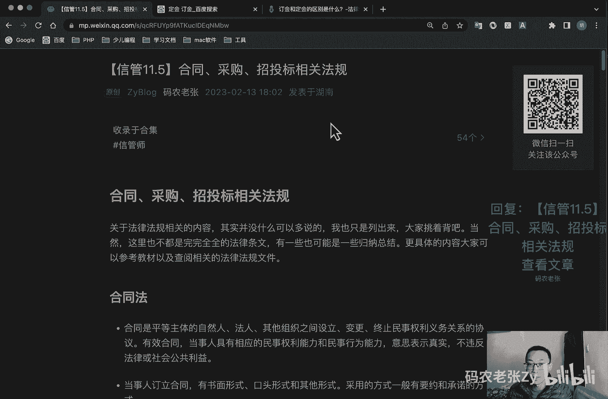

# 【信管11.5】合同、采购、招投标相关法规 - P1 - 码农老张Zy - BV13k4y1i7QM

哈喽大家好，今天呢我们来学习的是信息系统项目管理师，第11大篇章的第五篇文章，也就是合同采购招投标相关的一些法规啊，关于法律法规相关的内容，其实并没有什么可以多说的，我这里也只是把它列出来。

大家就挑着背啊，当然这里也不是完完全全的法律条文，有一些也可能是一些归纳总结，所以说呢我们还是要以这个具体的教材为主啊，那然后可以也可以去了解一下，相关的一些法律法规，好我们先看第一个合同法。

这里我就挑着说一下啊，合同法啊，这个合同是什么意思啊，大家自己看一下就行了，然后当事人订立合同啊，有什么有书面形式啊，书面形式，口头形式和其他形式几种对吧，一般有邀约和承诺的方式，邀约什么意思啊。

邀约就是邀请，希望他人向自己发出邀约的一个意思表示啊，就比如说寄送一个价目表啊，拍卖公告，招标公告等等，就是一个邀约，邀请邀约是可以撤回或者是撤销的，这个撤回啊就是在要到达受邀约人之前。

或者与邀约同时到达受邀约人，然后撤销呢叫在就是他的通知呢，是在受邀约人发出承诺通知之前到达受邀约人，反正就是都是那个你的邀约书，到达受邀约人之前，你都你都是可以撤回或者是撤销的。

或者跟他同时到达都可以了，然后呢邀约的不可撤销，就是邀约人规定了承诺期限，或者以其他形式明示邀约不可撤销，或者说受邀约人有理由认为邀约是不可撤销的，并且已经为履行合同做了一些准备工作的。

这种邀约呢就是不能撤销的，还有就是邀约失效啊，这种情况大家可以仔细来看一下啊，然后承诺也是可以撤回的，就是你发出邀约，然后对方返回一个承诺，这个和这个呢其实就是一个合同的一个，具体过程的对吧。

一定是有一个邀请一个承诺的好，这个大家可以自己去了解一下，ok对于格式，对于格式条款的理解发生争议的，应当按照通常的理解予以解释，对格式条款有两种以上解释的，应当作不利于。

主要应当作出不利于提供格式条款一方的解释，格式条款和非格式条款不一致的，应当采用非格式条款啊，这个格式条款什么意思，大家也可以自己去百度去查一下，我也不做具体的解释了，反正注意几个关键字。

就是不利于提供格式条款一方的解释好，合同无效，这个我们之前也讲过了，就是什么欺诈胁迫手段订立合同，损害国家利益的，这肯定就是合同就直接无效了，然后恶意串通化水寒，国家集体或者第三人利益的。

以合法形式掩盖非法目的，损害社会公共利益的，违反法律，行政法规的强制性规定的，好变更或者撤销，因重大误解订立的，或者在订立合同时显示公平的，以欺诈胁迫手段或者乘人之危，使对方在违背真实意思下订立的合同。

这个都是之前讲过的，然后还有什么我们再往下看一下啊，合同无效被撤销或者终止的，不影响合同中独立存在的，有关解决争议方法的条款的效力也好，这个也了解一下就行了，合同履行就是质量要求不明确。

按照就是质量要求，如果不明确啊，你在合同里面没有写出明显的质量要求的，那么按照国家标准，行业标准发行履行，如果说你就是参与的这个项目，你做的这个东西没有国家标准，没有行业标准呢，那么就按照通常的标准。

或者说是符合合同目的的特定标准，去旅行就可以了，好价款或者报酬不明确的，按照订立合同的履行地的市场价格去执行，对吧，去旅行，然后呢依法应当一致，就是依法应当执行，政府定价或者是政府指导价的呢。

我们就按照政府的指导价去履行就行了，然后履行地点不明确的给付货币的，那么在接收货币的一方所在地旅行，就是谁去接收货币，那么你就在这个你这个人所在的这个地方，或者你这个公司所在的这个地方。

按照当按按照当地的去去旅行，如果交付不动产的，就在不动产所在地的去旅行，如果是其他标的，那么在履行义务一方所在地履行哇，都是非常专业的法律名词啊，这个不了不理解的，大家可以再去详细的再去查一下，好。

履行方式不明确的，按照有利于实现合同目的的方式履行，这些都大家看一下啊，旅行费用的负担不明确的，由履行义务的一方承担啊，执行政府定价或者是政府指导价的，在合同约定的交付期限内，政府价格调整时。

按交付时的价格计价，逾期交付标的物的与价格上涨时呢，按照原价格去执行，价格下降时呢，按照新价格执行，逾期提取标的物或者是逾期付款呢，这个就是甲方和乙方的问题，就是谁出的问题对吧。

谁出的问题就按另另外一种，就乙方如果出问题了，这个是甲方如果出问题了，那么预价格上涨时按照新价格执行，然后价格下降时呢按照原价格执行啊，注意逾期交付标的物的肯定是乙方，对不对。

下面这个逾期提取标的物或者是逾期付款呢，一般就是我们的什么甲方好，这个终止履行债务啊，这个大家自己看一下什么，然后这个这个这个还有一个就是，给付定金的一方不履行约定债务的，无权要求返还定金。

收受定金的一方不履行约定债务的，应当双倍返还定金，ok这个地方呢是啊，单独说一下，就是不知道大家有没有了解过，就是这个定金，这个定金和这个定金有没有什么区别，不知道大家有没有了解过啊。

这个东西还是非常有意思的，这两个东西这两个东西呢其实是不一样的啊，这个定金和刚刚我写的那个定金是不一样的，为什么呢，有一个定金有一个定金差呢，是可以有，有一个定金他是可以退退款的。

然后另外一个定金是不能退款的，好我们来看一下，大家可以自己去。

自己也再去了解一下，就这两个定制有什么区别啊，真的就合同里面就这就这么一个字的区别，就非常非常大，好这里面都有这些区别，我们可以简单来看一下，你看第一个就是数额不同了，就是定金的数额呢。

不能超过主合同金额的20%，超过部分无效，而定金这个定了这个定金的数额是没有限制的，第二个呢就是效率不同，定金它是作为预付款，一般在合同正常履行的情况下呢，成为价款的一部分。

在合同没有得到履行的情况下呢，不管是给付一方当事人违约还是接受接受范围，约定金都是要原数返回的，ok这个定金是可以原数返回的，那么那个定金呢，那个定金说就是说如果你履行了合同，那么其实你是可以不用去帮。

就是这就是对方不想要了，这种情况下呢，你是可以不用去返还定金的，如果你没有履行合同。

在这种情况下呢，你就要双倍返还定金的，就是我们在这个地方去写的啊，就在这个地上去写的，所以说就是你经常会看一些电视节目啊，比如说一些法制节目里面可能就会讲到，就是说你买车交了定金或者买房。

你交了定金之后，你一定要注意啊，到底是哪个定制，如果是这个定制的话，你买房了，你交完这个定金了，但是你突然不想要了，对不对，你突然不想要了，但是合同已经签了，对方也确实是，就是。

就是开发商那边是有权不返还你这个定金的，注意他有权不返还你这个定金的，为什么呢，就是因为这个条款，就因为这个条款，如果对方已经他他已经履行约定，在履行约定的这个合同条款了，那么他是可以不用返还定金的。

如果他没有履行合同条款的话，那么他是应该双倍返还定金的，注意啊，一定要注意啊，注意看你签的合同上面到底是哪个定子。

如果是那个定啊，就是就是刚刚看到，如果是这个定制的话，那么其实你看这里定金都要原数返回的，ok这个地方呢是一个非常额外的一个知识点。

也是非常有意思的一个地方，大家可以注意一下好，这个也是在日常生活中非常常见的一个问题啊，一定要注意这两个字，ok我们再接着往下看，下面就是采购法，采购法这个也是啊，我觉得挑的快点多啊。

这个三公三公一诚实对吧，公开透明，公平竞争，公正原则和诚实信用原则，三公一诚实，然后呢我们再看一下啊，如果是采购本国货物啊，应当采购本国货物或者工程和服务，但是呢这个东西买不到对吧。

中国呃在在我们中国境外买不到，或者是呃为在中国境外使用的项目，而进行采购的，或者是法律法规有另另有规定的这些，那就可以采购国外的项目了啊，这个也是之前说过的好，我们再接着往下看看有什么比较重要的。

然后采购的方式呢是有公开招标，邀请招标，竞争性谈判，单一来源采购询价以及其他，这个之前也是讲过的，然后我们再看一下啊，符合下列基金的，可以按到技能法啊，这这这个呢大家都了解一下就行了，等一下啊。

主要是这个地方，就是在采用竞争性谈判的时候呢，我们成立谈判小组，一定是呃由采购人的代表和有关专家，共三人以上的，三人以上的，然后单数组成的专家人数，不小于成员总数的2/3，这几个都是比较关键的一些点啊。

这几个都是比较关键的一些点，好这个地方也一样啊，这个就是呃使用询价方式采购的话，也是三人以上，单数专家不少于2/3，好我们再接着往下看啊，呃其他倒是没有什么特别的了，这个剩下的大家自己去了解一下。

好我们再来看招投标法，招投标法呢在就是就这它是分几个部分啊，有招标，有投标，还有开标评标，中标这几个部分，我们先看一下招标这一块，交包这一块其实也没什么特别的东西啊，就你这同样他也是要遵循公开公平。

公正和诚实信用的原则，以同样的三公一诚实对吧，然后呢就是呃招标分为公开招标和邀请招标，公开招标的概念就在这个地方，然后邀请招标在这个地方，这个之前我们也都是说过的好啊，就是如果是公开招标的话。

那就一定要发布这个招标公告的啊，这个这个之前也都是了解过的，然后如果使用邀请招标的话，应当像三个以上具有具备承担项目承担能力，资质良好的特定法人或者其他组织，发出投标邀请书，好好我们再接着往下看。

就是招标人设有标底的，这个之前也说过了，交通人如果设有标底的，这个标题是必须要保密的啊，标题是个什么东西啊，就是你的可以接受的，你就是你自己去划定一个最低价格的，一个那个那条线对吧，那条线。

然后我们看其他人的标书离那条线的距离呢，就是在同等水平情况下，那肯定是选价格最低的那个对吧，这个也是之前都讲过的，ok这个呢其他的倒没什么特别的了，看一下这个是呃，招标人应当确定投标人编制投标文件手续。

的合理时间啊，就是这招标文件开始发出日志的，最短不得少于20个工作日对吧，然后呢，就是如果是对已发出的招标文件，进行必要澄清或修改的，应当在招标文件要求提交，投标文件截止时间至少15日之前。

以书面形式通标，通知所有招标文件销售人，然后就是说你的招标内容有一些修改对吧，这个也是要提前通知的，然后这个呢就是提前20天通知，ok我们再看一下投标部分，投标人应当在图标呃。

文件要求提交投标文件的截止时间前，将投标文件送达投标地点对吧，招标人收到投标地点呢应该切手保存，不得开启，然后投标人少于三个的，招标人一到就是需要重新招标了，少于三个的肯定要重新招标了。

好如果是晚于那个时间段的话，那招标人就可以去收了，就是晚晚于那个招标招标规定的截止时间的，招标人应该是去收的，然后呢就是我们可以补充啊，可以为这个标书进行一些补充。

这个补充呢也必须是在那个时间之前去进行，补充的补充，修改内容呢为招标文件的一个组成部分，然后呢就是两个以上的法人或者其他组织，可以组成联合体，以一个投标人的身份呢共投投标好。

这个都是我们其实都是我们之前学过的啊，这个就是比较正式的一些说法啊，好就是联合体各方面都需要具备，就应当具备承担招标项目的一个相应的能力，就是国家有关规定或者是招标文件，对投标人资格有规定的。

联合体各方均应具备相应的一个资格条件，比如说你可能发的那个甲乙丙丁什么那种等级，对吧，我们需要招标的都必须是以及以上的企业，那么你所有的这种，你如果是组成联合体的这种去投标的话。

那么参与联合体内的所有的企业，你不管是几家企业，你必须都得在这个等级以上的这些水平，就是所有所有参加的这些人的水平，都必须在这个等级以上，那么你们才能组成这个联合体，你才有相应的资质好，然后呢。

就是联合体各方应当签订共同的一个投票协议，然后明确规定各方承担的工作和责任，并将共同投标协议呢，连同投标文件一起提交招牌人对吧，就联合体这一块的，这个是之前没讲过的。

然后呢就是投标人不得已低于成本的报价竞标，就是泄露标底了对吧，低于成本的报价去竞标不太好了，然后呢也不得以他人名义投标，或者以其他方式弄虚作假去为标，好，叫做比较专业的术语啊，大家去了解一下好。

最后一个就是那个开屏重啊，开标呢就是在规定的在在确定的投标，提交投标文件截止时间的同一时间公开进行，开标地点呢为招标文件中预先确定的一个地点，然后高开标呢又由招标主权招标人去主持。

然后邀请所有投标人都要参加，然后呢，就是呃在截止时间之前收到的所有投标文件，开标时，开标的时候呢，都应当当众予以拆封宣读，开标过程呢应当记录并且存档去备案，然后呢。

评标由招标人依法组建的评标委员会去负责，然后依法必须进行招标的项目呢，评标委员会的呃，代表和有关技术经济方面的专家组成，就是成员人数还是一样的，五人以上的单，上面那个是三人以上单数对吧。

这里是五人以上的单数，然后其中技术经济方面的专家呢，不得小于2/3，这个都是硬性的规定，所有的都是不得小于2/3，这个是非常关键的一个数字啊，好与投标人有利害关系的人呢。

肯定不能进入相关项目的一个评标委员会了，这个是正常的，这里大家能够理解的，然后呢已经进入的应当去更换的，ok我们再接着往下看啊，啊，评判委员会应当按照文件规定的评判标，准和方法呢。

对投标文件进行评审和比较，设有标底的呢应该能去参考这个标题啊，标题是很重要的，对吧，不能泄露对吧，再强调一下，然后呢评标委员会完成评标之后呢，应当向招标人提出书面评标报告，并推荐合格的中标候选人。

好这个呢我们再接着往下看啊，这个中间的大家都可以自己再来看一下，好在确定中标人前的，招标人不得与投标人就投标价格，投标方案的实质性内容进行谈判，你招标还没结束呢，你肯定不能给他们进行谈判的对吧，然后呢。

应当啊，就是评标委员会呢，应当客观公正地履行这个遵遵遵守职业道德，这个就不用多说了，然后中标人确定之后呢，招标人应当向中标人发出中标通知书，并同时将中标结果通知所有未中标的投标人。

就其他人也都要通知到告诉他们啊，那我们已经确定中标人了对吧好，然后呢，中标通知书呢，对招标人和中标人均具有法律效力，中标通知书发出之后呢，招标人改变中标结果的，或者是中标人放弃中标项目的。

应当承担相应的法律责任，好招标人和中标人，应当自中标通知书发出之日起30日之内，按照招标文件和中标人的投标文件，订立书面合同，和招标人和中标人呢不得再进行，不得再行订立背离合同实质性内容的其他协议。

在标文件中要求中标人提交履约保证，nina中标人应当提交好，中标人，按照合同约定或经招标人同意呢，可以将中标项目的部分非主体，非关键性的工作分包给他人，完成接受分包的人应当具备相应的资格条件。

并不得再次分包，这个也这个东西之前讲过了，然后呢，作为中标人应当就分包项目向招标人负责，好总结一下，ok多不多，爽不爽，就是其实这个东西非常非常多，我还是跳着跳着跳着说，就是稍微减了一点点，重点的说了。

但是这些东西呢就是确实不太好背，不过信号的呢是，他们基本上也都只是出现在选择题当中，所以至少你应该熟悉其中的内容，比如说标题不能泄露啊，前面我说过对标底是不能泄露的，然后采购小组要三人以上。

单数专家不能少于2/3，但是呢在这个评标委员会里面对吧，他是五人以上的单数，对不对，刚刚也强调过了，然后没有别的办法对吧，就这篇文章多读多看就好了，没有什么别的太好的方法好了。

今天内容呢就是这些大家可以回复文章的标题，信管11。5合同采购招投标相关的法规，来获得这篇文章的具体内容啊，很多东西我都跳的多了，但是具体的内容你还需要仔细的来，再好好的看一看好了。

今天的内容呢就是这些。

