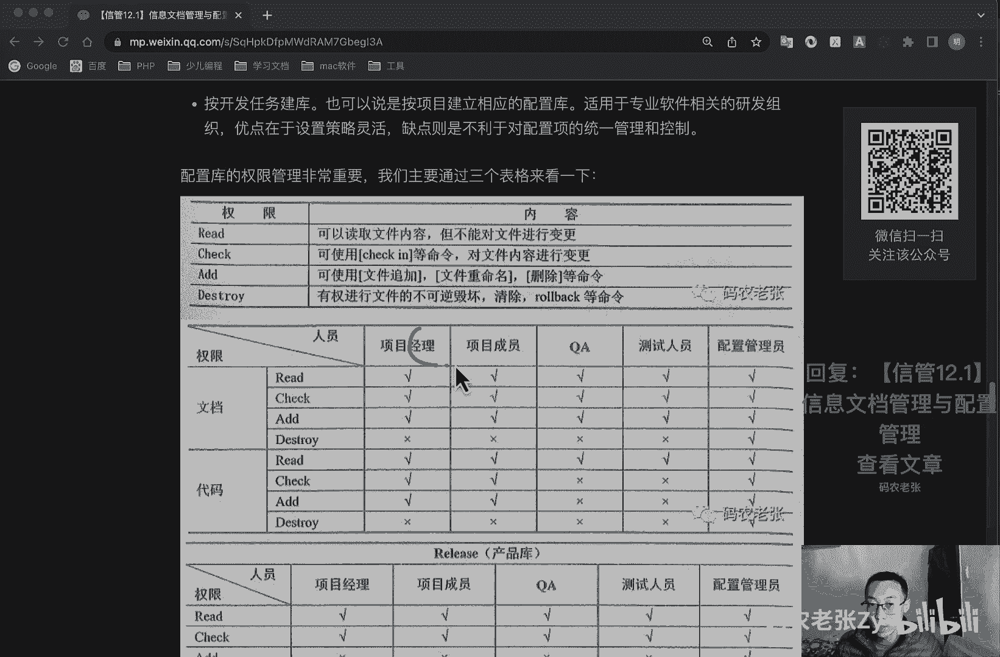
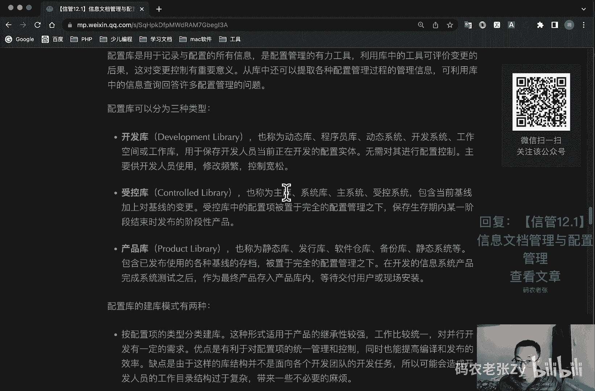
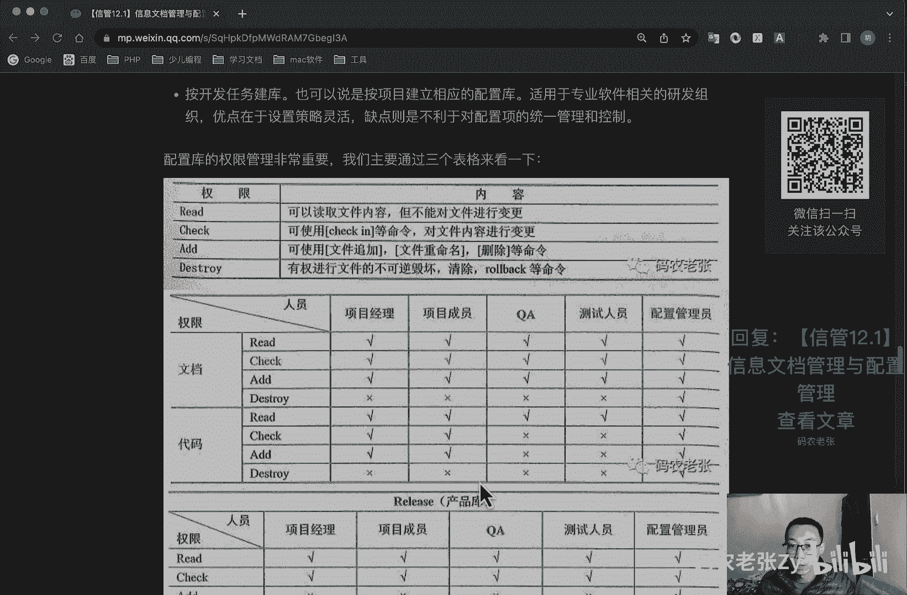
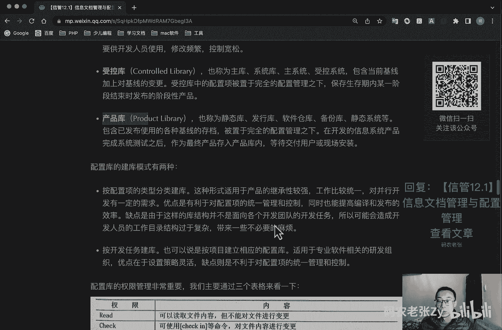
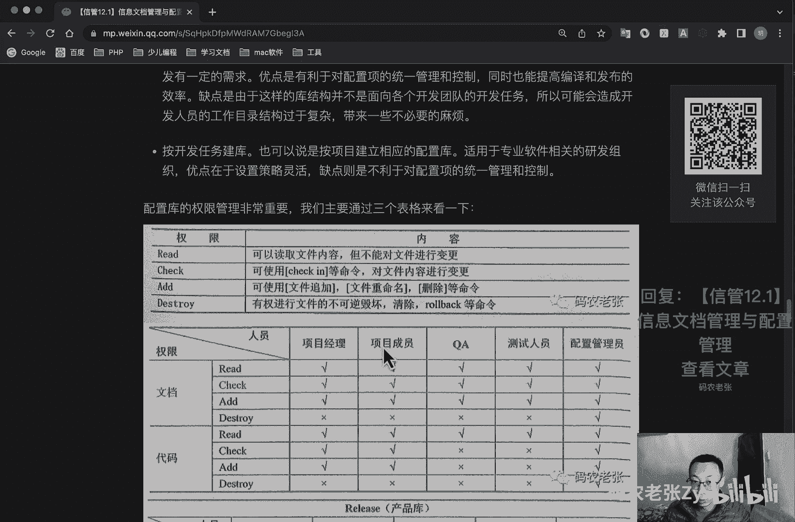
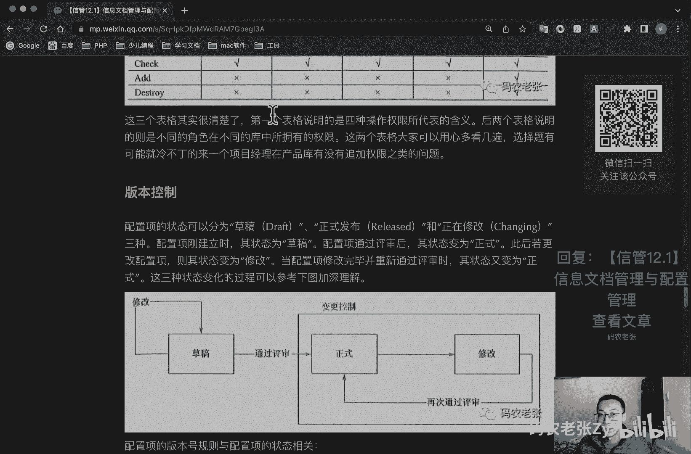
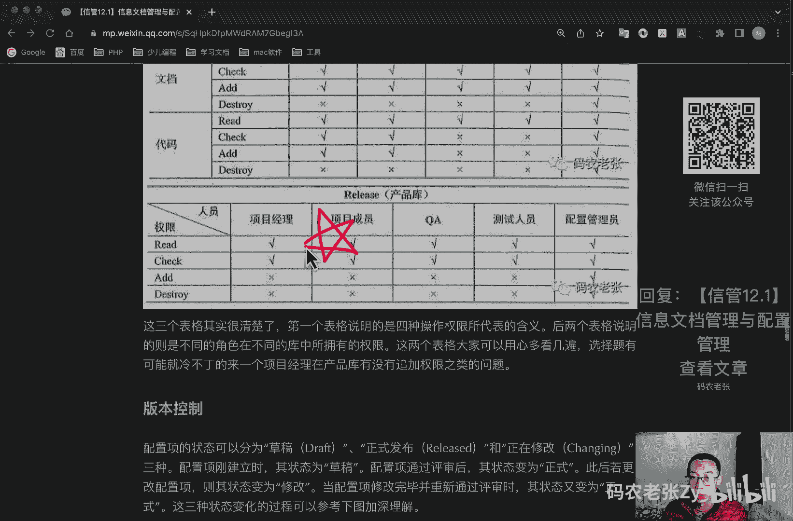
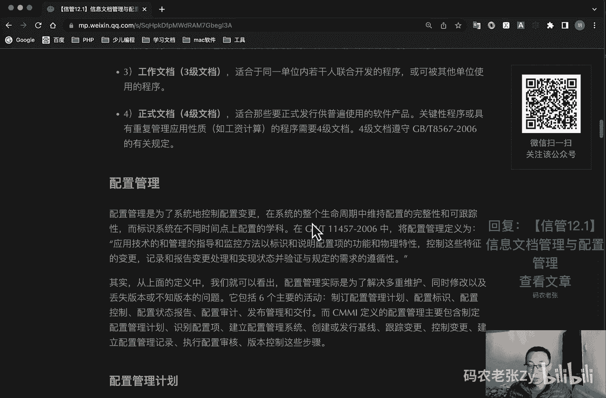

# 【信管12.1】信息文档管理与配置管理 - P1 - 码农老张Zy - BV1yV4y1f78h

hello，大家好，今天我们来学习的是新系统项目管理师，第12大篇章的第一篇文章，信息文档管理与配置管理，对于项目管理来说，文档是非常重要的，如果是传统的工程行业项目的话。

那么仅仅标书呢就是有几百升千页的，相对来说呢，其实信息系统开发项目呢已经好了很多了，另外就是配置项，它是比文档更大的一个概念，项目文档呢是包含在配置项当中的，除了文档之外呢，它还包括源程序啊。

计划报告等等，今天呢我们主要来看一看在信息系统项目中，这些文档配置项相关的内容，今天内容呢比较强，但是呢只是说明相比较多，重点内容呢其实还好，其他的相关了解，这是哪个非常牛的内容呢。

大家也都可以好好看看，所以也就不是特别重点的地方，我就读的稍微快一点啊，好了，信息系统相关的一个项目文档，这里就是已经加粗了对吧，有开发文档，产品文档和管理文档，ok我们先来看一下他们具体的一个情况啊。

好第一种就是开发文档，开发文档呢是用于描述开发过程本身的，基本的开发文档，包括可行性研究报告和项目任务书，需求规格说明，功能规格说明，设计规格说明，包括程序和数据规格说明，开发计划，软件集成和测试计划。

质量保证计划安全和测试信息，然后第二种呢就是产品文档啊，产品文档呢主要是描述开发过程一个产物，它包括产品的使用维护，增强转换传输方面的内容，这些文档包括什么呢，培训手册对吧，说明书一样的对吧。

然后呢就是参考手册和用户指南，软件支持手册，产品手册和信息广告，ok第三种呢就是管理文档，管理文档呢它是记录项目管理的一个信息，例如说开发过程的每个阶段的进度和进度，变更的记录像软件变更情况的记录。

开发团队的职责定义，项目计划，项目阶段，报告配置管理计划好这三个文档，你知道这三个文档，然后大概有他们的一个区分就行了，查开发文档呢主要是我们开发写出来的，对不对，就就就就进入开发过程以后。

写出来的也不一定全是开发写的，他主要有需求规格，什么设施设计说明书之类的对吧，然后产品文档呢就是一些培训手册对吧，一些手册，管理文档呢就是一些软件变更的情况啊，就是一般是给公司用的对吧，公司留档用的好。

文章的质量，这个也是比较重要的，就是文档的质量呢可以分为四个等级，第一个呢就是最低限度的文档，这个就是适合开发工作量低于一个人月，的开发者自用的一个程序，该文档应该包含的就是程序清单，开发记录。

测试数据和程序简介，就我们自己做的一些小项目，大概就是最低限度的文档以及文档协议，写点注释写的东西，我们自己大概知道是什么情况就可以了，然后第二种呢就是内部文档，它是二级文档，也叫做二级文档啊。

可用于没有与其他用户共享资源的，一些专用程序，除一级文档提供的信息之外呢，二级文档还包括程序清单内足够的注释，以帮助用户安装和使用程序，同样也是我们自己做的一些小程序小小功能。

但是呢我们的文档资料比上一集的，可能还要再丰富一些对吧，注释呢也是比较明确的，比较详细的，然后也是有一些安装的一些步骤，还是说明的好，第三种呢就是工作文档也成为三级文档。

这个就是我们一般在公司里面使用的，那种文档了，适用于同一单位内，若干人联合开发程序使用的一些文档，或者可以被其他单位使用的程序，那么这个的，一般一般大家的公司可能都是有三级文档的。

就比如说我们新自己建一个小dio c，或者是自己有那个什么smart之类的对吧，大家都可以看到的一些文档什么的，这达到这种文档级别的，有这种共享的文档呢，那么它都是三级文档好，最后一个就是正式文档。

四级文档，这个呢是适合那些要正式发行，供普遍使用的软件产品，关键性程序或者是具有重复管理应用性质，如工资计算的程序，需要司机文档，四级文档呢遵守这个gb t8567 ，2006的有关规定。

好四级文档呢一般都是正式文档和发布文档，就比如说我们去交付的一些产品的，所带着所带在一起的那些文档对吧，然后或者说是我们啊去看一些，我们去接一些第三方服务，那些第三方服务所提供的一些文档。

这些呢就是拿到了第四节文档的一些，这就是达到四级文档的这个水平好，这个就是四种文档质量好，这个也是比较重要的，在这里我也我也是有加粗的好，我们再来看配置管理，配置管理呢是为了系统的控制配置变更。

在系统的整个生命周期中，维持配置的完整性和可跟踪性，而标识系统在不同时间点上配置的学科，在gb t114572006 中呢，将配置管理定义为应用技术的和管理的，指导和监控方法。

以标识和说明配置上的功能和物理特性，控制这些特征的变更记录和报告，变更处理和实现状态，并验证与规定的需求的遵循性，好吧，比较看不懂对吧，我也看不太懂啊，反正就是跟配置项有关的东西。

ok其实呢从上面的定义中我们就可以看出，配置管理呢实际上是为了解决多重维护，同时修改以及丢失版本和版本的问题，所以说在这里呢其实我们能看到一个什么，就是版本完美啊，我们一会会讲的好了。

他包括六个主要的一个活动，就是制定配置管理计划，配置标识，配置控制，配置状态报告，配置审计，发布管理和九负，而semi对吧，这个东西还记得吧，3y定义的配置管理主要包含，制定配置管理计划，识别配置项。

建立配置管理系统，创建或发行基线跟踪变更控制变更，建立配置管理记录，执行配置审核，版本控制这些步骤好，我们先来看一下配置管理计划啊，配置管理计划的主要内容包括，配置管理的软硬件，资源配置项计划。

极限计划，交付计划，备份计划，配置审核和评审，然后变更管理等等，由c c b c c b还记得吧，变更控制委员会审批该计划，制定配置管理计划，便于配置管理员按计划开展配置管理工作。

并保持配置管理工作的一致性，制定配置管理计划的步骤一般包括哪些呢，第一个就是建立并维护，配置管理的一个组织方针，第二呢就是确定配置管理需要使用的资源，第三个分配责任，第四个培训计划。

第五个确定配置管理项目干系人，并确定某个介入时机，第六个制定识别配置项的一个准则，第七个就是是制定配置软件，管理软件的资源，然后就制定机械计划，制定配置库备份计划，然后制定变更审核流程，制定审批计划。

这个配置库呢一会我们也会讲的好，不要着急，ok下面这一段呢其实了解一下就是了，你知道这个配置管理计划，大概包括哪些内容就可以了，好我们再来看一下配置下啊，配置项是比较核心的。

就是我们配置管理其实都是在管理这个配置项，对吧，gb t114572006 中呢，对配置项的定义为为配置管理设计的硬件，软件或二者的结合，在配置管理过程中呢，作为一个单个的实体来对待。

可以作为配置上面有哪些东西呢，注意啊，有外部交付的软件产品和数据对吧，外部交付的产品，软件产品和数据，指定的内部软件工作产品和数据，指定了用于创建或支持软件产品的支持工具。

供方供应商提供的软件和客户提供的设备软件，典型配置项呢包括项目计划书，需求文档设计文档，源代码，可执行代码，测试用例，运行软件所需要的各种数据就是启示，就是我们开发中的所有东西全是配置上对吧。

基本上就全是配置上，我们用到的这些东西全是配置项，在识别配置下的过程中呢，要遵循下列步骤，第一个就是识别配置项，然后呢就是为每个配置项指定唯一的标识号，确定每个配置项的重要特征。

确定配置项进入配置管理的时间，确定每个配置项拥有者的责任，填写配置项目管理表，然后审批配置项管理表需要加以控制的，配置上呢可以分为机械配置和非机械配置向，两类，极限配置极限是什么意思啊，极限配置呢。

就是可能包括所有的设计文档和源程序等等，而非极限配置呢，可能包括项目的各类计划和报告等等，所有配置上的操作权限的都应该由cmo，cmo呢它表示的就是配置管理员啊，这这这这个跟那个co什么的差远了。

这个这个就是一个普通的一个配置管理员，严格管理，然后基本原则呢就是机械配置相，向开发人员开放读取权限，非极限配置相当相pmccb以及相关人员开放，这个呢我们还会再说的好，建立配置管理系统啊。

配置管理系统用于控制工作产品的配置，管理和变更管理，该系统的不包括存储媒体啊，规程啊和访问配置系统的工具，用于记录和访问变更请求的工具，三猫也就是配置管理员呢，建立并维护。

用于控制工作产品和配置管理系统和病根系统，建立配置管理系统的步骤呢，主要包括，建立使用多配多控制及配置管理的管理机制，的存储和检索配置项和共享和转换配置项，存储和复原配置项的归档版本。

存储和更新和检索配置管理记录啊，创建配置管理报告啊，保护配置管理系统的内容权限分配，ok下面都通了解一下啊，多了解一下好，我们再看配置库，这个是比较重要的啊，这个是可以打个新的啊。

好配置库呢是用于记录与配置所有信息，是配置管理的有力工具，利用库存的工具呢可以评价变更的后果，这对p变更控制有重要的意义，从库中呢还可以提取各种配置，管理过程的管理信息，可利用库中的各种信息查询。

回答许多配置管理的问题啊，配置库可以分为三种类型，ok我们先读，先读完了之后给我再跟你说怎么看啊，好我们先看一下，第一种叫做开发库，开发库呢它也称为动态库，程序员库，动态系统，开发系统。

工作空间或者是工作库这些名词啊，这前几个这些名词也要记住啊，开发库它的别名是哪些啊，然后呢，由于保存开发人员当前正在开发的配置实体，无需对其进行配置控制啊，注意无需对其进行配置控制，红门牌要再说了。

主要供开发人员使用，修改频繁控制宽松，第二种呢叫做受控库，也称为主库系统库，主系统受控系统非常重要啊，别名也非常重要，受控库包含当前基线加上对机芯的变更呃，受控库中的配置上呢，被置于完全的配置管理之下。

保存生命期内某一阶段结束时，发生的一个阶段性的产品，ok受控库最后一个产品库，这个呢也称为静态库，发行库，软件仓库，备份库，静态系统等等，ok还是很重要啊，包含已发布的使用的各种机械的存档。

被置于完全的配置管理之下，在开发信息系统产品完成系统测试之后呢，作为最终产品存储产品空带等待交付用户，或者说是现场安装好，我现在用开发的角度来看一下，这三个是什么情况。

这个呢就是我们本地本地的运行的环境对吧，本地运行环境，从开发角度来说，本地运行环境，你自己电脑上的运行环境，或者说你啊当前单位，你这个本地的一些运行环境好，第二个受控库测试环境，对不对。

就是一个测试环境，收购控是测试环境，最后产品库就是我们的线上环境对吧，通过互联网产品来说的话，产品库就是我们线上环境收购库，就是我们特殊环境开发库，就是我们的本地环境做开发的同学，这么一说。

马上就明白了对吧，如果你不明白的话，那你就好好去啊，背下来这些，那也没办法了对吧，如果你没有做过开发工作，但是你只要是在互联网公司待过的，你不管是产品啊，不管是做项目或者是做个各种其他做运营啊。

只要你在互联网公司待过的，你跟开发人员稍微打过一点交道的，你肯定能搞明白，这个是本地库，这个是呃，这个是本地环境，这个是开发环境啊，这个是测试环境，这个本地环境也叫开发环境对吧，这个是测试环境。

这个呢就是正式环境好，配置库的建库模式有两种，这个了解一下是什么啊，按配置上的类型分类建库，这种形式适用于产品的集成性较强，工作比较统一，并行开发有一定的需求，优点就是有利于对项目配置上的统一管。

理和控制，同时呢能够提高编译和发布的效率，缺点是由于这样的库结构呢，并不是面向各个开发团队的开发任务，所以可能会造成开发人员和工作目录，结构过于复杂，带来一些不必要的麻烦，第二呢就是按开发任务建库。

也可以说是按项目建立相应的配置库，适用于专业软件相关的研发组织，优点在于设置策略灵活，缺点是不利于对配置项的统一管理和控制好，下面这三个库配置库的权限管理非常重要，我们主要通过几个表格来看一下。

第一个就是他们的权限，就是我上面说的那三个库啊，就我们就要去管理它的权限，分为什么呢，读对吧，read读可以读取文件内容，但不能对文件进行变更，第二个就是check检查对吧。

可以使用check in the meaning对文件内容进行变更，第三个呢就是a d d可以添加修改对吧，可以使用文件追加文件重命名，删除等命令，然后最后呢就是destroy就是一个删除摧毁对吧。

有权进行文件的不可逆的一个毁毁坏清除，还有roll back等等的命令，对不对，其实这个衡量，其实已经非常有点像我们那个什么，就是在管理那一块的，对不对，有的人有可读权限，有人可以修改对吧。

可以针对那个不同的一个分支去进行一些操作，对不对，其实这个东西呢怎么对我们开发来说呢，就非常好理解了，好第二个第二个就是这个呢就是在主库，就是在那个呃测试环境对吧。

在我们的主库里面就是这个叫什么受控库，对不对，在失控库或者是主库。

或者说我们开发测试环境里面，这个它的一个呃具体一个权限情况对不对，对于文档来说对不对，比如说项目经理对吧，有有毒，然后有check，然后有a d d的权限，但是他没有destroy的权限，对不对。

然后项目成员呢用哪些权限，然后q a q a是什么，就是那个产品啊，就就就那个质量保证对吧，一个是质量保证，一个是智能控制对吧，qc是质量控制，qa是质量保证对吧，质量保证人员他们对这个呃。

他们对文档有哪些权限，然后测试人员有哪些权限，然后配置管理员，那肯定都是所有的权限都有的对吧，然后呢代码对不对，代码项目经理有哪些权限，然后项目成员有哪些权限，然后q a它只有一个re的权限了对吧。

测试人员才有这个瑞的权限了，然后配置管理员呢还是同样的全部权限，注意啊，这个表格有可能也会问你啊，就比如说刚刚我说的q a他对于代码在主库，或者说在这个受控库，它有什么权限，对不对。

它只有一个re的权限，ok很绕，对不对，这个表格也不太好记，对不对好吧，没办法，一定要记下来好第二个就是产品库。

产品库就是我们的线上环境对吧，在这里线上产品库，静态库，发行库。

线上环境对于这个环境来说呢，我们一般就是只针对代码的，只针对代码的话，那么我们项目经理有什么缺陷对吧，只有read和check，然后项目成员呢同样的read和check，q a呢也是这两个。

然后测试也是这两个，但是配置管理员cmo它都是有所有的权限的，ok这个呢这个还稍微好记一点啊，好注意啊，这个是主库的。

这个是主库的，这个是产品库的啊，我们没有开发库的，对不对，为什么呢，刚刚说过了，无需对开发库进行配置控制，所以说没有开发库的表格啊。

注意啊，这一这一点也是需要注意的，这个东西呢大家可以就仔细的再来看一看啊。

非常重要的，这个是今天里面我们的课程里面是比较重要的。

一个点好，第二个这个是一个第二重要的吧，一个小小的一个姓好，这个就是版本控制，配置上的状态呢可以分为草稿，正式发布和正在修改啊这三种，然后呢配置像刚建立的时候呢，其实状态就是为草稿状态。

配置项通过评审之后呢，状态就变为正式状态，此后如果发生变更，那么就变为修改状态，当配置项修改完毕并重新通过评审时，他的状态呢又变为一个正式的状态，这三种状态的变化过程可以参考这个图啊。

首先呢我们开发一个产品对吧，一开始他就是一个草稿，然后在草稿之后呢，我们不断对他修改，不断对他修改，然后通过评审之后呢，它就变成一个正式的发布版本，对不对，但是呢这次发布版本。

我们在运营的时候也会经常去修改，也会添加功能啊，或者怎么样的，那么如果在修改的时候，他们就会变成一个修改的状态，然后修改的状态呢，然后再次进行一个评审，然后他又回到一个正式的状态，然后在这其中呢。

其实就是通过我们变更控制控制的好，那么针对这三个不同的状态呢，其实我们有不同的版本号的一个标识，对不对，然后针对草稿这个状态呢，我们一般我们一般做软件对吧，它的版本号一般都是什么零点y z对吧。

比如说我们做一个我们看一个产品，它的版本号是0。11，对不对，这个这个就是他的一个版版本号，表明他现在这个版本正处于一个草稿状态，它大概的一个状态就是他大概使用斑马号，就是零点y z。

这个是比较规范的一种命名的方式，就是零点y z，y z就是代表数字从01~99好，随着草稿的一个修改，y z的取值应该是增加的，yj的初始值和增幅由用户自己去把握好，第二种形式呢就叫做正式的。

比如说我们看到某个版本，对不对，现在是什么go go语言对吧，go语言就是我现在录视频的时候，已经出到1。2了对吧，已经出到1。2了，之前我用的是1。18，1。18对吧，前面有个e对不对。

它表明它是一个正式状态的一个版本，他的版本号为x。y x。y一点二对吧，1。2就是一个非常正式的一个版本，x为主版本号，这个e为主版本号，取值范围为，然后取值范围为1~9，然后y为次要版本。

它的取值范围为0~9，好就是这这种情况，然后呢，如果是处于修改状态的配置上的版本号呢，就那x。y z就我前面说的1。18，对不对，1。18我之前用的版本是1。18，现在可以升级到1。2了，1。

2就是一个大的版本升级了，对不对，然后呢，1。18就是一个修改状态的一个版本，升级对吧，当然还有更大的版本是什么呢，就是前面x也变了，就是二点版本对吧，2。1版本，这种呢就是更大的一个版本升级对吧。

p h p8 p p7 ，对不对，这这两个就是更大的一个版本，然后p a p7。17。2，就是一个这种正式版本的一个小迭代，然后呢p a p7。7。12，7。127。1。2。

这种可能就是一个修改状态的一个版本升级，这个大家去了解一下，然后在这边比较规范的，就是零点y z是草稿状态，然后x。y就是正常状态，然后x。y z就是一个修改状态，这个呢大家一定要注意的好。

一般来说在这里再看一下，一般来说配置上版本的控制流程是，先创建配置项，然后修改处于草稿状态的配置上，零点y z的或者是发布状态的，x。y z的变成一个修改状态，然后呢版本号就变成x。y就是正式发布了。

然后呢通过技术评审或者是领导审批，成为正式发布的成本产品，然后版本号也转为这个x。y，之后进行的变更呢，就继续重复上述的流程就行了，就一定要评审和审核通过之后，才是正式的一个x。y。

但是我们版本号可以先给它确定为一个x点，y对吧，z啊，这个z是小版本的一个升级，就是修改的一个升级好了，大家看一下配置基线，就我们之前一直提到这个名词就到了极限，不知道大家有没有印象，其实基线就配置。

基线呢就是一组经过正式评审，并且达成一致的规范或者工作产品，是开发工作的一个基础，机械呢是由一配置项组成，这些配置项目构成了相对稳定的一个逻辑实体，就比如说我们现在要开发某一个功能对吧。

我们这个功能要达到什么水平，大概有什么，这对就是大概功能要实现就要实现哪些功能，然后它的性能指标有哪些，这些呢就是一个基础的基线，比如说我们要有1000的k p s对吧，这个就是机械。

我们我们如果是地域机械的话，那说明我们这个产品还是有问题的，对不对，我们肯定是要最少要达到这个极限的，好呃一个产品呢可以有多个机箱，也可以只有一个极限，极限主要的属性有什么名称，标识符，版本日期等等啊。

它极限通常对应的是开发过程中的一个，一个的里程碑，好对机械来说呢有几种不同的角度呢，可以划分出许多不同的基线，这个地方呢也是一个小型号比较重要的嗯，嗯他有的时候可能是选择题啊。

就是也第一个是按国家标准分，分为功能机械系统规格说明，然后分配极限需求需求规格说明书，然后产品机械软件，产品所有的配置项的规格说明，大概知道它什么意思就行了，然后国家标准是有这三种对吧，功能分配产品。

然后呢在实际工作中呢，我们通常是需求机械设计，机械测试机械和产品，机械需求设计测试产品，ok分别对应我们不同的部门对吧，然后呢就是对内对外，对内对外呢就是对内一般有时发行极限啊，这个这个是对外发行极限。

就是提交给外国客户的版本，它最低要达到的一个极限水平对吧，然后呢就是构造极限，就是我们企业内部要达到的一个构造的，一个就是开始构造建造的一个极限水平，大概是什么情况，发行机械和构造极限啊。

这些非常是非常容易出选择题的内容啊，一颗小心啊，建立配置机械的步骤可以概括为以下几步，创建构造机械或者房间机器生成文件，使机械可用这个了解一下，好我们再来看一下配置审核，配置上分呢主要是对配置项的处理。

是否背离初始的规格说明，或者是已批准的变更请求的现象，配置审核的目的呢，就是为了确保项目配置管理的有效性，具体来说呢，防止不适用的产品发现不完善的地方，找出各配置项之间不匹配的地方。

确认配置项目已在所要求的质量控制审查之后，作为基线入库保存，确认记录和文档保持的可追溯性，对于配置审核呢也有以下两个分类啊，这个也是要注意一下的，第一个呢就是功能配置分类。

功能配置审核呢主要是针对验收的，着重于功能与功能和文档性的完备，包括检查配置项的开发是否已经圆满完成，检查检查开发是否已经圆满完成，然后配置上是否已经达到了规定的，性能和功能的特性。

然后呢配置项目运行和支持文档是否已经完成，是否符合需求，这个都是功能配置审核的啊，注意几个啊，就开发是否完成，文档是否完成，是否符合要求，性能功能的，然后呢就是物理配置下，物理配置下的一个审核。

物理配置审核呢其实主要就是针对开发过程中，是开发过程是否正确的一个审核，开发过程是否正确的一个审核，包括每个构件的配置项呢，是否符合相应的技术文档啊，这配置项羽，配置状态报告中的信息呢是否相对应啊。

主要是这个啊，一个是开发过程的，一个是功能与文档的完备性好，这个呢也是啊加粗了对吧，也需要去注意一下好，配置状态报告，配置状态报告呢是详细记录了开发过程中的，每一项的变更，反映了开发活动的历史情况。

从而达到提高所有开发人员之间的通信能力，避免出现不一致和冲突的目的，它的内容主要包括变更内容，变更原因变更请求人和实施人，变更发生时间变更影响分析，其实呢，配置状态报告记录的都是变更相关的内容。

毕竟没有变更状态也不会发生变化，也就没有报告记录的必要性，后面我们还有一课就是专门讲项目变更的啊，配置状态报告的任务呢是有效记录和报告，管理配置项所需的信息，它的目的是及时准确的将软件配置。

向当前的情况，供相关人员了解，一加强配置管理工作，好了解一下就行了，好我们再来看一下配置管理中的角色分工，最后呢，我们再来简单了解一下这个角色分工的问题啊，他们的主要就是分包括有项目经理啊。

配置配置控制委员会，然后配置管理员c85 对吧，然后开发人员，项目经理呢，他是整个信息系统开发和维护活动的负责人，他根据配置控制委员会的建议呢，批准配置管理的各项活动，并控制他们的进程，具体工作职责呢。

包括制定项目的组织结构和配置管理策略，批准发布配置管理计划，决定项目起始，机械和软件工作开发工作的里程碑，接受并审阅配置控制委员会的报告，然后配置控制委员会c4 b啊，他主要是负责他。

他也叫变更委控制委员会对c c b，然后呢他也可以叫配置控制，边缘化，都都是cc表，然后呢，负责指导和控制配置管理的，各种具体工作的进行，以项目经理的决策提供建议。

其具体工作职责呢包括啊批准配置上的标志，以及软件机械的一个建立，然后呢就是制定访问控制策略，然后建立更改机械的设置，审核变更申请，然后呢就是根据配置管理员的报告呢，决定相应的一个对策。

配置管理员l c m o前面也提到过了，他是根据配置管理计划执行各种管理任务，定期向那个c c b提交报告，并练习c c b的例会，他们的具体工作职责呢，就包括软件配置管理工作的日常与管理与维护。

提交配置管理计划，然后各配置下的管理与维护，执行版本控制和变更控制方案呃，完成配置审计并评价报告，对开发人员进行相关的培训，识别开发过程中存在的问题并制定解决方案啊，嗯还是有点用的，对不对。

但是跟c e o那个啊c e o c t o c i o啊，那些比差远了，它就是一个配置管理员啊，他的权利没有c c b的大对吧，也没有成，其实也达不到那个项目经理啊，最后一个就是开发人员。

他们的职责呢就是根据组织确定的配置，管理计划和相关规定，按照配置管理工具的使用模型来完成开发任务，好了总结一下吧，看着感觉非常多对吧，今天的内容，但其实重点呢，需要我们重点关注的内容并不是特别多。

主要呢就是包括我前面也说了啊，就是文档分类，文档等级配置库对吧，配置库很重要，然后就是版本号，配置审核分类这几块啊，在上面呢也都加粗或者是标红了，他们的内容呢其实就像开头说过的一样。

也都是非常有意思的内容，有兴趣的同学啊就可以继续查阅相关的资料，进行更加深入的学习，说实话啊，说实话，配置项这一块的内容，其实我们平常接触的并不是特别多，对不对，文档这一块可能还见过。

但是配置项这一块说实话接触的并不是特别多，所以说有兴趣的同学呢，还可以再深入的去好好了解一下好了，今天的内容呢就这些，大家可以回复文章的标题，信管12。1信息文档管理与配置管理。

来获得这篇文章的具体内容，以及相关的更详细的内容啊。

好了今天的呢就是这些。

