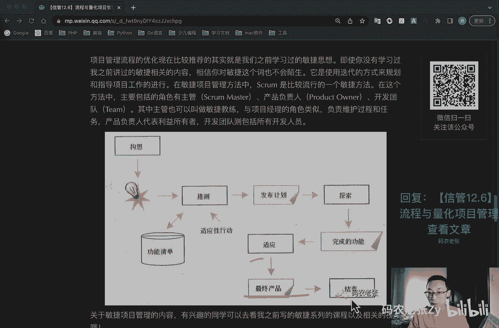
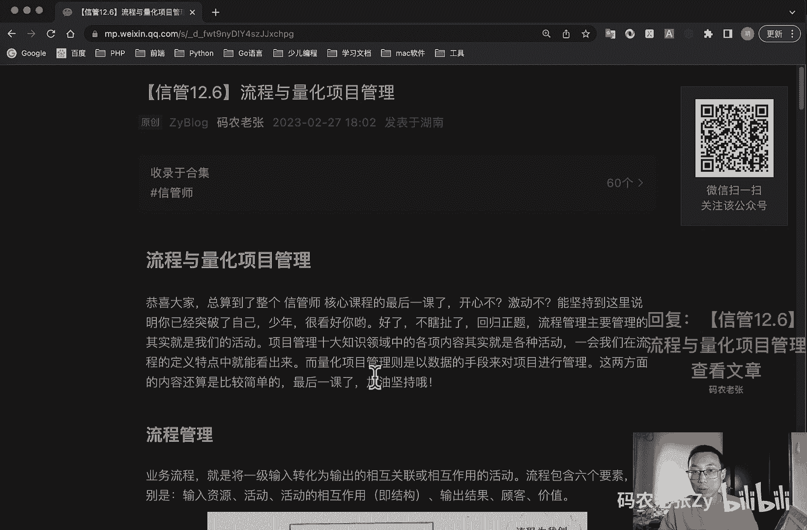
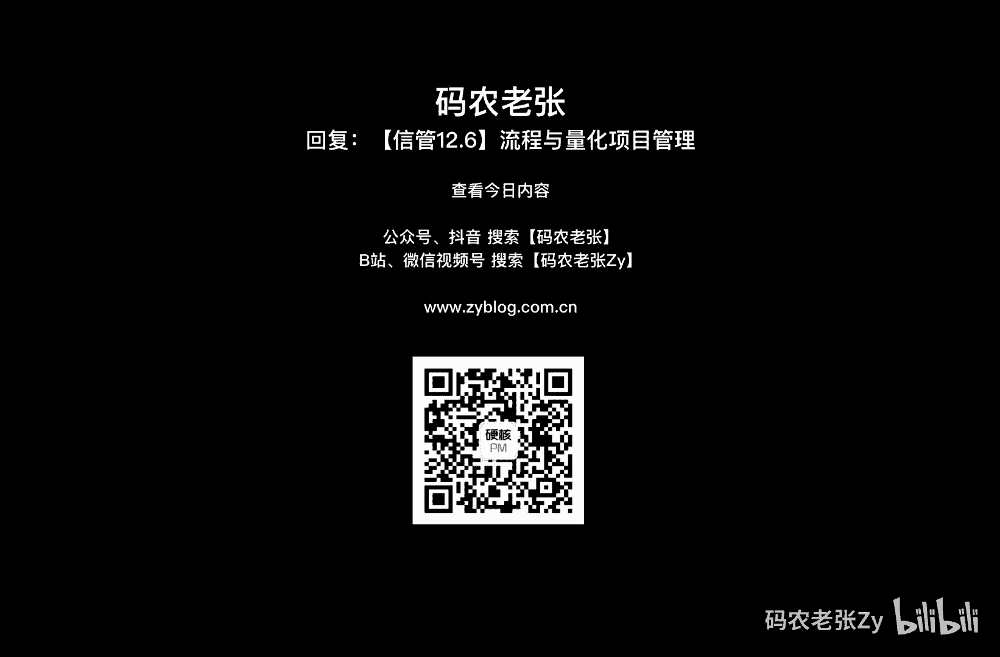

# 【信管12.6】流程与量化项目管理 - P1 - 码农老张Zy - BV1Ph4y1p7Dk

hello，大家好，今天呢我们学习的是信管师第12大篇章，的第六篇文章，流程与电话项目管理好，恭喜大家，总算到了整个信管师核心课程的最后一课了，开心吗，激动吗，能坚持到这里呢，说明你已经突破了自己。

很看好你哦，好了不瞎扯了，回归正题，流程管理呢主要管理的其实就是我们的活动，项目管理，十大知识领域中的各项内容呢，其实就是各种活动，一会儿我们在流程的定义当中就能看出来，而量化项目管理呢。

则是以数据的手段来对项目进行管理，这两方面的内容呢还是比较简单的，最后一课了，我们一定要加油，坚持好吧，ok我们先来看第一个流程，管理业务流程呢就是将一级，就是将一级的输入转化为输出的。

相互关联或者相互作用的一个活动，流行流程呢包含六个要素，分别是输入资源，输入一个资源，然后呢就是活动对吧，活动a b c d e f g，然后一直到n，然后他们之间的相互作用，然后也就是结构。

然后呢输出一个结果，最后呢就是干嘛，最后就是创造价值，为客户创造价值，好流程的特点呢也有四个，就是流程是可以定义的，可测量的，可以结构化的，流程的目的呢是为客户创造价值。

流程通常有一个或者多个的输入资源啊，依据规定将输入资源呢恰当的转化为输出，怎么样，对于流程呢，我们是不是早就已经非常熟悉了，在每个项目管理知识领域中，都有各种流程工作需要完成。

每个工作都是根据一定的输入，转化成一定的输出，另外呢流程还包括四个层次，它分别是生产流程层，动作层，计划层和战流程，这四个名字呢大家去了解一下就可以了，业务流程管理啊，这个b pm它呢是将生产流程。

业务流程，各类行政申请流程，财务审批流程，人事处理流程，质量控制以及客服流程等，70%以上需要两人以上协作实施的任务，全部或者部分的由什么计算机来处理，并使其简化自动化的一个业务过程。

bpm呢是一种以规范化的构造，端到端的专业业务流程为中心，以持续的提高组织业务绩效为目的，的系统化方法，业务流程管理的步骤呢就是流程规划前开始，包括呢流程分析，流程设计流程执行流程评估，流程改进这五步。

ok这个也了解一下就行了，好我们来看一下业务流程分析，业务流程分析的方法呢主要包括以下几种方法，第一个呢就是价值链分析法，就是找出和或者设计出哪些能够使顾客满意，实现顾客价值最大化的业务流程。

这种价值分析活动呢可以分为两种类型，就是基本活动产生价值，涉及产品的物质创造及其销售服务营销等等，另外一个呢就是辅助活动，不产生价值的辅助基本活动，并通过提供外股购入技术。

人力资源以及各种职能进行支持等等，客户关系分析法呢是对应的系统呢，一般是cr m系统，供应链分析法呢对应的系统一般是s m系统，然后基于e r p的分析法呢，不用多说了啊。

它对应的肯定就是e r p系统，然后呢就是业务流程的重构，业务流程分析的工具呢主要包括业务流程图，tf d业务活动图，b a m u m l活动图，这个我们之前详细的讲过了对吧，还记得吧。

非常早的时候了，标杆瞄准i d e f d e m o，然后是什么p e t r i网，还有业务流程建模语言这几种好，你在这边往下看，业务流程设计工作流这个工作流啊。

它是一类能够完全或者部分执行的业务过程，根据一系列的过程规则，文档信息或者业务，在不同的执行者之间传递和执行，这个如果你做过oa的话，你肯定知道这个东西要工作流好，我们这里已经标了顺序了。

就是包括这个工作流的接口以及交换格式，从这里开始，然后工作流执行服务对吧，然后通过工作流引擎进行一个分发分配，然后我们这里呢也要定义一个流程的，一个定义工具，可以使用一些图形化的工具对吧，然后呢。

我们就下一步就是客户端的应用去调用这个，去根据那个工作流引擎去调用这些特定的工具，然后第五部其实就是调用应用了对吧，调用应用了，然后呢第六部就是管理一些监控的工具，第七步就是其他工作流去执行这个服务。

ok这个执行顺序呢我也大概标出来了，这些接口之间就是其中的接口啊，就是这些接口及接口12345啊，这些东西呢是为了各个模块之间的一个解耦，而流程定义的工具呢，就是各种图形化的一个工具啊。

这些工具呢一般包括就是什么程序流程图，什么pdf对吧，然后ipo图n s图，问题分析图p a d过程设计语言，pd l维码，什么判定表，判定数等等的，ok主要就这一块的流程定义工具，这个东西呢。

大家去也是简单了解一下就可以了啊，如果你有兴趣的话，你可以再深入的去看一下这些都是什么样子的，好业务流程的实施与评估，业务流程的实实施的步骤呢，主要是对现有的业务流程进行全面的，功能和效率的分析。

发现存在的问题，设计流程改进方案并进行评估，制定与业务流程改进相配套的组织结构，人力资源配置和业务规范等方面的规划，形成系统的业务流程实施方案，组织实施与持续改进业务流程评估的过程啊。

这个是加粗的比较重要的对吧，它主要包括方案评估，包含增值性分析，流程设计的正确性，检验业务流程方案的评价，然后实施条件的评估，包含管理基础，人本管理，传统企业信息化方面的内容，接下来呢是效果的评估。

主要是产品和服务质量，顾客满意度，销售增长率，成本，员工工作效率等等，好我们再接着往下看，就是业务流程的重构，业务流程呢一般可以分为管理流程，操作流程和支持流程三大类，这些流程指导企业整体运营方向。

确定企业的价值取向，业务流程重构，b p r覆盖了企业活动的各个方面，和产品的全部生命周期，它是对企业的业务流程进行根本性的再思考，和彻底性的一个再设计，从而获得可以用诸如成本，质量。

服务和速度等方面的业绩来衡量显著性的成就，涵盖了企业活动的各个方面，和产品的全部生命周期，b p r遵循的原则包括以流程为中心的原则，团队管理原则，以客户为导向的原则，bp实施的步骤包括项目启动啊。

拟定计划，建立项目团队分析，重构流程和重新设计流程呃，设计评估，实施新的设计，持续改进，基于b p r的信息系统规划，一定要突破以现行职能式管理模式的局限，从供应商企业客户的价值链出发。

确定企业信息化的长远目标，选择核心业务流程为实时的突破口，在业务流程创新及规范化的基础之上进行吸引，新系统的规划，基于bp r的信息系统规划的主要步骤啊，也包括这些，就是战略规划，流程规划，数据规划。

功能规划和系统实施好，接下来就是敏捷项目管理，项目管理流程的优化呢，现在比较推荐的，其实就是我们之前已经学过的什么，就是敏捷的思想，即使你没有学习过，我之前讲过的敏捷相关的内容。

相信你对敏捷这个词呢它也不会陌生，只要是你互联网相关的行业，他呢就是使用一种迭代的方式，来规划和指导项目工作的进行，在敏捷项目管理方法中的，ram是一个比较流行的一个敏捷方法，在之前我的课程里面。

也对他进行了一个详细的一个就是学习了，这个呢如果你没看过的话，建议还是可以去看一下啊，就是直接搜索pm i a c p就可以了，就是在这个方法中呢，主要的主要包括的角色，有主管。

square master对吧，我们之前都是很详细的讲过了啊，然后有产品负责人，product owner，然后还有开发团队t，其中主管呢也可以叫做敏捷教练，他是与项目经理的角色类似的一个角色。

但是他不完全是项目经理，对不对，这个之前我们就是很详细很详细的讲过的，负责维护过程和任务，产品负责人的代表，所利益所有者，然后开发团队呢就是包括所有的开发人员，ok这个呢就是敏捷的，大概一个流程图啊。

就是包包包括从构想到推测，然后列出程序清单，然后适应性的行动发布计划探索，然后完成功能适应，最终产品结束。

这大概只是敏捷中的一个迭代的一个过程啊，好关于敏捷项目管理内容呢，就是有兴趣的同学可以看我之前写过的，敏捷系列课程以及相关的视频啊，就是我前面说过的，就是直接去搜这个pmi a c p。

c p这个敏捷相关的课程，不管是b站还是这个公众号里面，都可以去直接收到的，ok我们再来看量化项目管理，量化项目管理，q p m呢，其实就是以数据的手段来进行项目管理，它的目的在于量化的管理，项目。

已达成项目已建立的质量与过程的性能目标，量化项目管理的过程域呢涉及以下的活动啊，这个也比较多啊，我们看一下，建立并维护项目的质量与过程的性能目标，然后组成项目与定义的过程。

以帮助达成项目的质量与过程性的性能目标，然后选择对理解性能起关键作用，并有助于达成项目质量与过程，性能目标的子过程与属性，然后选择将用于量化管理的质量，项与与分析技术，使用统计与其他量化技术。

来监督所选子过程的性能，使用统计与其他量化技术管理项目，已确定项目的质量与过程性能，目标是否正在得到满足，然后对所选定的问题执行根本原因分析，以解决在达成项目质量和过程，性能目标上的不足。

量化项目管理包含两个基本要素，这两个基本要素呢第一个就是对预测有信心，即能够准确地预测项目在多大程度上，满足其质量与过程性的目标的能力，基于对可预测过程性能的需要呢。

选择将使用统计或其他量化技术管理的子过程，然后第二个呢就是理解在过程性能中，遇到的偏差本质和程度，并且察觉项目的实际绩效，何时可能不足以达成项目的质量，或与过程的一个性能目标，好。

我们再来看一下量化项目管理的一个过程啊，量化项目管理的过程呢主要就是两个大的步骤，第一个就是准备量化管理，包括建立项目的目标组成，以定义的过程，选择子过程与属性，选择度量项羽分析技术。

第二个呢就是量化的管理项目，包括监督所选子过程的性能管理，项目绩效执行根本原因的一个分析啊，量化项目管理过程的指标，作为it企业呢在开始选择度量的时候，可以从少数的度量值入手。

这样才能更便捷准确和一致性的收到，收集到数据可以参考使用生产率，比如说l o c每小时，这什么意思，l o c什么意思啊，我们之前讲过的代码每行对吧，就是写多少行代码对吧，每小时，然后就是质量。

如缺陷率，缺陷排除率，然后就是规模成本，人月的工作量，一个人一个月的工作量，实际成本，计划成本等等，然后就是时间，工期等度量值，这些指标的确定步骤包括数据定义，数据收集收集度量的责任度量收集的一个工具。

好总结一下今天的内容呢其实比较简单，基本我都全都照着读的，这个可能可能就是你看的会有点晕，因为全是一大堆的名词和一些官方的一个术语，唯一一个重点呢就是业务流程重构bpr。

就我们前面之前看过的这一块相关的知识，其他的都可以作为了解的内容，到此为止呢，我们所有的正课的部分内容呢就全部完成了，这个时候呢，你的教堂上也已经画出了，密密麻麻的一些重点了对吧。

接下来呢其实就是需要好好的去记忆和背诵了，呃如果你现在的书啊，他还跟新书一样的话，那么好吧，就是相信经过努力呢，你也是可以通过考试的，当然考试呢并不是最终的一个目的，我们更大的追求呢。

应该是对我们之前学习过的知识的时间运用，这才是我们学习的最根本目的，希望大家能够在自己的工作和生活中的，有机会去运用到我们这一系列课程中，所学习到的一些知识点，即使只是偶然想起某个内容。

好像之前在我这里见过那一部，枉费我几个月的一个整理码字了，最后还有就是简答论文，以及一篇总结性的一个结束的文章，就是后面还有两篇文章，大家也一定可以坚持到底，好吧好吧。

我们今天的内容呢就是可以回复文章的标题，信管12。6流程与量化项目管理，来获得这篇文章的具体内容，更详细的内容，大家还是得自己来看一下文章好了，今天的内容呢就是这些。

