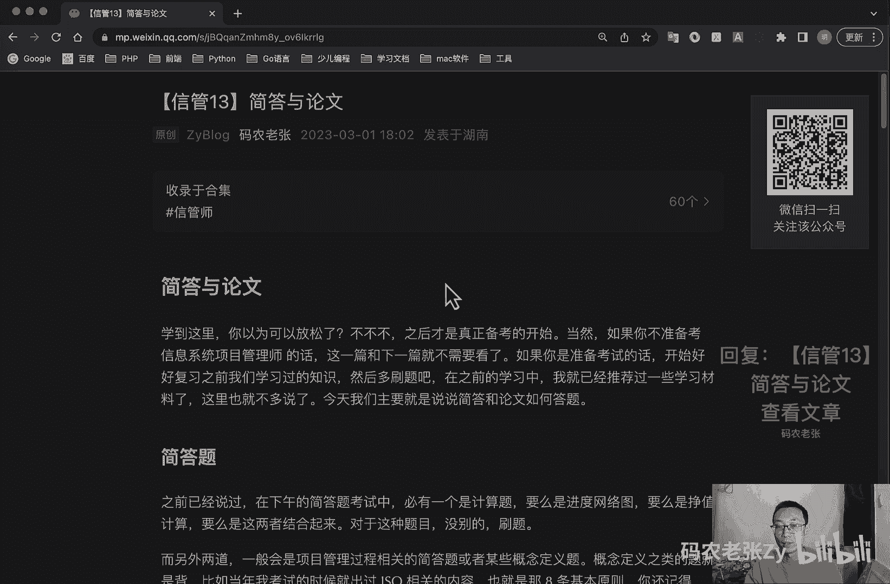

# 【信管13】简答与论文 - P1 - 码农老张Zy - BV1ag4y1L7hj

哈喽大家好，今天呢我们来学习的是信系统项目管理师，第13大篇章，就这一篇文章了啊，就是简答与论文，学到这里呢，你认为可以放松一下嘛，对吧，就是不不不，这其实现在的我们才是真正备考，备考的一个开始。

当然了，如果你不准备去考信息系统项目管理师的话，那么这一篇文章和下一篇文章，其实你就不太需要看了，如果你是准备考试的话，那么开始好好复习之前我们学习过的知识，然后多刷题，在之前的学习中。

我们就已经推荐过一些学习材料了，这里就不多说了，今天呢我们主要就是说一说简答和论文，是如何去答题的，就是简单的看一下例题啊，好之前我们已经说过啊，就是在下午的简答题考试中呢，有一个是计算题。

要么是进度网络图，要么是正值计算啊，这要么就是这两者结合起来，对于这种题目没别的，就是刷题，然后所有的公式，所有的那些东西怎么画图，怎么怎么就是正直的那些公式，这些东西呢一定要死记硬背，一定要背下来。

这个没什么可多说的啊，然后答题的时候呢，你记得能列公式的，一定把一条一条的公式列出来，这些都是有加分的，就算你算错了，没关系，这些肯定是有一点点加分的，那么另外两道呢，一般都是项目管理过程相关的简答题。

或者是某些概念定义题，就是说我们下午的那个简答题呢，一般是有三道题啊，一个是计算，那么另外两个呢就是就是管理过程的一个相关，简答题，或者是某些概念的定义题，概念定义之类的题呢就是背啊。

就比如说我当年考试的时候，就出过ISO相关的内容啊，就是之前讲讲那个质量管理的时候，我特别强调过啊，就ISO相关的内容，它有八条的基本原则，当时考试的时候就考这八条基本原则，就是你现在还能想起来吗。

对吧要是不记得了，在这个分可就丢了，对不对，而管理过程出题呢则是给出案例之后呢，我用我们学过的项目管理，十大知识领域当中的内容进行简答就可以了，我们今天的主要就是来看一下这种这种题。

这种简答题是怎么做的，好我们先来看例题啊，OK我们直接边读题边说好，说明啊，就是他会有个那个题目的一个说明，就是就是我们题目的内容，我们看一下啊，就2018年底，某公司承接了大型企业数据中心呃。

运行维护服务项目，任命经验丰富的王伟为项目经理，OK这个没什么感觉，没什么太大的问题，好我们看第二句话，在2019年1月初项目启动会之后，王伟根据经验编制了风险管理计划，诶，跟风险有关的对吧。

这道题应该是跟风险有关的，然后我们看第一句话就有问题了，王伟根据经验编制了风险计划，他自己的经验是不是好像不对吧，我们的风险管理计划，应该不是某一个人去根据经验来编制的吧，应该是团队啊，包括各个方面啊。

就是项目干系人呢都可以来参与这个风险管理，计划的一个编制，对不对啊，根据自己的经验，这个好像可能是有一点片面了，对吧好，我们接着往后看啊，我们一定要去找这个题目里面的问题。

这个问题呢很可能就会在后面出现，比如说你看这个问题一就有了，我提前说这里看，只主请指出本项目风险管理中存在的问题，看到没好，我现在就已经开始在找问题了对吧，一般这种题他都会出一些问题了，让你来找的好。

接着呢他整理出了风险清单，并制定了应对措施对吧，风险清单尽量用同报通报，通报通报最好的就是什么呢，团队来做对吧，OK整理出了风险清单，这个有了有了，就是这这一步倒是没问题了是吧，他有风险清单。

然后制定了应对措施啊，制定风险应对计划，对不对，这个倒也有了对吧，但是好像也是他自己去弄的，是不是是不是感觉是也是有问题的对吧，这些有问题的点你都要记住，你都可以写下来，没关系的，多写一点，没问题的好。

接着呢他考虑到风险管理，我们看一下，它考虑到风险管理会发生一定的成本，好，王伟就按照呢应对措施的实施成本和难易程度，对风险进行了排序，是按照成本和难易程度对风险进行排序，好像也不对吧。

是不是它它它应该是嗯进行定，进行定性分析对吧，然后进行定量分析，然后我们才能知道这个风险的一个实施成本，然后它的难以程度，然后这两个东西这两个过程好像也没有停歇，对不对，他还是去按照经验。

然后他他是按照应对措施的实施成本对吧，和难易程度就直接对风险进行排序了，嗯这个地方呢也是有问题的，对不对，这个呢我们到时候也可以记下来，好吧，第一题，第一小题里面这些都是问题，好接着呢在项目会议上。

王伟挑选了20项实施成本较低，相对较低，难度相对较小的应对措施，而自己挑的看到没有，他又是自己挑的，自己挑的实施成本相对较低，难度相对较小的应对措施，然后呢将实施责任分配到个人，他直接去分配了。

并将实施进度和成本，并将实施进度和成本，什么和和成果等纳入个人绩效当中，然后3月底，各责任人反馈应对措施均已经实施完成了，好吧是吧，这个感觉好像是各种问题都有对吧好，4月初，数据中心周边施工作业。

造成试电试电的临时中断对吧，然后呢，数据中心部分UPSUPS就应急电源，应急电源由于电池老化未能及时供电，造成部分的设备停机啊，这就是风险发生了对吧，这风险已经发生了，看看它的风险应对怎么样呃。

该风险在20项应对措施的范围之内对吧，他在我们这，他在他之前制定的20项目的，应对措施范围之内，那如果他不在这个里面怎么办，对不对，如果他不在这个里面，那他就没有应对措施了对吧，那他只能接受了，对不对。

这个问题就很多对吧好，然后当时安排的是小李负责的，而小米呢小米怎么样呢，认为电力中断发生的可能性太小，你不能他自己认为的吧，又是他自己去认为了，他自己是认为中发生可能的中断性太小。

没有按照要求对UPS进行健康检查以及测试，其实风险应对做的也不好对吧好，列出数据中心新上线一大批设备，随后又发生了部分设备的一个停机事件，经过调查呢是机房空调制冷不足引起的。

客户认为这是运维团队工作人员的疏忽，然后呢，王伟却坚持认为，大批设备上限，在年初做风险识别的识别的时候呢，属于未知的风险责任，不该由运维团队来承担，OK啊跟这个项目经理好像干的不怎么样，对吧好。

我们看一下问题啊，上面的东西已经说完了，看一下问题，结合案例呢，请指出本项目中风险管理中存在的问题对吧，我刚才已经说了好几条了，一个一个列下来，对不对，按照什么，按照我们风险管理他那几个过程对不对。

设定风险管理计划，识别风险，然后定性分析，定量分析，然后制定风险应对措施，然后最后要监控风险，对不对，这几个一个一步一步的来看看他们哪个没做到，哪个没做好，一个一个列出来就行了。

OK第二步呢就是结合案例，请写出风险管理的主要过程，并说明王伟在这些过程中做了哪些具体工作，对吧，还是那几个过程嘛，对不对，还是那几个过程，然后呢结合这个案例题，看看它有哪些做了哪些没做。

比如说智力风险管理计划做了，但是没做好，他自己去根据经验弄的，对不对，这个肯定不对了，然后呢就是应对措施有，但是定性定量分析没有，对不对，然后风险监控也没做好对吧，风险在识别也没有做好。

所以说后面又出现了新的风险，他自己都不知道他是一个那个什么对吧，他感觉是一个那个就是属于未知风险的，其实这个是可以通过风险再分，就是那个风险再分析再可以再获得的对吧，好了，我们看问题三，问题三。

就是请将下面1~4中的答案，填写在答题纸的对应栏内，这个就是填空啊，就是这个里面也算一个填空，然后每填一个空就一分，就是应对威胁，可能给项目目标产生消极影响的风险，产生消极影响的风险。

可以采取哪些策略诶，这个是不是什么减轻对吧，减轻转移，所以对吧，避免还有那个什么接受，对不对，那四个风险应对策略还记得吧，OK他有可能问消极的，也有可能问积极的，对不对，还要注意这个题目。

注意这个字好了，更详细的信息啊，在这里看一下啊，看我看我这个在文章里面是怎么分析的好啊，就是首先我们一定要读清楚题目，因为第一个问题就是问，你这个项目在风险管理中存在哪些问题对吧，我们就简单看一下。

一眼就能看出来的，第一个就是风险管理计划的指定存在问题，不应该只有项目经理一个人指定，应该由团队协助完成对吧，这个我前面说过了好，第二个就是方便风险识别工作不充分，导致后期出现了很多问题对吧。

这个也是有问题的，第三个呢就是风险定性分析存在问题，对风险的分类不够细致，然后呢定量分析也存在问题，没有进行风险，根本就没有体现风险定量分析，然后呢就是风险应对存在问题，不能只挑成本低的。

难度小的去安排风险应对措施，然后就是风险监控存在问题，小李认为电力中断发生概率小，没有按照要求执行，导致后续设备的出现问题了，监控存在问题，然后风险在识别我们没有进行风险在识别对吧。

也没有体现出来这个东西啊，没有统一的答案，但是基本的点都应该回答到了对吧，你也就能够加分了，对于这种题呢，就是多写，仔细回想整个风险管理中学习过的知识点，看看案例中他哪些做到了，哪些没做到就可以了。

好问题二也比较好回答对吧，就是风险管理过程全部列出来了，就刚刚那些全部列出来，然后再给每个过程，结合案例中完美的工作进行扩展，比如说风险管理计划的过程，包括制定风险管理计划，风险识别，实时风险定性分析。

实施风险定量分析，风险应对，监控风险对吧，王伟自己制定了风险管理计划，也识别了风险，并且制定了应对措施，但是其他的过程啊就没什么太明显的体现了，当然你答题的时候也可以一条一条列出来，写得更详细一些。

其实前面还是前面这一块对吧，好问题三就更好说了，对不对，消极风险应对的方案哪四个，我前面都已经说过了啊，就是回避转移，减轻接受对吧，这个是填空形式了，这个这个就相当于就是我前面那个说的那个。

ISO那种项目的形式了啊，就ISO那种情形形式就是概念题，你就直接背下来的东西，这个没什么可多说的，要不然这四分就丢了，对吧好，我们再来看一下论文，论文这个东西对我来说就是一个老大难。

因为我第一次考试就是因为论文挂掉的，对于软考的中级和高级来说，唯一的区别就是高级要考论文啊，这个论文呢就是要在两个小时的时间内，写出至少一篇2000字的大文章出来，现在先不说别的。

就是说如果你已经不是学生了，你上了几年班了，而且还工作过几年了，你先在两个小时之内你试试，你自己试一试，两个小时之内手写2000个字试试，你去抄一篇2000字的文章，看这个时间够不够，你自己去试一试。

同时写字速度是一方面，另外字还不能写的太难看，我的天哪，过于潦草，也要扣卷面分的，这对我们各种理工科的小伙伴来说，这太难了是吧，太痛苦了，赶紧啊，我们先把字练起来好，接下来我们说正事啊，就是论文考什么。

论文一般考的还是项目管理，十大知识领域的内容，一般来说呢就是让你写一个你做过的项目，应用了某个领域中的内容，过程有什么收获之类的，所以呢我之前一直强调，要保证每个领域中的过程都要背下来。

最好能把所有的过程的输入工具，以出工具与技术，还有输出都给他背下来，这样才好写论文，OK比如说有这样一道题目啊，这个就是一个论文的原题，实事，项目范围管理的目的呢，是包括是包括确保项目做起。

只做所需的全部工作，已顺利完成项目的各个过程，项目范围管理关注为项目界定清楚工作边界，防止范围蔓延，当必须改变项目工作边界时，项目范围管理提供了一套规范的方法，处理范围变更，请你请你注意啊。

请以这是命题作文啊，请以信息系统项目的管理范围管理为题，分别从以下三个方面进行论述，第一个呢就是简要概述你所参与管理的项目，信息系统项目呃，项目的背景啊，目标啊，规模啊，发起单位啊，项目内容啊。

组织结构啊，项目周期交付成果，并说明你在其中承担的工作，OK第二个呢就是结合项目实际论述，你对项目范围管理的人人人士啊，可以包括呃，就就就工作啊，这这应该是字打错了，可以包括但不限于以下几个方面。

第一个呢就是项目范围，对项目的意义，第二个就是项目范围管理的主要过程，工具和技术，第三个呢引起项目范围变更的因素，第四个呢就是如何做好项目范围控制，防止项目范围蔓延，对不对，关键点它全在这里提出来了。

看到没有好，第三个就是请结合论文中所提到的信息系统，项目，介绍你如何进行氛围管理的，包括具体的做法以及一些经验教训，OK有的题目怎么写呢，注意啊，我们写论文一定要紧贴这几个点。

一般论文试卷呢我们居中去写题目，这个题目呢如果试卷上给出了，我们就写试卷，试试卷上的，比如说这个命题的对吧，如果没写的话，你就自己要去想一个这个这个题目，很明显他已经给出了。

就叫做信息系统项目的范围管理，我们就写在试卷的中间就可以了，第一行的中间，然后呢，就是接下来呢，我们论文要写一个300字的一个摘要，这个摘要呢要引出系统建设的一个原因，简要概述项目内容。

以及使用过的一些管理过程啊，一定控制300字左右，然后呢正文部分是2000字，我们可以用一先来一到两段的引言，或者概述距离，这里和上面就是这个摘要的内容是不一样的，摘要是整体概括，然后正文部分。

这里的引言呢主要就是项目介绍，大概200到300字的部分，其实就是他第一个要求的这个部分的内容，注意啊，这一行的内容，这个呢就是我们第一部分的内容，我们就写写写论文的时候，我们分段。

第一段我们就写这个东西好，接下来就是正文中心的部分，最好是划分为四个段落，就是这个地方看到没有，这个地方按他这个小标题一样的，我们可以划分四个段落，怎么去写呢，其实就是写项目范围管理的。

就是各个过程对吧，就写各个过程，一个段落大概4~500字左右，然后一共就是四个段落，一共1600字以上，2000字以下，每个段落呢是一到两个管理过程的一个描述，比如说我们范围管理。

就刚刚这个题目的范围管理有六个过程，对不对，我们可以将范围管理计划，范围管理计划和收集需求写了一段，然后定义范围，一段工作分解结构，一段核实和控制方面一段，当然了，你还要点题对吧，你还要点题。

就是控制范围的时候，要怎么去防止范围蔓延对吧，然后呢呃如果有的过程是不够的，比如说我们质量管理，还有其他一些管理，它只有三个过程对吧，那么就写三段就好了，但是每段呢你写的字字数多一点对吧。

然后将过程名称写的小标题，这样呢可以这样的格式，内容就是过程的一个描述，加上创设一个问题，然后解决问题，最终的一个效果，就是起到这个段落里面就可以了，大概就是这样啊，4~500字左右一个段落。

然后一个每个段落就是描述一个过程，或者是一到两个过程好，最后再写一个写一到两个小段落来收尾，看字述情况啊，就前面你如果是已经写了2000字了，最后你再写一个小段就够了。

如果你写只写了1600个字左右的话，那么你就写呃一到两个小段落，然后呢两到300字一段就可以了，主要就是写不足，同样的看到没有，这一段，第三个特点啊，包括具体做法和一些经验教训。

这个地方呢主要你一定要写一点不足啊，这个不足呢一定是无关紧要的不足，而而不是系统直接被你整挂了，然后呢再给出下回可以弥补的解决方案，来表明继续学习项目管理相关知识的一个决心。

这个就是具体做法和经验教训好吧，这样的话几段看到没有，第一个呃，这个这个摘要不算摘要，它是你肯定要写的，这个是必须要写的，然后第一段是这个一年或者概述，然后第二第三第四第五段左右或者是234段。

主要就是这个分四个段落左右啊，一般4~500字左右，1600字以上，然后2000字以下的，如果不够的话，你就分三个段落也是可以的好，然后最后呢就是一到两个小段落来收尾，这个主要写经验教训。

然后一定要写以后要学习项目管，项目管理相关知识的一个决心，其整体的格式就是这个样子好，大概过程呢就是就是这样一个过程，就是看起来很简单，但是真正下手呢还是有点难度的。

最主要呢其实啊最主要的问题是时间紧迫，就你去考试的时候没有时间让你去思考，所以说大家最好提前写一些草稿，两个小时啊，两个小时2000多字啊对吧，你要算上摘要啊，对不对，你要算上摘要。

加上正文2000多个字啊，有所以说你一定要提前写一些草稿，有大致的印象，然后在考试的时候，你提笔就写啊，不要考虑太多，提笔就开始写，关于论文呢大家可以去训信管网去找一些范文，也可以买相关的范围的书籍。

最后呢我们再看几条关于论文的一些经验技巧，这个多看多看多写，一定要多看多写好，第一个7号论文就是以自我为中心，然后站在高级工程师的角度，然后忠实于论点，条理清晰，开门见山，标新立异，要有主见。

收尾一定要一致，好常见的问题，第一个走题啊，第二个就是字数不够或者字数偏多，包括就是这个字数啊，它是包括标点符号的，标点符号我们要占一格，然后一共加上标点符号2500字才是最佳的。

然后呢就是摘要归纳是欠妥，然后文章深度不够，缺少特色，泛泛而谈，文章口语化太重，文章文字表达能力太差，文章缺乏主题项目，项目年代久远，然后文章结构不清晰，段落太长，这些都是一些常见的问题。

好我们再来看扣分点，扣分点第一个就是没有写论文，摘要，摘要过于简略，或者摘要中没有实质性内容的论文，第二个字迹潦草啊，其中不少字难以辨认啊，这个问题很严重的，然后呢。

就是确实属于过分自我吹嘘或者自我标榜，夸大其词的论文，比如说你上来你就你就嫌你接了几个亿的项目，说吧，几个好几个小目标的一个项目，怎么可能对不对，你要有这种水平了，你还来考这个试是吧，当然也有可能啊。

也有可能你确实接过这种项目，但是在考试的时候呢，就是即使你真的戴过这种项目，也请挑一个，就你带过的项目里面金额相对小一点的，一般来说八百五百万，500万以上，1000万以下这种的。

一般800万左右的是相当合适的一个金额啊，然后呢，内容有明确的错误或者明显的错误和漏洞的，就是按同一类型错误的每一类扣一分，然后内容处仅属于大学生或研究生，实其性质的项目。

比如说什么开发一个官网啊什么这种的，你就尽尽量不要写了对吧，还有什么电商项目那种的，之前都已经写烂掉了，并且实际应用背景水平比较低的一些论文啊，写什么比较好，笔签的比较新的对吧，大型分布式的啊。

AI的人工智能的比较新的，比特币的，比那个比特币就是区块链的或者是什么卡，现在最火的差的GBT的，对不对，这些的都可以啊，越新越好对吧，然后规模越大越好，好加分点，有独特的见解或者是有很深入的体会。

是相对非常突出的论文，第二个呢就是观点很高，确实符合当今计算机应用系统，发展趋势和新动向，并且并能初步加以实现的论文对吧，我前面说的这种新技术，最好的网站开发这种就别写了，然后就是内容详实，体会中肯。

思路清晰，非常切合实际，接下来呢就是项目难度，或者是项目完成的质量优异，或者项目涉及重大的课题啊，国家课题的这种的，并且能够正确按照试题要求论述的，如果你接触过的话，你当然是可以写的了。

如果你完全没接触的话，你瞎编的话，那就啊是吧，自己考虑好论文雷区啊，论文雷区第一个就是虚构情节对吧，虚构的文章有较严重的不真实的，或者是不可信的内容出现的论文，第二呢就是未能详细讨论项目开发的实际经验。

主要从书本知识和根据资料摘录进行讨论呢，你去背那个过程啊，去背过程的那些概念啊，那些是不行的，一定要有一些实际的开发经验的啊，然后呢就是所讨论的内容与方法过于陈旧，或者是项目的水准相对低下的。

且没有鲜明特色的应用，还是前面说过的那种啊，就是网网网站开发内容呢尽量就是少写了啊，还有app的性能也不是太好了，然后呢就是内容不切题意，或者是内容相对很空洞，基本上是泛泛而谈的。

没有较为深入体会的论文，好论文，或者啊正文与摘要的篇幅过于短小的论文，最后呢就是文理很不通顺，错别字很多条理或思路不清晰，自己过于潦草等情况都是乐意，都是一些类区，OK总结一下啊。

关于简答案例和论文相关的内容呢，我们就讲到这里了，这些内容呢非常的偏硬实了，就是靠刷题去积累题量，而论文的话如果有时间的话，可以每个管理过程呢都去准备一篇，如果没时间的话，你至少要准备两篇。

考试中呢他一般会输出两个论文题目，二选其一，比如说上面我们出了一个范围管理吧，他可能再出一个风险管理，或者再出一个什么别的管理对吧，然后呢论文时间真的很紧迫啊，这个一定要严肃认真的准备对待。

就是还还有还有三个就是说三遍强调了啊，练字练字练字，OK然后呢就是在准备这个论文的时候呢，还有一个就是整体管理，一般是相对来说会比较少一点，整体管理项目，整体管理那个论文相对来说会出的比较少一点。

然后后面九个呢就是随机了，这个这个就说不好了，大家可以自己看情况，一般你可以参考前几年的，就就是每年考两次试对吧，你去看看前面两次的大概是考什么题目的，那么这一次的题目其实也差不多能猜出来，对不对。

总共就那么九个，总共生下来就那么几个那个管理过程了，对吧是吧，他都那么轮得来的对吧，当然也不一定啊，也不一定，他可能是上一次考过了，这回再考一次的，这个也说不准，但是呢呃大部分情况下呢。

可能就是前两次考试考过的那种论文题目呢，他这一次就不一定会再出了啊，大部分情况是是是这样的，好今天的内容大家可以回复文章的标题，信管13简答与论文，来获得这篇文章的具体内容啊。

这是关于简答和论文的内容呢，大家还可以再详细的来看一下好了。

今天的内容呢就是这些。

