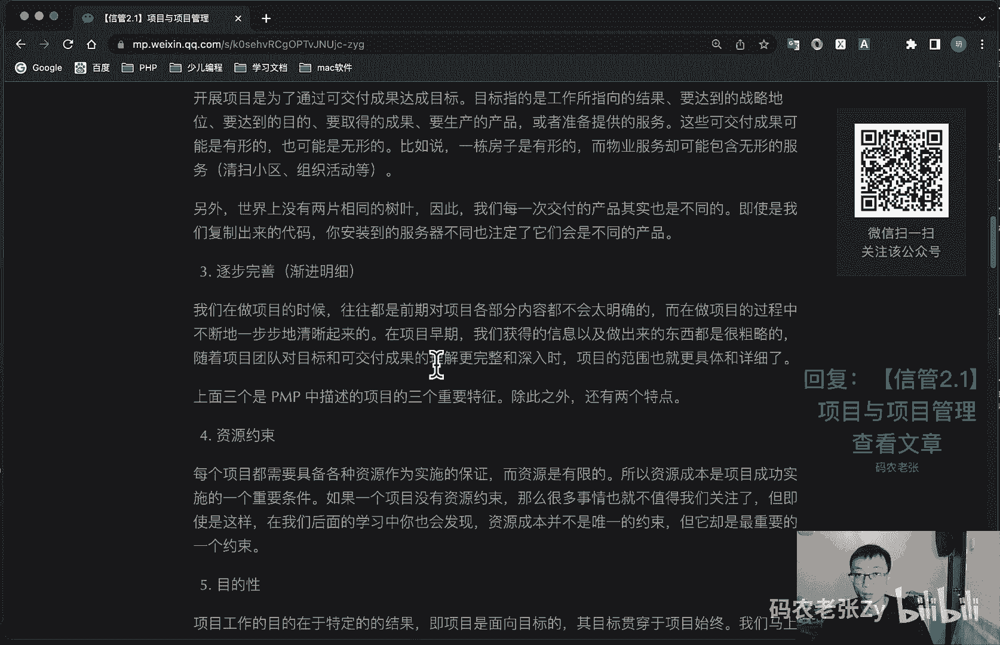
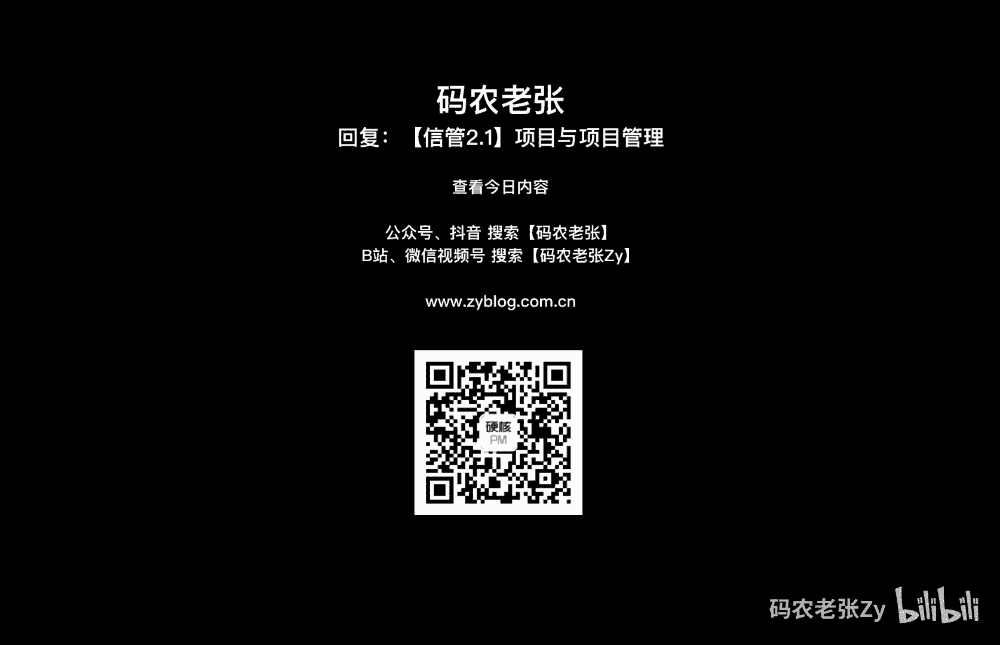

# 【信管2.1】项目与项目管理 - P1 - 码农老张Zy - BV1V84y1W7q5

哈喽大家好，今天我们来学习的是信息系统项目管理师，第二大篇章的第一篇文章，项目与项目管理好吧，要说之前的内容呢都太偏向程序员们了，那么接下来的内容呢就该扯平了，项目管理方面的内容呢。

如果你可以理解就理解，如果不可以理解的，那就只能全背下来，要知道让程序员们背东西，可是比他们他们996还可能历代对吧，但是在这一局呢，如果你是做过传统行业项目的，或者是说做个产品经理啊，运营啊。

甚至是只做过啊，只要是大致跟过一个完整的，传统或者线上项目的都会比较轻松，但是呢轻松只是一个方面，在最早的介绍中，我们就说过，尽管是下午的两门考试，都和项目管理知识有着非常重要的联系，特别是什么论文。

不妨论文很恐怖的，所以说呢项目管理部分，整个都是我们学习的重点，甚至比前面技术方面的知识还要重要，毕竟就是做这个选择题啊，你选择题这个东西你实在不会，你还可以蒙一下，对吧好了。

另外还要需要注意的一点就是，即使你已经有了p mp证书，通过了pmp的考试，即使你是7a的成绩，就是p m p m考试那个成绩要7a的成绩，但是注意我会一直在强调。

就是p m p的知识掌握程度完全不足以，应对信息系统项目管理师的考试完全完全不足，以所以说呢请一定要好好的学习复习，接下来的项目管理方面的知识，不要有任何的侥幸心理，反过来说呢，如果你没有考过pmp。

那么就更要认真努力的学习，这部分内容的体系非常庞大，之前的技术部分内容都只是点到为止，而我们在项目管理方面的学习的研究，将会更加深入啊，好了，我们先来看一下项目啊，我们知道从历史上来说呢，什么金字塔啊。

长城啊，以及世界上的各大奇迹啊，各种建筑啊，其实都是一个一个的项目成果，而现在盖一栋楼可以说是一个项目啊，然后送我们的宇航员上太空，这是一个更大的一个项目对吧，似乎项目都是很大的东西。

但其实我在写这篇文章，或者说我写这一系列的文章，或者说呢去外地进行一次旅游，我们要做一个旅游的规划，对事对不对，这些也都是在做项目，这么看来呢，项目貌似离我们的生活很近，对不对没错。

从项目管理的角度来说呢，万事都可以是项目，同样也可以进行项目管理，我们先来看看什么是项目，然后再想想是不是你所做的各种事情，都可以归结为各种各样的项目啊，我们先看一下项目的阴影。

这个非常重要的红色的字啊，项目是什么呢，项目就是为提供一项独特的产品或成果，独特的注意，独特的产品服务或成果，所做的临时性的一个努力，定义内容上面的红字已经标出来重点的单词了，我们再来详细的说明。

关于项目这个词的完整定义，它可以描述为什么呢，就是为达到特定的目的，使用一定的资源，为达到目的，使用一定的资源，在确定的期限内，为特定发起人而提供的独特的产品服务或成果，而进行的一次性努力啊。

这几个这几个词都很很重要，但是其实意思和上面这一句话的定义，其实是一模一样的啊，不管在信管师还是在偏bug当中呢，对于项目来说都是这么定义的，这几个关键词真的非常非常重要，好。

我们下面就呃仔细的说几说一下这几个关键词，这个呢就是项目的一个特点，就是上面我们标的那几个关键词，第一个呢就是临时性，也就一次性啊，这是项目和产品的一个最大区别，临时性，就说明项目呢。

一定是有一个开始和一个结束时间的，即使是像淘宝这样的，一直存在着一个超级大的网站对吧，但是他的每一次升级迭代呢，或者说功能增加，也都可以看作是一个一个的项目，第二个呢就是独特性。

独特的产品服务或者成果啊，这也是上面那句定义里面的对吧，开展项目是为了通过可交付成果达到目标，目标呢指的就是工作所指向的一个结果，要达到的战略目地位，要达到的目的，要取得的成果。

要生产的产品或者是准备要提供一个服务，这些呢就叫做目标，这些可交付成果呢可能是有形的，也可能是无形的，比如说一栋房子呢就是有形的，而物业服务却可能包含无形的服务，比如说清扫小区啊，组织活动等等的。

这些可能是无形的服务，因为你不参加的话，就说明你没有去参加嘛，你就没有享受到这项服务，那么也可能这个项目跟你就没什么太大关系，另外呢世界上没有两片相同的树叶，因此呢我们每一次交付的产品呢。

其实也都是不同的，即使我们是每一次都是复制出来的代码，你安装到的服务器不同，也注定了他们会是不同的一个产品啊，注意这一点啊，它一定是项目，一定是独特的好，第三个就是逐步完善，这个呢也叫做渐进迷信。

就我们在做项目的时候呢，往往都是在前期，对项目各部分内容都不会太明确，而在做项目的过程中不断的一步步的清晰起来，在项目早期呢，我们获得的信息以及做出来的东西，都是很粗糙的，而随着项目团队。

对项目目标的和可交付成果的理解，更是完整和深入的时候呢，项目的范围呢就更加的具体和详细了，上面这三个是pmp中描述项目的三个重要特征，这个东西很重要很重要，临时性独特性和逐步完善，就是这个渐进明细的。

另外呢还有两个特点啊，这个呢其实也是大家总结出来的，但是这个不是教材里面的，也是，但是呢大家也是会总结出来的，第一个呢就是项目一般都是有资源约束的，也就是说每个项目都会据。

他呢都会需要各种资源作为实施的保证，但是这些资源呢往往又是有限的，所以说资源成本呢，是项目成功实施的一个重要条件，如果项目一个项目的没有资源约束，那么很多事情也就不值得我们关注了，但即使是这样的。

在我们后面学习中，你会发现资源成本并不是唯一的约束，但它却是最重要的一个约束，这个资源资源是一个什么概念呢，可能这个地方写的不太清楚啊，就比如说时间对吧，你做项目的这个时间它就是我们的一个资源。

然后成本对不对，你要花多少钱，你需要多少钱，你要多少人力成本这些的，他也是一个资源，这些东西都是有约束的，在这里呢我们已经说过了，就是如果一个项目没有资源数，他没有时间要求对吧，他可以无限的投钱。

那么很多事情不值得我们去关注了这个东西呢，嗯这怎么说呢，他他还能算一个项目嘛，对不对，因为他一直可以投钱啊，他没有资源限制，没有这些东西呢，所以说没有了时间限制对吧，你看我们上面在上面这个地方。

在上面这个部分呢，因为我们这个项目呢还有一个重大的特点，它就是有一个临时性，对不对，临时性就是说它在一定时间范围之内的，然后在这个地方呢，你又没有这个时间的资源约束的话，所以说他也就不能称为一个项目了。

好还有一点呢就是目的性了，项目工作的目的性呢在于特定的结果，这项目呢它是面向一个目标的，这个目标是贯穿于项目始终的，如果我们做一个项目是没有目标的，不知道我们要拿，我们最后获得的是一个什么东西的话。

那么这个项目呢其实嗯怎么说呢，它的它的这个项目特征呢也不是特别明显的，我但是我们也可以把它当做什么呢，在敏捷里面叫做一个一个试验型的一个项目，对不对，这个这种情况也是有的。

但是真正的项目还是有非常强的目的性的，好我们马上就来说这个项目目标的一个事情啊，项目目标呢我们主要关注的是两种目标，第一个就是成果性目标，成果性目标就是只通过项目开发。

充分满足客户要求的产品服务或者成果，这就不用说了，第二个呢就是约束性目标，就是管理目标，只完成项目，成果性目标所需要的时间成本，以及满足的质量范围等等，好通常我们会用一个smart原则来制定目标。

代表的含义分别是什么呢，就是具体的可测量的相关方一致同意的，现实的以及有时间限制的，注意啊，都有时间限制，对不对，这个smart目标体系呢，其实是非常常用的一种治理目标工具，不太清楚的小伙伴们。

可以自己看一下相关的内容，这个就不用多说了，因为很多培训啊，或者是公司里面都会讲到这个东西了，项目目标有几个特点，我们一起来了解一下，就是项目目标有不同的优先级，不同的目标呢可能在项目管理不同的阶段。

根据不同的需要，其重要性也不一样，它的目标是有不同优先级的，第二个呢项目目标是具有层次性的，对项目目标的描述呢需要从一个抽象，就是一个从抽象就是高层的战略目标，到具体低层的具体目标的一个层次结构。

有高层的战略目标对吧，然后与低层的什么目标执行的目标好，第三个呢就是项目目标不但要注意效果，还要注意它的效应，第四个呢就项目目标，一般由项目的客户或者是具体投资方，或项目的发起者来确定。

有时候也需要通过协商来参与，确定好，我们再来看一下，就是这个项目与日常运作的关系，这个日常运作呢，一般也就来说这成为一个运营啊，一般在一个组织或者一个公司中的工作呢，就分为两大类。

也就是说也就是说一个就是做项目，另外一个呢就是日常运作，这个日常运作呢就成为运营，每个组织都通过从事某些工作来实现战略目标，项目通常是实现战略目，这就是战略计划的一种有效手段，他有他们有很多共同之处啊。

比如说你不管做项目还是做运营，它对于由人来做的，然后都受制于有限的资源，需要规划执行和控制，同时呢他们也有非常明显的一个区别啊，就是什么呢，第一个运营就是持续不断的和重复进行的，而项目呢是临时的独特的。

这个前面也说了嗯，然后呢项目和运营的目标有着本质的不同，项目的目标是实现他的目标对吧，实现这个项目要做的目标，然后就把这个项目结束了，这个呢就是项目目标，而持续运营就是运营的目标呢。

就是进行日常的运作的，一般是为了维持经营，所以说呢它是重复的和不断进行的，然后项目的实现机制呢与运营呢也大相径庭，因为宣布当宣布目标实现时呢，项目就结束了，相比之下呢，运营是确定一组新的目标。

然后呢再继续的去进行好，我们再来看一下项目被批准的一个典型依据啊，项目是组织管理，在项日常运作范围内，无法处理的活动的一种手段，也就是说呢就是运营支持不够的时候，我们就需要来做一个新的项目了对吧。

因此呢，项目经常被当作实现组织战略计划，的一种手段使用，不管项目团队是该组织的员工，还是服务合同的承包者，下面的多项考虑因素呢，是项目批准的一个典型依据，包括什么呢，市场需求，运营需求，客户需求。

技术进步，法律要求，同时这些因素呢也是项目中引起变更，那个主要因主要的一个依据啊，信息系统项目上面关于项目的概念呢，是非常大范围的项目理念嗯，不过具体的项目呢有具体的要求。

项目呢还是有非常大的一个区别的啊，毕竟我们大部分情况下交付的软件，即使实物呢也可能只是一些服务，更有可能是非常抽象的一段算法，或者说数据结构，或者说只是一个解决方案，但是呢就像前面项目的定义中说过的。

只要是成果，就是我们项目所交付的产品，因此呢信息系统项目与传统项目相比，还是有它的一些特点的，第一个最大的特点就是什么呢，做信息系统项目目标不明确，上来就是给我帮我做一个跟淘宝一样的，什么玩意儿对吧。

这个东西的目标太不明确了，太不清晰了，上来就做个淘宝可能吗，然后第二呢就是需求变化非常频繁，今天我想做什么，明天想做什么，后天想做什么，可能第三天做出来的东西，跟第一天就完全不是一个东西了。

这个这个情况经常发生的对吧，然后对设计队伍会比较庞大，然后呢设计人员高度专业化啊，大家都是这个从工资就能看出来了，然后就是涉及的承包商可能会比较多，但是现在大家都直接使用云服务的，稍微好一点了。

然后各级承包商都分布在各地，相互联系比较复杂，然后系统集成项目中呢，呃需研制开发大量的一个硬软硬件系统，然后呢项目生命周期呢通常是比较短的，然后通常需要采用大量的一个新技术，使用与维护的要求非常的复杂。

这些特点呢相信大家也是深有体会的，特别就是我前面说的前两项，我们之前学习过的敏捷开发呢，其实就是为了解决传统项目管理模式中，目标模糊和变更代价太大问题而出现的，对于敏捷还没有了解。

或者是已经忘得差不多的小伙伴，还可以再回去看一下，我敏捷系列相关的文章和视频，好我们再来看一下项目管理啊，最后我们再来了解一下什么叫做项目管理，项目管理，项目管理它就是在项目活动中。

综合运用各种知识技能和工具，在一定的时间成本质量等要求下，实现项目上的成果性目标，其中范围时间成本质量是项目管理的四大元素，范进制成，范进制成就是时间，也叫做进度管理，范进制成非常重要的好。

项目管理具有以下的一些基本特点啊，项目管理是一项复杂的工作，牵扯的面非常广，不确定性非常高，同时还伴有不同程度的各类约束，项目管理呢具有创造性，项目具有一次性和独特性的特点，每个项目都会有不同的创新。

项目管理呢需要集权领导，和建立专门的项目组织，下一节课呢我们就会学到，然后项目负责人就是项目经理，在项目管理中起到非常重要的作用，然后社会经济啊，政治啊，文化自然环境等，对项目都有不同程度的影响。

对于信息系统项目管理来说呢，核心呢就是整体管理范围管理，进度管理，成本管理，质量管理和信息安全管理，保障方面呢是通过人力资源管理，合同管理，采购管理，风险管理啊，信息文档与配置管理啊。

知识产权管理和法律法规，标准规范和职业道德规范来进行保障的，同时呢，在项目进行过程当中呢，我们还会伴随着变更管理和沟通，也是干系人管理信息系统项目的，一般开发过程呢，包括可研与立项，启动计划。

实施监控和收尾等等，而其中的监控过程中，可能发生在项目生命周期的任意一个阶段，没错你应该猜到了，就是这两段内容啊，这是我们接下来要学习的最核心的内容了，就是这些好了准备好了吗，ok总结一下。

总算是接触到项目和项目管理相关的概念了，对吧，是不是感觉和p m p介绍的那些都差不多对吧，本身的项目这个概念呢就早就已经定型了，所以说大部分的教材对于项目和项目管理，这两个概念都不会有太大的差别。

项目的概念特点，目标与运营的区别，项目管理的概念呢都是我们今天的重点内容，接下来呢我们就来了解一下，项目管理的认证体系和项目组织的相关知识，不要走开，你才刚刚迈进项目管理的大门。

后面的精彩内容还多的是呢，好了，今天的内容呢就是这些，大家可以回复文章的标题，信管2。1项目与项目管理，来获得这篇文章的具体内容，以及一个详细的一个说明好了。

今天的内容就是这些。

