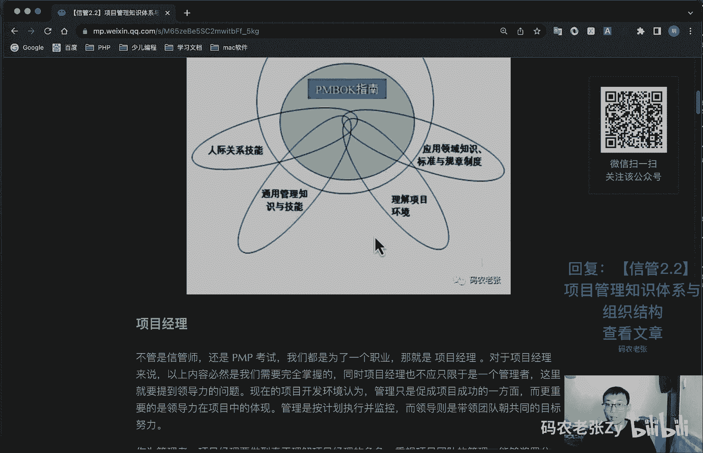

# 【信管2.2】项目管理知识体系与组织结构 - P1 - 码农老张Zy - BV1rg41147wo

哈喽大家好，今天呢我们来学习的是信息系统项目管理师，第二大篇章的第二篇文章，项目管理知识体系与组织结构，上一次课中呢，我们已经学习过了项目以及项目管理的概念，这些内容呢帮我们认识到了。

项目到底是个什么东西，有什么特点和运营有什么区别之类的，今天呢我们就继续沿着项目这件事说下去，我们在一起探讨一些项目管理的知识体系，以及我们公司中呢会有哪些的组织形式，可以让我们的项目能够顺利的进行好。

我们先看一下项目管理知识体系啊，如果你想成为一名优秀的项目经理，或者组建一个优秀的项目团队，那么有一些专门的知识领域呢，是我们必须要设计的，它包括什么呢，就是包括项目管理的一个专业的一个知识体系。

然后应用领域的一个知识标准和规定，然后项目环境知识，然后通用的管理知识和技能，软技能或者是人际关系技能，主要就是在这张图里面了，这张图也是p m p里面非常经典的图啊。

就说呢我们项目管理知识体系包括这些内容，然后pm bok指南，那这个这个呢就是p m p的那个教材，这个呢一般就是称为什么，项目管理的一个圣经啊，这本书里面的内容，然后在这本书里面。

除了就是项目管理这个专业知识以外呢，我们还要包括这些知识啊，这些就是额外的一些知识，就是人际关系技能啊，通用管理知识，就是这个管理学相关的一些知识了，然后理解一个项目的环境。

就是你对这个项目的现在的一个，情况的一些了解，然后就应用领域知识啊，标准规章制度啊，就比如说你做什么项目，你对这个相关的一个应用领域的知识，你多少应该有些了解的好了，我们再接着往下看，项目经理啊。

也不管新老师还是偏考试，我们都是为了一个职业，什么职业呢，那就是项目经理这个职位对吧，对于项目经理来说呢，以上内容都是我们必须要完全掌握的，同时呢项目经理不应只限于是一个管理者。

这里就要提到领导力的问题，现在的项目开发环境认为呢，管理只是促成项目成功的一个方面，而更重要的是领导力在项目当中体现，管理是按计划执行并且监控，而领导呢则是带领团队朝共同的目标去努力，作为管理者。

项目经理要做到真正的理解项目经理的角色，重视项目团队的管理，能够讲啥，奖罚分明，计划计划再计划，切记呃注重用户参与，而作为领导者呢，我们的我们只应该具备的是广博的知识，丰富的经历和经验。

良好的协调与沟通能力，良好的职业技道德，一定的领导和管理能力，后面的课程中呢，我们还会专门探讨一下项目经理这个角色，好项目干系人，项目干系人呢主要就是指的，与项目有关的一些利益的一个相关者。

利害关系人在偏bug，第六版直接改成了相关方，就是干系人被叫成相关方了，而在pmbok第五版的时候呢，则是从乡，则是将相关方管理从沟通管理中抽离出来，正式成为了项目管理，十大知识领域当中的重要一环。

下一节课呢我们讲讲到的就是项目管理，师大知识领域啊，下一节课讲啊，好项目干系人呢是积极参与项目或者是其利益，可能受到项目实施或者完成的，积极或消极影响的个人或者是组织。

包括任何直接或间接地与项目有关的人，我们主要面对的干系人呢包括什么呢，包括项目经理，项目管理团队，项目团队的其他成员，客户用户发起人注意啊，这个地方他为什么打一个括号，客户不一定是用户啊。

注意客户不一定是用户，用户也不一定是客户，注意啊，这个地方是有区别的，比如说你做外包，你做外包的时候，你的你的客户是谁，可能是另外一个公司，然后这个公司呢，拿你开发的软件去给他的用户用。

那么其实它真正的用户呢是他的用户，对不对，所以说你的客户和用户是分开的，不是一个人啊，然后呢发起人项目组合经理，项目组合评审委员会，然后就是项目集经理，项目管理办公室，然后职能经理，运营经理啊。

卖方就是业务伙伴等等，然后这个项目集要项目组合，这些东西后面会讲，现在不要着急，还有pmo就是项目管理办公室好，我们的目的呢是管理好干系人，从而让项目稳定的推进，项目干系人呢经常会有不同。

甚至是相互冲突的目标，项目管理团队呢必须识别项目干系人，确定其需求与期望，然后对这些期望进行管理，比身加影响，以确保项目的成功，其实呢这就是我们要做的干系人管理，具体内容呢我们的课程后期还会说好。

我就上一上一节课，我们讲过一个什么东西呢，就比如说这个物业提供的服务，它也是一个成果对吧，他这个成果呢比如说物业提供的服务啊，可能召集一些活动啊，你没有参加，那么你算不算这个项目的干系人呢。

想一想你像不像你算不算这个项目干系人了，其实是算的，为什么，因为你是业主啊，你是业主，然后你跟这个物业公司呢，其实是有一定的合同和法律关系的，对不对，所以他们组织的一些活动，就是可能会影响你的利益。

可能会影响你的利益，只要是可能会影响你的意义的话，那么你就是他们这个项目的一个干洗人，他们组织一个活动，就是做一个项目，那么你就是他这个项目的干系人，知道吧，好我们接着往下看，pp先介绍p m p啊。

就提到项目经理和项目管理知识体系，就不得不提到p m p，这家伙可以说是项目管理领域的事实标准，同时它的配套教材，也就是项目管理知识体系指南，也就是我们常说的pm box，也是项目管理领域的一个圣经啊。

项目管理信息系统，项目管理师教程中的项目管理领域的内容呢，基本全是取自于pmbok第五版，p m p呢是由pmi pmi，叫做美国项目管理协会推出的一个资格认证，根据ip mi。

ip i是国际项目管理协会制定的，知识体系和经验组织编写的pm box，并在全世界范围内组织p mp认证考试，根据ip mi的规定，项目管理资格证书包含四个等级，分别是a级高级项目管理及理。

b级项目经理，c级项目管理专家和d级项目管理专业人员，然后pp呢证书对应的就是c级，在本系列课程的开篇呢，我们就介绍过p m p考试的一个情况啊，他就我在这里再说一次，他就是1年要有四次考试。

一次呢四个小时考完200道选择题，随机抽取150道评分，就是有说有50道题，他是不参与那个评分的，一般呢能做对110~120道题左右，就可以通过评分，结果可以是以七个领域的a b，c d e等级给出的。

一般5a都可以通过，然后7a就是相当好的一个成绩，那p m p考试呢自己报名比较麻烦，一般会通过培训机构来报名，因为p mp要求有项目经验和培训经验，因此他的报名表呢是需要填写英文的，项目经验的。

考试通过之后呢，pp有一个虚证周期，也就是3年，在这3年之内，你需要通过参加活动发表论文，或者是通过继续教育的方式来积攒这个pdu，p du呢，它也叫做行业积分，在达到60分以后就可以续阵。

这个呢一般培训机构会帮你处理这个问题，如果如果你实在没有搞这搞过这些分的话，就是你你没有去，你没有去什么发表论文啊，那些东西就其他一些东西呃，就是可以积攒p p o的这些形式，你没有弄过的话。

那么其实你找培训机构，他也会帮你去处理这个问题，然后呢就是费用啊，考试费用就是p m p的，考试费用就是折合折合人民币3900左右，然后补考费用呢是折合人民币2500左右。

然后续证的费用呢大概是150美元啊，按当时的汇率来算，一般培训费用是2000~5000人民币不等，这个不是考试费啊，这考试费你单独交的，这个是培训费啊，一大笔开支对不对，很贵很贵了，之前我们就说过。

信息系统项目管理师考试费200多块钱对吧，这个这个这个差距就非常大了，不过他的培训费呢一般也是大概这个价格，但是他他的考试费只有200多块钱了，而且呢它是终身的证，我们不需要就前面这个积攒p d o啊。

去续证啊，什么这些的，不需要，好感谢国家啊，p mp呢在外企是比较韧的，国内的话呢，头部互联网企业对于信管师的证，也是没有问题的，这个不用担心，毕竟我们国内的民营企业呢，还是比较认可我们国内证书的。

国企更不要说了啊，国企是认他的，不认这个的啊，呃另外呢也是我们一再强调的，p m p的考试难度，和信管师呢完全不是一个级别啊，只要是正常人跟着上课，通过pp的难度不会太大，200道选择题。

你蒙都蒙的差不多了，对吧啊，但是呢信管师只能说一个是天堂，一个是地狱了，好下一个呢，下一个项目管理知识体系呢叫做prince to prince呢，是project in什么什么什么这个了。

就是受控环境下的项目管理的一个简称，国际项目管理师认证，这个是英国的p m p是美国的，这个是英国的，1996年开始推广的，世界三大项目管理体系之一，在国际上被称为王者认证。

ps two呢是描述了如何以一种逻辑性的，有组织的方法，按照明确的步骤对项目进行管理，它是一种基于流程和机构化的项目管理方法，有助于降低所有类型和规模的项目中的风险，prince的原则。

主题和流程与pmbok是一致的，但是呢，prince to不包含pm box当中的所有知识和节点，也就是说它是一个裁剪版的偏僻，也就是一个小的偏僻，依据组织和项目的特殊性呢。

prince to必须被裁剪，比如说项目的大小啊，复杂性类型啊，地理和文化差异等等啊，然后这个图啊，记住啊，你看到这个图，你知道是prince two的图就可以了，prince to呢包括七个原则。

就是持续业务验证，吸取经验教训，明确定义角色和职责，按阶段管理啊，例外管理啊，关注产品，根据项目环境裁剪，同时呢它也包括七个主题啊，包括商业论证，组织质量计划，风险变更进展。

这些主题呢是项目经理所关心的重要内容，最后呢它还包括七个流程，就是master prince to，很喜欢七，对不对，七这个数字啊包括项目管理，项目准备流程，项目指导流程，项目启动流程。

然后阶段控制流程，阶段边界管理，产品交付管理流程和项目收尾流程等等啊，好了，这个prince to呢真的就是了解一下就可以了好了，今天我们重点是什么组织结构，只要有多个人一起合作呢。

就可以说这些人形成了一个组织，而公司呢就是一个有规律，有制度的组织，在这个组织当中一定存在着某种组织结构，比如说我们最常见的是什么呢，估计大部分公司都是这样的，我就按部门区分的对吧。

按部门区分的公司架构，我估计大部分程序员，那是他可能会和财务是住在一起办公的，当然也有那种特别特别小的公司啊，呃可能就一间房子特别小那种公司，那有可能是在一起办公的，但是嗯一般来说。

这种稍微有有个七八个人的那种公司，大部分就是财务，他会有单独的座位或者单独的区域的，他不会跟程序员坐在一起的对吧，一般都是说一个部门的和一个部门的，是住在一起的，这对最常见的一种组织形式。

也要做职能型组织，而另外一些呢对于一些重大项目来说呢，我们可能会抽掉很多的精英，去组织成一个专门的一个项目小组，这种小型的内部组织呢也被称为项目型组织，好了，我们主要来说呢就是这些东西了，职能型组织啊。

你看这个图就很清晰了，对不对，上面是老板，对不对，然后就是职能部门经理，下面就是普通的员工了，熟悉吧，这个不用我多说了吧，他只相信大部分同学所在的公司，都是这样一个组织架构，比方说呢技术部主管好吧。

他主管系统开发财务，就是主管公司账务，然后运营主管呢就是主管运营，每个部门都有一个老大大点的公司，可能是总监，小点的公司呢可能是经理，然后比较大的公司就是总监经理可能都有，反正呢就是把相似的同学呢。

相似职位的同学呢都放到一堆成为一个部门，这个呢就是职能型组织，重点来了啊，今天的内容呢，主要就是这些组织的优势和劣势啊，职能型组织的优势包括强大的技术支持，便于知识技能和经验的交流。

清晰的职业生涯精神路线，直线啊，直线沟通简单，责任和权限清晰，有利于重复性工作为主的过程管理，然后职能型组织的劣势呢包括什么呢，职能力优于项目，具有狭隘性，组织横向之间的联系比较薄弱。

就横向的不同部门之间的联系比较薄弱，部门间协调难度比较大，项目经理呢缺少或者缺少权呃，极少或者缺少权力权威，项目管理发展方向不明确，缺少项目基准，就项目经理啊，在这种组织架构中呢，就是说不上什么话。

就这个意思啊，在职能型组织中的项目经理的权力比较弱，而职能经理的权利呢会比较大一些啊，注意啊说了这都是今天的重点啊，这是问答题，有可能会问，就直接问你这个主题结构有什么优点，有什么缺点好。

第二个呢就是项目型组织，下面主角看出来了吧，又不一样对吧，老板在上面，然后项目下面是项目经理负责，对不对，项目经理，然后项目经理底下有不同的员工，好这个就不是按部门了，你这个员工有可能是设计。

有可能是开发，有可能是测试，它都放在一个项目里面了对吧，这个就不相同了，前面说的这个职能型组织呢，就是说你看你你这个技术部门的，你可能技术部门底下呢又分为几个小组对吧，开发小组或者什么小组的。

然后开发的就开发了一堆人放在一起，然后测试的就把测试的几个人放在一起，然后财务部的这几个财务啊，出纳会计啊，他们可能就放在一起了，好项目型和智能型，就这个地方不同，项目型组织呢。

可能参与过的同学会比较少一点啊，纯做项目为生的公司会采用这种组织形式，一般外包公司可能会常见一些这种组织形式呢，就是很明显的项目经理负责制呃，一般呢这种公司呢也会存在人事，行政或者财务之类的部门呢。

但是在这种公司里面，他们都只是起辅助作用的，在项目型组织中的团队成员是以项目划分的，各种技能的人才呢可能混杂即可，在一个项目团队当中好了重点来了，他们的优势和劣势啊。

项目组织的项目型组织的优势包括结构单一，权责分明，利于统一指挥，目标明确单一，沟通简洁方便啊，决策快，然后它的劣势包括什么呢，就是管理成本比较高对吧，各种不同的人放在一起，比如说项目的工作量不足。

或者是资源配置效率比较低，然后项目环境比较封闭，不利于沟通，技术知识不太好共享对吧，你一个项目跟另外一个项目，可能完全不是一个东西，他们的知识可能不太好共享，然后呢就是员工缺乏事业上的连续性和保障。

就是你这个项目做完了之后呢，你没有后续的一个后续的项目呢，你可能有也可能没没得做，或者是怎么样的，你的上升渠道也不是特别的清晰，所以说呢在项目型组织当中呢，项目经理的权限高，而职能经理的权限比较低啊。

这个就是项目型组织的一个特点，好我们说完了，上面两种就是他们的优点和缺点，其实是互补的嘛，但是也很明显，对不对，说实话，正常的公司运营还是职能型的会好管理一些，但是呢这样可能也会导致在做项目的过程中。

让项目经理无法得到足够的权限，于是呢又有将它们合在一起的一种叫做什么呢，叫做矩阵型组织，在这种组织中呢，这个呢也通常是现在的中大型公司，进行项目开发的一个主要形式啊，你看这张图也能看出来了是吧。

老板还在这里，对不对，老板还在这里，然后职能部门经理呢也在这里，然后呢在这里面呢之后呢我们还具有什么，就是你要做项目的时候，会画一个项目经理出来，由谁负责这个项目，而这个项目经理呢又不是要横向的。

他会去在不同的职能部门呢去把人拉过来，就这种形式了，这种组织形式呢是不是很熟悉，对不对，平常我们属于某个部门，但当有一个新的项目时的，项目经理会和职能经理商业协调，把我们调到相应的项目组。

当然从职能划分来说呢，我们还是属于这个职能部门的啊，工资呢也是这个职能部门来发的，然后项目部呢可能会有一些提成，就比较理想的情况下，他可能会有一些提成，根据项目经理的职能职权限大小呢。

还有弱矩阵和强矩阵两种类型啊，在弱矩阵就是这种弱居阵里面啊，弱居阵里面，项目经理的权限可能仅限于项目组织和协调，对于具体的调派规划还是有需要，由职能经理就是由他们来确定的，项目经理的。

只是进行一个项目中间的一个组织和协调啊，员工的主要工作呢，也是他还是向他的自己的老大去汇报，他不是向项目经理去汇报好，另外一种呢就是强矩阵，就是强矩阵，强矩阵呢可能会有单独的一个项目经理部。

项目经理的一个呃部门，去专门管项目经理的一个部门，然后这个部门呢有专门的项目经理，然后这些项目经理呢就会去管这些，就是去各个部门去抽调员工，如果他如果他的权限不够呢，他会让他的上级就是负责这个项目经理。

项目这个部门的这个老大去和其他职能部门，经理老大去进行一个沟通的协调，由他们去协调，然后他这里其实也就是相当于给他的权限，稍微增大了一些啊，然后这种矩阵型组织的优势包括什么呢。

就是包括项目经理负责制对吧，然后有明确的一个项目目标，及时响应，获得职能组织更多的知识，最大限度地利用公司的稀缺资源，改善了跨职能部门间的协调，合作质量成本时间等因素得到更好的平衡，团队成员有归属感啊。

士气高啊，问题少出现的呃，冲突较少且容易处理和解决，但是呢这种组织也不是没有劣势的，注意啊，他的管理成本会增加呢，为什么管理成本会增加，多头领导啊，对不对，你既要向职能部门汇报。

也要向这个项目经理去汇报了，注意这个地方项目经理的权限增加了，所以说你也要向他汇报了，也要向这边来汇报了，所以说他是多头领导的，多少都要和职能获得对吧，两边的领导去打招呼，然后呢就是啊难易检测和控制的。

就就是比较难去检测和控制对吧，因为与员工，因为他这个全集啊，它是这种交叉型的，有横向的，也有这种纵向的这种管理，然后呢，资源分配与项目优先的问题呢会产生冲突，然后最后呢就是权利呢难以保持平衡。

就是这他们俩的权利啊，这还是难以保持平衡的，就很难的好，然后呢就是比较难，对不对，那么最后还有一种什么呢，就是混合型组织对吧，没有万金油的，我们只能以当前公司或者组织中最合适的方式，来组建我们的团队。

于是多层次的复合型组织出现了，就是一个完全职能型组织的内部，建立一个完全的一个项目型主教，其实跟上面那个强制类型的有一点点像啊，有一点点像，并且可以通过标准的正式报告机制的。

以纯项目的形式来进行这个项目的开发啊，你看到了，他这里还是以这个项目经理来进行这个这样，横向的一个对吧，横向的一个以项目经理的这种形式来做的，然后在这个里面它又可以有一个项目，什么项目b的一个协调。

对不对，反正就是这个他这个协调的，就是混合型的一种的，比上面那个强迫症的形形式呢，可能就是还要复杂一些，这种形式呢这个这个大家了解一下就好了，为什么呢，因为这个就是更复杂的，它管理管理的那个问题。

他提升的就更多了对吧，他管理的问题就会越来越多好，最最核心的是什么呢，就是前面说过的这个矩阵型的优劣势，矩阵型的优劣势，然后呢这个是什么项目型的，项目型组织的一个优劣势对吧，项目型组织的优劣势。

然后呢就是这个最后就是这个职能型的优劣势，这三个地方这三个地方是比较重要的，然后混合型的你知道有这个东西就行了，然后它比强聚症的，它会增加更多的管理成本好了，项目管理办公室在前面听到这个名词。

项目管理办公室简称是p m o对吧，如果说有一个部门来管理所有的项目的话，那必须就是p o po，一般就是指项目管理办公室，你在招聘网站上一定能看到，就是你你去搜这个项目经理这个职位啊。

很多这个职位它是由pmo总监发布的，篇幅总监发布这个项目部经理的招聘信息，它主要是由组织的高层主管，项目经理，各类各项专家啊，项目协调人员组成的咨询po对于组织来说呢，po的战略性职能包括项目组合管理。

和提高组织级项目管理能力，而他的日常职能呢，主要就是建立组织内项目管理的职场环境，培养项目管理人员，提供项目管理的指导和咨询，组织内的多项目管理和监控，其实呢它就是什么，就这一块这一块。

如果你建立一个pm的话，他可能就是这一块，它可能就是这个东西，就是所有的项目经理都归这个po去管，其实呢从b m o的职能可以看出，p m o是比较偏向于一个服务性的管理组织。

它以组织利益为首要出发点的，这也是和项目经理目标的最大不同，项目经理的目标呢是关注特定项目的成功，而p m o呢则关注组织中所有的项目，以及他们能够达到的优化水平，同时呢。

p m o会更关注项目整体的风险和机会等等，pm呢包括几种类型啊，就是知识型，控制型和指令型三种，其实呢也就是对项目经理职权利的限制，的一个级别，支持型的是以项目经理体系，就是给项目经理提供支持为主的。

就是po给项目经理提供支持，然后控制型的就是po会去干涉项目的执行情况，然后指令型的就是项目经理，必须要听从pmo的一个指挥对吧，就是三种形式好企业组织对文化的一个呃，就是企业和组织文化对项目的影响。

最后我们再来了解一下，组织文化对项目产生的影响，一个组织的文化就组织文化这个东西，很多公司他会去讲这个东西啊，不知道你在的公司有没有这个东西啊，就组织文化呢对项目的影响，主要体现在啊组织的共同的价值观。

行为准则，信仰和期望，它会影响到这个项目的相关的一些内容，然后组织的方针和办事事程序等等，而对于职职职责和权利的一个管理，最后就是重点了一些其他因素了，这个了解一下就好了，好总结一下，今天内容不少。

对不对，还好上面的就是项目管理知识体系，我们了解一下就好了，就是什么pp啊，什么那些的pm p prince to啊，那些大家了解一下就好了，重点很明显，就是在各种组织形式上，最重要的就是职能型。

项目型以及矩阵型三种组织结构的优缺点上，这是非常重要的内容啊，而且你也马上能根据这三种形式来思考一下，自己目前所在的公司是一种什么样的组织形式，理论与实践结合才是最好的学习，最后还有个表格。

就下面这个表格也是我们需要重点关注的，展示呢就是组织结构对项目的各个方面的影响，最后再强调一遍啊，这三个组织结构非常非常的一个重点啊，你看什么，就这个你看这个第一个这个是职能型组织。

然后这个是矩阵型组织，包括弱矩阵，平衡矩阵和一个强矩阵，然后另外还有一个项目型组织，然后再看啊，项目经理的权利就是在职能型组织中的，很小或没有，然后在弱矩阵里面呢就是有限，在平衡性矩阵的就是小到中等。

然后再强迫症里面中等到大，然后在项目型组织里面的，那肯定项目经理的权利就是最大的，对不对好了，相关的还有什么呢，就是组织中全职参与项目工作人员的比例，对不对，这边呢也是从小到大的，对不对。

然后呢项目经理的一个职位对吧，这这这个也是从部分时间的到全部全全，全部都是工作在这个项目上面的，然后呢就是项目经理的头衔啊，这个主要就是一路往上的，对不对，到后面的这个里面肯定都是项目经理的对吧。

然后对项目管理的什么那个行政人员对不对，就是抽调一些人部分的时间来管理这个项目，就是职能型组织，他部分参与这个项目，然后到这个项目型组织里面就是全员全时的，肯定就是一直都是参与这个项目的好。

这个呢就是这几个地方，这个表格呢也可以记下来啊，也是很有用的，就是如果对问答题出了，就是某个项目的什么那些优优势劣势之类的，你想不起来那些具体的内容了，你把这个表格上面这些关键词填上去的，也可以的。

没什么太大问题好了，今天的内容呢就是这些，大家可以回复文章的标题，信管2。2，项目管理知识体系与组织结构，来获得这篇文章的具体内容，以及更加详细的一些描述内容好了。

今天的内容呢就这些。

