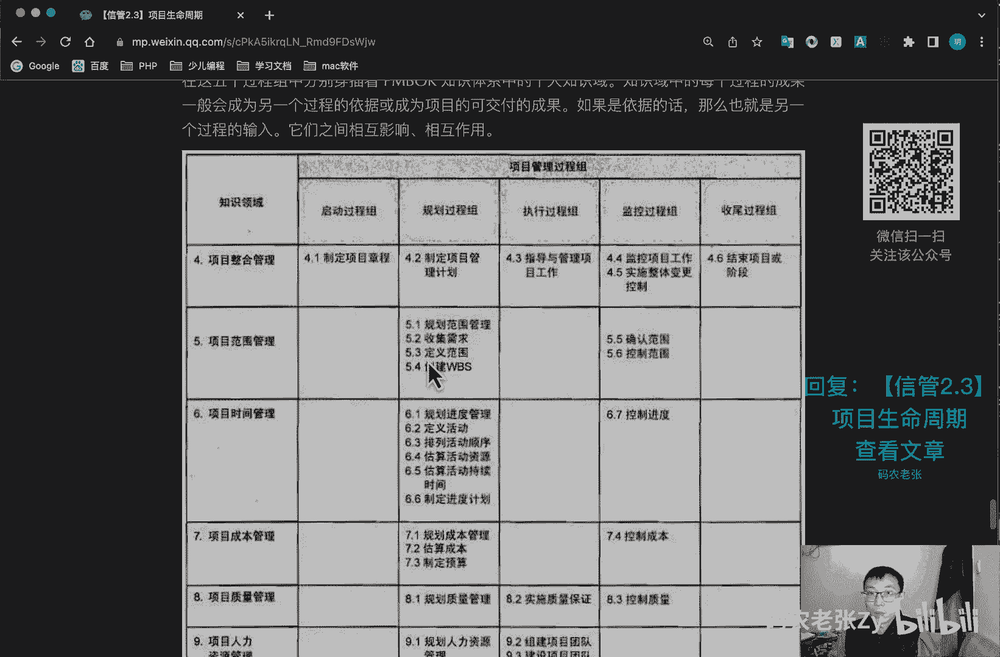
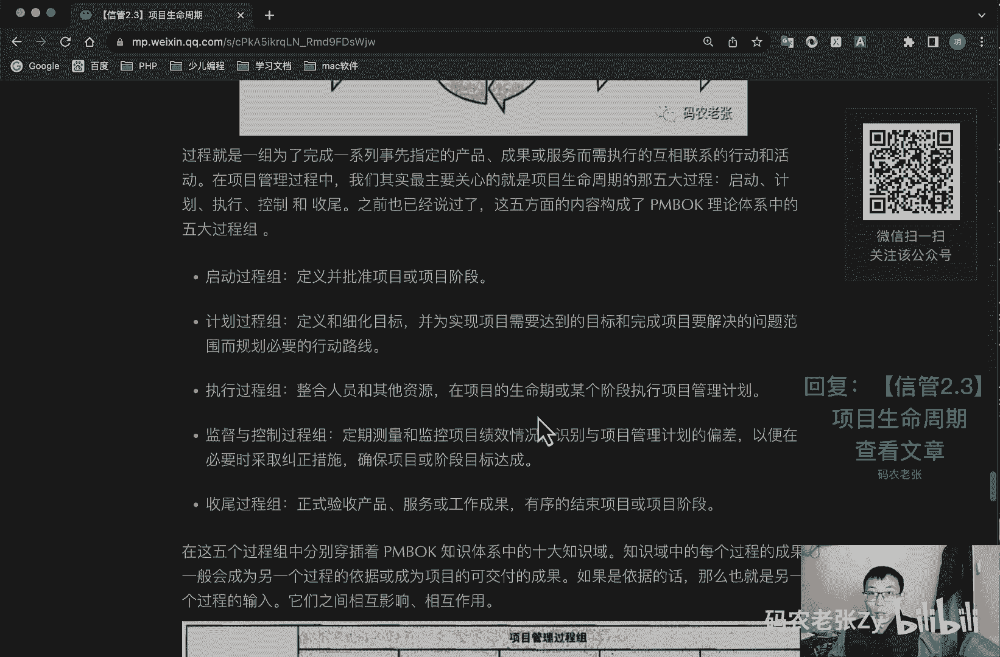
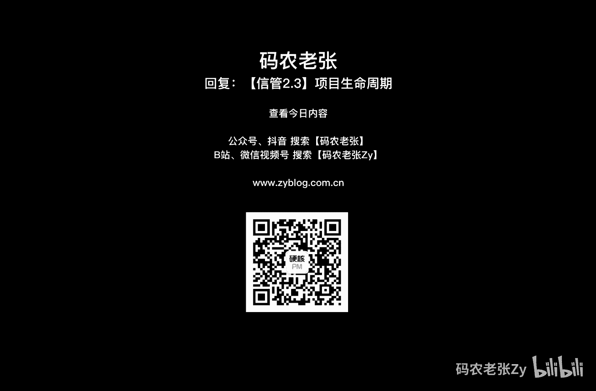

# 【信管2.3】项目生命周期 - P1 - 码农老张Zy - BV1SK41127T3

哈喽大家好，今天呢我们来学习的是信息系统项目管理师，第二大篇章的第三篇文章，项目生命周期，上一篇的文章的内容有点多对吧，消化完了没有，其实吧最主要的就是那三种组织形式而已，别的真的没什么。

记住他们的优缺点和，项目经理的权利大小就可以了，今天呢我们轻松一点，虽说还是挺重要的，但要记住他们呢，也并不是在今天就我们学习的东西，要记住他们并不是在今天要记住的啊，我们要了解一下项目的生命周期。

以及在it项目开发中，常用的一些典型的生命周期，其实这些内容啊，在我们技术相关的内容中都已经有涉及过，这里呢就是更详细的说明一下，看到下面的内容呢，你一定不会感到非常陌生的。

然后最后呢我们还要提一下项目管理过程，也就是大家翘首以盼的pm box 10大过程领域，当然了，这个只是简单的介绍一下，因为每个过程域呢，我们在后面都会进行详细的一个学习。

好我们先看一下下面的项目的生命周期，在技术相关的第一课，也就是信管1。1，信息系统与信息化，这篇文章当中呢，我们就提到过信息系统生命周期的概念，其实它本质上就是从项目生命周期演化产生的。

项目生命周期呢指的是项目从启动到收尾，所经历的一系列阶段，阶段，通常都有时间限制，有开始点，结束点也有控制点，从预测型也就是计划驱动的方法呢，到适应性的或者是变更驱动的方法，项目生命周期呢。

可以处于这个连续区间以内的任何位置，在预测型生命周期中呢，在项目开始时就对产品和可交付成果进行定义，对任何范围变化都要进行仔细的管理，而在适应型生命周期当中呢，产品开发需要经过多次的迭代。

每次迭代开始时呢，才能定义该次迭代的一个详细的范围，这个预测型计划驱动呢，其实就是我们讲的这种瀑布模型的，开发方法对吧，然后这个适应性的和或者是变更驱动，这种方法呢。

其实就是我们之前讲过的敏捷的那种开发方式，好吧，这个就是一个项目真周生命周期的一个图，我们可以看到就是在启动启动项目，就是启动项目的时候，然后所投入的人力成本的一个水平，就是比较就是一步一步上升的对吧。

然后在组织准备的时候，然后到后面执行项目工作的时候，我们的投入就是提到最高了，这个投入呢有成本也有人力资源的，然后呢最后到项目结束，然后最后就完成了，好在这个过程中，你可以看到我们主要什么启动项目。

然后组织与准备项目对吧，然后执行项目工作，然后就是一个结束项目，这四个阶段呢如果我们换一个单词的话，就可以当做是什么呢，一个就是启动，一个就是计划，一个就是执行，一个就是收尾。

另外还加上一个全过程的一个什么呢，全过程的一个监控，这样的话就演变成了一个完整的pmbok的，五大项目过程组，就是启动计划，执行收尾和监控这五个过程组，不同的阶段呢其实并没有特别严格，这个划分方法。

就是上面说的这四个阶段啊，这个因为监控是贯穿整个所有阶段的，所以说呢我们主要还是在讲这四个阶段，并没有特别严格的划分方法，阶段通常是以一个或者多个可交付成果的完成，为结束的。

通常这些阶段呢也需要遵循一些规定，比如说呢每个阶段要完成哪些技术工作，每个阶段的交付物何时以及如何产生，每个阶段都有哪些人参与，如何控制和批准，每个阶段，在上面这个图中呢，我们还看到了一条曲线。

这条曲线代表的就是我刚刚说过的人，成本与人力投入的水平，我们可以看到成本与人力投入呢，在开始的时候是比较低的，对不对，然后随着项目的进展呢，到工作期间是达到最高的，并在项目快要结束的时候迅速回落。

不过成本和人力投入，这条曲线呢并不是适用于所有的项目的，因为有的项目呢，可能在生命周期早期的支出会比较大，以确保所有的资源到位，也就是说给予的资源投入呢，从一开始就是顶端的，就是有的项目可能是这样的。

这样的，然后到最后在结束的时候才掉下来的，有的项目可能是这样的啊，那接着看一下，除了成本和人力之外呢，项目的风险，不确定性和变更代价，也会随着项目的进展而产生变化，这里需要注意的，他们俩是反过来的。

就说这个风险和不确定性啊，在项目最开始的时候，它的风险和不确定性是比较高的，随着我们通过渐进明细，对不对，我们做项目了解的越来越深入，它的风险和不确定性是一步一步的下降了。

同样的这个变更的代价就是在一开始，我们在一开始做项目的时候，代码写的还不多的时候，我们变更的代价还是比较低的，随着我们的代码写得越来越多，做的东西越来越来多，多之后呢，投入的成本和人力也越来越多。

所以它的变更的代价也会越来越高，这个呢都是根据这个呃就是项目的一个特点，就是它的渐进明星系以及滚动性规划来确定的，就是这种情况就是因为我们是渐进明细的，所以它的风险会越来越低。

也同样也因为我们是渐进明细的，所以它的变更代价也会变得越来越高，好这个具体内容，大家可以过来看一下信息系统中的项目，典型生命周期啊，这个我们来看一下啊，这个我前面已经提到过了什么呢。

第一个就是一个瀑布模型啊，这个内容非常经典的东西啊，瀑布模型最最经典的不提，他就没有办法说，软件工程和软件项目管理重要到什么程度呢，后面所要讲的所有东西只是翻来覆去。

对它的变化形式本质上没有什么特别的不同，估计不少同学呢，可能现在的公司就是这种开发模式，我们可以从什么呢，从开始的一个可行性计划分析对吧，可行性分析开始，然后呢这个其实就是一个计划的一个阶段。

然后依次经历什么呢，需求分析啊，设计啊，编码啊，测试啊，最后到运行和维护，最后我们就直接把这个东西给交付了，对不对，这几个阶段呢一步一步的走下来，它对应的其实就是我们之前讲过的，什么结构化的方法。

也就是说它的特点和优劣势，与结构化方法是完全一样的，只不过结构化方法是更偏理论的一个方法论，而瀑布模型呢，是我们可以更具体的项目化的术语，就我们可以更具体，用更具体的项目化的术语来总结一下这个东西。

好这个瀑布模型啊，它的优点是具有检查点对吧，他每每一点每1。1步一步的往后走的，关注后续的一个阶段，在迭代中可以使用，然后模板化的开发呢可以实现共同的一个指导，然后缺点呢就是阶段划分相对固定。

然后严格区分阶段的，并且包含大量的文档，线性化的开发，到末期才能看到结果以及不适，不太适应变化，这个呢就是一个最最经典的一个瀑布模型，你可以再回顾一下，就是我们之前已经学习化，学习过的这个结构化方法。

是总结的优缺点，不管是简单还是选择题啊，这两个概念就是结构化方法和这个瀑布模型，他的这些优点啊，缺点啊，如果在简答题中出现了，他们两个可以互相借鉴的，互相通的，所以说你去答这一块去放到那个。

如果他问的是这个结构化方法的优缺点，你去答这个瀑布模型的优缺点也是可以的，也是可以拿分的，这个是没问题的，因为他们俩本来就是一样的，一一对应的好，我们再来看第二个，第二个是v模型。

如果你的项目很注重质量，也就是交付成果对质量的要求非常高，那么v模型就是不可缺少或缺的神器，你看它他这边其实是瀑布对吧，这边就是一个瀑布，用户需求需求分析概要设计，详细设计以及编码和实现。

然后同样它对应的就是什么呢，这边他把一些测试的内容给加上了，对不对，它其实就是在瀑布模型基础上，为对应的阶段加上一个测试嘛对吧，它的重要意义在于什么呢，其实是非常明确的表明了测试过也是过程。

也是一个一样存在不同级别的，并且呢，也可以对应到我们普普模型的开发流程当中，微模型能体现的就是开发和测试是同等重要的，右边的这些测试是什么，也不用我多解释了对吧，主要你是要看它的对应关系。

在详细设计阶段呢，我们其实对应的就是单元测试，单元测试呢其实更重要的，其实它是通过编码来的，对不对，但是通过编码来的，但是在这个地方，在这个地方它这个台阶上面，你需要注意的就是详细设计。

对应的是单元测试对吧，然后概要设计对应的是这个集成测试，但其实概要设计正常来说应该是对应的，详细设计的对吧，但是呢我们我们这个编码，因为这个编码编码实现，它其实应该是这样横过来叫这个单元测试的。

因为单元测试是力度非常低的对吧，所以说呢它其实应该跟编码是这是一个级别的，但是在这张图里面的，你是要记住它是稍微错开一位的好，那我们概要设计对应的就是集成测试，然后需求分析呢对应的是什么。

对应的是系统测试，然后最后用户需求对应的是验收测试，验收测试呢就是在真实的环境下，就是完全真实的环境下，有完全真实的用户来进行一个测试，这个就是验收测试最后的一个测试了，好螺旋模型刚刚说过了。

如果看中质量，那么你应该选择的是v模型，而如果项目很注重风险的话，那么有很大的风险隐患，那你最推荐的最佳的选择，就应该是这个螺旋模型，这个一圈一圈的，有点看不懂，对不对，我第一次看的时候也是非常蒙圈的。

其实呢你可以从左上角就从这个地方开始看起，他这一圈一圈的转出来的对吧，他先从这个需求计划开始，然后进行一次需求分析，然后呢开始进行软件的需求，这个需求确认什么之类的，然后再开始往上转转转转。

转到这里又进行一次风险分析，然后又开始到外面的什么软件产品设计啊，设计确认与验证了，然后组装与测试啊，就开始开发了，怎么一路一路一路转出来，但是呢你注意到一点，就是他每次转的时候。

他都会进行一个什么都会进行一次风险分析，所以说他这个就是正完全针对的螺旋模型，完全针对的就是风险非常大的一些项目，好吧是吧，其实呢它就是对吧，这里也写了计划执行收尾，中间加了一个风险分析。

螺旋模型呢是一个生化深化软件的过程模型，将迭代增量的方式呢与线性顺序，瀑布中控制和系统化的方面相结合起来，使得系统增量版本的快速开发成为可能，更重要的是他在其中增加了风险分析，当项目产品有问题的时候。

我们就可以马上终止开发，综上所述，模螺旋模型的特点呢就是用于适用于复杂的，高风险的不成熟的一个项目啊，最重点就是高风险的好，我们再来看迭代模型啊，迭代这个词其实是在敏捷开发中发扬光大的。

在之前的敏捷学习中呢，我们知道迭代是在一个固定的时间内，去交付某些有价值的成果，真正的迭代模型呢是早于敏捷的，是敏捷采用了这个迭代模型，是敏捷采用了这个迭代模型，而不是说敏捷发明了迭代啊。

这个东西一定要注意了，好那么一次迭代呢就可以看成是一次小的瀑布，我们每一次迭代呢，其实看可以看作是一次小的瀑布，整个迭代迭代，开发过程呢就是不断重复的去重复，这个小的瀑布，循环好，下面这个图啊。

从这个图，那么我们就可以看出，这个迭代呢也其实也是包含不同阶段的，比如说这个初始细化构造啊，移交阶段，然后在这个和在这个工作流不同的工作流上呢，它的侧重点也不一样，比如说在开始的时候对吧。

开始业务建模和需求获取的时候，很明显能看出来，在前面这两个这两个步骤的时候，我们会花费比较多的一些精力啊，成本啊，时间啊都会发挥在这个地方，这个地方也比较高对吧，这个地方也是比较高的。

然后在分析设计的时候呢，它主要是在细化这一块是工作比较多的，然后在实现和测试部分呢，其实就是构造，构造对应的就是我们前面瀑布模型里面的，开发了写代码那一块了对吧好最后呢就是移交，移交就是其实就是完成了。

其实也是代表这个小迭代完成了小迭代，完成了对应瀑布模型呢其实就是已经收尾了，对不对，收尾了，那么在这个地方呢，它其实就是在测试测试之后对吧，最后部署的时候，这一块它的工作量就比较大的了。

占的比重也就比较多的了，好了，我们教材上的这个迭代模型呢，在网上被管方面，利用于另外一个经典的模式的解释，就是统一过程ip，统一过程，i o p呢是一种用力用力驱动。

与体系结构为核心迭代及增量的软件过程模型，有u ml方法和工具支持，广泛应用于各类面向对象项目，它本身呢也是迭代模型的一种，可以归类为迭代模型之下，除此之外呢，螺旋模型很明显的。

也可以看出是迭代模型一类的模型，还有一种就是面向对象的迭代模型方式，称为什么呢，喷泉模型这个也非常有意思啊，你看一下他这个他这个是什么，从底下往上喷的，对不对，往上喷的，然后到不同的阶段。

它可以返回不同的东西，对不对，这是一种面向对象的一种迭代方式，然后在这个外面呢，你也能看到很熟悉的什么单元测试，对不对，集成测试系统测试验收测试，然后在这个里面呢，我们顾客需求分析什么这些的内容好。

这个图你就了解一下就可以了，你只要知道看到这个图，看到这个形状的像个喷泉一样，对不对，你记住它是喷泉模型就行了，然后它是什么呢，它是一个面向对象形式的一个迭代模型，好再接着往下看原型化模型。

原型化模型的第一步就是创建一个快捷原型，这个之前我们已经讲过了吧，原型开发结构形式的好，能够满足项目干系人与未来用户的，可以与原型交互，再通过与相关干系人进行充分的讨论和分析，最终弄清楚当前系统的需求。

进行了充分的了解之后呢，在原型的基础上开发出用户满意的产品，那个圆形是有两种形式的对吧，一种抛弃型的，一种这种演化形的，对不对，好了，在螺螺螺旋模式中呢，我们就提到过圆形化的开发。

其实呢它是为了弥补瀑布的变更，代价高昂的特点，在开发前呢我们用最小的代价来产出一个原型，用于确认需求，原型的可以不用写代码，线框图，低保真，高保真，原型呢，几乎已经成为了产品经理的一个代表工具啊。

使用extra的高手做出来的动态高不能原型，是真的能够达到以假乱真的地步的，因此呢原型模式其实现在已经被产品经理在，已经广泛的应用了，而我们的技术呢可以快速实现的，类似圆形的一种开发形式，叫做什么呢。

我们之前在敏捷里面也学过的，叫做mvp，也就是最小可行性产品，这个我们之前都已经讲过了，如果不记得的小伙伴，还可以到之前的米这个课程中再去回顾一下，圆形呢，根据使用的结果可以分为两类对吧。

一个抛弃型的原型，这个原型呢就是之前在敏捷里面都讲过的，还有进化型的原型对吧，进化型的就是可以从一个呃基本需求出发，然后通过修改和最佳功能逐渐丰富，演化成最终的一个系统，好我们再看一下敏捷开发模型啊。

敏捷开发啊之前我们已经写过太多了，对不对，有兴趣的小伙伴就回去看一下啊，好了说了一下，重点就是了解一下敏捷开发，在这边的重点关注的内容就好了，它是适合小团队小规模的项目，小步快跑的模式。

其实实现的呢就是增量迭代的方式来进行开发，剩下的希望大家还是去看一下我之前的p m i，a c p相关的课程好了，还有一个逆向工程，逆向工程呢是从技术的角度来说呢，就是通过反编译等手段。

将一个软件进行结构分析，比如说在十多年前的反编译安卓应用，来参考别人的代码，实现的是非常常见的情况，为什么呢，因为那个时候组件不多啊对吧，然后呢就是逆向工程，包括设计模型啊，就实现级的逆向。

然后也就是完全恢复之前的系统，然后还有程序，数据结构信息结构级的恢复数据以及算法，然后对象模型数据和控制流模型，功能级的来回复内容文档，以及原ml状态图和部署图领域的恢复设计流，这个大家了解一下就行了。

理想工程这一块，我们再看一下下一块大的内容，项目过程组与知识域，项目管理呢从实践来说呢，其实就是将知识技能工具和技术，应用于项目活动当中，以满足项目的要求，它是通过利用项目管理知识。

技能工具和技术过程实现的，这个过程呢凭借每个过程的输入条件，创造出成果，也就是我们常说的输入输出，然后中间还有个什么工具和技术对吧，工具技术通过把一定的输入条件，把一定的输入内容拿过来以后。

也许是一些条件，也许是一些成果，也是什么东西，拿过来之后，通过一定的工具和技术进行一些加工啊，处理啊，也就是执行的过程，最后呢变成什么，变成一些成果进行输出就行了对吧，这个就是这些东西。

然后它大概过程就是这样的，这个是这个是五大过程组啊，这五大过程组启动过程组，规划过程组，然后是监控过程组，是在中间不断的全局的去监控的，然后去执行过程，最后是一个收尾过程。

好过程呢就是一组为了完成一系列，实现指定的产品成果或服务，而需执行的相互关联的行动和活动，其实就我前面解释的那个东西，有输入，有输出，中间有工具和技术来进行一个任务的执行，然后呢在项目管理过程当中呢。

我们其实最主要关心的就是项目生命周期的，五大过程组对吧，刚刚也是看了这个图了，启动规划执行收尾，还有包括一个监控好，这五个方面内容呢，就构成了偏book理论体系当中的五大过程组啊。

这个详细的解释一下启动过程组，定义并批准项目或者项目阶段，这个都是书上的内容啊，然后计划过程组定义和细化目标，为实现项目需要达到的目标，和完成项目要解决的问题范围，而规划必要的行动路线。

然后在执行过程中就是整合人员和其他资源，在项目的生命期或者某个阶段，进行执行项目的管理计划，然后监控监督与控制过程组，就是定期测量和监控项目绩效情况，识别与项目管理计划的偏差，以便在必要时采取纠正措施。

确保项目或阶段目标达成，最后呢就是收尾过程，主要正式验收产品服务或工作成果，有序的结束项目或者项目阶段，注意啊，一定会有收尾，一定要收尾，做项目一定要收尾，在这五个过程组呢。

分别穿插的pm bok知识体系当中的十大知识域，知识域中的每个过程的成果呢，一般会成为另一个过程的依据，或者成为项目，就是最终的一个可交付的成果，如果是依据的话，那么也就是另一个过程的输入。

也是我前面解释过的内容啊，他们之间相互影响，相互作用好这个东西，这一张表非常非常重要，这一张表非常非常重要，这张表怎么看呢，这边是十大知识领域啊，这边有十个，看到没有整合范围，时间成本质量。

人力资源沟通风险，然后采购，然后干系人这边有十个，这个是知识领域，这边对应的就是五大过程组，就我们前面一直在说的，我们今天一直在说的五大过程组，然后这个呢就是说明，在整合管理这个知识领域当中呢。

在启动过程组有这么一个活动，然后在规划过程组有这么一个活动，在执行过程中有这么一个活动，在监控过程组呢有这么两个活动，最后的收尾工程组有这么一个活动，注意这个表格非常非常重要，当然现在你不用把它背下来。

现在你不用背下来，为什么呢，因为我们还没讲呢对吧，我们讲了之后呢，这个表格你一定要背下来，要背到什么程度呢，就是我们简答题，还有什么，还有论文，全都是根据这个来写，全都是根据这个来写。

最后我们都会说这个东西的，然后如果你是考p mp的话，考p mp的话，不仅要把这个表格里面的内容背下来，还要背什么对吧，你们老师一定会说我还要背什么i d t o对吧，i d t o是什么呢。

就是输入输出那个东西，那个东西也要背下来，ok这个东西呢我也就不多说了，这个我们以后一定要背下来的东西啊，好我我这里还有一个工具啊，主要是一个小程序的工具，一会我要给大家展示一下，看一下啊。

偏僻知识域啊，用一句顺口溜来说的话，就可以继承什么呢，范围时间成本质量是核心，人类沟通风险，采购干系人是辅助整体管理来归一，也就是十大项目知识领域啊，好这个还有一个比较完整的图。

其实跟上面这张图差不多啊，就跟这张图差不太多的，但是这个更详细一些，我们再来仔细看一下，就是说作为一个项目到底是一个什么情况，就是项目启动或启动者，或者是发起人去发起这个项目对吧。

然后他会我们就会获得一些项目的输入，这些可能是可可行性研究报告啊，或者是各种一些项目前期的一些准备工作，然后呢我们就进入这个循环当中，这个循环是一个非常出名的，叫什么。

就这个p d c就这里在这里写了pd c一循环，这个也是非常出名的一个循环啊，这个是叫做戴明环，他的中文叫做代名环，虽说叫戴明华，但是他并不是由戴就戴明这个人提出来的，他是由这个叫瓦特的提出来的。

然后戴明去进行完善的更具体的内容，大家可以去查询一下相关的资料，pdc循环非常重要的，他这个p啊代表的就是plan计划，然后do代表的是去做对吧，check是检查，然后act就是一个活动对吧。

然后pd c循环这个非常重要，然后我们获得项目输入之后呢，就是通过pd c循环来不断的去进行呃，项目的开发对吧，不断进项目开发，开发完成之后呢，我们将项目可交付成果交给什么最终用户。

然后把项目记录呢就变成一个过程的一个资产，好，这个就是一个整个做项目的一个大的，一个过程图啊，非常笼统，但是也非常重要的一张图，就是你做项目的时候一定要理解这个图，好，这些内容是什么呢。

不用说我大我不用不用，我说大家应该也能看出来了，项目过程管理组和知识域的那张大表格，就我前面说的这个就这个大表格非常非常重要，但是呢你现在还不用把它背下来，我一直在想着，你现在还不用它背下来。

但它是我们整个课程的一个超级重点，当你学完全部的内容之后呢，再背它也会变得非常容易，另外项目生命周期中的重点呢是信息系统，项目典型生命周期，这一部分也不需要完全的记忆，我们只要看到名字。

知道这些模型的特点就行了，什么呢，就是我们前面也一直在说的，就这几个原型化模型啊，你也开发模型逆向工程啊，啊这个这个图啊，你要记住他是干嘛的对吧，喷泉模型的，然后这个迭代模型的这个是代表迭代模型的。

对不对，这个是螺旋模型，螺旋模型最重要的是什么呢，高风险对不对，高风险的，然后呢还有这个就是这个是v模型，v模型呢强调测试，然后他们一一的对应关系，最后呢就是还有这样一个对吧，还有这样一个瀑布模型。

最基础的一切，一切的基础好，再来联系一下，就是我开发的一个这个小程序啊，其实大家就可以直接在小程序里面搜索，p p m p i t t o，或者说叫p m p知识域，这个是只要搜索这个小程序就可以了。

然后小程序里面呢，这个就看我这个这里面已经量就已经列出来了，这个十大知识领域，对不对，随便点进去一看就可以看到，这是它里面的过程跟这里都对应的，跟我们这个表格，大家可以看一下。

跟这个表格跟这个表格是对应的，跟这个表格对应的，比如说我们这个是成本管理，对不对，项目成本管理，然后规划成本管理，然后这个规划成本管理，然后下面有他的输入，然后有工具与技术，然后还有输出。

这个呢如果你是考p mp的，你肯定要背这些东西的，然后呢我们可以怎么玩呢，就把这个隐藏起来对吧，隐藏起来之后你就去背吧对吧，你就去背就行了好吧，这个也比较简单的，然后当然这个这个这个外面这几个呢。

是我们考信管识别的重要的就是这些东西，这个是比我们考新款是比较重要的，这个是你一定要背下来的，当然p m p呢你肯定也要背这个东西，然后然后呢这个也可以打开显示，也可以隐藏对吧，这个呢就方便可以。

大家去自己去背一下这些内容好了，今天的内容呢就是这些，大家可以回复文章的标题，信管2。3项目生命周期，来获得这篇文章的具体内容，以及详细的一个信息啊，这个内容呢还是比较重要的，前面已经说了对吧。

这几个模型最重要的，最重要的就是这张表格以后我们再背啊，但是你要知道这个表格现在是在这篇文章里面，或者你在书上面呃，好像新款时代教材里面是没有的，但是你可以去看一下，找一下电子版的pmp的pm bok。

这本书里面的，他都会有这个详细的这个表格，好吧，今天内容呢就是这些。

