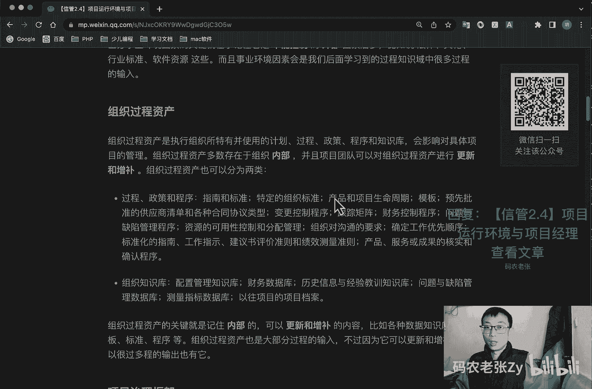
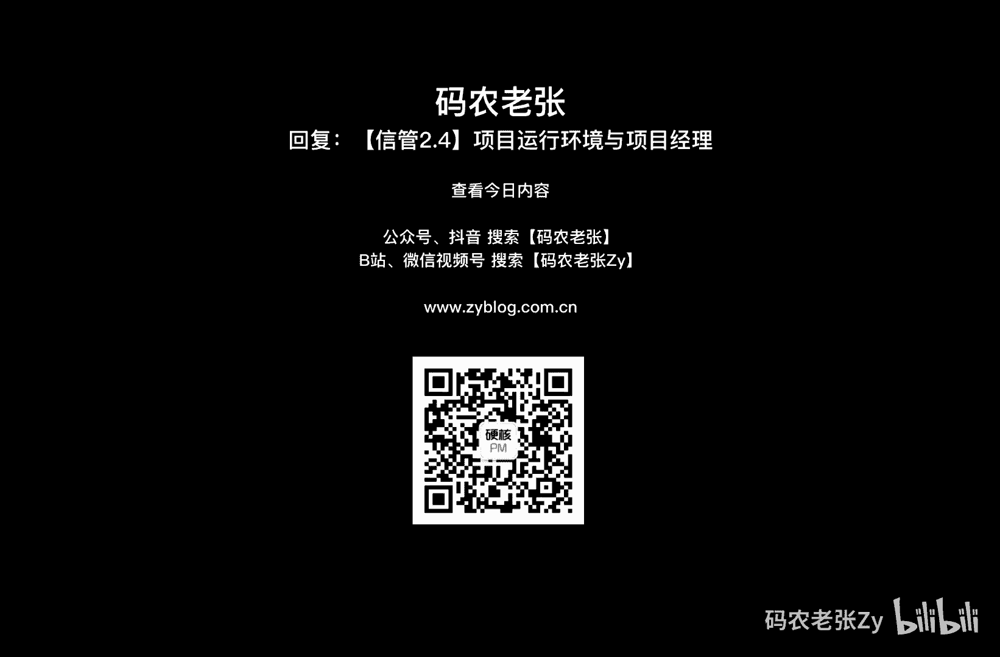

# 【信管2.4】项目运行环境与项目经理 - P1 - 码农老张Zy - BV1c8411K7Hm

hello，大家好，今天呢我们来学习的是信息系统项目管理师，第二大篇章的第四篇文章，项目运行环境与项目经理呃，加餐加餐啊，这这整篇文章都是加餐，在信息系统项目管理师教程，这本教材里面是没有的。

而且在pmbok第五版里面也是没有的，这部分内容是在pmbok第六版中，新加的两个独立章节，不过内容不多，非常轻松，重点很少，大部分全是了解的内容，开心高兴吧，那我们就来一起学习一下，好吧好了。

我们先来看一下项目的运行环境，项目所处的不同环境呢，可能对项目的开发产生有利或者不利的影响，这些影响呢两大主要来源就是事业环境因素，和组织过程资产呃，事业环境因素呢源于项目外部的。

最外部的通常是往往是企业外部的环境，事业环境因素呢可能对整个企业项目，组织项目集合的项目产生影响呃，组织过程资产呢主要是来源于组织内部的啊，注意一个是外部的，一个内部的组织过程资产是内部的。

事业环境因素是外部的，可能来自组织自身项目组合项目及其他项目，或者是这些的组合好，我们先来看一下事业环境因素，事业环境因素呢，它简称是e e e f e e f s，是指项目团队不能控制的，不能控制的。

注意这些重点加粗的对项目产生影响，限制或指令作用的各种条件，虽说外部环境的因素更多，但组织内部也会有各种事业环境因素，因此呢事业环境因素可以分为两类，一个呢是组织内部的事业环境因素，包括组织的文化啊。

结构啊，治理啊，设施和资源的地理分布啊，基础设施啊，信息技术，软件资源可用性，员工能力等等，然后组织外部的组织外部的事业环境因素，主要包括市场条件和社会和文化的影响与问题，还有法律限制，法律啊很重要。

商业数据库，学术研究，政府或行业标准，财务考虑因素，物理环境要素等等，区分事业环境因素的关键呢，就在于记住它是不能控制的，外部因素居多的，比如说法律的，文化的，行业，标准的软件资源等等这些。

而且事业环境因素呢，会是我们后天学习到的过程，知识域中很多过程的一个输入好，第二个就是股组织过程，资产组织过程，资产呢是执行组织所特有并使用的计划过程，政策程序和知识库会影响对具体项目的管理。

组织过程资产呢多数存在于组织的内部啊，注意内部，并且项目团队呢可以对组织过程资产，进行更新和增补，事业环境因素是不能改的，大部分是不能改的，组织过程资产呢基本上都是可以更新和增补的。

组织过程资产呢也可以分为两类，第一个呢就是过程程序和过程，政策和程序指南和标准，特定的组织标准啊，产品和项目生命周期啊，模板啊，预先批准的供应商清单和各种合同协议类型啊，变更控制程序。

跟踪举证的财务控制程序，问题与缺陷管理程序，资源的可用性控制和分配管理，组织对沟通的要求，确定工作优先顺序，标准化的指南，工作指示，建议书，评价准则和绩效测量标准准则，产品服务或者成果的核实和确认程序。

另外呢就是组织的知识库呃，主要是包括配置管理知识库，财务数据库，历史信息与经验，教训指示库，问题与缺陷管理数据库，测量指标数据库和以往的项目的档案，组织过程资产的关键就是记住它是内部的。

可以更新和增补的，对不对，跟系列环境因素正好是反过来的啊，比如各种知识库，数据知识库啊，模板啊，标准啊，程序啊等等啊，看到这些名词呢，一看就知道是组织过程，资产解读过程，基坦呢大部分也是过程的一个输入。

不过它因为它可以更新和增补，并且是组织内部的，对不对，所以说很多过程的输出也有它好，我们再来接着看项目治理框架，治理呢是组织在各个层级上的，组织性和结构性的安排，旨在决定和影响组织成员的行为。

这里是一个多维度的概念，需要什么呢，包括考虑人员角色结构和政策要求，通过数据和反馈提供指导和监督，这里是组织内行使职权的框架，包括但不限于规则，政策，程序规范关系。

系统过程这个概这个框架呢会影响到什么呢，就是组织目标的设定和实现方式，风险监控和评估方式以及绩效优化方式，这个呢了解一下就可以了，好项目经理角色之前呢我们就说过啊，就是我们学习这个课程呢。

就是想拿到信息系统项目管理师这个证呢，或者说你去考pmp证书，最终的目的都是为了成为一个角色，是谁呢，那就是项目经理，项目经理呢在领导团队达成目标方面，发挥着至关重要的作用。

很多项目经理呢从项目启动的时候，就参与到项目，直到项目结束了，他也不离开，有的时候呢，项目经理呢可能会在项目启动之前，就参与评估和分析活动，也有些组织呢可能还要求项目经理管理，或者协助项目的商业分析。

就非常早期的了，还有商业论证以及项目组合管理的事宜，项目经理呢还有可能参与后续的一个跟进活动，以实现项目的商业收益，项目经理在团队中的职责包括什么呢，包括审查组织的愿景，使命和目标。

确保成果与之保持一致，然后解释与成功完成成果相关的一个愿景，使命和目标，最后向团队沟通自己的想法，激励团队成功去完成目标，项目经理无需承担项目中的每个角色，单一，具备项目管理知识和技术知识的理解和经验。

怎么说呢，打杂的你什么都得会，对不对，感觉看上去就是这样是吧，好了说了半天呢，我们还没给项目经理一个完整的定义，项目经理是由执行组织委派领导团队，实现项目目标的个人好，项目经理的影响力范围啊。

项目经理在其影响力范围内承担多种角色，这些角色的反应的项目经理的能力，体现了项目经理这一职业的价值和作用，好我们首先看在项目上，项目经理领导项目团队，实现项目目标和相关方的一个期望。

项目经理利用可用资源与平衡，相互竞争的项目制约因素，项目经理还充当什么，项目的发起人，团队成员与其他相关方之间的什么一个沟通者，包括提供指导和展示项目成功的一个愿景，这个东西非常非常重要。

沟通这个东西非常重要，项目经理使用软技能，例如人际关系技能和人员管理技能，来平衡项目相关方之间的相互冲突，和竞争的目标已达成共识好了，在组织方面，项目经理呢需要积极的与其他项目经理互动。

就是其他独立项目，或者同一项目级的其他项目呢，可能会对项目造成影响，原因呢包括但不限于什么呢，主要是对相同资源的需求，资金分配的优先顺序，可交付成果的接受或者发布，项目与组织的目的和目标的一致性。

与其他的项目经理互动啊，就有助于产生一些积极的影响，以满足项目的各种需求呃，项目经理呢需要寻求各种方法来培养人际关系，从而帮助团队实现项目目的和目标，比如说我这边缺前端了，是不是，你帮帮我帮帮忙嘛。

借借两个前端过来，对不对，这个呢都是通过这些人际关系来实现的，然后呢，项目经理在组织内部，充当扮演着强有力的领导者角色，项目经理还致力于什么呢，就是展现项目的价值，提高组织对项目管理的接受程度。

提高组织内现有的p m o的一个效率，好再看看在行业方面啊，项目经理应时刻关注行业的最新发展趋势，获得并思考这些信息，对当前项目是否有影响和可用，这些趋势包括但不限于产品和技术开发。

新兴且正在变化的一个市场空间，标准，技术支持的工具，影响当前项目的经济力量，影响项目管理学科的各种力量，过程改进和可持续发展的一些战略好，专业语学跨学科方面啊，对于项目经理而言。

持续的知识传递和整合是非常重要的，此外呢，指导和教育其他专业人员，了解项目管理方法，对组织的一个价值，好吧，这个是项目经理，就是在各个各个方面的一些影响力啊，影响力的范围好。

我们再来看一下项目经理的一个胜胜任力，pmi呢有一个人才三角的概念，就这个三个人才三角主要关注，主要重点关注三个关键技能的一个组合哈，第一个就是这个技术呃，技术项目管理技术。

项目管理技能呢只有效的运用项目管理知识，实现项目级或者项目的预期或成，果的一个能力啊，顶尖的项目经理经理呢，会具备几种关键的技能啊，但是包括但不限于什么呢，重点关注所管理各个项目的关键技术。

项目管理要素主要包括什么呢，就是项目成功的关键因素啊，进度计划，然后指定的财务报告，然后问题日，然后针对每个项目裁剪传统和敏捷的工具，技术和方法，然后制定完整的计划，并谨慎地排定优先顺序，管理项目要素。

包括但不限于进度，成本资源和风险，战略和商务管理技能啊，就是这一块战战略和商务管理技能，战略和商务管理技能呢包括纵览组织概况，并有效协商和执行，有利于战略调整和创新的决策和行动的能力。

为关于项目成功交付的最佳决策，项目经理应咨询具备关于组织运营的专业知识，运营经理战略和商业技能，有助于项目经理确定，因为其项目考虑哪些商业因素，也就是说运营那边的东西你也得懂一点啊。

商务运营销售这边的东西你也得懂一点啊，你自己的技术这一块你肯定也得懂得好吧，最后呢还有一个非常重要的是什么呢，领导力，领导力呢这个呢我们单独来说，领导力技能呢包括指导激励和带领团队的能力，包括协商抗压。

沟通解决问题，批判性思维和人际关系技能的基本能力，项目经理呢应该研究人的行为和动机，需要运用领导力技能和品质，与有关的项目相关方进行合作，包括项目团队啊，团队指导和项目发起人。

领导和管理的最终目的都是办好事情，很多技能和品质归根结底就是处理政治的能力，政治涉及影响裁判自主和权利，政治及其相关要素呢不局限于好与不好，以及正面与负面之分啊，没有没有完全的那种两极划分的东西啊。

权力往往需要人们对领导者的看法来配合，借助人际关系呢，可以让项目相关的协议得到落实，在权利方面的顶尖的项目经理的积极主动，且目的明确，并且会在组织政策协议和程序许可的范围内，主动寻求所需的权利和职权。

而不是做党的组织来授权啊，我们要去积极的主动去获得一些权利好了，领导者的品质和技能啊，研究显示领导者的品质和技能呢，包括但不限于什么呢，第一个有远见，例如帮助描述产项目的产品目的和目标，能够构建梦想。

并向他人诠释你的愿景好，第二个积极乐观，第三个乐于合作，这不解释啊，然后呢就是通过建立行信任啊，解决在顾虑寻求共识，平衡互相竞争的和对立的目标，运用说服协商，妥协和解决冲突的技能。

发展和培养个人及专业网络，以长远的眼光，把人际关系看成是与项目本身同等的重要呃，持续发展和运用政治敏锐性，来管理关系的一个冲突，这个地方全是人际关系，也就是沟通那一块的东西非常非常重要好了。

通过花大量的时间管理期望呃，然后诚恳的接受反馈，提出建设性的反馈，询问和倾听来进行沟通，还是在讲沟通对吧，尊重他人，帮助他人，保持独立性，谦恭有礼，友善待人，诚实可信，忠超忠诚可靠，遵守职业道德。

这是做人的基本准则了，这也不多说了，展现出诚实诚信，正直和文化敏感性，果断勇敢，能够解决问题，适时地称赞他人，终身学习，以结果行动为导向，关注最重要的事情啊，关注最重要的事情包括通过必要的审查和调整。

不断调整工作优先级，寻求并采用适合适用于团队和项目的优先级，排序方法，区分高层战略优先级，尤其是与项目成功的关键因素相关的事项，对项目的主要制约因素呢保持警惕，在战术优先级上保持灵活。

能够从大量信息中筛选出重要的信息呃，这个主要是那个工作能力方面的啊，然后呢就是以整体和系统的角度来看待项目，同等对待内部和外部因素，能够运用批判性思维，例如运用分析方法来制定决策，能够创建高效的团队。

以服务为导向，展现出幽默的一面，与团队成员有效的分享乐趣，好，我们再看一下领导力和管理，管理呢更接近于指挥一个人，采取已知的预期行动，从一个位置到另一个位置去对吧。

你指挥他从一个位置到另一个位置去去干嘛了，就去做做什么事情，对不对，而领导力呢是指通过讨论或者辩论与他人合作，带领他们从一个位置到另外另外一个位置，就是我们我们要去带领他，从一个位置到另外一个位置。

管理是什么，我们指定你，你必须从这个位置到那个位置，然后领导呢就是我说服你，你要从这里到那里，我会我还会带着你去，好，项目，经理呢必须同时采用领导力和管理力这两种方，式。

技巧在于如何针对各种情况找到恰当的平衡点，管理与领导力的比较呢，可以参考下面这个表格，我们可以直接来看一下，一边是管理，一边是领导，管理，这边呢直接利用职位权力，然后领导这边呢利用关系权利来指导。

影响和合作，然后管理这边呢主要是维护为主，领导这边呢主要是发展为主，管理这边呢主要是靠管理对吧，这个呢主要是靠创新好管理，这边呢是关注系统和架构，领导这边呢是关注人际关系，管理这边呢主要是依赖控制。

领导这边呢主要是激发信任，管理这边呢主要是关注近期的目标，领导这边呢就是关注长期的一个愿景了，管理这边呢是了解方式和时间，领导这边呢是了解情况和原因，管理这边呢要关注盈利，领导这边呢要关注前景。

管理这边呢要接受现状，领导这边呢就要去挑战现状了，管理这边呢要正确的去做，是领导这边就是做正确的事对吧，这个很有意思啊，这这这这这种语法汤那种感觉是吧，然后这个呢就是关注操作层面的问题。

及其解决方式对吧，然后领导这边呢就是关注愿景一致性和动力，以及激励好，最后再来看一下执行整合，执行项目整合实呢项目经理承担双重的角色，项目经理呢是第一个呢就是项目是重要的角色，与项目发起人携手合作。

来理解战略目标，并确保项目目标和成果与项目组合，项目及以及业务领域保持一致，项目经理以这种方式来实现，战略层面的整合与执行，第二个呢就是在项目层面上，项目经理负责指导团队关注真正重要的事务，并协同工作。

为此项目经理需要整合过程知识和人员，在整个项目期间实施整体变更，控制过程呢是为了整合变更的请求，变更这个东西也非常重要的一个东西啊，项目经理呢需要整合项目管理，知识领域所涵盖的过程。

才有可能实现预期的项目结果，项目经理还需要充分认识到，项目背景和新的各种因素，然后决定如何在项目中更好地利用这些新环境，因素以获得项目的成功，好了，这个东西呢我们在后面会说啊，大家先不要着急。

这个我现在只是跟你说，这个东西也是比较重要的一个东西，好总结一下，之前我们说过，今天的内容呢是在pmbok当中的内容，我们主要关注的是项目的运行环境，和项目经理相关的内容，据说这些呢不是考试的内容。

但是如果你是期望成为一名合格的，项目经理的话，这些内容呢还是非常有必要去了解一下的，最主更主要的是呢，他对我们理解之后的项目管理方面的内容呢，也是非常有用的，总之呢多学一点，不会让你吃亏上当的对吧好。

今天内容呢就是这些，大家可以回复文章的标题，信管2。4，项目运行环境与项目经理，来获得这篇文章的具体内容啊。

和详细的一些解释好了，今天的内容呢就是这些。

