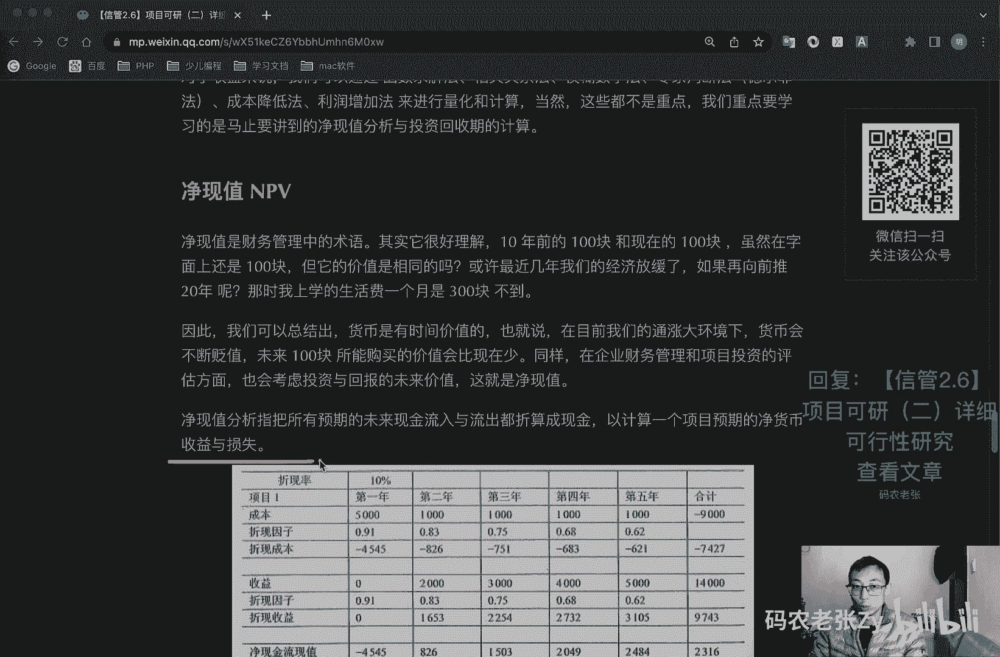
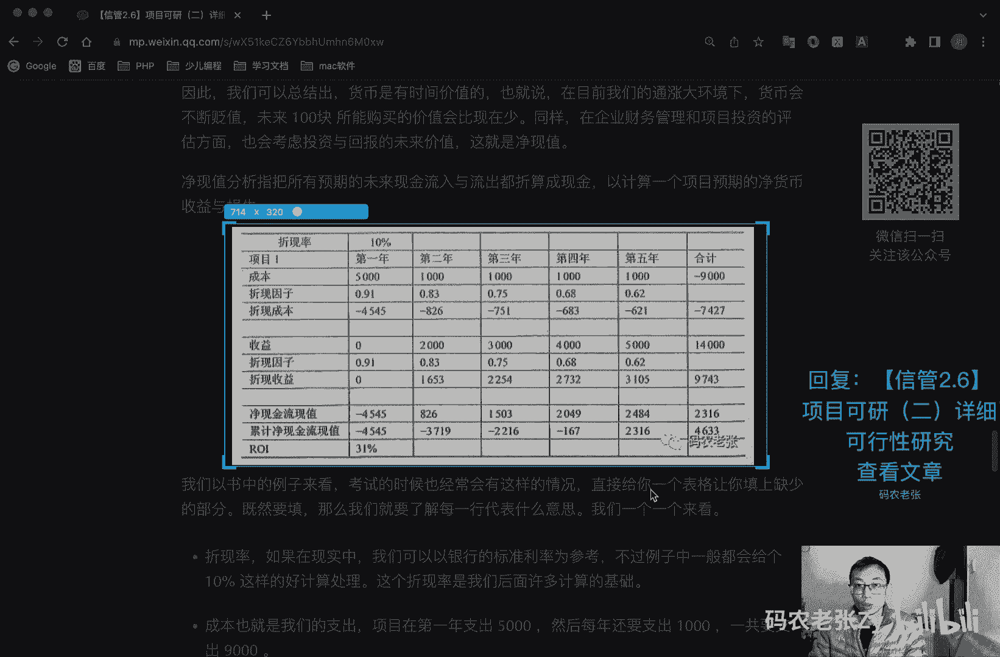
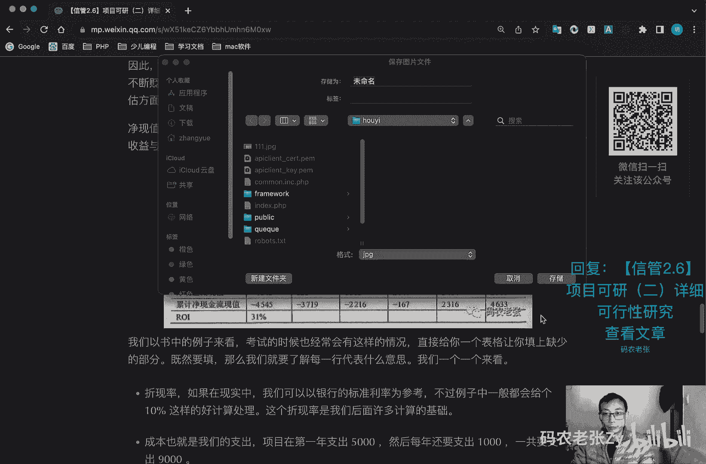
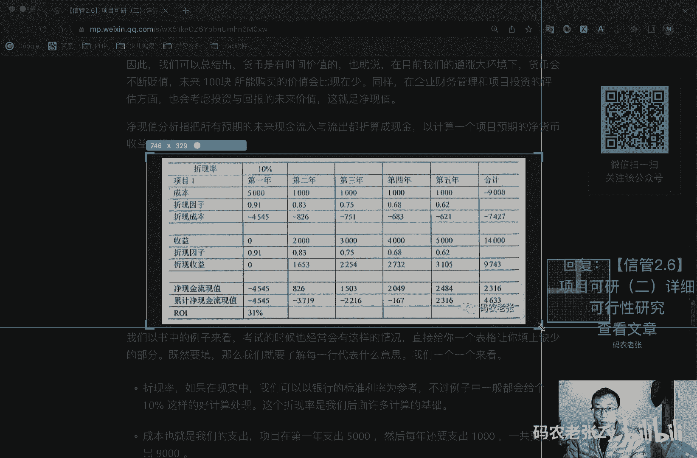
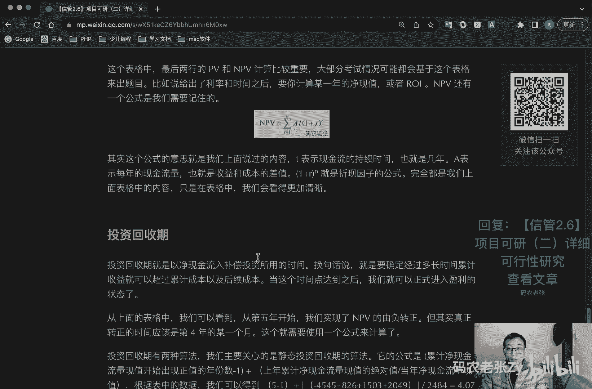

# 【信管2.6】项目可研（二）详细可行性研究 - P1 - 码农老张Zy - BV1QA411Z79T

哈喽大家好，今天呢我们来学习的是信息系统项目管理师，第二大篇章的第六篇文章，项目可研的第二篇文章，详细的可行性研究，在实际的整个项目可研的过程当中呢，机会研究和初步可行性研究有可能不会出现啊。

但是详细可行性研究这个步骤是不可缺少的，比如说一些升级改造的项目，可能需要初步和详细的可行性研究，而一些小的项目，可能只需要一个详细的可行性研究，就可以开始进行开发了，在小项目中呢。

往往机会研究和初步研究，都可以直接合并到详细可言当中，详细可行性研究呢是在项目决策前，对项目有关的技术，经济，法律，社会环境等方面的条件和情况，进行详尽的系统的注意，要加粗的地方。

详尽的系统的全面的调查研究分析，对各种可能的技术方案进行详细的论证比较，并对项目建设完成后，可能取得的经济社会效益进行预测和评价，最终递交的可行性研究报告，将成为进行项目评估和决策。

的一个重要的一个依据，好我们看一下，进行详细可行性研究的一个依据和原则，他呢就是必须在国家有关的法律法规，政策规划的前提下进行的，同时，还应当具备一些必需的技术资料，进行可行性研究的主要依据呢。

包括以下几个因素，国家经济和社会发展的长期规划，部门和地区的发展规划，以及国家和地方的相关政策，法律法规和制度，项目主管部门对项目设计，开发建设要求请求的一个批复，项目建议书或者是项目建议书批准后。

签订的意向性协议，国家地区企业的信息化规划和标准，市场调研的分析报告，技术产品或工具的有关资料，国家有关经济法规规定，如中外合资企业法，税收外资贷款等规定，国家关于信息化建设方面的标准规范，定额资料。

市场调查报告等等，他的依据呢是项目能够启动的第一个布的内容，在确定依据之后呢，就上面这些依据之后呢，我们还要在一定的原则框架中进行项目，这些原则框架包括哪个呢，主要就是三个原则，第一个就是科学性的原则。

即要求可按客观规律去办事，要做到运用科学的方法和认真的态度，来收集分析和鉴别原始的数据和资料，要求每一项技术与经济的决定呢，要有科学的一个依据，第二个呢就是客观性的原则，坚持从实际出发。

实事求是的一个原则，认识客观条件，运用客观的资料，报告和结论呢，必须是分析研究过程合乎逻辑的结果，第三个呢就是公正性的一个原则，站在公正的立场上，不偏不倚，综合考虑项目干系人的各方利益，不弄虚作假。

好了，我们再来看一下详细可言的一个内容和方法啊，详细可言所涉及的内容非常多，每一个方面呢都有其处理问题的方法，信息系统项目的可行性研究内容呢，一般可以归纳为以下这些内容啊，第一个是概述。

提出项目开发的背景必要性和经济意义，研究项目工作的依据和范围，产品交付的形式种类和数量，第二个呢是需求确定调查，研究国内外客户的需求情况，对国内外的技术趋势进行分析，确定项目的规模目标。

产品方案和发展方向，需求预测的方法呢包括时间序列预测法，因果回归预测模型，消费水平法，最终用途消费系数法等等，具体内容呢，这些东西啊就大家可以自己去了解一下啊，然后呢就是现有资源实施情况的分析调查。

现有资源包括软硬件资源啊，数据啊，规章制度等种类与数量，以及这些资源的使用情况和可能的更新情况，然后呢就是设计初步的技术方案，确定项目的总体和详细的目标范围，总体的结构和组成，核心技术和关键的问题。

产品的功能与性能，接着就是项目实施进度计划的建议啊，投资估算和资金的筹措的一个计划和，资金筹措计划还是比较重要的，然后呢就是项目组织人力资源技术培训计划，包括现有的人员规模，组织人员层次啊。

个人技术能力啊，人员技术培训计划等等，经济和社会效益分析，主要是以效果评价为主啊，然后就是合作和协作的方式好，我们接下来看就是详细可行性研究的方法，详细可行性研究的方法有很多。

主要包括财务评价和国民经济评价两种，财务评价呢主要是直接的效益和直接的费用，也就是项目的内部效果，它主要包括呢就是静态评价法，包括静态投资回收期，静态投资收益率两种，然后呢动态评价法包括折现率，净现值。

内部收益率，外部收益率，动态投资回收期啊，动态投资收益率啊，收益和成本比值这些内容啊，都是管理学中比较经典的一些财务评价的方法，如果你就是了解过一点管理学，或者你本身就是管理学专业的，这些东西。

你绝对是学过的啊，或者是财务专业的，你绝对都学过这些东西的，后面呢我们在成本效益分析中，也会着重讲其中的几个方法，国民经济评价呢主要是间接效益和间接的费用，也就是项目的外部效果，它主要包括什么。

经济评价法，市场预测法，投资估算法，在投资估算法中的主要有指数估算法，因此估算法单位能力投资估算法，然后呢就是增量进效益法好，我们来看一下成本效益分析，在对成本效益的分析中。

我们最主要的是需要了解两个算法的实现，也就是进线值，进线值叫做np v分析和投资回收期，这两种计算内容，不过在这之前呢，我们需要先了解一下成本效益的一个概念啊，这个东西是比较重要的。

好像首先说成本在现实生活中呢，你以为的成本就是我们出的钱投资了多少钱，就这个大方向是没错的，确实是这样，成本就是我们出的钱要把这些钱变成更多的钱，就是我们后面要讲到的收益，对于成本来说呢。

还有许多不同的分类，这个才是我们今天最主要的，需要去了解的内容啊，这是其中一个重点，好我们看一下这几个成本的分类，第一个呢就是固定成本，是指其总额在一定时期或者一定产量范围内呢，不直接受产量变动的影响。

而保持固定不变的成本，比如说我们谈好的总价合同啊，一签定制，一签订之后，就合同一签订之后，这个价格就不能再变动了，还有比如说设备的折旧和房屋的租金等等，这都是固定的，然后呢就是变动成本。

变动成本是指在一定期间和一定业务量范围内，其总额它会随着这个业务量的变动而呈正比例，变动的成本，比如说这个原材料啊，工资啊之类的，一般业务量越大，这类成本也就越大对吧，你招的人越多，工资发的越多。

你就你要做的产品越多，你的原材料消耗也越大，对不对，这些就是变动成本，然后呢就是混合成本，混合成本呢，就是指混合了固定成本和变动成本的一个成本，然后呢就是直接成本费用的发生了。

与特定的产品或者服务有直接的关联，就拿我们做项目来说，只要是与项目开发有关的成本，它都是直接成本，像是开发人员的工资对不对，办公设备的损耗，然后服务器的这些租用的这些呢，都是我们的直接成本。

然后就间接成本费用的发生了，与产品或者服务存在关联，但不是直接的关联，比如说我们支付给办公室保洁的那些保洁阿姨，他们的清洁费用对不对，然后我们的水电费，我们的停工损失费是吧，现在那个什么居家办公对不对。

停工损失费等等这些的这些呢就属于间接成本，下面的一些可能大家还是比较了解的，那么下面几个呢就比较好玩了，好这个呢就是一个沉没成本，沉没成本是指以往发生的，但与当前决策无关的费用。

说白了就是我们已经花掉的钱，没有办法再去改变了，也就是说支出之后不可改变的成本，就像我们组织了团建活动对吧，玩完回来了，这部分费用呢就是沉没成本了，另外呢就像是中途弃用的一些设备啊。

无法再使用的零部件啊，需求变更后无法再使用的代码，甚至包括时间精力都是沉没成本，注意你不要太去太在乎你的沉没成本，也就是说你买了一个东西，你后面再去后悔也是没用的，这个东西已经变成你的沉没成本了。

那么你也可以把它卖掉，对不对，或者是你把它继续留着用或者怎么样的，总之不管你怎么去处理它，但是你之前付出的这笔钱他都叫做沉没成本好，第二个呢就是期货机会成本，他那是指企业为从事某种经营活动。

而放弃另一项经营活动的机会，或者说利用一定资源获得某种收入时，所放弃的另外一种收入，其实呢它就是一个选择题啊，比如说有两个项目，a和b你只能选其一对吧，那么如果我们选择了a，你也就会获得a的收入。

但是b的收入就和你没关系了，这个b的收入啊，不是那个a的收入，a的收入你已经拿到了，对不对，但是这个b的收入就是你的机会成本，因为你没有选择它，它就是你的机会成本，机会成本是一个遗失的成本对吧。

另外呢还有一个最典型的例子，就是几份offer同时放在了你的面前，但是你只能选择一个，你只能去一个地方上班，对不对，那么其他的offer就是你的机会成本，这个就比较好理解了对吧好了，机会成本啊。

一个沉没成本，机会成本这个都是比较有意思的，还有一个呢就是质量成本，这个呢他是为了确保产品或者服务，满足规定要求的费用，以及没有满足规定要求而引起损失的费用，是企业生产总成本的一个组成部分。

这个怎么理解呢，这个其实就是我们有可能反因为返工维修等，因为质量问题而增加了成本，代码刚上线产生了重大的bug对吧，不管是损失的金额还是修补bug所付出的时间，精力，人力成本，它都是质量成本。

这个质量成本后面我们会详细的说啊，呃另外还有个比较典型的例子啊，就是那个汽车对吧，买汽车之后经常会听到什么汽车召回了，对不对，某个零部件有问题了，汽车召回了，他这种一召回。

就是说这个汽车在没有卖出去之前，或者说他没有下生产线之前，它的质量成本肯定非常低的，对不对，你在生产线上就可以把问题解决了，然后呢如果他已经下线了，卖到顾客的手里了，然后这个时候你再去召回的话。

其实它的质量成本是非常非常高的，这个呢我们后面还会再详细的去说的好，怎么样，是不是又大开眼界了，其实这些都是管理学的基础，而且是非常非常基础的内容，在这里呢我们只是简单的了解一下。

只是说只是大概说出来这些名词啊，你知道是啥意思就行了，更具体的内容，你可以自己再去详细的看一下好了，收益除了成本之外呢，我们还要了解一下收益，收益不就是我们赚到的钱嘛，对吧没错。

但和成本一样的收益也是不同的分类的，这个就简单一点了，第一个呢就是有形收益，他呢是可以通过直观的，或呃看到或者感觉到的这种收益啊，项目为社会提供的产品，就是最明显的一个有形收益，有些收益越多呢。

说明项目的经济效益越高，当前项目投资分析中，最主要的是以可计量的有形收益的大小，作为项目投资决策的依据的好了，另外一个呢就是无形收益，是指不能用货币或者是实物计量的效益，为有形收益的一个对称啊。

投资项目，或者说某一经济活动为国民经济所提供的，难以或无法用某一计量单位进行计量的收益，都叫做无形收益，除了上面两种之外呢，收益还可以分为经济收益和社会收益，然后近期收益和远期收益，显性收益和隐性收益。

微观收益和宏观收益等等，对于收益来说呢，我们可以通过函数求解法，相关关系法，模糊数学法，专家判断法，也可以叫做德尔菲法，然后成本降低法，利润增加法来进行量化和计算，这个德尔菲法我们后面会说的，当然了。

这些都不是重点啊，我们重点要学习的是马上要讲到的是什么，净现值分析与投资回收期的计算，这两个东西是关联起来的，可以一起看好，我们先看一下什么叫做进线值极限值npv啊，净现值是财务管理中的术语。

它其实很好理解啊，就是说你10年前的100块和现在的100块，虽然在字面上还是100块，但是它们的价值是相同的吗，对不对，大家肯定想到了通货膨胀嘛，对不对啊，或许最近几年呢我们的经济已经放缓了。

但如果再向前推20年的话，那个时候我上学，一个月的生活费是300块钱不到啊，你想想啊，一个月生活费300块钱不到啊，你再看看现在的大学生啊，什么那些的，他一个月生活费是多少，因此呢我们可以总结出来就是。

货币是有时间价值的，货币是不断贬值的，未来100块所能购买的价值会比现在要少，对不对，那么它价值肯定会变少，同样在企业财务管理和项目投资的评估方面呢，也会考虑投资与回报的未来价值，这个呢就叫做净现值。

净现值分析呢，它指的就是把所有预期的，未来的现金流入与流出，都折算成我们现在的这个金额，以计算一个项目预期的进货币收益与损失。

好这个表格很重要，我现在先把它截下来，然后我们一会再好好的去看，因为我们下面再去讲这个表格中，每一项它具体是什么作用啊。

稍等一下。

你把它截下来，然后钉在这个地方。

好接下来我们就往下看啊，我们以这个这这这张表格是书上的一个例子啊，考试的时候也经常会有这种情况，就是直接给你一个这样的表格让你填上，就是他有一行或者是有几个空，它空空出来的，然后再让你填上。

那么如果既然要填的话，我们肯定必须要知道这个表格中，每个地方都是什么意思，对不对，其实最主要还是这些名词对吧，这些名词所对应的这些算法，这些东西啊，它是怎么回事啊，好我们先来看一行一行的来看好。

我们第一个来看就是折现率，折现率这个东西其实一般都是表格的，上面这个折现率如果在现实当中呢，我们可以以银行的标准利率为参考，不过例子中呢一般都会给一个10%啊，因为什么呢，好计算，对不对。

这个折现率呢就是我们后后面许多计算的基础，然后在现实生活中，除了这个银行的利率之外呢，你还可以就是每年国家的那个gdp增速，对不对，经常都会听到这个对吧，原来都是什么8%的增速，对不对。

但是近几年可能因为疫情的影响，是不是能到3%，4%就已经相当不错了，以那个去做折现率的话，其实也是可以的啊，下面这一行这就开始了这项目对吧，项目然后我们第1年第2年，第3年这一行就不用多说了好了。

主要是成本了，从从成本就开始了，成本成本就是我们的支出，对不对，项目我们在第1年什么支出5000块钱，然后每年呢我们还要支出1000块钱，为什么呢，因为我们还有人员工资啊。

还有各种其他的一些消耗品啊什么的对吧，他还是会有一定的支出的，然后一共就要支出什么，一共到最后要支出了9000块钱对吧，这是付9000的好，这个是折现因子，这个折现因子啊，也就是以10%的。

就是10%的这个折现率来进行计算的，每年都以这个10%的折现率，进行利率的折现，这个利率折现它是有个公式的，公式是什么呢，就是这个公式啊，这个模式1÷1加r2 的n次方好，这个r r就是折现率。

就这个10%对10%，然后这个n呢就是年数，对不对，好，我们来算第1年的第1年其实什么呢，第1年就是1÷1+1-1的一次方，对不对，其实就是1÷1。1，对不对，1÷1。1的结果呢就是0。91。

当然后面还有很多小数啊，它就直接省略了，就变成两位小数了好了，这个呢就是一个折现因子，这个折现因子后面计算，全是根据这个折现因子来的啊，这个东西就非常重要的东西啊，然后呢就是折现成本。

折现成本呢是什么呢，绝对就是这个成本吗，成本乘以那个折现因子，成本乘以折现因子得出来的结果吗，第1年5000x0。91，然后最后得出来的4545，对不对，这个这个也不用太多解释了，最后我们总共的是吧。

总共是-7427对吧，到第5年我们一共支出的这些是服务7000呃，427嗯，我注意啊，这个是没有折线的，这个是没有折线的，就按我们纸面上的那个钱对吧，我们直线上的钱，但我前面说过了，钱是在贬值的。

对不对，贬值了之后呢，其实到那1年我们一共支出了之后呢，按现在的价值来算的话，其实我们才支出了7427，其实是要少一点的啊，好我们再来看嗯，下一个收益对吧，收益第1年项目正在开发的时候，没有收益对吧。

这是个零，当然也有可能有收益啊，这个你看出题的情况啊，好我们第1年开始赚到钱了对吧，第1年赚到了2000，第2年赚到了3000，第3年赚到了，第4年赚到了4000。

然后第5年赚到了5000万的收益还不错，对不对，最后我们总共有多少，有就是项目，前5年我们总共有14000的收益对吧，其实相当不错了对吧，14000收益相当不错了，因为我们看我们的支出是多少。

9000对吧，我们后面有14000的收益是相当不错了，但是呢这个这个收益还是以我们现在的纸面，纸面上的钱来算的，对不对，我们还没有去进行折现呢，好这个折线一子跟上面一样的，跟上面一样的。

这个就不用多说了，跟上面是一样的，完全都是一样的，好诶这个这个这个地方刚刚没说对吧，这个地方那个他公式应该是多少吧，就是一加上呃，1÷1+1。1对吧，然后几次方对不对，这个主要是几次方。

这个就是五次方了，五次方之后他算出来的结果就是0。62，这个大家可以自己用七盘棋去扣一下啊，接下来呢就是我们折现的收益啊，折现的收益就是什么呢，我们收益乘以折现因子，对不对，这个就好解释了啊。

因为我们上面已经看过了折现因子对吧对吧对，然后乘出来乘出来乘，乘完了之后把它们汇总起来，9473，这就是我们我们实际上我们纸面转了14000，对不对，但是我们折线了之后，其实对相对于现在的价值来说呢。

我们只赚了9743块钱对吧，也有可能后面单位是万啊，这这这这个他给的单位就无所谓了，因为它主要还是以上面的数字计算为主的好，我们再来看一下啊，接着往下看，这个呢就是折现的收益，有了折现的成本和折现的。

就是折现的成本和折现的收益之后呢，我们接下来就可以计算那个净现金流了，这个净现金流是什么意思呢，净现金流呢其实就是你看我们在这个地方呢，这个地方都是一样的对吧，其实呢它就是我们的收益去减去成本的一个结。

果，我们收益去减去成本的一个结果，现在是零，这个是-454545对吧，第1年没有收益的话，他这个也就不计算了，就是就是-4545，然后第2年呢变成86了，对不对，其实还是那个收益去减去。

就是这个1653去减去这个826对吧，1653-826还是826是吗对吧，然后第三点呢是什么呢，就是2254-75，12254-751，然后就是1503，然后第四，然后这1年就是2049，2049。

就是2732去减去683，2732去减去683，然后等于2049，这个呢就是收益去折现啊，注意啊，折现之后的收益去减去折现之后的成本，最后结果你看这里还有一个最后的汇总的一个，结果，就是2316。

其实就是这个去减去这个他们他们是这么剪的，不是这个地方加起来啊，不是这一串加起来啊，这个地方还还是这里的折现的总收益，去减去折现的总的那个成本，好，这个这个这个就在这个地方啊，这个地方是需要注意的。

这个地方需要注意，它不是前面的累计加起来了，好这个呢就是我们的近限制的进线金流，净现金流现值对吧，这个名词很绕口啊，净现金流现值这个东西啊，这个东西呢它是np v当中的那个p啊，他如果用字符来表示的话。

它就p就是np v当中的那个p全名就是pv，它的它的意思呢就叫做限值，就现在的一个价值就叫做现值，他表示的其实就是未来的收益，减成本之后，我们的利润在现在的一个价值，这个pv也是非常重要的。

这个pv这个单字母啊，现在先记住，将来我们还会说到这个pv这个东西的好，再接着往下看，接下来这一行呢，就是比前面那一行多了两个字啊，多了两个什么字呢，累计累计净现金流现值，累计净现金流现值对吧。

这个又是怎么算的呢，这个你看啊，这个就是这样一步一步去加，什么意思呢，454545，对不对，4545，然后去加他加88，然后等于-3719了，对不对，再去加他，再去加他，加加501。

然后变成-2216了，再去加他，他的结果就是-167了对吧，马上就要转正了啊，再去加他2484，看到没有，转正了，转正了，我们赚钱了好最后我们累计，最后我们累计合出来的就是一个什么4633，对吧。

最后我们就是4633没错，这个就是上一行的现金流量限制，也就是pv的一个逐年的累加，就把他们逐年累加上来，累加上来的结果就是这个累计净现金流现值哇，这个说的好好绕口啊，好吧好了。

最后呢还有个什么r o i对吧，r o i代表的是投资收益率，就是将净收入除以投资额的所得值，它的计算公式呢就是总的这个公式在这里，总的折现收益减去总的折现成本，再除以折现成本啊，总的折现收益。

总的折现收益是9743对吧，9743，然后减去总的折现成本，9743-7427，9743-7427，然后再除以折现成本，就是还除以7427，你看公式在这里套上公式之后，他最后的结果是什么呢，就是31%。

这个就是r o i l y这个东西啊，注意这个叫做投资收益率，这个叫做投资收益率好了，整个表格上面所有的东西就没了，对不对，这个表格呢最后两行的就是最后两行呢，这个就叫做pv对吧，刚刚已经说过了。

这个叫做pv，然后下面这个累计净现值流的流量值呢，就叫做np v np v就是我们前面说的这个东西啊，np v，然后大部分考试呢情况呢，可能会基于这个表格来出题目，比如说给了就是给你一个利率对吧。

就是折现率给你个利率和时间之后几年，对不对，给你一个利率，还有个几年，然后让你计算某1年的一个净现值啊，进线值会注意进线值，或者说是r y也有可能让你计算机去计算r y。

然后n p v呢还有一个公式是我们需要记住的，这个公式看起来很复杂，对不对，n p v等于什么呢，给你什么累加，然后这个a然后后面什么一加r的几次方，对不对，这个地方呢你看注意。

这个地方还是折现因子的公式，看到没，这个地方还是一个折现因子的公式，然后这个t呢代表的就是我们现金流的持续时，间，就是那个呃呃就是也是那个n吧，就是我们几年对吧。

然后a表示的就是每年的一个现金的一个流量，a表示每年的现金流量，也就是收益和成本的那个差值，就是那个就是前面这里讲的，收益和成本的那个差值，其实就是他嘛，对不对。

收益和成本的差值就是我们的净现金流现值嘛，就是pv嘛，然后呢嗯一加r n次方，最后面这个嘛就是我们这些因子，对不对，其实呢完全还是我们上面那个表格，就是前面讲的这一堆公式的那个组合。

就是他用一个公式给它表示出来了对吧，其实内容是一样的啊，内容是一样的好，只是说用这个表格来看的话，我们更清晰，如果你记不住这个公式的话，你就把这个表格列出来，如果你能记住这个公式的话。

你直接用公式去算也可以，但是你怎么去算的话，你都要去算什么呢，都要去算出什么极限因子，算出直线因子，算出那个第几年，第几年，然后他的那个折现成本和折现收益对吧，然后用他们你才能得到pv，对不对。

得到pv之后你才能去计算np v对不对，然后有这两个，然后这些东西都有了之后呢，你也你才能去计算r i，对不对，所以这这都是一环套一环的，这个呢是我们接触到的第一个计算题，第一个计算题其实嗯怎么说呢。

东西比较复杂，对不对，东西比较复杂，但是都是加减乘除啊，注意我们项目管理里面所有的这些计算题，基本都是加减乘除，所以说也不用太担心，就是说前面讲的这些每一个东西，每个东西是什么意思，怎么去算这些东西。

这些这些概念你记住它就可以了，基本上大部分人正常的小学水平通过的，你都可以算出来，好这个就是需要去记忆的，这个没办法啊，这个只能说是没办法的，这个啊好好记吧，好把这个关掉好，我们再来看投资额。

应该先不管了，没没关系没关系，我们再来看投资回收期啊，投资回收期呢就是以净现金流入，补偿投资所用的时间，换句话说呢，就是要确定经过多长时间累计收益，就可以超过累计成本以及后续成本。

当这个时间点到达之后呢，我们就可以正式进入盈利的状态了，其实我前面已经这就已经重点强调过了，我们在什么时候盈利了，看到没有，在第5年是不是诶不到第5年啊，其实不到第5年，我们在第4年的某一个月份。

你看我们在第4年的时候还只欠了160，-1167了，对不对，我们只欠了这么多钱了，其实在第4年的某一个月份，我们就已经转正了，然后到第5年的时候，我们已经赚了这么多了，对不对。

这个呢就是我们的那个投资回收期的，就是投资回收期的那个点，知道吧，就那个点就经过那个点之后，我们就是由负转正了，在这里也说了啊，在这里也说了，就是从第5年开始，我们实现了n p a的有负转正。

但其实真正的转正时间是第4年的某个月，这就要使用一个公式，我们可以使用公式来计算啊，这个投资回收期呢有两种算法，我们最主要关心的就是静态，投资回收期的一个算法啊，它的公式是什么呢，就是累计净现资金流量。

现值开始出现正值的年份数减一很长，对不对很长，但是其实就是就是你看就是你看一下，我们刚刚那个表格就是哪1年变成正值了，看到没有，哪1年第5年变成正值了，然后刚刚那个公式是什么，变成正直的那1年减一。

其实就是四对吧，好四嗯，我们看一下这个地方就是一个四，对不对，加上什么加上上年累计现金流量值的绝对值，除以当年净现金流量的绝对值，刚刚是什么-13级，对不对，我们在这里啊，这里公式写出来了。

这里是哦累计的累计的累计的流量限定值啊，累累累计的是这个地方，是这个地方一路一路一路累加，累加到这个地方啊，注意啊，累加到第4年，累加到第4年，把他们累加的和最后再除以，这个其实就是-167去除以它。

但是绝对值啊，绝对值去除以它好，167÷2484对吧，667÷2484，我们看一下，直接着往下看，除以2484之后等于4。07，对不对，是167，167÷2484，我们来算一下啊，167÷2484。

对不对啊，对0。067，0。067是吧，李4。07，4。07，然后你再把这个4。07再换成，是把这个0。07对吧，把这个点零七再换成是第几个月份，对不对，就可以就或者是换成再除以365对吧。

再乘以365，然后就会换成是哪一天，我们可以精确到哪一天，它是由负转正了对吧，其实呢这个就是表格中对吧，这里也说了，就是表格中第4年的累积性限制，流量限值-167的绝对值。

167就拿167去除以2484，其实就是从这个结构来说呢，我们在第4年的开头没多久啊，这很明显的开头没多久啊，没多久就已经实现了由负转正的一个过程了，这时如果有另一个项目，也进行了一个npv的计算。

并且算出投资回收期呢，只需要3年多，他就可以实现那个由负转正了，那么明显在投资回收的维度上，那个项目会更优于当前这个项目，毕竟投资回收期越长的项目呢，可能带来的风险也就越大。

不过呢这个只是确定一个项目的一个因素，而不是决定项目整体项目可研，是否通过的一个决定性因素，它只是一个决定，只是其中一个因素，这是财务方面的因素啊，好总结一下今天的内容呢不算多。

但是第一次我们什么接触了计算题了，后面还有的啊计算题啊，这只是一部分好了，这只是第一道，这是第一道计算题啊，我们后面还有两个非常重要的计算的部分，一个就是那个范围，一个就是进度方面的。

另外一个也是一个那个呃，财务方面相关的一个计算正值的那一块了，好，当然他那个正值计算呢，也是跟这个跟我们今天讲的这个pv是有关系的，好吧，到时候我们再详细说好吧。

好我们学习到了详细的可行性研究的依据原则，内容方法等，然后学习了成本与收益相关的内容，特别是净现值这一块，最主要的搞清楚那个表格当中各行的意义，以及最后限值和净现值的一个算法，净现值。

np v呢是整个管理学当中都会学到的内容，各位大佬呢如果将来要当老板的时候，这一块的知识说不定什么时候讲会就会用上，这个东西真的很很有用，和现实的管理学里面一定会讲这个东西，包括财务方面的东西。

而且这个东西在财务那一块，其实是最简单的一个东西啊，好了内容比较杂乱，大家呢还是需要更加深入的理解消化一下，当然了，下篇文章我们也会相对轻松一些可言，我们这一块也是要快要收尾了，好今天内容呢就是这些。

大家可以回复文章的标题，信管2。6项目可研二，详细可行性研究呢来获得这篇文章的具体内容，当然最主要的部分是什么呢，一个就是这几个成本，这几个成本，这几个成本的分类，以及他们相关的概念非常重要。

然后另外一个呢就是这个进行值这个表格，这个表格每一行是怎么算的，这个公式是什么对吧，折现因子的公式是什么，还有包括最后这个n p v的这个公式是什么，然后这个l i是怎么算的，这些东西呢。

大家呢最好再仔细的再去看一下，仔细的去练一下啊，你可以遮住一部分，遮住一部分，然后回想一下这一行应该是怎么算出来的，这一行主要主要就是后面这几行了，这些东西是怎么算出来的，然后另外呢还有一个公式是什么。

还有一个就是投资回收期的这个公司，非常简单的，就是累计近千之流量限值，开始出现正值的年份数减一，加上上年累计净现金流量现值的绝对值，除以当年累计现金流量的现值，哎呀好绕口，对不对，注意啊。

上上年累计的除以当年的，这前面是累计的，后面是当年的，然后前面是年份，前面那个单位是年份啊，最后解出来的结果就是这样的，四加上这个出完了之后就是4。07，好这个大家也可以自己动手来试一试。

把计算器试一下也是可以的。

好了，今天的内容呢就是这些。

