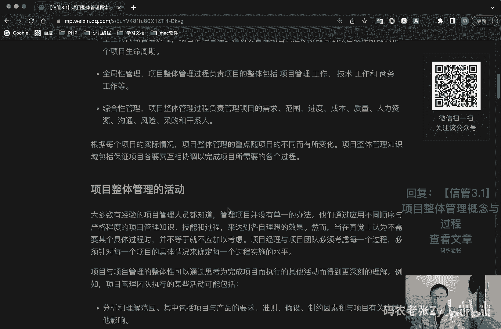

# 【信管3.1】项目整体管理概念与过程 - P1 - 码农老张Zy - BV1Ld4y177a7

hello，大家好，今天呢我们来学习的是信息系统项目管理师，第三大篇章的第一篇文章，项目整体管理的概念与过程啊，好从这节课开始，我们就进入正式进入到了项目管理时，大领域的一个学习过程之中啊。

之前我们就已经说过，这十大领域包括什么呢，整体范围进度成本质量，人力资源沟通风险采购以及干系人管理啊，这是非常非常重要的，pmp也是考的十个东西，在这其中呢，项目整体管理就是其余的就整体管理啊。

他就是其余的这九个项目管理过程，的一个整体的综合汇总，最后在所有的项目过程结合起来生成的项目，什么项目管理计划书，就是项目整体管理的一个最终的一个产物，我们最我们先来看看什么是项目的整体管理。

好项目整体管理知识领域呢，包括识别确定结合统一与协调，各项目管理过程，组内不同过程与项目管理活动，所需进行的各种过程和活动，其实他就什么都管，从项目管理的角度来看呢，整体管理由统一合并，结合各方面特征。

包括未完成项目，和满足顾客与其他利害关系者的要求，管理他们的期望，而必须采取的贯穿项目整体的至关重要的行动，项目整体管理过程呢，负责项目的全生命周期管理，全局性管理和综合性管理啊是吧，看着高大上啊。

非常重要的好，全生命周期管理的过程呢是项目整体管理过程，负责管理项目的启动阶段，直到项目收尾阶段的整个项目的生命周期，就是它贯穿全部的，然后呢就是全局性管理，项目整体管理过程呢，负责项目的整体。

包括项目管理工作，技术工作和商务工作等等，然后第三个呢就是综合性管理，项目整体管理过程呢，负责管理项目的需求范围，进度成本质量，人力资源沟通风险，采购和干系，也就是我们前面说的后面九个都是啊。

最后综合起来就是它好，根据每个项目的实际情况呢，项目整体管理的重点随项目的不同而有所变化，项目整体管理知识域呢，包括保证项目各要素相互协调，已完成项目所需要的各个过程，ok看的看的很高大上对吧。

其实内容不是特别多啊，项目整体管理这一块好，我们先来看一下项目整体管理的活动呃，大多数有经验的项目管理人员都知道啊，管理项目呢并没有单一的方法，他们通过应用不同顺序，严格程度的项目管理知识。

技能和过程来达到各自的理想的一个效果，然而呢，当在直觉上认为不需要某个具体过程时呢，并不等于就不加不应加以考虑，项目经理与项目团队呢必须考虑每一个过程，必须针对每一个项目的具体情况。

来确定每一个过程实施的一个水平，它只有水平的高低，并不是说那个项目这个过程就完全不需要啊，这这个东西呢也是需要注意的，然后项目与项目管理的整体性呢，可以通过思考未完成项目而执行的其他活动。

而得到的更深刻的理解，例如说项目管理团队执行的某些活动，可能包括哪些呢，好我们就来看一下，第一个就是分析和理解范围，其中包括项目与产品的要求准则，假设制约因素与项目有关的其他影响。

把产品需求的具体准则呢形成文件，比如说像软件需求规格说明书s r s对吧，之前好像讲过对吧，s2 s，然后呢就是准备工作分解结构，这个叫w bs，这个后面我们也会讲，然后呢是采采取适当的措施。

项目按照项目管理计划形成整体的若干过程，在计划的范围内展开并付诸实施，接下来就是测量并监视项目的状态，过程和坚果结果，这个就是监控过程组前面讲过的五大过程组，555大那个项目管理的五大过程组，还记得吧。

监控过程组，然后呢就是分析项目的风险好，其实可以看出来啊，上面这些活动过程呢，对应的正是后面我们既要学习的什么呢，就是范围，进度，风险等相关知识领域当中的内容，同时呢这些过程活动呢也经常会相互反复。

多次产生联系，因此呢我们各个管理过程，其实也是在不断的更新变化当中的，并不一定啊，它是有绝对的一个前后联系的啊，好，也就是说我们后面要学习的所有的过程和阶段，他不是一个完全的。

一定是说按照我讲课的这个顺序来执行的，他们不是的，不是的，你不要这么去认为，只是说我们是在这十大知识领域当中，我们需要按照这样一个顺序，去一个一个把这把这些过程讲出来，但是呢在实际执行过程中呢。

这些过程是可以互相穿插的啊，好，我们先来看一下项目的整体管理的一个过程啊，呃项目的整体管理过程包含六个主要的过程，如果是在偏僻的考试当中呢，我们需要把各个过程的输入，输出和工具与技术都背下来。

上回我们已经看过我那个小程序了，也就是说非常出名的背什么呢，背i t t o，但是呢信管师考试稍微好一点的，就是我们不需要那么强制的详细的去背下来，所有过程的i t t。

我们只需要心里有个大概的印象就可以了，然后我们主要背的是什么呢，其实我们主要背的是这个管理过程这一块，在新馆期考试里面的，这一块是相对来说比较重要的，i d t o就是太细了太细了。

那那个可能是你当然你能背下来更好，对写论文，对那些什么的非常有用，好对于项目整体管理来说呢，它的过程比较简单，我们直接通过一个表格就可以来看一下啊，好他有几个过程啊，六个过程对吧，六个过程。

第一个过程呢就是制定项目章程，它是属于启动过程组的，它是呢制定一份正式批准项目或阶段的文件，并记录，能反映干系人需要和期望的，初步要求的一个过程，第二个呢就是制定项目管理计划的过程啊。

它是属于规划过程组的，对定义制，编制整体和协调所有子计划所必需的行动，进行记录的一个过程，然后第三个呢也是一个执行过程组的，是指导与管理项目进行，是为实现项目目标而执行。

项目管理计划中所确定的工作的一个过程，第四个呢是监控项目工作，它属于监控过程组的，他那是跟踪审查和调整项目进展，以实现项目管理计划中确定的绩效目标的过程，第五个呢是实施整体变更控制。

它也是监控监控过程组的，他那是审查所有的变更请求，批准变更管理，对交付可交付成果，组织过程资产呃，项目文件和项目管理计划的一个辩论过程，好组织过程资产是什么，还记得吧，不记得了，回去再看一下啊。

然后呢就是结束项目或阶段收尾过程组啊，完结所有项目管理过程组的所有活动，已正式结束，项目或阶段的过程好，今天我们就先来看什么，今天我们就先来讲这两个过程，制定项目章程，还有制定项目管理计划，好。

我们先看一下项目章程，项目章程呢是正式批准项目的一个文件啊，也就是说有了项目章程，我们才能正式宣布项目是存在的，对项目增程商城的开始实施啊，对对项目的开始实施给予了一个合法的地位。

也标志着项目的一个正式启动啊，这个是非常重要的，然后呢，最好让项目经理呢，能够参与到项目江城的一个制定当中，同时呢，项目章程也将授权项目经理在项目活动中，使用组织的资源开展活动，可以说。

项目章程呢也是项目经理的，他的一份什么授权书，项目章程的粗略的制定，项目的范围，一般来说呢它包括的内容有哪些呢，我们来看一下呃，包括的有项目的目的或批准项目的原因，然后呢。

还有可测量的项目目标和相关的成功标准，然后呢有项目的总体要求，概括性的项目描述项目的主要风险，总体里程碑，进入计划，总体预算嗯，项目审批要求用什么评价，用什么标准来评价项目成功，由谁对项目成功下结论。

由谁来签署，项目结束，然后呢就是尾判的项目经理及其职责和职权，对吧，他是项目经理的一份授权书，然后发起人或其他批准项目章程的人，的姓名和职权，制定项目章程的依据呢主要来自于协议，这个协议包括哪些呢。

合同谅解备忘录，协议书，口头协议等等呃，项目工作说明书，包括业务需求啊，产品范围说明书啊，战略计划等等，然后还有呢商业论证，事业环境因素，组织过程资产是不是之前说过事业环境因素。

组织过程资产这两个东西经常会见到啊，想不起来的小伙伴啊，记得回去看一下啊，前前前几篇文章，前几个课程里面就讲过了，那通常呢在制定项目章程的时候呢，也经常会使用一些引导技术，比比如说头脑风暴冲突处理。

问题解决和会议管理等等，这些东西我们后面也会讲的，而在项目章程颁布时呢，通常也会一起组织一个项目启动会议，有的时候呢这个会议叫做开题会议，或者叫kick off会议，注意看到这两个都要记住。

它是全部项目启动的啊，他呢就是用来接受项目情况，宣布项目正式启动的，好了，这个呢就是第一个过程啊，这是我们在项目管理领域开始学习到的，第一个过程，就叫做项目章程，就是制定项目章程啊。

这是我们第一个过程啊，后面其实我们在学习项目管理知识的时候，就是每一个十大知识领域，每一个知识领域的每一个过程，逐个过程去讲解，然后去重点学习里面一些呃，可能有一些过程里面，有一些很重要的工具和技术。

或者一些重要的一个输入输出，这些东西呢就是我们重点要学习的内容，但是像这个呢可能比较简单的，就比较简单的，其实我们一直在介绍的什么呢，是它的一个输出啊，一个制定过程和一个输出对吧，然后在这个地方。

像这种东西其实就是它的一个什么工具与技术，就是它的工具与技术，通过这些工具与技术来生成了一个什么项目，章程好，我们看第二个第二个过程啊，那第二个活动了，第二个是什么，项目管理计划。

项目管理计划呢是项目的主计划，会成为总体计划，它确定了执行监控和结束项目的方式和方法，包括项目需要执行的过程，项目生命周期，里程碑和阶段划分等全局性的内容，项目管理计划呢，是其他子计划制定的依据和基础。

它从整体上指导项目工作的有序进行，通常来说，一个项目的管理计划会包括什么呢，一大堆东西啊，好了我就快点读了，这个东西呢并不是特别重要，但是你要知道啊，就比如说提到里面的关键词呢。

你要知道它是属于是属于这个项目管理计划的，好了，第一个呢就是项目背景，然后呢就是项目经理，项目经理的主管领导，客户方联系人，客户方的主管领导，项目管理团队和项目实施小组人员。

还包括呢就是项目的整体技术解决方案，所选择的项目管理过程及执行水平，对应这些过程的工具技术和输入输出的描述，然后呢，就选择的项目生命周期和相关的项目阶段，项目的最终目标和阶段性目标记录计划。

项目预算变更流程和变更，控制委员会对于内容范围和时间的关键评审议，便确定旋钮问题和味觉决策，很多新的名词对不对，包括这些新的名词，没关系，后面我们都会讲到，现在你先知道知道将来学完了之后。

你要再回来看这些东西，你要反复的来看的啊，好了，另外一个项目管理计划呢，就像上面另外就是一个项目管理计划，就像上面所说的，它是其他所有的管理子计划的依据和基础，它同时包含了三基准和11计划。

这三个基准是什么东西啊，三个基准叫做进度基准，成本基准和范围基准，这个东西非常重要啊，非常重要，我们项目管理有一个铁三角，这这个铁三角就是进度范围和成本，他就是一个三个非常重要的一个基础。

这个东西一定要记住啊，然后呢11个计划是吧，11个计划呢，这11个计划其实就是我们后面的九大计划，后面的九代呃，去后面的我们九个知识领域，这九个知识领域，再加上另外其中每个知识领域。

有有两个知识领域当中的两个过程，又会产生一个特别的两个计划，这个加起来就有11个计划，我们先看一下呃，主要就是什么呢，范围对吧，范围进度成本质量，人力资源沟通风险，采购干洗人，这个是我们的九个九个。

然后呢这个是多出来的，一个叫做需求，一个叫做过程改进，这两个是多出来的，总共加起来就是11计划，这这个东西这个东西要背下来，要记下来的这个东西也是比较重要的，起码这些呃其他他有可能会问你。

中间它列出来一大堆，然后他可能是啊，是他可能加一个什么叫做一个什么质量基准，它加一个质量基准进进来，然后一个选择题问你哪个不是那个呃，那个项目的那个，这就是项目管理计划里面的一个重要基准之一，对吧。

那肯定就质量就不是，对不对，这个也是需要去记下来的，好非常重要的，ok这些东西这些名词没关系没关系，后面我们都会讲，包括这个基准啊，包括范围基准，它是由哪些东西构成的，这些东西我们都会去讲的好了。

我们再看一下原则啊，项目管理计划的制定，是在一定的原则之下去制定的，这些原则包括什么呢，目标的统一管理，方案的统一，管理过程的统一管理，技术工作与管理工作的统一协调，技术的统一管理。

然后就是人员人员资源的统一管理，各干系人的参与逐步精确，在这其中呢，为了所有的统一管理，干性能参与呢其实是非常重要的，就是这个干性能的参与其实不只是项目管理，任何管理学的领域人都是非常重要的。

这里的干系人呢不仅仅是你的下级，也有你的评级和你的上级，另外逐步精确就逐步精确呢，也是我们在介绍项目的时候呢就讲过了，其实呢它就是滚动式规划和逐步求精的意思，对于项目管理计划来说呢，内容非常全面。

涵盖的方向也非常多，这些都是需要一步一步的，在我们的项目过程中积累经验，逐步的精确起来的，前面就说过了，项目管理计划，在这个地方制定项目管理计划，这个过程其实是把我们后面所有的管理计划。

就包括我们刚刚讲到的吗，非常重要的一点，就是这个三基准和11计划这一块，把它所有的东西全部合起来，合起来之后呢，就叫做项目管理计划，所以说这个东西啊，它不一定是在最开始做出来的。

最开始你写出这么详细的项目管理计划出来，是可能性不高，可能性不大，这个东西通常是在后期最后项目快交付的时候，你才会把这个东西给交出去的，我跟你说这个东西啊，他一开始他并不会写写。

就是一把一把说一把就能把这个东西写出来的，因为你看到没有，你看它包含了这么多东西，对不对，好这个呢就是我们前两个过程组啊，前两个过程组诶，这个地方是我看一下啊，这里还有个过程啊。

就是制定项目管理计划的过程啊，它就包括将确定协调与综合，所有部分计划所需要的行动形成文件，使其成为项目管理计划，就是前面也说过了，就就就还是前面围绕前面那三个基础，它是一个计划，制定项目管理计划。

过程呢是确定编制所有部分计划，并将其综合和协调为，项目管理计划所必须的过程，这些过程包括什么呢，啊就是包括明确目标啊，成立初步的项目团队啊，工作准备与信息收集啊，依据标准模板编写初步的概要的项目计划。

就一开始，我们可能就编写的是一个概要的项目计划，然后再编写各分计划，就详细的一个各个11计划，对不对，11计划三大基准，然后根据那些东西去编写各分的计划，然后把分计划纳入项目计划。

项目经理呢就负责组织编写项目计划，然后评审与批准项目计划，获得批准后的项目计划呢，就成为了项目的一个基准计划，可以看出来的项目管理计划，就是各个分计划的汇总，一部关于当前项目的完整的手册宝典。

我一直在说的就是这件事啊，就是这件事好，总结一下，今天内容呢我们学习到了项目整体管理的概念，然后还有项目整体管理的一个过程，以及这个过程当中的前两部分的内容，也就是制定项目章程和项目管理计划的。

制定了项目章程的作用呢是今天的重点，也就是关于项目章程的前两段的内容，另外一个呢就是项目管理计划的内容，三个基准和11个计划一直在强调这个东西，对吧好了，下节课呢。

我们将继续学习项目整体管理中的后续过程，相关的内容，后续过程还有几个，还有四个，对不对，但是我们下次一篇文章其实就讲完了好了，这个整体计划看起来很厉害，很高大上，对不对，但是其实这个东西啊。

在我们十大知识领域里面还是比较简单的一块，ok今天的内容呢大家可以回复文章的标题，信管3。1项目整体管理概念与过程，来获得这篇文章的具体内容，以及详细的说明和解释。

还是需要具体来看一下的，好了，今天的内容就是这些。

