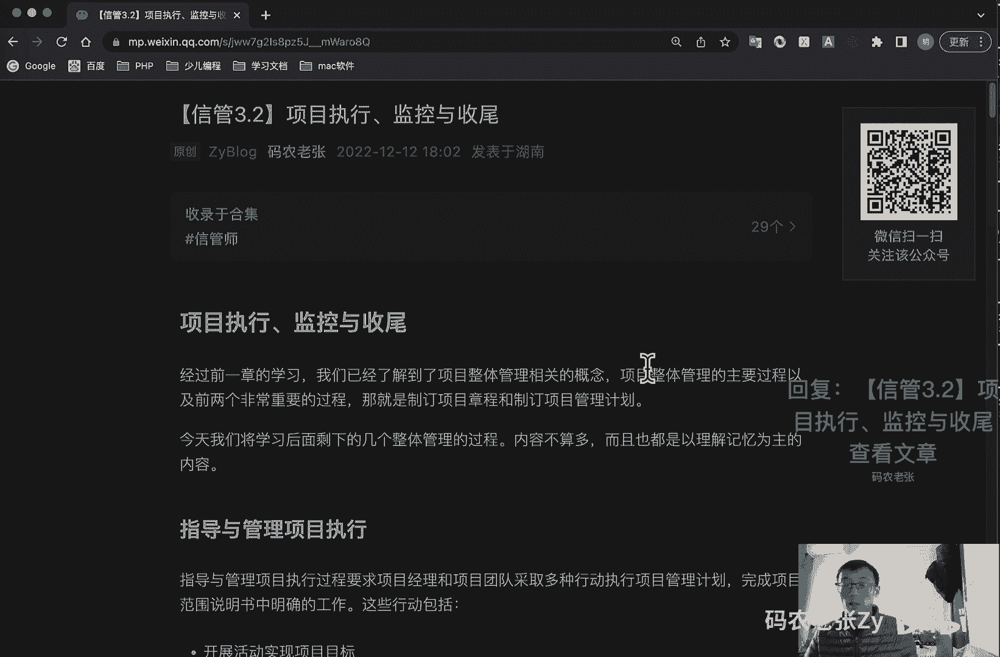
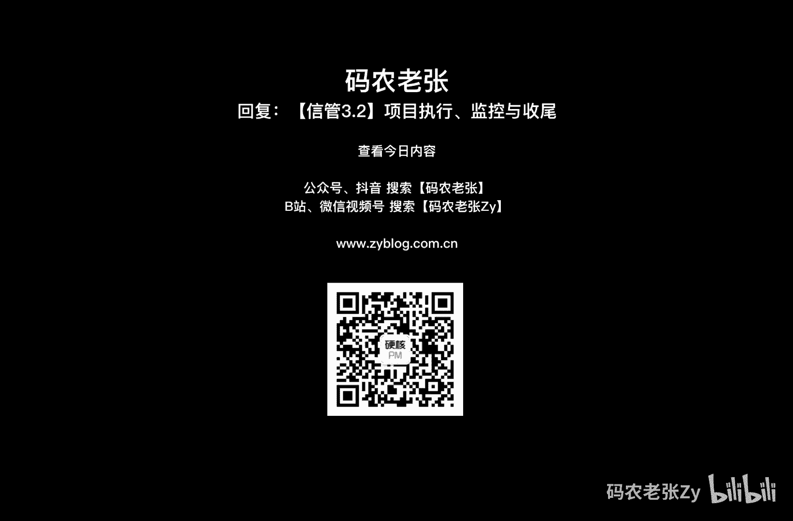

# 【信管3.2】项目执行、监控与收尾 - P1 - 码农老张Zy - BV1z8411N7RS

哈喽大家好，今天呢我们来学习的是信息系统项目管理师，第三大篇章的第二篇文章，项目执行监控与收尾，经过前一章的学习呢，我们已经了解到了项目整体管理相关的概念，项目整体管理的主要过程。

以及前两个非常重要的过程呢，就是制定项目章程和制定项目管理计划，今天呢我们要学习的是剩下的几个，项目整体管理的过程，内容不算多，而且都是以理解记忆为主的内容啊，好了，我们先来看第三个过程。

就是指导与管理项目执行，指导与管理，项目执行过程呢，要求项目经理和项目团队采取多种执行动，执行项目管理计划，完成项目范围说明书中明确的工作，这些行动包括哪些呢，第一个就是开展活动，实现项目目标。

付出努力与资金，实现项目目标，配备培训并管理分配到项目上的项目团队成员，根据具体情况取得报价标书，邀约或建议书，在潜在的卖方中间进行比较，选定卖方取得管理并使用资源，包括材料，工具，设备与设施。

实施已列入计划的方法和标准，创造控制，核实并确认项目可交付成果，管理风险并实施风险应对计划，然后就是管理卖方，将批准的变更纳入项目的范围，计划和环境，建立并管理项目团队内外的项目沟通渠道。

收集项目数据并报告费用进度系数与质量绩效，以及有助于项目预测的状态，信息收集与记载，吸取的教训，并实时批准了过程的改进活动，其实这个过程就是我们项目的什么项目的一个，执行的过程。

也就是根据各种计划的去实施的一个过程，在这个过程结束之后呢，我们会有一个什么呢，它的重要的输出就是可交付的成果，这个呢就是我们的项目成果，之前在讲项目的概念的时候，就清晰地定义过这个成果呢可以是实物。

也可以是某种服务技术和方案等等，注意就是执行过程呢，往往是我们在项目周期中执行最长的一个过程，并且是所有项目管理计划最终的落脚点，但是呢在项目管理理论中的这一块，却并不是非常重点的内容。

毕竟执行它是贯彻始终的，在指导与管理项目执行中吗，还要求实施什么呢，这三个是呃比较重要的一个东西啊，就是第一个就是批准的纠正措施，这个呢就是为使项目工作绩效，从新与项目管理计划一致。

而执行的一个有目的的活动，让项目的绩效与项目计划保持一致，而对项目执行工作下达了一个书面命令，这个就出现问题了，我们要去纠正，对不对，第二个呢就是项目的预防措施，这个问题还没有出现。

但是我们可能感觉可能会出现问题的时候，就我们要去预防对吧，这个呢就是确保项目工作的未来绩效，符合项目管理计划而进行的一个有目的的活动，就未来绩效啊用于降低项目风险，消极后果的可能性的书面文件。

第三个呢就是批准的缺陷补救请求，而进行的有目的地活动，对于在质量检查和审计中发现了产品缺陷的，进行纠正，一个书面文件，这个也是出现问题了，并且是在后期比较后期出现问题了，它是一个缺陷补救的一个情况。

这三项工作一般是通过变更请求产生的，变更有可能是范围，也有可能是进度成本带来的，不管怎样有变更，它就有行动，后面我们马上就会讲到整体变更控制的问题啊，不过这个我们先来看一下，就是项目的一个监控问题啊。

好这个是第三啊，第二个第三个，第四个，这是第四个过程啊，就是监控项目工作，监控项目工作呢，就是让计划与实际的情况进行比对，根据比对的结果呢采取纠正或者预防措施，控制项目的实施效果。

监控项目工作过程中的对象包括哪些呢，包括就是第一个就是对照项目管理计划，比较项目的一个实际的表现啊，然后呢就是评价项目的绩效，判断是否出现了，需要采取纠正或预防措施的迹象。

并在必要时提出采取行动的一个建议，下一个呢就是分析跟踪并监视项目风险，确保及时及时识别风险报告，其状态执行适当的风险应对计划，下一个呢就是建立有关项目，产品以及有关文件的准确和及时的一个信息库。

并保持到项目完成为状态报告，绩效绩效测量和预测提供信息支持，为更新当前的成本和进度信息提供预测，在实时批准变更时进行一个监视，大家看能看出来一个地方没有，就是在这个地方看，在这个地方。

就是我们是否要采取纠正或者预防措施，就是尤其这个监监控项目工作去转给哪里的，转给这个地方的，看见没，就你在正常执行的时候没关系，然后在监控的时候，它也会产生一个输出，就是需要去纠正那些内容。

那么就转给他了，就变成那个就变成我们上一个过程，就是这个过程的知道与管理项目，执行这个过程的一个输入了没有，就说他们之间的过程关系，并不一定是按顺序来的，有可能是我们后面讲的。

可能是前面一个过程的一个输入，都有可能的，在项目管理呃，中断，可以可能根据可能的项目或环境，变量的一个变化，以及它们与其他变量之间的关系，才是用分析技术来预测潜在的后果，例如说呢可用于项目的分析技术。

包括回归分析，分组方法，因果分析根本原因分析，预测方法，如时间序列，情景构建模拟，然后失效模拟与影响分析，故障树分析，储备分析，趋势分析，正值管理啊，差异分析等等，这个是成本那边会讲的。

然后其他地方我们都会在后面还会详细的去讲，的好了，我们再来看下一个过程，就是实施整体变更控脚，这又是下一个过程了，这个是第个过程的啊，是第五个对吧，第三个第四个第五个第五个过程了呃。

整体变更控制过程是贯穿于项目的始终，它是对项目极限的变更进行标识记载，批准或拒绝，并对此变更加以控制，因此呢这个过程呢，其实就是以监控项目工作的输出为依据，将其作为输入，再通过变更之后呢。

再就由项目执行过程来进行执行，前面说了，就是说上面那个过程是直接是那个执行过程的，一个输入器，还不对了，中间还有一个这个过程，对不对，还有一个怎么说呢，就是我们之前是有一个监控项目工作对吧。

就是上一个过程啊，上一个过程就是前面讲的那个过程，监控项目工作，他发现了问题之后呢，交给谁呢，交给这个交给实施整体变更控制，然后实际整体变更控制进行审批啊，进行各种这个各种研究之后呢。

决定确实要进行变更了之后呢，我们然后由他再交给那个什么执行对吧，执行那个对不对，执行是执行项目，那个就是我们今天讲的那个第一个那个过程，对于变更来说呢，我们可以从不同的维度来进行分类。

比如说呢按变更性质可以分为重大变更，重要变更和一般变更，通过不同的审批权限来控制，然后呢按变更的破解性呢，可以分为紧急变更和非紧急变更，通过不同的变更处理流程来进行，按变更所发生的领域和阶段呢。

可以分为进度变更，成本变更，质量变更，设计变更，实施变更和工作产品范围变更，根据就是按变更所发生的空间呢，可以分为内部环境变更好，外部环境变更，按变更的内容呢。

it行业的变更更进一步可以划分为多个子行业，比如说弱电工作应用，开发集成和it咨询等等的一个变更，实施整体变更控制的原因和内容包括哪些呢，对于一个项目来说，或者是对于一个功能来说。

我们不能说完全无理由的就去变更它，修改它，变更，那它一定会是某些原因引起的，比如说呢产品范围，成果就是产品范围，就是成果定义的过失或者是疏忽，然后项目范围就是工作这一块定义的，过失或者疏忽。

然后就增值变更啊，应对风险的紧急计划或者回避计划，项目执行过程与项目基准要求不一致，带来的被动调整，以及一些外部事件，其实这些原因啊我们可以总结成几个方面，那就是跟团队成员啊，用客户啊，法律啊，运营啊。

技术啊有关的内容都非常容易引起变更，还有另外一个非常经典的形容变更的原因呢，那就是通过五个字哪个字呢，人才物法还引起变更的原因，无外乎就是这五个方面，什么呢，就与人有关的，对不对，与人有关的。

和财务有关的，和财务有关的，比如说成本收益相关的，然后物呢就是物料啊，资源啊有关的，然后法律法律法规有关的，最后就是环境因素相关的对吧，如果你记不住上面这几个，然后简答题又出了这个问题的话。

你记不住上面这几个，那么你回答这个人财物法，还刚刚这几个也是没有问题的，绝对是可以拿分的好了，变更的内容具体包括哪些呢，我们再往下看一下啊，变更的内容呢，包括第一个。

就是识别可能发生和已经发生的一个变更，然后就是影响整体变更控制的相关因素，确保只有已变更的已批准的变更才能够被实施，然后呢就是评评审并批准变更申请，接下来的管理机械的完备性，然后呢。

评审并审批所有书面的纠正措施和预防措施，接下来呢根据已批准的变更更新范围，成本预算进度和质量要求，协调整个变项目的一个项目内的变更，接下来呢要记录变更申请的所有影响，然后呢就是验证缺陷修复的正确性。

接下来就是基于质量报告控制项目质量，使其符合标准，当然了，变更来源是需要通过清晰的工作绩效报告，包括资源可用情况，进度和成本数据啊，政治管理，政治管理还是那个成本成本，后面成本那边要学的。

然后就是燃烧图和燃尽燃尽图啊，在敏捷那边我们也讲过的对吧，以及相关的变更请求作为依据，经过专家判断，变更控制会议或者是ccd ccd，一会我们就要讲到变更控制委员会批准后实施，最后要在变更的结果中。

对变更认知来进行一个记录，好我们接着往下看，就是变更控制的原则与流程，变更控制的原则主要包括哪些呢，第一个就是基准管理，基准是变更的依据，包括成本进度范围基准，第二个呢就是变更控制流程化。

所有的变更都必须遵循流程，第三个呢就是明确组织分工，第四个就是评估变更可能影响，第，五个就是一定要妥善保存变更产生的相关文档，这个非常非常重要啊，好在这里我们要注意的也是我们一直在说的。

那就是基准很重要，流程要遵循变更，要评估结果，要存档，这四句话也可以代替上面这一段的，如果有简答题问到的话，记这四句话也可以啊好吧，其实根据这个原则呢，我们也能够推测出。

变更控制程序的一个具体流程是什么样的，第一步呢我们要产生一个变更的想法对吧，然后呢我们要申请这个变更，第二步呢就是pm就是项目经理和团队，去分析这个影响，去评估一下这个变更可能会带来的一些问题。

第三个呢就是将评估结果通知给变更的发起人，接下来呢就是执行变更，就是我们具体的一个负责开发的人，去执行这个变更，然后呢就是验证变更后的一个效果去进行验证，接下来呢就是对结果进行一个存档。

最后呢就是把这个存档和新新产生的这些文档，新的一些内容去分发给所有的一个干系人好了，下面还有一个流程图，如果你记不住上面这八点的，去记这个流程图也是可以的，都一样的啊，下面这个这个是变更申请人。

这个是项目经理这个ccd啊，这个是变更变更那个14人，这个是配置管理员啊，这里多了一个配置管理员好了，我们一开始变更申请就开始申请，对不对，然后申请完了之后呢，交给那个什么，交给项目经理。

交给项目经理进行一项分析，然后项目一，然后项目经理进行分析，完了之后呢，就交给ccb进行审核对吧，要么要么执行变更，对不对，执行变更就走这条线，走这条线之后呢，我们可以去监控这个变更。

然后同时呢我们看这个变更是否已经完成，如果是完成的话，我们还要更新一下配置项，然后最后就结束了，如果我们不去做那个就就是不做变更的话，我们就直接结束掉这个变更情况，然后通知干系人，最后去结束就可以了。

这张图也可以记下来，或者是上面的八点记下来都是可以的，都可以去做简答题的好，我们接着往下看到ccd变更控制委员会，就是在上网中呢，我们就是反复提到过一个组织，那就是变更控制委员会c c b。

这是一个什么样的组织呢，一般来说呢，c c b是项目的所有者权益代表，负责裁定接受哪些变更，ccd由项目所涉及的多方人员共同组成，通常包括用户和实施方的决策人员，主要是项目的关键干系人。

包括但不限于投资方，甲方代表，项目经理，客户代理技术业务运营负责人专家等等，如果有监控监理总监，如果有监理总监的话，看出来了吧，就是ccb主要组成成员其实是一不干活的人，当然这个这里打了引号。

就表示他们不会是一般的那种去执行的，一线员工，就比如说我们做软件开发的，他就不会是写代码的这帮人啊，就可能是一个你的项目经理啊，这就包括项目经理啊，客户代理，什么业务运营负责人这些人啊。

就一线的项目团队呢，我们主要是一个执行方案，而cc b呢主要面对的是变更的一个决策方，它是一个决策机构，第一个就是批准配置项的一个标识，以及信息系统基线的一个建立，第二个呢就是制定访问控制策略。

第三个呢建立更改基线的一个设置，审核审核变更的一个申请d的，最后一个呢就是根据配置管理员的报告，决定相应的对策啊，很明显ccb它不是一个作业机构，通常的工作呢，是通过评审手段来决定项目是否能变更。

但不提出变更的一个具体方案，具体方案呢，当然还是项目团队或者是相关的负责人来提的，那么项目经理或者项目发起人，有变更审批的权利吗，有的确，他是有的，但是他不多，它只能是小问题。

小问题我们项目经理可以直接排版的，这个没问题啊，小问题很小的一些问题，比如说你一一页面上面你错了几个错别字啊，或者是稍微改一点点小样式啊，或者颜色稍微有点不对啊，这种小问题的项目经理是可以直接排版的。

记得不管是新管是考试还是p mp，亦或是现实的项目管理中的，只要有ccd，如果有ccd存在，那么重大的基线的变更呢，一定是走ccd的影响非常大的那种变更，肯定是要由ccd来进行确认的。

就比如说你这个功能需求整个要进行改动了，那肯定项目经理做不了主的，你得去问那个业务需求方案，业务方案去问他们，对不对，好了，我们再来看一下与配置管理的关系啊，就是如果把项目整体的交付成果呢。

视作是项目的一个配置项，对整体的交付的成果视作是项目的一个配置项，就是你通过这个配置配置项里面的配置列表来，就是你这些所有东西都完成了，都已经配置好了，那么这个项目的交付成果也就完成了。

就这个东西当做一个配置项，配置管理呢，就可以视为对项目完整性管理的一整套系统啊，当用于项目基准调整时呢，变更管理可视为其一提的一部分，也就是说可以把它们看作是相关联的，一个两套机制，变更管理呢。

由项目交付或者是基准配置调整时呢，也由配置管理系统调用，变更管理呢，最终应将对项目的调整结果，反馈给这个配置管理系统，以确保项目执行与项目的账目要求是一致的，好整体变更控制过程中的配置管理活动的。

一般包括哪些呢，第一个就是配置识别确定与核实产品配置标记，产品与文档管理变更，以及保持信息公开的一个基础，第二个呢就是配置状态记录，应记录与报告该信息，这个信息呢包括批准的配置识别列表。

建立变更的一个状态，以及被批准变更的一个执行状态，下一个呢就是配置核实审计，配置核实和配置审计呢保证一个项目的配置，项目组成相应的变更，被记录评估批准追踪以及正确的执行，这保证了在项目配置文件中。

确定的功能呢已经被满足了，好项目整体管理的最后一个阶段了，就是结束项目或阶段，结束项目或阶段呢是完结所有项目管理过程的，所有活动，已正式结束项目或者阶段的一个过程。

他是确认项目或阶段是否已满足所有投资人，客户以及其他项目干系人的需求呃，的行动和活动，第二个呢就是他确认已满足项目阶段，或整个项目的完成标准或退出标准，的行动和活动，第三个呢就是当需要时呢。

把项目产品或者是服务转移到下一个阶段，或者移交到生产或运营型的行动或活动嗯，第四个呢就是收集项目或者项目阶段记录，检查项目成功或失败，收集教训，归档项目信息，以方便组织未来的项目管理啊。

这是它四个主要作用其实就列在这里了，从这些节奏活动中呢，不知道大家有没有发现一个有趣的地方啊，那都是正常的结束活动，就是有正常的结束活动，也有退出的，结束活动就是异常的结束活动。

也就是说呢即使是项目失败了，或者是他中途退出了，也是要有一个结束的一个流程的，这个是不可缺少的，在结束项目或者接待的过程中，我们主要关心的是两种收尾啊，第一个就是叫什么呢，叫一个合同收尾。

主要是针对合同内的项目内容呢，是否完成对产品进行验证，实施合同管理的一个收尾过程，最核心的就是对文档的一个验证，这个东西非常重要，你做过做过实际项目开发的，或者你带过项目团队的，你这个东西非常重要的。

然后呢就是行政收尾，也可以叫做管理收尾，收集项目或项目阶段的记录，收集教训，归档项目死这个呃，归档项目信息回顾评价文档，最终获得更新的组织过程资产对吧，这个就是之前学过了组织过程资产。

这个也是非常重要的，以便组织未来的项目管理，在收尾的时候，我们要做到四件事，就是什么移交成果，总结经验，项目归档，团队解散，是不是又是一句非常重要的一句话，如果你不记得上面那些东西啊。

就上面上面上面这四段，这数量好像写了好多对吧，还有这些写了好多对吧，其实最主要的核心的就记住这四个啊，然后呢最后一个可能会很多人会诧异啊，就是团队解散啊，这什么意思啊，不是做完项目了。

为什么团队还要解散，对不对，这个呢主要是针对矩阵型组织而言的，毕竟大家在结束项目之后，还是要回到自己的职能部门的，另外呢小型的临时外包组织呢，也可能会经常出现有项目，就是在有项目的时候组建团队。

项目结束之后就解散团队的情况，即使是运营型的项目，如果项目或某个阶段结束了，团队成员呢，也有可能会比较被调到其他的项目组，项目组当中，因此呢解散项目，团队呢是一个比较普遍的一个情况。

就是他的意思不是不是你公司解散了，就是你这个项目团队这几个人可能要又散开了，去接新的项目，或者说又回到你的职能性部门呢都是有可能的，然后呢，对于信息系统集成的项目验收工作来说呢，我们要通过系统测试系统。

试运行系统的文档验收，并获得项目的最终经验报告之后呢，才可以说完成了项目的一个收尾工作，然后之前呢我们讲过一个开题会议对吧，这还有一个项目的一个总结会，前面已经说过了，不管是项目还是正常完成。

还是中途的退出，结束流程呢都是必不可少的，而在结束流程中，最重要的就是要对项目的进项目进行，进行一个总结反思，通常情况下呢这是通过项目总结会来完成的，项目总结会呢就是要回答。

我们在这次项目经历中做对了什么，做错了什么，下次再怎么做就非常重要，做对了什么，做错了什么，下次再怎么做的一个问题，或者说俗话中的就是说俗话说就是干得咋样，有啥问题啊，这个就是项目总结会。

一般讨论内容包括哪些呢，主要包括项目技术成本进度计划的一个绩效，执行的怎么样，都要完成的怎么样，然后就是项目的一个沟通情况怎么样，然后识别问题与解决问题的情况怎么样，然后就是最后就是项目的一些。

就整个过程的一个意见和一些建议，其实啊核心的就两点就是绩效和问题啊，就你看这四句话，其实就两个点，绩效和问题，项目总结会呢，可以帮助我们了解项目全过程情况，以及相关成员的情况，能够了解了解出现的问题。

并总结改进的一个措施，了解值得吸取的教训和经验并总结，最后我们还要对总结后的文档进行归档，也就是最终的纳入什么组织过程资产对吧，组织过程资产是可以更新的，不能更新的是什么呢，回忆一下啊。

事业环境因素对不对，好了结束流程，综上所述，我们可以总结出项目或者阶段的一个结束流程，它主要是什么呢，就是产品核实，结束流程，我们先进行产品核实，也就是合同和行政的一个收尾，然后呢就是财务收尾。

财务结账了，对不对，然后呢就是更新记录，更新记录更新到哪里啊，组织过程资产里面，然后总结经验，更新组织组织过程资产啊，这个记录的就是文档啊，这个更新文档，然后这个呢是总结经验，就是开那个什么总结会。

开完总结会之后呢，更新组织过程资产，最后呢我们就去解散团队，这个就是整个一个结束的一个流程好了，总结一下今天内容中的重点是什么呢，重点就是项目变更请求的三种措施，还记得吧，纠正的对吧，纠偏的。

然后那个预防的还有一个什么对吧，然后呢就是变更控制的概念以及分类，还有它的原因，然后呢就是变更控制了一个程序流程，然后变更委员会c c b的概念和职责，结束的两种重要的收尾，什么合同收尾和行政收尾。

以及项目总结会的内容，虽说啊我写了不少东西，但其实上述的每一点并没有太多的内容，都是一点点的条目，直接记就可以了，通过两篇文章呢，我们就结束了项目整体管理的学习，第一个重要的知识领域呢。

其实我们就学完了，是不是很快对吧，各位很开心，对不对，貌似项目管理方面的知识很简单啊，不要大意啊，我们这现在只是一个开始啊，项目整体管理，只是项目整个十大领域中非常小的一部分，好戏还在后头，好了。

今天的内容呢就是这些，大家可以回复文章的标提信管3。2，项目执行监控与收尾了，或者这篇文章的具体内容，详细的内容大家还是要仔细的过来看一下啊，好了，今天的内容呢就是这些。

