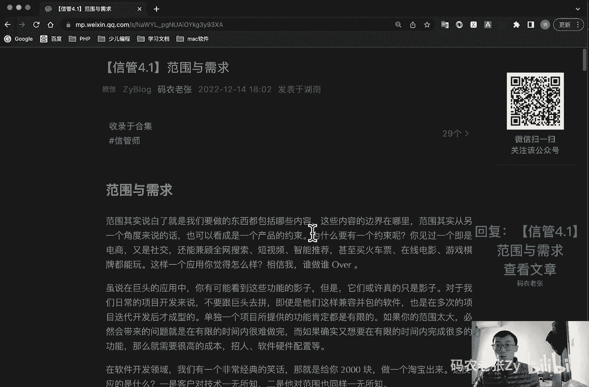
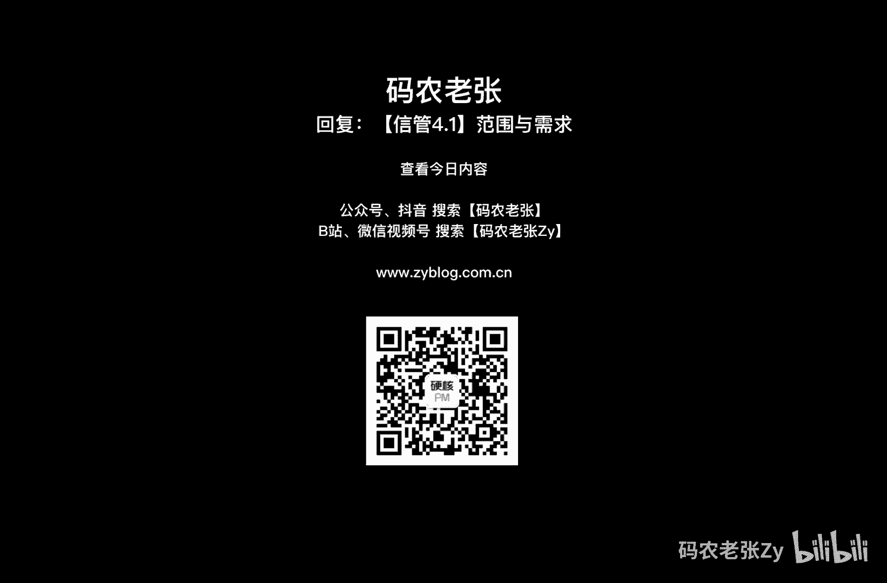

# 【信管4.1】范围与需求 - P1 - 码农老张Zy - BV1sy4y197jj

哈喽大家好，今天呢我们来学习的是信息系统项目管理师，第四大篇章范围管理相关的内容了啊，第四大篇章的第一篇文章范围与需求，好范围呢，其实说白了就是我们要做的东西，都包括哪些内容。

这些内容的边界在哪里范围呢，其实从另一个角度来说的话，也可以看成是一个产品的一个约束，为什么要有一个约束呢，就是你说你见过一个即使电商又是社交，还能兼顾全网搜索短视频，甚至买火车票。

在线电影游戏棋牌都能玩的一个app有吗，也许有，对不对，也许有，但是这样的应用你觉得怎么样呢，相信我就是如果我们来做的话，谁做谁over，为什么呢，就说在巨头的应用中呢。

你有可能会看到上面这些功能的影子，但是他们或许真的只是影子，它不是一个，他们就是开发的是一个重点，他不会所有的东西全部都特别兼顾的特别好的，对于我们日常的项目开发来说呢，不要去跟巨头平了。

即使是他们这样兼容并包的软件，也是在多次的项目迭代开发之后才成型的，单独一个项目所提供的功能呢肯定都是有限的，如果你的范围太大，必然会带来的问题，就是在有限的时间内很难做完，而如果确实有想到。

要在有限的时间内完成很多的功能，那么就需要很高的成本，比如说招人啊，软硬件的配置啊等等，在项目开发领域呢，就我们有非常非常经典的一个笑话，就是说给你2000块钱给我做个淘宝出来，我你觉得这可能吗是吧。

什么点子都有了，就缺一个写代码的了，对不对，这种问题就反映了什么呢，一个就是客户对技术一无所知，二个第二点呢，就是它对范围也是同样的一无所知的，好，我们就来看一下项目范围管理。

项目范围呢是为了达到项目目标，交付具有某种特质的产品和服务，项目所规定要做的工作，项目范围管理呢，就是要确定哪些工作是项目应该做的，哪些不应该包括在项目中，项目范围管理呢需要做三个方面的工作什么的。

明确项目的一个边界，然后呢对项目执行工作进行一个监控，最后呢就是防止项目范围发生蔓延，好了这个蔓延东西呢我们在后面也会讲的，好接着往下看，第一个我们首先要了解一下，就是什么是产品范围，什么是项目范围。

在项目中呢实际上存在两个相互关联的范围，分别是产品范围和项目范围，产品范围呢是指产品或者服务，所应该包含的功能和特性，如何确定信息系统的范围，在软件工程中呢也被称为什么，之前我们学过的需求分析。

项目范围呢，是指为了能够交付产品和服务，项目所必须完成的工作，扯这两个定义呢可以看出来，产品范围是项目范围的一个基础，项目范围呢要实现的就是产品范围内的所有特，性，同时项目范围呢可能会更宽泛一些。

因为我们的项目管理呢，不仅限于产品的功能特性，还有许多其他的管理计划，也属于在项目范围之内的，判断项目范围是否完成了，要以项目管理计划范围，需求说明书，w bs和w bs字典来进行衡量。

判断产品或服务是否完成，要根据产品或服务是否满足需求规格说明书，项目的范围基准呢是经过批准的，什么范围，项目范围说明书，w bs和w b s点好了，这个w b s呢现在不了解的话，没关系。

后面我会再说了，现在你可以先知道它是是工作分解结构的意思，还记得我们在项目整体管理中所讲过的，整体管理计划中的三大基准吗，这就是第一个，第一个基准范围基准就在这里讲到了，他什么，注意它是什么。

它是项目范围说明书，w bs和w bs字典，项目范围管理里的，不仅不仅仅是让项目管理和实施人员知道，未达到预期目标，要完成哪些具体的工作，还要确认清楚项目相关各方在每项工作中，清晰的分工界面和职责。

项目范围管理的重要性啊，详细清楚的界定分工界面和责任啊，不但有利于项目实施中的变更，控制和推进项目的发展，减少责任不清的事情发生，也也便于项目结束时呢对项目范围的一个核实，范围管理呢。

能够提高对项目成本进度和资源，估算的一个准确性，这是它的非常重要的几个地方啊，发展趋势和新兴实践啊，就是项目范围管理的发展趋势和新兴实践，包括但不限于注重与商业分析专业人士的合作，以便于什么呢。

就是确定问题并识别商业需求，识别并推荐，能够满足这些需求的可行的解决方案，收集记录并管理相关方需求，以满足商业和项目目标，推动项目集成或项目的产品服务，或最终成果的成功应用，好我们来看一下项目为呃。

项目范围管理的一个主要过程啊，项目范围管理呢，主要是通过下面表格中的六个过程来实施的，然后它主要嗯他主要在哪些过程组呢，就是前面几个，前面这几个前面那四个都是在规划过程组的。

然后呢就是后面两个呢就是在这个监控过程组，然后我们一个一个来看一下啊，规划范围管理，规划范围管理呢主要就是编制范围管理计划，书面描述将如何定义，确认和控制项目范围的一个过程，然后就是收集需求。

为实现项目目标而确定记录，并管理干系人的需要和需求的一个过程，这是收集需求，然后呢就定义范围，定义范围呢就是制定项目和产品详细需求，详细描述的一个过程，接下来就是创建w b s，创建wb s呢。

就是将项目可交付成果和项目工作，分解为较小的，更易于管理的组件的过程，这个w b s bs前面说过了，工作分解结构，然后呢就是监控过程组，监控过程组包括确认范围和控制范围，确认范围呢主要就是正式验收。

合已已完成的项目可交付成果的一个过程，然后他控制范围的控制范围，就是监督项目和产品的一个范围状态啊，管理范围基准变更的一个过程，好范围管理呢是非常重要的，所以说这六大过程呢都要熟记在心。

如果能够完全的记下所有的输入，输出技术和工具的话，那就更好了，我们还是先通过理解的方式，一个一个先讲解完了，回过头来我们大家再好好的来背这个对吧，还有怎么背啊，用哪个工具啊，之前我们都已经说过了。

对不对，我自己那个小程序背这些东西还是非常方便的，好，我们先来看第一个过程啊，就是什么规划和规划范围管理嗯，就像上面表格中说的，规划范围管理，主要的工作呢就是制定范围管理计，划。

范围管理计划呢是项目或项目集，管理计划的一个重要组成部分，描述将如何定义制定监督控制和确认项目范围，它是制定项目计划过程和其他范围管理过程，的一个主要输入，要对将用于下列工作的管理过程，做出一个规定啊。

哪些工作呢，我们看一下啊，如何制定项目范围说明书，如何根据范围说明书创建w bs，如何维护和批准，w bs如何确认和正式验收，已完成的项目可交付成果如何处理，项目范围说明书的变更。

该工作与实施整体变更控制过程直接相关联啊，这个跟我们上面那个之前讲过的，整体实施整体变更控制那边又有关系，对不对，好了，需要注意的是，这是初学者很容易做做的一道题，就是会把范围管理计划当做是范围基准啊。

前面我们说了范围基准是什么，再三强调就是范围管理计划和范围基准，它不是一个东西啊，范围基准的定义在上面，我们已经说过了，是哪三个东西，要需求说明书，还有什么w bs，还有一个什么w bs字典，对不对。

在这里啊，范围需求说明书，w b w s b s字典，这三个东西组合起来叫做范围基准啊，叫做范围基准，范围说明书，w b s w b s字典，然后范围管理计划跟他们不是一个东西啊。

注意这里写的范围管理计划，跟他们不是一个东西啊，好了，除了范围管理计划之外呢，在规划范围管理过程中呢，我们还有还会输出一个需求管理计划，需求管理计划描述在整体项目生命周期内，如何分析记录和管理需求。

主要包括以下这些内容，第一个就是如何规划跟踪和汇报各种需求活动，第二个就是需求管理呃，需要使用到的一个资源，第三个呢就是培训计划，第四个就是项目干系人，参与需求管理的一个策略，下面就是判断范围。

项目范围与需求不一致的准则和，纠正的纠正的一个规程，然后呢就是需求跟踪结构，即哪些需求属性将列入跟踪矩阵，并可在其他哪些项目文件中追踪到这些需求，然后呢就是配置管理活动，例如如何启动产品和服务啊。

或成果的变更，如何分析其影响，如何进行跟踪和汇报，以及谁有权批准变更，这些东西都是可以去记一下的，因为这些他说不准，他可能简答题，他会问你一下，就是需求管理计划里面出的是什么。

然后注意这个需求管理像我们之前讲过的，在整体那边讲过什么呢，三个基准对不对，三个基准还有什么11计划，对不对，11个计划，11个计划里面，除了我们后面那个九大项目管理计划，我们这里讲了一个了呃。

需求管理计划，对不对，还呃不是需求管理，就是这个项目范围管理计划，对不对，范围管理计划，然后后面还有八个，其他的那个就是十大知识领域，里面有九个管理计划，对不对，九个管理计划，另外还多出来了两个。

然后其中有一个就是这个需求管理计划，对，其中有一个就是这个需求管理学，还有一个是什么过程改进计划，对不对，那个我们后面再说了，其中多出来的那个就是这个需求管理计划好的，其他其他的几个管理计划。

都是跟我们这九大过程领域的名字都是一样的，就是范围管理计划，这里就多了一个需求管理计划，就是在这个地方好了，再来看下一个过程了，我第一个过程讲完了好了，我们看第二第二个过程收集需求。

收集需求呢是为实现项目目标而确定记录，并管理该新人的需要和需求的过程，其作用是为定义和管理项目范围，包括产品范围奠定基础，其实需求相关的内容呢，我们在之前的软件过程中已经详细的讲解过了，记得吗。

我们在补充之前，我们没有讲过的内容，在哪，什么地方讲过，讲过的啊，大家想一想啊，在什么地方可言那边，对不对，首先呢是需求的分类，大家还记得呃，不是不是可以是软件工程那边的对吧，需需需求那边的好。

首先是需求的分量，大家还记得软件工程中的需求层次吗，就是包括有什么业务需求，用户需求，系统需求，功能需求，非功能性需求设计约束，对不对，记得的回去复习一下啊，这种需求层次的划分呢其实更偏软件工程方面。

而在项目管理领域呢，我们的需求分类会更加的宽泛一些，好我们先看一下啊，呃第一个是业务需求，整体组织的高层次需求，例如说解决业务问题，或抓住某些业务机会实施项目的一个原因，这个业务需求。

接下来就是干系人需求，干性能需求，是指干系人或干系人群体的一个需要，然后呢就解决方案的需求，未满足业务需求和干系人需求，产品服务或成果必须具备的某些特性，功能和特征。

在这里呢就包含了功能需求和非功能性需求，然后呢就是过渡需求，从当前状态过渡到将来状态，所需要的一些临时能力，例如说数据转换和培训那个需求，然后呢就是项目需求，项目需要满足的行动过程和其他条件。

现在呢就是质量的需求啊，用于确认项目可交付成果的成功完成，或其他项目需求的实现了任何条件，或者是标准，主要这里就是跟软件工程，我们那一块学过的那六种分开的，这里又是新的几种，你看123456又是六种。

对不对，好了，这里的需求呢会更广泛一些，接下来我们看一下这些，收集需求的一些基础和工具啊，这个是在收集需求这一块需要了解的啊，第一个就访谈，访谈是通过干系人的直接交谈来获得信息的，正式或非正式的方法。

访谈的典型做法是，向被访被访者提出预设和机型的问题，并记录他们的回答，通常采取一对一，但也可以有多个被访者，或者是多个访问者共同参与，它的特点是什么呢，他特点是比较真实，但是呢怎么样呢。

他非常耽误时间啊，比较慢，我们要一个一个的去访谈好了，第二个就是焦点小组会议是吧，预先选定了干系人和主题专家集中在一起，了解他们对所提供的产品，服务或成果的一个期望和态度，就把所有人召集在一起。

看看他们的期望和态度是什么样的，接下来呢就是引导式研讨会，邀请主要的跨职能干系人一起参加会议，对产品需求进行集中的定义与讨论，研讨会呢是快速定义跨职能需求，和协调干系人差异的一个重要的技术啊。

其实跟上面那个差不太多，但是他可能就是邀请的人会更多一些，然后就是群体创新技术群，组织一些群体活动来识别项目和产品需求，包括什么头脑风暴法，名义小组技术，德尔菲技术概念，思维导图，清河图等等的。

好了结果我们还会说，然后就是群体决策技术，为达成某种期望结构，而对多个未来行动方案进行评估，可用来开发产品需求，以及对产品需求进行归类和优先级排序，包括什么呢，一致同意，后面我们也会说的。

然后就是问卷调查啊，通过设计书面问题，为向为数众多的受访者快速收集信息，这个速度比较快的问卷还是速度比较快的，然后就观察，直接观察个人在各自的环境中，如何开展工作和实施流程，最后呢就是原型法。

在实际开发之前呢，先造出该产品的使用模型，并根据据此征求需求的反馈意见啊，这个就不多说了，好上面这些工具我们再详细的说一说啊，第一个就是访谈法，访谈法我刚刚以前已经了说过了啊，就是他特点是什么。

直接和深入，但是需要取得对方的信任，当然了，相比其他工具来说呢，访谈法会比较真实一些，当然这个真实那也是相对的，毕竟人们也有可能在访谈的时候随口乱说，但比起问卷之类的夏天来说呢。

这个真实情况还是要好很多了，毕竟还是面对面的交谈，对不对，但是呢我前面也说过了，他一个问题就是它比较慢啊，好了，第二个访谈中呢，还有一种方法叫做观察与交谈，是指直接观察个人在各自的环境中。

如何执行工作或者任务的实施流程，观察呢也可以从称作工作跟随就看到这个名字，我就想起来他是观察，然后呢焦点小组呢其实是一种多人访谈，技术，访谈的对象呢，是项目经理很重要的干系人和专家嗯。

适合引导式研讨会中的引导技能的情景呢，包括联合应用设计开发呃，就是业务专家和技术团队一起收集需求，改进软件，然后第二个呢就是功能质量展开q f d，它们就是确定新产品的关键特征，最后一个呢就是用户故事。

对所需的功能进行一个简要的描述，这个就是适合引导式研讨会的这种东西啊，就是这三种j a d q f d，还有一个用户故事对吧，有的story敏捷里面讲过的头脑风暴，头脑风暴是一种产生新想法和新点子。

这个会议工具啊，所以它是一种创新工具，优势是能够面对面的进行交流，而且能够快速的产生许多想法，缺点呢就是它不会很客观，也不太适合专家，头脑风暴要注意的就是要以扩散思维为主，所以产生的想法都只是最多的。

最初步的想法就是在做头脑风暴的时候，不知道大家有没有参与过去，做头脑风暴的时候，就是你想到什么，就所以所有能想象到的，大家能想到的全都记下来，先不管它对不对，不管他可不可行。

天马行空的各种想法都可以先记录下来，它就是干这个事的头脑风暴，它主要就是干这个用的，就是记录下来的，就是各种想法，各种各种点子全部记录下来，好名义，小组技术是用于促进头脑风暴的一种技术啊。

通过投票排列最有用的创意，以便进一步执行头脑风暴或者优先排序，就前面我们说的头脑风暴想出来的各种东西，乱七八糟的，对不对，我们可以再进行一些投票，然后把最好的一些点子给它排序排出来。

好我们再看一下德尔菲技术，德尔菲技术是一种组织专家，就某一主题产生一致意见的一种信息收集技术，德尔菲是一种背靠背的技术啊，这个后面我们还会再详细的说啊，这里就不先先不单独说了啊。

如果有兴趣的小伙伴可以去查一下，这个也是一个就是项目管理里面，有一个非常重点的一个名词啊，这个我们后面会详细的说的好，清河图，清河图呢是针对某一问题，充分收集各种经验知识，想法和意见的语言文字资料。

通过图解方式进行汇总，并按其相互亲和性归纳整理这些资料史问题，明确请来清河图的核心呢，它也是一个头脑风暴，是通过投票来进行的，就是决定了就决策嘛，决策对吧，根据投票的情况呢，可以有什么呢，就一致同意。

就是一致同意，所有人都必须同意这个这个决策，那才能通过，第二个呢就是大多数同意，只要有半数以上的人通过，对不对，我们这个决策就可以通过了，或者这个点子就可以通过了，第三个呢就是相对多数同意。

就两个或两个以上的选项嗯，大家可以相相对的来选一下哪哪几个比较好，就是一个人去做决定，一个人拍板就可以了，它不会那么纠结，也不会有什么多人投票这种情况呢，但是呢它可能会导致执行会比较慢，因为可能有人服。

对不对，好问卷调查，问卷调查呢可以快速收集许多问题，相信大家平时都都或多或少，都会填过一些网络问卷，它的缺点也非常明显，就是问题决定答案了，出题者的水平决定的答案的问卷的质量，同时呢真实性还是比较差的。

随便乱填一下，我们可能为了获得一些小礼物，是对不对，我们随便乱填一下就得了，就假设性的问题呢，大部分人的回答呢也并不是很客观的啊，好需求管理计划来看一下需求管理计划，还记得我们在项目管理。

就前面我们说那个需求管理计划啊，就11计划里面的需求管理计划，需求管理计划具体的一个说明啊，就是如何它包括哪些内容啊，就是如何规划跟踪和汇报各种需求活动，然后就是需求管理需要使用的一个资源。

然后培训计划，项目干系人参与需求管理的策略，然后去判断项目范围与需求不一致时，的那个标准和纠正规定，然后去需求跟踪结构配置管理活动啊，这个前面也说过了，其实对吧，在这个地方又要重复的说了一遍。

因为这个地方就是在收集需求，这个地方有没有在这个地方是一样的啊，就是在收集需求，这个地方会对这个需求管理计划，去进行一些更新好了，需求跟踪，需求跟踪呢是为了使计划，产品和活动与需求保持一致。

需求跟踪呢包括正向跟踪和一个反向跟踪，正向跟踪呢是指检查需求文件中的每个需求，是否都能在后续工作产品中找到一个对应的点，就是我们拿着这个表格去跟这个产品去对，看看我们这个表格里面的东西是不是都做了。

然后反向跟踪又是什么呢，它反向跟踪称为逆向跟踪，是指检查产品的设计文档，就我们产品做完了，我们去拿这个设计文档啊，或者是产品的一个构件啊，测试的文档啊，啊，这等。

真正的或者你真正的拿这个产品去拿这个产品，在跟那个表格核对，我看看这个产品上的这个功能诶，在这个表格上面能不能找到它的出处在哪里好，不论采用哪种跟踪方式，都要建立于维护一个非常重要的一个需求文档。

它就是需求跟踪矩阵，k这个这这这个图片是一个过程啊，就是说你看我们在这里面，是用户的一个原始需求，然后正向跟踪，然后放到一个需求文件里面，然后在正向跟踪就是我们具体的产品对吧。

然后逆向跟踪就是这么反过来的一个过程啊，这个大家这个图片大家知道什么意思就行了，然后下面这个比较重要的就是需求跟踪矩阵，从原始的用户需求到用户需求，文件之间的跟踪呢。

我们可以采取下面这种就是这种表格的形式，你看这是原始的需求，这可能是比较那个呃，比较比较偏用户的那种传统的语言描述对吧，就是正常的一种语言描述，然后我们要把它转换成一种用户用力的那种语，言的去描述。

就是偏向一个就是产品经理去整理的这一块了，就use case对吧，呃用路呃，就是用力这一块的一个需求的描述了，然后呢而从需求文件呢更进一步，就是把把这个再进一步提炼的话，也就是到下游真正的产出的工作。

产品之间，可以通过另一种就是需求跟这种表格来记录，就把它在再给升级一下，就变成这个样子了，就变成这个重量就变成一个用力了，对不对，我们就是就是这边统计出来的用力对吧，然后放到这边来了。

然后我们再给他指定到具体的一个功能点，或者说具体的一个设计元素，或者是具体的组件，或者是具体的测试用例上面，在这里面就写的更具体更详细了，这一步通常都是软件工程师来啊，就是软件工程师来做这一步呢。

就是呃产品经理来做好，这两个需求跟踪矩阵的表格啊，就是大家记住他们的这个样子就可以了，就是看到了，我们就知道这个东西是需求跟踪矩阵对吧，如果你在你的实际工作中能用上的话，那就当然更好了，好。

好了我们来总结一下啊，今天是范围管理的第一篇文章，我们了解到了范围的一个概念啊，也知道了在产品范围和项目范围的一个区别，另外还有就是范围基准的一个定义，这些都是一个小的记忆点。

接着我们了解到了范围管理的一个主要过程，它大概的含义最好能够记住，现在记不住啊，那也可以在学习完范围管理，所有的课程内容之后，再回过来背一下，就是那几个六个是吧，最后呢我们学习了规划范围管理和收集需求。

这两个最开始的这两个过程当中的内容，重点呢就是在收集需求这个过程中，特别是我们在这里呢，顺带的讲了很多的工具与技术，这些内容呢在后面很多其他的过程中，也有可能会出现。

到时候呢我们就不会再进行详细的说明了，当然也有一些会进行更加详细的说明，比如说德尔菲那个，然后最低的要求是什么呢，就是提到这些工具和技术的名称，你就要知道他大概是干什么的，有什么特点。

下节课我们将学习的是定义范围和创建w bs，这两个过程，其中w bs呢是整个范围管理的学习中的，最核心的内容，同时呢这两个过程的输出也就是产出物，就是我们的范围基准，所以说做好准备。

后面的重点内容会越来越多，好了，再回忆一下范围基准是哪三个东西，想一想想一想范围基准是哪三个东西，就在这篇文章里面，好，今天的内容呢就是这些，大家可以回复文章的标题，信管4。1范围与需求。

来获得这篇文章以及具体的内容，具体内容大家还是要好好的来看一下，学习一下，复习一下吧，好了，今天内容呢就这些。

